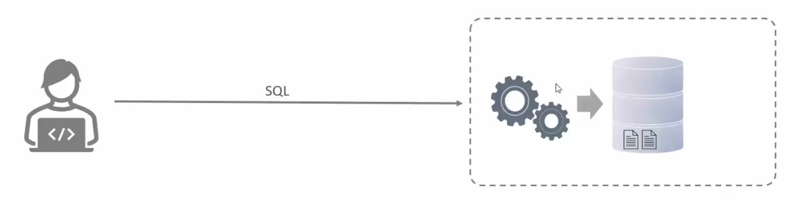
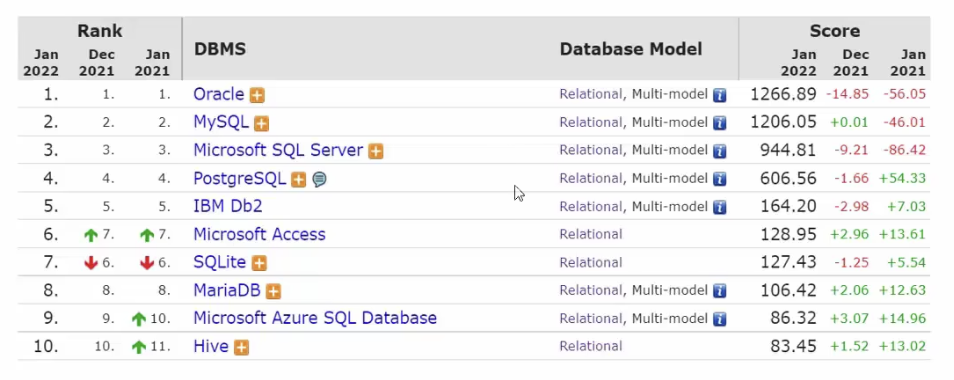
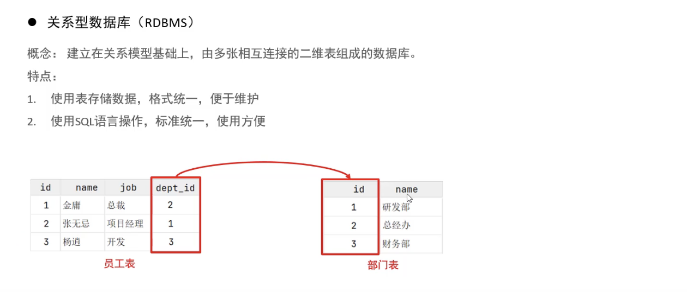
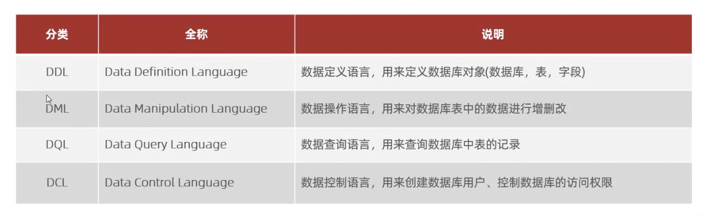
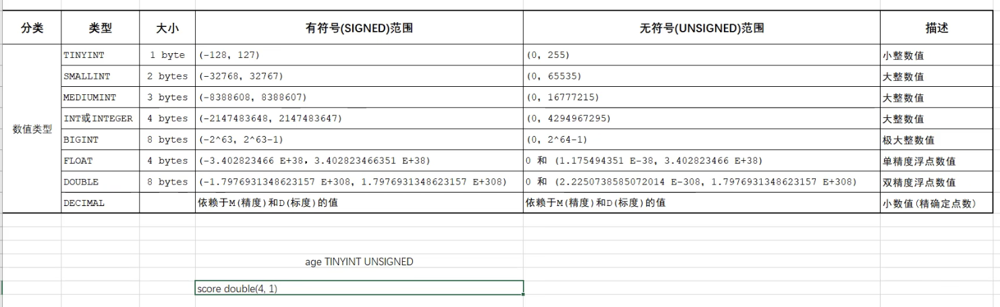
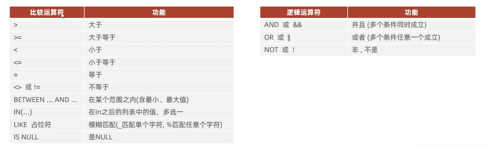
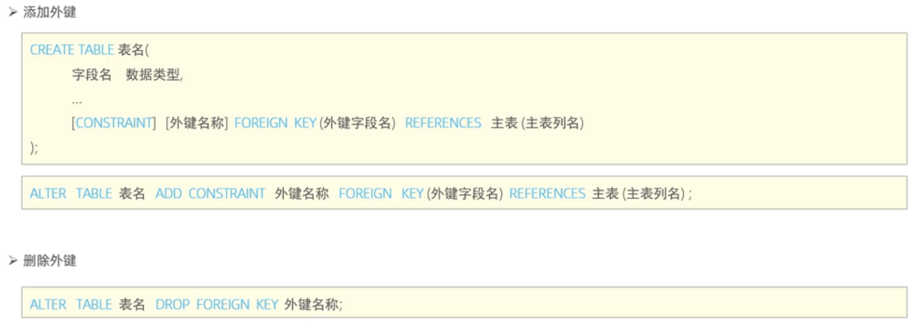

# mysql内容


# 基础-mysql概述

**数据库相关概念**

数据库：是存储数据的仓库，数据是有组织的进行存储，简称DataBase（DB）。

数据库管理系统：操纵和管理数据库的大型软件，简称DataBase Management System（DBMS）。

SQL：操作关系型数据库的编程语言，定义了一套操作关系型数据库的统一标准，简称Structured Query Language（SQL）



通过sql操作数据库管理系统，从而操作数据库。

主流的关系型数据库管理系统：



**mysql数据库**

版本：

* 社区版（MySQL Community Server）：免费，MySQL不提供任何技术支持
* 商业版（MySQL Enterprise Edition）：收费，可以试用30天，官方提供技术支持

本课程采用的是MySQL的最新社区版（MySQL Community Server 8.0.26）

安装：

* windows/linux：参照官网
* mac：使用homebrew安装`brew install mysql`

启动与停止：默认mysql是开机自启的

```bash
#windows
#启动
net start mysql80
#停止
net stop mysql80

#mac使用brew安装
#启动
brew services start mysql
#停止
brew services stop mysql
#设置根密码等安全选项
mysql_secure_installation
```

客户端连接：

* 方式一：MySQL提供的客户端命令行工具
* 方式二：系统自带的命令行工具执行指令 `mysql [-h 127.0.0.1] [-P 3306] -u root -p` ，windows中想要在任意命令行中执行mysql命令，需要配置path环境变量。

数据模型：




通过表结构存储数据的数据库就称为关系型数据库，不通过表结构存储数据的数据库就称为非关系型数据库。 

**开发时数据库使用**


# 基础-SQL语句

## SQL通用语法

SQL语句可以单行或多行书写，以分号结尾。

SQL语句可以使用空格/缩进（不限制个数）来增强语句的可读性。

MySQL数据库的SQL语句不区分大小写，关键字建议使用大写。

注释：

* 单行注释：-- 注释内容  或  #注释内容（MySQL特有）
* 多行注释：/\*注释内容*/

## SQL语句分类



### DDL

DDL（Data Definition Language）：数据定义语言，用来定义数据库对象（数据库，表，字段）

**数据库操作**

* 查询

  ```sql
  -- 查询所有数据库
  show databases;
  -- 查询单签数据库
  select database();
  ```

* 创建

  ```sql
  create database [if not exists] 数据库名 [default charset 字符集] [collate 排序规则];
  ```

* 删除

  ```sql
  drop database [if exists] 数据库名;
  ```

* 使用

  ```sql
  use 数据库名;
  ```

**表操作**

* 查询

  ```sql
  -- 查询当前数据库所有表
  show tables;
  -- 查询表结构
  desc 表名;
  -- 查询指定表的建表语句
  show create table 表名;
  ```

* 创建

  设计表字段：原型字段 + 基础字段（id、create_time、update_time等）

  ```sql
  create table 表名(
  	字段1 字段1类型[comment '字段1注释'],
    字段2 字段2类型[comment '字段2注释'],
    字段3 字段3类型[comment '字段3注释'],
    ...
    字段n 字段n类型[comment '字段n注释']
  )[comment '表注释'];
  
  #创建用户表
  create table tb_user(
      -> id int comment '编号',
      -> name varchar(50) comment '姓名',
      -> age int comment '年龄',
      -> gender varchar(1) comment '性别'
      -> ) comment '用户表';
  ```

  数据类型：mysql中的数据类型有很多，主要分为三类：数值类型、字符串类型、日期时间类型。

  

  

  

  案例：

  

  ```sql
  create table emp(
    id int comment '编号',
    workno varchar(10) comment '工号',
    name varchar(10) comment '姓名',
    gender char(1) comment '性别',
    age tinyint unsigned comment '年龄',
    idcard char(18) comment '身份证号',
    entrydate date comment '入职时间'
  ) comment '员工表';
  ```

* 修改

  ```sql
  -- 往表中添加字段
  alter table 表名 add 字段名 类型(长度) [comment '注释'] [约束];
  -- 修改表中指定字段的数据类型
  alter table 表名 modify 字段名 新数据类型(长度);
  -- 修改表中字段名及其类型
  alter table 表名 change 旧字段名 新字段名 类型(长度) [comment '注释'] [约束];
  -- 删除表中的字段
  alter table 表名 drop 字段名;
  -- 修改表名
  alter table 表名 rename to 新表名;
  ```

* 删除

  ```sql
  -- 删除表
  drop table [if exists] 表名;
  -- 删除指定表，并重新创建该表(空的)
  truncate table 表名;
  ```

**mysql图形化界面工具**

常用的图形化工具有：Sqlyog、Navicat、DataGrip（idea中自动集成）

### DML

DML（Data Manipulation Language）：数据操作语言，用来对数据库表中的数据进行增删改操作。

* 添加数据（insert）
* 修改数据（update）
* 删除数据（delete）

**添加数据**

```sql
-- 给指定字段添加数据
insert into 表名 (字段名1,字段名2,...) values (值1,值2,...);
-- 给全部字段添加数据
insert into 表名 values (值1,值2,...);
-- 批量添加数据
insert into 表名 (字段名1,字段名2,...) values (值1,值2,...),(值1,值2,...),(值1,值2,...);
insert into 表名 values (值1,值2,...),(值1,值2,...),(值1,值2,...);
```

注意：

* 插入数据时，指定的字段顺序需要与值的顺序是一一对应的。
* 字符串和日期型数据应该包括在引号中。
* 插入的数据大小，应该在字段的规定范围内。

**修改数据**

```sql
update 表名 set 字段名1=值1,字段名2=值2,... [where 条件];
```

注意：如果没有where条件，则会修改整张表的所有数据。

**删除数据**

```sql
delete from 表名 [where 条件];
```

注意：

* 如果没有where条件，则会删除整张表的所有数据
* delete语句不能删除某一个字段的值，只能一行一行的删除（可以使用update将值设置为null就可以了）

### DQL

DQL（Data Query Language）：数据查询语言，用来查询数据库中表的记录。


**基本查询**

```sql
-- 查询多个字段
select 字段1,字段2,字段3,... from 表名;
select * from 表名;
-- 设置别名
select 字段1 [as '别名1'], 字段2 [as '别名2'],... from 表名; -- as可以省略
-- 去除重复记录
select distinct 字段列表 from 表名;
```

**条件查询（where）**

```sql
select 字段列表 from 表名 where 条件列表;
```

条件：



**聚合函数**

聚合函数：将一列数据作为一个整体，进行纵向计算。

常见聚合函数：


```sql
select 聚合函数(字段列表) from 表名 [where 条件];
```

注意：null值不参与所有聚合函数的运算。

**分组函数（group by）**

```sql
select 查询字段列表 from 表名 [where 条件] group by 分组字段名 [having 分组后过滤条件];
```

where与having区别：

* 执行时机不同：where是分组之前进行过滤，不满足条件，不参与分组；而having是分组之后对结果进行过滤。
* 判断条件不同：where不能使用聚合函数进行判断，having可以。
* 分组之后，查询的字段一般为聚合函数和分组字段，查询其他字段无任何意义。

**排序查询（order by）**

```sql
select 字段列表 from 表名 order by 字段1 排序方式1, 字段2 排序方式2;
```

排序方式：

* asc：升序（默认值）
* desc：降序

注意：如果是多字段排序，第一个字段值相同时，才会根据第二个字段进行排序。

**分页查询**

```sql
select 字段列表 from 表名 limit 起始索引,查询记录数;
```

注意：

* 起始索引从0开始，起始索引=(查询页码-1)*每页显示记录数。
* 分页查询是数据库的方言，不同的数据库有不同的实现，mysql中是limit
* 如果查询的是第一页数据，起始索引可以省略，直接简写为 limit 10

**DQL执行顺序**


### DCL

DCL（Data Control Language）：数据控制语言，用来管理数据库用户、控制数据库的访问权限。

**管理用户**

```sql
-- 查询用户
use mysql;
select * from user;
-- 创建用户
create user '用户名'@'主机名' identified by '密码';
-- 修改用户密码
alter user '用户名'@'主机名' identified with mysql_native_password by '新密码';
-- 删除用户
drop user '用户名'@'主机名';
```

注意：

* 主机名可以使用%通配。
* 这类sql，开发人员操作的比较少，主要是DBA（Database Administrator 数据库管理员）使用。

**权限控制**

mysql中定义了很多种权限，常用就以下几种：


```sql
-- 查询权限
show grants for '用户名'@'主机名';
-- 授予权限
grant 权限列表 on 数据库名.表名 to '用户名'@'主机名';
-- 撤销权限
revoke 权限列表 on 数据库名.表名 from '用户名'@'主机名';
```

# 基础-函数

## 字符串函数

```sql
-- 案例
-- 由于业务需求变更，需要将emp表中的企业员工工号，统一更改为5位数，不足5位的在前面补0，比如：1号员工工号应为00001
update emp set workno = lpad(workno, 5, '0');
```


## 数值函数

```sql
-- 案例
-- 通过数据库的函数，生成一个六位数的随机验证码
select lpad(round(rand() * 1000000, 0), 6, '0');
```


## 日期函数

```sql
-- 案例
-- 查询所有员工的入职天数，并根据入职天数倒序排序。
select name, datediff(curdate(), entrydate) as entrydays from emp order by entrydays desc;
```


## 流程函数

流程函数可以再SQL语句中实现条件筛选，从而提高语句的效率。


```sql
-- 案例
-- 查询emp表的员工姓名和工作地址，北京/上海 ----> 一线城市，其他 ----> 二线城市。
select
	name,
	( case wrokaddress when '北京' then '一线城市' when '上海' then '一线城市' else '二线城市' end) as '工作地址'
from emp;
```

# 基础-约束

概念：约束是作用于表中字段上的规则，用于限制存储在表中的数据。

目的：保证数据库中数据的正确性、有效性、完整性和一致性。

## 分类


注意：约束是作用于表中字段上的，可以在创建表/修改表的时候添加约束。

## 外键约束

外键用来让两张表的数据之间建立连接，从而保证数据的一致性和完整性。


**为子表添加和删除外键**



**在父表中删除/更新有外键关联的记录**


# 基础-多表查询

## 多表关系

项目开发中，在进行数据库表结构设计时，会根据业务需求及业务模块之间的关系（业务《=》数据），分析并设计表结构，由于业务之间相互关联，所以各个表结构之间也存在着各种联系，基本上分为三种：

* 一对多（多对一）
* 多对多
* 一对一

**一对多（多对一）**

典型案例：部门 与 员工的关系。一个部门对应多个员工，一个员工对应一个部门。

实现：在多的一方建立外键，指向一的一方的主键。


**多对多**

典型案例：学生 与 课程的关系。一个学生可以选修多门课程，一门课程也可以供多个学生选择。

实现：建立第三张中间表，中间表至少包含两个外键，分别关联两方主键。


**一对一**

典型案例：用户 与 用户详情的关系。一对一关系，多用于单表拆分，将一张表的基础字段放在一张表中，其他详情字段放在另一张表中，以提升操作效率。

实现：在任意一方加入外键，关联另外一方的主键，并且设置外键为唯一的（unique）


## 多表查询概述

概述：从多张表中查询数据。

笛卡尔积：笛卡尔乘积是指在数学中，两个集合A和B的所有组合情况。（在多表查询时，需要消除无效的笛卡尔积）。

消除无效的笛卡尔积：加上条件查询语句就可以。如：`select * from emp, dept where emp.dept_id = dept.id;`

多表查询分类

* 连接查询
  * 内连接：相当于查询A、B交集部分数据（查询两张表有关系的那部分数据）
  * 外链接：
    * 左外连接：查询左表所有数据，以及两张表交集部分数据
    * 右外连接：查询右表所有数据，以及两张表交集部分数据
  * 自连接：当前表与自身的外链接查询，自连接必须使用表别名
* 子查询


## 内连接

内连接查询的是两张表交集部分数据。

内连接查询语法：

* 隐式内连接

  ```sql
  select 字段列表 from 表1,表2 where 条件...;
  ```

* 显式内连接

  ```sql
  select 字段列表 from 表1 [inner] join 表2 on 连接条件...;
  ```

## 外连接

外连接查询语法：

* 左外连接：相当于查询表1（左表）的所有数据 和 表1表2交集部分的数据

  ```sql
  select 字段列表 from 表1 left [outer] join 表2 on 条件...;
  ```

* 右外连接：相当于查询表2（右表）的所有数据 和 表1表2交集部分的数据

  ```sql
  select 字段列表 from 表1 right [outer] join 表2 on 条件...;
  ```

## 自连接

在一个表中查询两个有关系的字段，将这张表看成两张表（所以需要给这张表起两个别名）。

自连接查询，可以是内连接，也可以是外连接。

自连接查询语法：

```sql
select 字段列表 from 表A 别名A join 表A 别名B on 条件...;
```

## 联合查询

联合查询就是把多次查询结果合并起来，形成一个新的查询结果。

多次查询的字段列表数量和类型都需保持一致

```sql
#合并查询结果
select 字段列表 from 表A...
union all
select 字段列表 from 表B...
#合并查询结果，并去重
select 字段列表 from 表A...
union
select 字段列表 from 表B...
```

## 子连接

概念：SQL语句中嵌套select语句，就称为嵌套查询，又称子查询。

```sql
select * from t1 where column1 = (select column1 from t2);
```

子查询外部的语句可以是insert/update/delete/select的任何一个，常见为select。

根据子查询的结果不同，分为：

* 标量子查询（子查询结果为单个值，只有一行一列）
* 列子查询（子查询结果为一列，可以是多行）
* 行子查询（子查询结果为一行，可以是多列）
* 表子查询（子查询结果为多行多列）

根据子查询位置，分为：where之后、from之后、select之后出现的子查询。

**标量子查询**

子查询返回的结果是单个值（数字、字符串、日期等），最简单的形式，这种子查询称为标量子查询。

常用的操作符：=  <>  >  >=  <  <=

**列子查询**

子查询返回的结果是一列（可以是多行），这种子查询称为列子查询。

常用的操作符：in   not in  any  some  all


**行子查询**

子查询返回的结果是一行（可以是多列），这种子查询称为行子查询。

常用操作符：=  <>  in  not in

**表子查询**

子查询返回的结果为多行多列，这种子查询称为表子查询。

常用操作符：in

# 基础-事务

## 事务简介

事务是一组操作的集合，它是一个不可分割的工作单位，事务会把所有的操作作为一个整体一起向系统提交或撤销操作请求，即这些操作要么同时成功，要么同时失败。

默认MySQL的事务是自动提交的，也就是说，当执行一条DML语句，MySQL会立即隐式的提交事务。

典型案例：转账


## 事务操作

**修改事务提交方式**

查看/设置事务提交方式

```sql
-- 查询事务提交方式（默认是1，自动提交）
select @@autocommit;
-- 修改为手动提交
set @@autocommit = 0;
```

提交事务

```sql
commit;
```

回滚事务

```sql
rollback;
```

**不修改事务提交方式**

开启事务

```sql
start transaction 或 begin;
```

提交事务

```sql
commit;
```

回滚事务

```sql
rollback;
```

## 事务四大特性

* 原子性（Atomicity）：事务是不可分割的最小操作单元，要么全部成功，要么全部失败。
* 一致性（Consistency）：事务完成时，必须使所有的数据都保持一致状态。
* 隔离性（Isolation）：数据库系统提供的隔离机制，保证事务在不受外部并发操作影响的独立环境下运行。
* 持久性（Durability）：事务一旦提交或回滚，它对数据库中的数据的改变就是永久的。

## 并发事务问题


## 事务隔离级别

事务隔离级别就是用来解决并发事务问题的。

隔离级别越高性能越差，隔离基本越低数据安全性越差。业务中选择事务的隔离级别时，既要权衡数据的安全性，又要权衡数据库的并发性能。


查看事务隔离级别

```sql
select @@transaction_isolation;
```

设置事务隔离级别

```sql
set session|global transaction isolation level read uncommitted | read committed | repeatalbe read | serializable;
```

# 进阶-存储引擎

# 进阶-索引

# 进阶-SQL优化

# 进阶-视图/存储过程/触发器

# 进阶-锁

# 进阶-InnoDB引擎

# 进阶-MySQL管理

# 运维-日志

# 运维-主从复制

# 运维-分库分表

# 运维-读写分离

# 常见错误

**1. mysql8.0版本 报错：Error: ER_NOT_SUPPORTED_AUTH_MODE: Client does not support authentication protocol...**

报错信息：

Error: ER_NOT_SUPPORTED_AUTH_MODE: Client does not support authentication protocol requested by server; consider upgrading MySQL client

解决：修改加密规则为普通模式，默认是严格加密模式

```mysql
#更新用户密码
ALTER USER 'root'@'localhost' IDENTIFIED WITH mysql_native_password BY 'Zy19920512#';
#刷新权限
FLUSH PRIVILEGES;
```

