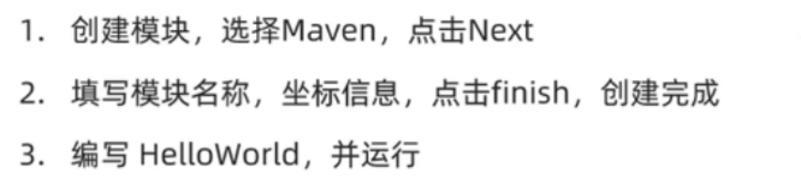

# Javaweb简介

后端接口：

1. 接收请求（网络：springboot框架、web服务器tomcat）
2. 访问数据（file、io流、数据结构：数组/集合/JSON/字符串等、数据库）
3. 处理数据（file、io流、数据结构：数组/集合/JSON/字符串等、数据库）
4. 响应结果（网络：springboot框架、web服务器tomcat）

SSM：Spring SpringMVC Mybatis。

Spring Boot 是 Spring 的一个子项目， 可以简化传统 Spring 应用程序的配置和启动过程，包括与 Spring MVC 和 MyBatis 等框架的整合。


# Maven

## 介绍

**什么是Maven**

Apache Maven是一个用于管理和构建Java项目的工具，它基于项目对象模型（POM）的概念，通过一小段描述信息（配置）来管理项目的构建。

**Maven的作用**

1. 依赖管理：方便管理项目中的依赖资源（jar包），并避免版本冲突。

2. 统一目录结构：


3. 标准的项目构建流程：使用Maven提供的指令快速的完成项目的编译测试打包发布等构建流程。


**Maven内部模型**


## 安装

安装步骤：

1. 官网下载安装包 [apache-maven-3.8.8-bin.tar.gz](https://dlcdn.apache.org/maven/maven-3/3.8.8/binaries/apache-maven-3.8.8-bin.tar.gz) 或 [apache-maven-3.8.8-bin.zip](https://dlcdn.apache.org/maven/maven-3/3.8.8/binaries/apache-maven-3.8.8-bin.zip)

2. 解压安装包

3. 将安装包放置指定目录（mac中一般放到/usr/local/中；windows任意目录）

4. 配置本地仓库

   1. 在maven安装包目录`apache-maven-3.8.8/`中新建`mvn_repo`目录
   2. 在`apache-maven-3.8.8/conf/settings.xml`中，在`<settings>`标签中添加`<localRepository>/usr/local/apache-maven-3.8.8/mvn_repo</localRepository>`

5. 配置阿里云私服：在`apache-maven-3.8.8/conf/settings.xml`中，在`<mirrors>`标签中添加：

   ```xml
   <mirror>
     <id>alimaven</id>
     <name>aliyun maven</name>
     <url>http://maven.aliyun.com/nexus/content/groups/public/</url>
     <mirrorOf>central</mirrorOf>
   </mirror>
   ```

6. 配置环境变量

   * mac：找到shell配置文件（`.bash_profile`、`.bashrc` 或 `.zshrc`），添加：

     ```bash
     export M2_HOME=/usr/local/apache-maven
     export PATH=$PATH:$M2_HOME/bin
     ```

   * windows：配置path环境变量，将maven安装包中bin目录路径配置到path环境变量中。

7. 测试

   ```bash
   mvn -v
   ```

## Idea集成Maven

**配置Maven环境**

方式一：当前工程

* 新建空项目
* 选中Idea中File --> Settings --> Build,Execution,Deployment --> Build Tools --> Maven
  * 设置Maven主路径为本地安装的Maven，修改配置文件路径以及本地仓库路径
* 选中Idea中File --> Settings --> Build,Execution,Deployment --> Build Tools --> Maven --> Runner
  * 修改JRE版本为要使用的JDK版本。
* 选中Idea中File --> Settings --> Build,Execution,Deployment --> Compiler --> Java Compiler
  * 修改字节码版本为要使用的JDK版本

方式二：全局

* 关闭项目，回到Idea初始界面
* 选中Customize（自定义） --> All settings
* 与上面后三步一样

**创建Maven项目**




**导入Maven项目**

## 依赖管理

`pom.xml`

```xml
<dependencies>
  <dependency>
    <!-- maven坐标 -->
    <groupId>ch.qos.logback</groupId>
    <artifactId>logback-classic</artifactId>
    <version> 1.2.3</version>
  </dependency>
</dependencies>
```

# SpringBootWeb入门

步骤：

1. 创建SpringBoot工程：新建模块，选择Java Maven，选择Spring Web依赖包
2. 定义HelloController类，添加hello方法，并添加注解。
3. 运行测试

# Web服务器-Tomcat

Web服务器是一个软件程序，对HTTP协议的操作进行了封装，使得程序员不必直接对协议进行操作，让Web开发更加便捷。

主要功能是部署web项目对外提供网上信息浏览服务。

Tomcat是一个轻量级的web服务器，支持servlet，jsp等少量的JavaEE规范。

基于SpringBoot开发的web应用程序，内置了Tomcat服务器，当启动类运行时，会自动启动内嵌的Tomcat服务器。

# 请求响应

## 概述


## Postman

Postman是一款功能强大的网页调试与发送网页HTTP请求的Chrome插件。

作用：常用于进行接口测试。

Apipost、Apifox都是基于Postman衍生出来的应用程序，使用跟Postman基本一致。

使用：创建工作空间 --> 在工作空间中添加请求

## 请求-常见参数的接收及封装

**简单参数**

* 原始方式：

  在原始的web程序中，获取请求参数，需要通过HttpServletRequest对象手动获取。

  ```java
  @RequestMapping('/smipleParam');
  public String smipleParam(HttpServletRequest request) {
    String name = request.getParameter("name");
    String ageStr = request.getParameter("age");
    int age = Integer.parseInt(ageStr);
    System.out.println(name + " : " + age);
    return "OK";
  }
  ```

* springboot方式

  简单参数：参数名与形参变量名相同，定义形参即可接收参数。如果方法形参名与请求参数名不一致，可以使用@RequestParam注解完成映射。

  ```java
  @RequestMapping('/smipleParam');
  public String smipleParam(String name, Integer age) {
    System.out.println(name + " : " + age);
    return "OK";
  }
  ```

**实体参数**

* 简单实体对象：请求参数名与形参对象属性名形同，定义实体类接收即可。

**数组集合参数**

数组：请求参数名与形参中数组变量名相同，可以直接使用数组封装。

集合：请求参数名与形参中集合变量名相同，通过@RequestParam绑定参数关系。

**日期参数**

使用LocalDateTime类型的参数接收，并使用@DateTimeFormat注解规定日期参数格式。

**json参数**

json数据键名需要与形参对象属性名相同，定义实体类形参即可接收参数，并需要使用@RequestBody标识。

**路径参数**

在@RequestMapping中使用{}来标识路径参数，并使用@PathVariable获取路径参数。路径参数需要保持一致 

## 响应-响应数据给客户端

**@ResponseBody注解**

* 类型方法注解、类注解
* 位置Controller方法上/类上
* 作用：将controller方法返回值直接响应给客户端，如果返回值类型是 实体对象/结合，将会转换位json格式响应。
* 说明：@RestController = @Controller + @ResponseBody

**统一响应结果**

将响应结果统一封装成实体对象Result的形式响应客户端。

```java
public class Result {
  private integer code;
  private String msg;
  private Object data;
  //...
}
```

# 分层解耦

## 三层架构

controller：控制层，接收前端发送的请求，对请求进行处理，并响应数据。

service：业务逻辑层，处理具体的业务逻辑。

dao：数据访问层（Date Access Object）（持久层），负责数据访问操作，包括数据的增删改查。


## 分层解耦

**概念**

内聚：软件中各个功能模块内部的功能联系。

耦合：衡量软件中各个层/模块之间的依赖、关联的程度。

软件设计原则：高内聚低耦合。高内聚：模块内部的联系越紧密越好；低耦合：尽可能降低层与层之间或者模块与模块之间的依赖关联，最好能做到解除耦合。解除之后，层与层之间就没有依赖了，此时及时service层的代码发生变化，它也不会影响controller及dao的代码。这样我们程序的灵活性及可扩展性就更好了。

**控制反转和依赖注入**

上面的三层之间是有耦合关系的。controller依赖service，serveice依赖dao。

spring中我们使用控制反转和依赖注入来解耦三层架构。

* 控制反转：Inversion Of Controller，简称IOC。对象的创建控制权由程序自身转移到外部（容器），这种思想称为控制反转。在被依赖的类上面加上@Component注解，表示将当前类交给IOC容器管理，称为IOC容器中的bean。

* 依赖注入：Dependency Injection，简称DI。容器为应用程序提供运行时所依赖的资源，称之为依赖注入。在要注入依赖的定义变量的上面加上@Autowired注解，表示，IOC容器会提供该类型的bean对象，并赋值给该变量。

* Bean对象：IOC容器中创建、管理的对象，称之为bean。


**IOC详解**


**DI详解**


# mysql数据库

## 数据库设计

## 数据库操作

## 数据库优化

# Mybatis

## 介绍

Mybatis是一款优秀的持久层框架，用于简化JDBC的开发。


## 入门

Mybatis就是让我们可以在Java程序中编写SQL语句去操作数据库的工具。

**案例**

使用Mybatis查询所有用户数据步骤

1. 准备工作（创建springboot工程、数据库表user、实体类User）
2. 引入Mybatis相关依赖，配置Mybatis（数据库连接信息）
3. 编写SQL语句（注解/XML）


**XML映射文件**

mybatis中编写SQL语句的方式有两种：

* 注解（简单的SQL语句）

* XML映射文件：通过XML文件的方式配置SQL语句。（复杂的SQL语句）

**JDBC**

JDBC（Java DataBase Connectivity）：就是使用Java语言操作关系型数据库的一套API接口（规范）。

Java只提供JDBC接口，具体的JDBC的实现由各个厂商提供，就是数据驱动jar包。

我们可以使用这套接口（JDBC）编程，真正执行的代码是驱动jar包中的实现类。


**数据库连接池**

数据库连接池是一个容器，类似于线程池，负责分配、管理数据了连接（Connection）。

它允许应用程序重复使用一个现有的数据库链接，而不是再重新建立一个。

释放空间时间超过最大空闲时间的连接，来避免因为没有释放连接而引起的数据了连接遗漏。

优势：资源重用、提升系统响应速度、避免数据库连接遗漏。

**lombok**

Lombok是一个使用的Java类库，能通过注解的形式自动生成构造器、getter/setter、equals、hashcode、toString等方法，并可以自动化生产日志变量，简化Java开发（主要是简化实体类的定义），提高效率。


## 基础增删改查

## 动态SQL

随着用户的输入或外部条件的变化而变化的SQL语句，我们称为动态SQL。简单来说就是这条SQL语句不是固定的，是动态变化的。

Mybatis提供的在XML映射文件中的动态SQL`标签`可以将SQL语句变成动态SQL。

* \<if>：用于判断条件是否成立。使用test属性进行条件判断，如果条件成立为true，则拼接SQL。
* \<foreach>：循环
* \<sql> \<include>：SQL片段的抽取和引用，提高SQL语句复用性。

# 案例

## Restful

REST（REpresentational State Transfer），表述性状态转换，它是一种软件架构风格。


## 文件上传

**前端**

* type="file"的input
* method="post"
* enctype指定为multipart/form-data会将文件名和文件的二进制内容上传给服务端，enctype指定为aplication/x-www-form-urlencoded只会将文件名上传给服务端

**后端**

* 在controller方法中使用MultipartFile类型的参数接收前端传递过来文件，包括文件名和文件内容和文件存放路径（存放的是临时文件，上传请求成功后会自动删除）。

* 使用MultipartFile提供的api将文件存储到本地磁盘。

  ```java
  // controller方法
  public Result upload(MultipartFile image) {
    // 使用MultipartFile API提供的transferTo方法将前端上传的文件存入本地磁盘，该方法需传入一个file对象。
    image.transferTo(new File("要存储的文件的本地磁盘目录"));
    
    return Result.success();
  }
  ```

  


# 登录认证

合法身份凭证：会话和令牌。

令牌技术：jwt

* 第一部分：Header（头），记录令牌类型、签名算法等。例如：{ "alg": "hs256", "type": "jwt" }
* 第二部分：Paload（有效载荷），携带一些自定义信息、默认信息等。例如：{"id": "1", "username": "tom"}
* 第三部分：Signature（签名），防止token被篡改、确保安全性。将Header、Paload，并加入指定秘钥，通过指定签名算法计算而来。


# 异常处理

后端出错，返回给前端的结果有问题，需要处理异常：

1. 在controller层使用 try catch 处理异常
2. 使用全局异常处理器

# AOP

面向切面编程

* 连接点
* 切入点
* 通知
* 切面
* 目标对象

# maven高级

* 分模块设计与开发
* 继承与聚合
* 私服

# Web后端开发总结


