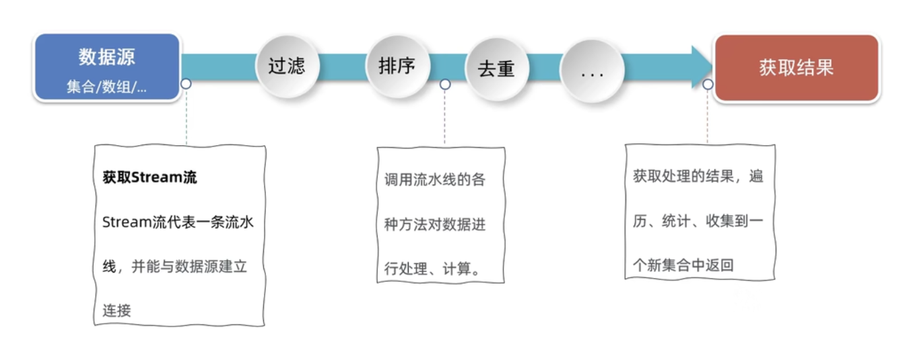
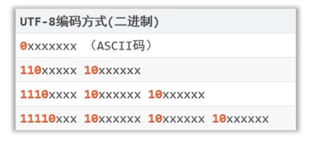
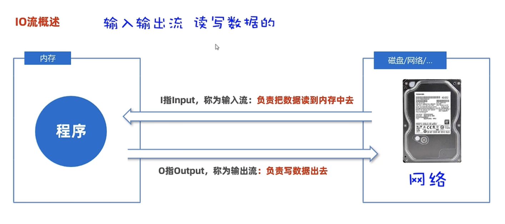
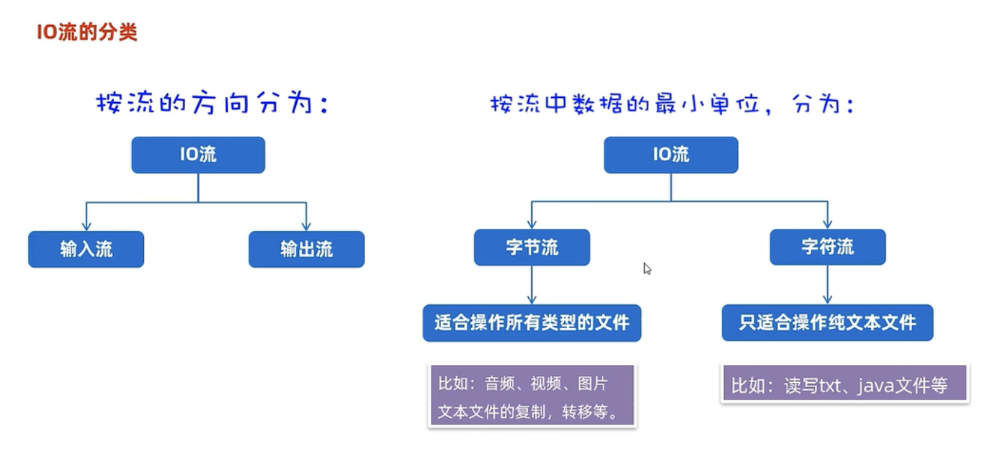
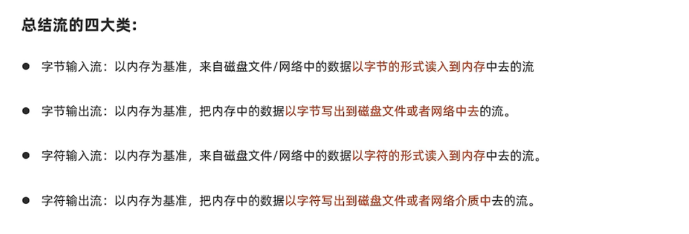
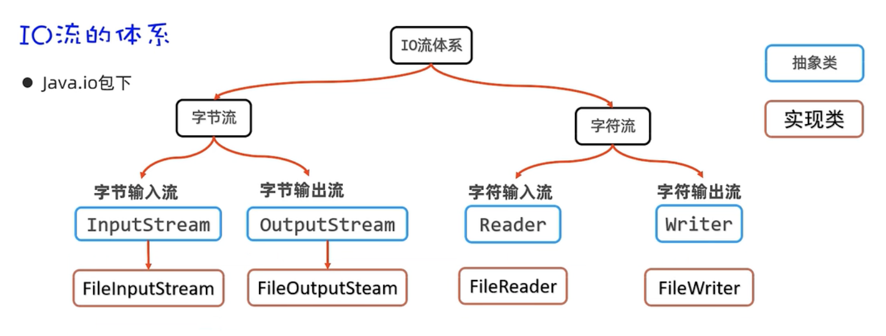
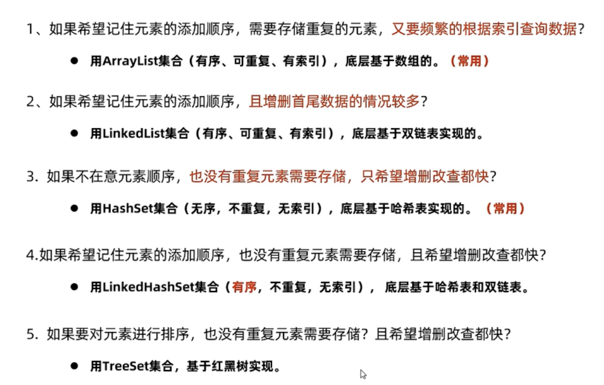
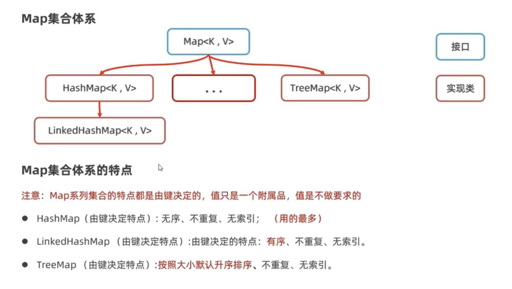
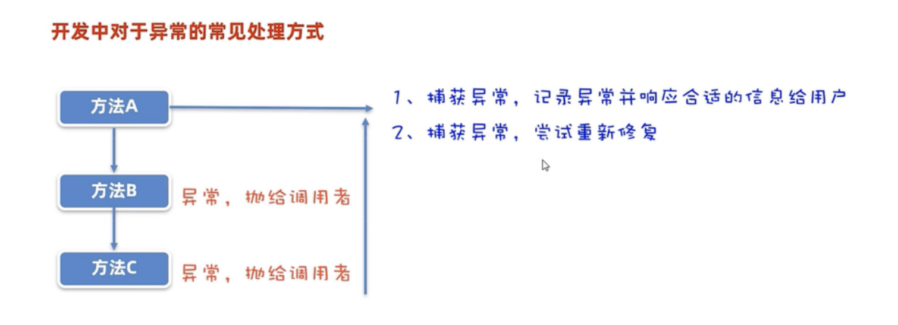

# Java概述

JavaSE：标准版，Java技术的核心和基础

JavaEE：企业版，大型互联网企业级解决方案，充分被市场认可

JavaME：小型版，移动应用的解决方案，没有被市场认可

# 搭建Java开发环境

**JDK简介**

Java的产品叫**JDK（Java Development Kit：Java开发者工具包）**，必须按照JDK才能使用Java。JDK 8/11/17/21是长期稳定版，企业用8和11最多。本教程使用17。

**安装**

oracle官网中，下载对应系统的安装包。

检查是否安装成功，并显示对应版本号。

```bash
java
javac
java -version
javac -version
```

**java和javac的作用**

javac是编译工具，java是执行工具，使用javac将java代码编译成机器能够识别的程序。然后使用java执行编译后的程序，如此java程序才能运行起来。

# Java程序开发步骤

java程序开发有三个步骤：编写代码，编译代码，运行代码。

**编写代码**：文件名大驼峰，后缀名.java（源代码文件）。注意：代码的类名必须与文件名一致，类中必须有个main方法，语句必须以分号结尾。

`HelloWorld.java`

```java
public class HelloWorld {
	public static void main(String[] args) {
    System.out.println("Hello World");
  }
}
```

**编译代码**：使用javac编译java文件，得到后缀名为.class的文件（字节码文件）（JDK11开始不需要有这一步，直接使用`java HelloWorld.java`，它会在运行代码之前帮我们编译）

```bash
javac HelloWorld.java
```

**运行代码**：使用`java`命令运行上一步的字节码文件，不要加后缀名

```bash
java HelloWorld
```

# Java程序的执行原理

**编程语言发展历程**

* 机器语言
* 汇编语言
* 高级语言

# JDK的组成、跨平台原理

**JDK（Java Development Kit：Java开发者工具包）的组成**

* JRE（Java Runtime Environment）：Java的运行环境。
  * JVM（Java Virtual Machine）：Java虚拟机，正则运行Java程序的地方。
  * 核心类库：Java自己写好的程序，给程序员的程序调用的。
* 开发工具：java javac ...

**Java跨平台原理**

一次编译，处处可用。

Java程序通过javac编译一次后，就可以在各个平台的虚拟机上运行了，原因是Sun公司为各个平台多提供了对应的JVM虚拟机。

# JDK安装后Path和java_home环境变量

**Path环境变量**

* Path环境变量用于记住程序路径，方便在命令行窗口的任意目录启动程序。
* 在命令行中启动程序有两种方式
  * 在程序所在目录，直接启动程序
  * 配置Path环境变量，就可以在命令行窗口的任意目录启动程序了
* 新版JDK安装好之后，会自动将java和javac配置到Path环境变量中，这样我们就可以直接在命令行的任意目录启动程序了，但是老版本的JDK需要自己配置Path环境变量。
* 配置步骤：
  * 找到java javac的命令所在目录
  * 将其配置到命令行的环境变量Path中

**配置java_home环境变量**

java_home环境变量的作用是，告诉操作系统JDK安装在了哪个位置（将来其他技术要通过这个环境变量找到JDK做一些事情的）

* 找到 JDK 的安装路径
* 将其配置到命令行的环境变量JAVA_HOME中

# IDEA开发工具的使用

**IDEA管理Java程序的结构**

* project（项目、工程）（创建空工程）（选择JKD版本）
  * module（模块）
    * src/package（包）（名字：com.公司名.包名）
      * class（类）
        * 代码（要有main函数）
  * out 编译之后的代码
  * .iml 包含了与模块相关的各种配置信息

# Java基础语法

**字面量**

字符：单引号，里面只能有一个字符，类型是`char`。特殊的字符：`\n`表示换行，`\t`表示tab

空值：null

**变量**

定义变量的格式：`数据类型 变量名 = 数据;`

变量命名规范：小驼峰

类命名规范：大驼峰

注意事项：使用变量前必须给其赋值、{}内为其作用域、在同一作用域中不能重复定义、强类型。

变量里的数据在计算机中的存储原理：

* 将数据转换成二进制，然后以计算机中表示数据的最小单元字节（byte，简称B）来存储。
* 一个字节由8个二进制位组成，每个二进制位就称为位（bit，简称b，1B=8b）。
* 数字类型的数据可以直接转换成二进制。
* 字符类型的数据是先通过ASCII编码表规则（字符和数字的对应关系）将其换算成数字，然后在转换成二进制。
* 图片就是像素点组成的，每个像素点由三原色也就是三个数字组成。
* 音频是由信号波组成，波上的每个点都可以对应一个坐标数据。
* 视频是由图片和音频一起组成的。
* 综上所诉，数据在计算机中存储的都是二进制。

**数据类型**

基本数据类型：4大类8种。                                    占用内存（字节数）

* 整形：byte short int(默认) long                     1 2  4  8
* 浮点型（小数）：float double(默认)             4 8
* 字符型：char                                                    2
* 布尔型：boolean                                             1

引用数据类型：String

**自动类型转换**

场景：

* 当某种类型变量要赋值给另一种类型的变量
* 不同类型数据一起运算时

结论：

* 类型范围小的变量可以直接赋值给类型范围大的变量，如：byte => int
* 不同类型数据一起运算时，表达式最终的结果类型由最高类型决定。
* 表达式运算时，byte/short/char是直接转换成int参与运算的。

**强制类型转换**

场景：大范围类型的变量赋值给小范围类型的变量，默认会报错，此时可以使用强制类型转换。

结论：

* 强制转换可能造成数据的溢出丢失，结果由开发人员自己负责
* 浮点型强转成整形，直接丢掉小数部分，保留整数部分返回

语法：

* 大范围类型 变量1 = 数据;

* 小范围类型 变量2 = (小范围类型)变量1、数据;   

**算数运算符**

加号与字符串运算时：能算则算，不能算就连接在一起。

**流程控制**

流程控制：就是控制程序的执行顺序的。

三种执行顺序：

* 顺序结构：自上而下执行代码
* 分支结构：根据条件，执行对应代码（if、switch同js）。switch不支持double/float/long
* 循环结构：控制某段代码重复执行（for、while、do-while同js）

**数组**

数组是一个容器，用来存储一批同种类型的数据。

静态初始化数组：

* 定义数组时，直接给数组赋值。
* 语法：`数据类型[] 数组名 = {元素1, 元素2, ...};`

动态初始化数组：

* 定义数组时，先不存入具体的元素值，只确定数组存储的数据类型和数组长度。
* 语法：`数据类型[] 数组名 = new 数据类型[数组长度];`
* 元素默认值规则：
  * 基本类型：byte short char int long => 0  float double => 0.0  boolean => false  
  * 引用类型：类 接口 数组 String =》 null

**方法**

```java
// 设置了具体返回值类型，方法中必须return，如果方法中不需要返回值，返回值类型设置成void
修饰符 返回值类型 方法名(形参类型 形参, ...){
	方法体代码...
  return 返回值;
}

// 方法重载：在同一个类中，出现多个相同名称的方法，但他们的形参是不一样的，那么这些方法成为方法重载了。
```

**面向对象编程**

将数据和方法交给类去维护，然后在通过类创建对象。

`Student.java`

```java
// 一个java文件中可以有多个class声明的类型，但是只能有一个public类。并且public类名要和文件名一致。
public class Student {
  // 构造器：与类同名的没有返回值类型的方法，就是构造器。
  // 注意：1.构造器也可以方法重载，也就是可以声明不同参数的构造器函数；2.如果不写构造器，那么会自动生成一个无参构造器。
  public Student() {
    
  }
  String name;
  double chinese;
  double math;
  public viod printTotalScore() {
    System.out.println(name + "同学的总分是" + (chinese + nath))
  }
  public viod printAverageScore() {
    System.out.println(name + "同学的平均分是" + (chinese + nath) / 2.0)
  }
}
```

合理隐藏，合理暴露：

访问控制修饰符，它们定义了类、方法、构造器和变量的可访问性。每个修饰符的作用范围不同：

1. **`public`**：最广泛的访问级别，被 `public` 修饰的类、方法、构造器或变量可以从任何其他类中访问。如果其他包中的类需要访问某个类或类成员，这些类或成员应该声明为 `public`。
2. **`protected`**：提供了一种中等级别的访问控制。被 `protected` 修饰的类成员可以被同一个包中的任何类以及其他包中的该类的子类访问。
3. **`default`（无修饰符）**：如果你不为类成员指定任何访问修饰符，则它们将具有默认访问级别。`default` 访问级别意味着类成员只能被同一个包内的类访问。这也被称为包私有级别。
4. **`private`**：最受限的访问级别。被 `private` 修饰的类、方法、构造器或变量只能在声明它们的类内部访问。这主要用于封装，防止外部代码直接访问类的内部状态。

实体类(标准JavaBean)：

实体类的作用就是用来保存数据的java类。只有保存数据和存储数据的get set方法，没有其他方法了。

1. 类中的成员变量都要私有，并提供相应的getXxx，setXxx方法。
2. 类中必须要有一个公共的无参构造器。

static类方法最常见的应用场景是做工具类：工具类中的方法都是一些类方法，每个方法完成一个功能，给开发人员共同使用。

```java
public class XxxUtil {
  // 建议将工具类构造器私有化
  private XxxUtil() {
    
  }
  public static void xxx() {
    ...
  }
  public static boolean xxxx(String email) {
    ...
  }
  public static String xxxxx(int n) {
    
  }
}
```

类方法中可以直接访问类成员，不能直接访问实例成员

实例方法中可以直接访问类成员，也可以直接访问实例成员

实例方法中可以出现this关键字，类方法中不可以

代码块概述：

代码块是类的5大成分之一（成员变量、构造器、方法、代码块、内部类）

代码块分为两种

* 静态代码块
  * 格式 static {}
  * 特点：类加载时自动执行，由于类只会加载一次，所以静态代码块也只会执行一次。
  * 作用：完成类的初始化，例如：对类变量的初始化赋值。
* 实例代码块
  * 格式 {}
  * 特点：每次创建对象时，执行实例代码块，并在构造器前执行。
  * 作用：和构造器一样，都是用来完成对象的初始化的，例如：对实例变量进行初始化赋值。

继承：

使用extends关键字 public class B extends A {} 

子类可以继承父类非私有成员。

java是单继承的，不支持多继承，但支持多层继承。

Object类是所有类的祖宗类。

多态：

多态是在继承/实现情况下的一种现象，表现为：对象多态、行为多态。

多态的前提：有继承/实现关系；存在父类引用子类对象；存在方法重写。

抽象类：

接口：

Java提供一个关键字interface，可以定义一个特殊的结构：接口。

```java
public interface 接口名 {
	// 成员变量（常量）
  // 成员方法（抽象方法）
}
```

接口不能创建对象；接口是用来被类实现（implements）的，实现接口的类称为实现类。

```java
修饰符 class 实现类 implements 接口1,接口2,接口3,... {
  
}
```

一个类可以实现多个接口（接口可以理解成干爹），实现类实现多个接口，必须重写完全部接口的全部抽象方法，否则实现类需要定义成抽象类。

接口弥补了单继承的不足。

内部类：

枚举类：

泛型：

**Lambda表达式**

Lambda表达式是JDK8新增的一种语法形式，用于简化函数式接口的匿名内部类的代码写法。

函数式接口：有且仅有一个抽象方法的接口。

注意：大部分函数式接口，上面都可能有一个@FunctionalInterface注解，有该注解的接口就必定是函数式接口。

**方法引用**

方法引用是进一步简化Lambda表达式的，方法引用的标志性符号 ::

* 静态方法引用

* 动态方法引用

* 特定类型方法引用

* 构造器引用

**Stream**

Stream也叫Stream流，是Jdk8新增的一套API（Java.util.stream.*），可以用于操作集合或者数据的数据。

优势：Stream流大量结合了Lambda语法风格来编程，提供了一种更加强大，更加简单的方式操作集合或者数组中的数据，代码更简洁，可读性更好。

Stream流使用步骤：



**File**

存储数据的方案：下面这些存储数据的方案都是存入到内存，内存中存储数据是很快的，因此这些内存中的数据容器通常会记录程序正在处理的数据，以便程序能快速的运算，用户体验感会好一些。但内存的问题是它记录的数据，在断电或程序终止时会丢失。


如果内存中处理后的数据需要长久的保存，我们可以把程序处理后的数据存到文件中去。数据库本质也是用文件存储数据的。

File是java.io.包下的类，File类的对象，用于代表当前操作系统的文件（可以是文件或文件夹）。可以对文件做一些操作，比如：获取文件信息（大小，文件名，修改时间）、判断文件类型、创建文件/文件夹、删除文件/文件夹等。

注意：File类只能对文件本身进行操作，不能读写文件里面存储的数据。

创建File对象：

```java
File f = new File("文件的相对/绝对路径");
```

file对象操作文件的常用方法：

* 判断文件类型、获取文件信息

  ```java
  // 根据文件路径获取文件对象
  File f = new File("文件的相对/绝对路径");
  // 判断当前文件对象对应的的文件路径是否存在
  f.exists();
  // 判断当前文件对象指代的是否是文件
  f.isFile();
  // 判断当前文件对象指代的是否是文件夹
  f.isDirectory();
  // 获取文件名（包含后缀）
  f.getName();
  // 获取文件大小，返回字节个数
  f.length();
  // 获取文件最后修改时间，返回时间戳
  long time = f.lastModified();
  // 获取场景文件对象时，使用的路径
  f.getPath();
  // 获取文件绝对路径
  f.getAbsolutePath();
  ```

* 创建文件、删除文件

  ```java
  // 获取文件对象
  File f1 = new File("要创建的文件的路径 /Users/a/a.txt");
  // 创建一个新文件（文件内容为空），不存在才会创建，创建成功返回true
  f.createNewFile();
  
  // 获取文件对象
  File f2 = new File("要创建的文件夹的路径 /Users/a");
  // 创建文件夹，只能创建一级文件夹，创建成功返回true
  f2.mkdir();
  
  // 获取文件对象
  File f3 = new File("要创建的文件夹的路径 /Users/a/b/c/d");
  // 创建文件夹，可以创建多级文件夹，创建成功返回true
  f3.mkdirs();
    
  // 删除文件或空文件夹，不能删除非空文件夹，成功返回true
  f3.delete();
  ```

* 遍历文件夹

  ```java
  // 获取文件夹对象
  File f = new File("/Users");
  
  // 获取当前目录下所有的”一级文件名称”到一个字符串数组中去返回
  String[] names = f.list();
  for (String name : names) {
    System.out.println(name);
  }
  
  // 获取当前目录下所有的”一级文件对象“到一个文件对象数组中去返回（重点）
  File[] files = f.listFiles();
  for (File file : files) {
    System.out.println(file.getAbsolutePath());
  }
  ```

案例：搜索指定文件位置

```java
import java.io.File;
//import java.io.IOException;

public class SearchFile {
    public static void main(String[] args) throws Exception {
        searchFile(new File("/Users"), "tools.xmind");
    }
    public static void searchFile(File dir, String fileName) throws Exception {
        // 1.拦截非法情况
        if (dir == null || !dir.exists() || dir.isFile()) {
            return; // 代表无法搜索
        }
        // 2. dir不是null,存在，一定是目录对象
        // 获取当前目录下的所有一级文件对象
        File[] files = dir.listFiles();
        // 3.判断当前目录下是否存在一级文件对象，以及是否可以拿到一级文件对象
        if (files != null && files.length > 0) {
            for (File f : files) {
                if (f.isFile()) {
                    if (f.getName().contains(fileName)) {
                        System.out.println("找到了：" + f.getAbsolutePath());
                        // 找到文件位置后，启动文件
                        // Runtime runtime = Runtime.getRuntime();
                        // runtime.exec(f.getAbsolutePath());
                    }
                } else {
                    searchFile(f, fileName);
                }
            }
        }
    }
}
```

**字符集、字符编码**

ASCII（美国标准信息交换码）是一种字符编码方案，主要对大小写英文、数字、标点符号、特殊符号进行编码。使用一个字节存储字符，字节的首位是0，总共可以表示128个字符（2**7）。

GBK（汉字内码扩展规范，国标）汉字编码字符集和字符编码方案，包含了两万多个汉字等字符，一个中文字符要编码成两个字节进行存储，字节的首位是1，总共可以表示32768个字符（2**15）。GBK兼容ASCII。

Unicode字符集（统一码，也叫万国码），Unicode是国际组织制定的，可以容纳世界上所有文字、符号。

* UTF-32是Unicode字符集中的一种字符编码方案：使用4个字节表示一个字符，有容乃大，但是过于奢侈，占存储空间、通信效率低。

* UTF-8是Unicode字符集中的一种字符编码方案，采用可变长度字符编码（定长码），也是一种前缀码，共分四个长度区：1个字节，2个字节，3个字节，4个字节。英文字符、数字等只占1个字节（兼容ASCII字符编码），汉字字符占用3个字节。



编码：把字符安照指定字符集编码成字节。

解码：把字节安照指定字符集解码成字符。

Java代码完成对字符的编码和解码（都是字符串提供的方法）：

```java
// 编码
String data = "a我b";
// 按照平台默认字符集（UTF-8）将该String编码为一系列字节，将结果存储到新的字节数组中。
byte[] bytes1 = data.getBytes(); // [97, -26, -120, -111, 98]
// 按照指定字符集进行编码
byte[] bytes2 = data.getBytes("GBK"); // [97, -50, -46, 98]

// 解码
// 通过平台默认字符集解码指定的字节数组来构造新的String
String s1 = new String(bytes1);
// 通过指定字符集解码指定的字节数组来构造新的String
String s2 = new String(bytes2, "GBK")
```

**IO流**

IO流是用于读写数据的（可以读写文件，或网络中的数据...）










FileInputStream（文件字节输入流）：

作用：以内存为基准，可以把磁盘文件中的数据以字节的形式读入到内存中去。

既然要读文件，肯定要创建管道与要读的文件接通，肯定还提供一些方法给我们去读文件里面的字节数据。

a.txt

```txt
abc12
```

```java
// 1.创建文件字节输入流管道，与源文件接通
FileInputStream is = new FileInputStream(new File("文件路径"));
FileInputStream is = new FileInputStream("文件路径"); // 简化写法，推荐使用
// 多态写法
InputStream is = new FileInputStream(new File("文件路径"));
InputStream is = new FileInputStream("文件路径"); // 简化写法，推荐使用

// 2.开始读取文件的字节数据
// 2.1每次读取一个字节返回，如果发现没有数据可读会返回-1
int b1 = is.read(); // a对应的字节编码
int b2 = is.read(); // b对应的字节编码
int b2 = is.read(); // c对应的字节编码
int b2 = is.read(); // 1对应的字节编码
int b2 = is.read(); // 2对应的字节编码
int b3 = is.read(); // -1
// 使用循环改造
int b;
while ((b = is.read()) != -1) {
  System.out.print((char) b);
}

// 注意：
// 1.上面这种方式读取数据的性能很差
// 2.读取汉字输出会乱码！！是无法避免的！！
// 3.流使用完毕之后，必须要关闭，释放系统资源
is.close();


// 2.2每次读取多个字节，每次用一个字节数组去读取数据，返回字节数组读取了多少个字节，如果发现没有数据可读会返回-1
// 定义一个字节数组，用来装读取的多个字节
byte[] buffer = new byte[3];
int len1 = is.read(buffer);
String rs1 = new String(buffer); // 将读取的字节数组转成字符串
rs1; // abc
len1; // 3

int len2 = is.read(buffer);
// 注意：读取多少，倒出多少
String rs2 = new String(buffer, 0, len2); // 将读取的字节数组转成字符串
rs2; // 12
len2; // 3

int len3 = is.read(buffer);
len3; // -1

// 使用循环改造
byte[] buffer = new byte[3];
int len;
while ((len = is.read(buffer)) != -1) {
  String rs = new String(buffer, 0, len);
  System.out.print(rs);
}
is.close(); // 关闭流

// 注意：
// 1.性能得到了明显的提升
// 2.读取汉字输出会乱码！！是无法避免的！！
// 3.这种方案对于读取字节，再将字节转移到其他地方去是很重要的，它适合做文件拷贝操作，后面会结合文件字节输出流来实现。

// 2.3一次读取完全部字节，可以解决字节流读取中文输出乱码的问题（这种方法不能读取特别大的文件，因为考虑内存有限）
// 方式一：自己定义一个字节数组与被读取的文件大小一样大，然后使用该字节数组，一次读取完文件的全部字节
File f = new File("文件路径");
long size = f.length();
byte[] buffer = new byte[(int) size];
int len = is.rend(buffer);
String rs = new String(buffer);
rs; // 文件全部内容，并不会乱码
len; // 5
size; // 5
is.close();
// 方式二：Java官方为InputStream提供了readAllBytes方法，可以直接把文件的全部字节读取到一个字节数组中返回。
byte[] buffer = is.readAllBytes();
String rs = new String(buffer);
rs; // 文件全部内容，并不会乱码
```

综上：读写文本内容更适合用字符流，字节流适合做数据的转移，如：文件复制等。


# 常用API

API文档中的java.base是重点。

**包**

1. 同一包下的程序可以直接访问
2. 访问其他包的程序，必须先导包
3. 调用java提供的程序，也需要先导包。Java.long包下的程序不需要导包，可以直接使用
4. 调用多个不同包下的程序，这些程序名又刚好一样，默认只能导入一个程序，另一个程序必须带包名访问。

**String**

**Object类、Objects类、包装类**

Object类：

* toString：返回对象的字符串表现形式
* equals：判断两个对象地址是否相等
* clone：对象克隆

Objects类：是一个工具类，提供了很对操作对象的静态方法给我们使用。

* equals：先做非空判断，再比较两个对象地址是否相等
* isNull：判断某个对象是否是null
* nonNull：判断某个对象是否不是null

包装类：把基本数据类型的数据包装成对象。

**StringBuilder、StringBuffer、StringJoiner**

StringBuilder：代表可变字符串对象，相当于一个容器，比String更适合字符串的修改操作，更高效，代码更简洁。

StringBuffer：StringBuffer的用法与StringBuilder是一模一样的。但StringBuilder是线程不安全的，StringBuffer是线程安全的。（是否多个人同时操作一个对象）

StringJoiner：JDK8开始才有的，跟StringBuilder一样，也是用来操作字符串的。好处是在某些场景下操作字符串，代码更简洁。

**Math**

**System**

System代表程序所在的系统，是一个工具类。

```java
// 终止当前运行的Java虚拟机
System.exit(0);
// 获取系统的时间戳
long time = System.currentTimeMillis();
```

**Runtime**

Runtime代表程序所在的运行环境。Runtime是一个单例类（对外只提供一个对象）

```java
// 获取运行时对象
Runtime r = Runtime.getRuntime();
// 终止当前运行的虚拟机
r.exit(0);
// 返回Java虚拟机可用的处理器数
r.availableProcessors();
// 返回Java虚拟机中的内存总数
r.totalMemory();
// 返回Java虚拟机中的可用内存
r.freeMemory();
// 启动某个程序，并返回代表该程序的对象
Process p = r.exec(String command); // command程序启动路径
p.destory(); // 关闭程序
```

**BigDecimal**

解决精度问题

**Date日期类**

Date代表系统此刻的日期。

```java
// 创建一个Date日期对象
Date d = new Date() 
// 返回1970年1月1日00:00:00到此刻的毫秒数
long time = d.getTime() 
// 把时间毫秒值转换成Date日期对象
Date d2 = new Date(time)
// 把时间毫秒值转换成Date日期对象
Date d3 = d.setTime(time)
```

**SimpleDateFormat**

简单日期格式化，可以把日期对象、时间毫秒值格式化成我们想要的形式。

```java
// 创建一个Date日期对象
Date d = new Date();
// 创建时间戳
long time = d.getTime();
  
// 使用SimpleDateFormat格式化日期对象和时间戳
SimpleDateFormat sdf = new SimpleDateFormat("yyyy-MM-dd HH:mm:ss EEE a");
String rs = sdf.format(d); // 2024-01-04 11:44:00 周四 上午
String rs2 = sdf.format(time); // 2024-01-04 11:44:00 周四 上午
  
// 使用SimpleDateFormat将字符串的时间解析成日期对象
String dateStr = "2024-01-04 11:44:00";
SimpleDateFormat sdf2 = new SimpleDateFormat("yyyy-MM-dd HH:mm:ss");
Date d2 = sdf2.parse(dateStr);
```

**Calendar**

Calendar代表系统此刻的日历。

通过它可以获取修改时间中的年月日时分秒等。

```java
// 获取当前日历对象
Calendar now = Calendar.getInstance();
// 获取日历中的某个信息(这些信息都可以在上一行的结果中找到)
int year = now.get(Calendar.YEAR);
// 获取日期对象
Date d = now.getTime();
// 获取时间戳
long time = now.getTimeInMillis();
// 修改日历中的某个信息
now.set(Calendar.MONTH, 9);
// 为某个信息增加/减少多少
now.add(Calendar.DAY_OF_YEAR, 100)
```

**JDK8新增的时间API**

优点：

* 设计更合理，功能丰富，使用更方便
* 都是补课班对象，修改后会返回新的时间对象，不会丢失最开始的事件
* 线程安全
* 能精确到毫秒、纳秒

代替Calendar：

LocalDate：代表本地日期（年月日星期）

LocalTime：代表本地时间（时分秒纳秒）

LocalDateTime：代表本地日期、时间（年月日星期时分秒纳秒）

ZoneId：时区

ZonedDateTime：带时区的事件

代替：Date

Instant：时间线/时间戳，有纳秒的记录。

代替：SimpleDateFormat

DateTimeFormatter：对时间格式化和解析

```java
// 创建日期格式化器对象
DateTimeFormatter formatter = DateTimeFormatter.ofPattern("yyyy-MM-dd HH:mm:ss");

// 格式化日期对象和时间戳
LocalDateTime now = LocalDateTime.now(); // 创日期时间对象
String rs = formatter.format(now);
// 或
String rs2 = now.format(formatter);

// 将字符串的时间解析成日期时间对象
String dateStr = "2024-01-04 11:44:00";
LocalDateTime ldt = LocalDateTime.parse(dateStr, formatter)
```

其他补充：

Period：计算时间间隔（年月日）

Duration：计算时间间隔（时分秒纳秒）

**Arrays类**

数组的一些操作

**集合**

集合是一种容器，用来装数据，类似于数组。java中集合的种类有很多，如：ArrayList List Map Set...，ArrayList是最常用的。

数组定义时长度就固定了，所有一些场景下使用数组存数据是不合适的。集合大小可变，开发中用的更多。

集合体系结构：

* 以Collection为代表的单列集合：每个元素只包含一个值。

  

  * List接口

    * 实现类ArrayList底层是基于数组实现的。数组数据结构特点：查询快，增删慢。
    * 实现类LinkedList底层是基于双链表实现的。双链表数据结构特点：查询慢，增删快，对首尾元素的增删改查极快。可以用来设计队列，因为队列只涉及首尾的操作。还可以用来设计栈，因为栈只涉及首部的操作。

  * Set接口

    * 实现类HashSet底层是基于哈希表实现的。哈希表数据结构的特点：增删改查都较快。JDK8之前，哈希表=数组+链表，JDK8之前，哈希表=数组+链表+红黑树。
    * 实现类LinkedHashSet底层是基于哈希表实现的，但是它的每个元素都额外多了一个双链表的机制记录他前后元素的位置，所以保证了有序性。
    * 实现类TreeSet底层是基于红黑树实现排序的。

  * 使用场景

    

* 以Map为代表的双列集合：每个元素包含两个值（键值对）。

  

  * 实现类HashMap底层跟HashSet是一样的。实际上Set系列集合的底层就是基于Map实现的，只是Set集合中的元素只要键数据，不要值数据而已。
  * 实现类LinkedHashMap底层跟LinkedHashSet是一样的。实际上Set系列集合的底层就是基于Map实现的，只是Set集合中的元素只要键数据，不要值数据而已。
  * 实现类TreeMap底层底层跟TreeSet是一样的。实际上Set系列集合的底层就是基于Map实现的，只是Set集合中的元素只要键数据，不要值数据而已。

# 异常

**Java异常体系**


Error：代表系统级别错误（属于严重问题），系统一旦出现问题，sun公司会把这些问题封装成Error对象给出来，Error是Sun公司自己用的，不是给程序员用的，隐藏我们不用管它。

Exception：叫异常，它代表的才是我们程序可能出现的问题，所以我们通常会用Exception以及它的孩子来封装程序出现的问题。

* 运行时异常：RuntiemException及其子类，编译阶段不会出现错误提醒，运行时出现的异常（如：数组索引越界异常）
* 编译时异常：编译阶段（写代码时）就会出现的错误提醒（如：日期解析异常）

**异常处理代码写法**

* 抛出异常（throws）：在方法上使用throws关键字，可以将方法内部出现的异常抛出去给上次调用者处理

  ```java
  方法名() throws 异常1, 异常2, 异常3...{
    ...
  }
  ```

* 捕获异常（try...catch）：直接捕获程序出现的异常。

  ```java
  try {
    // 监视可能出现异常的代码
  } catch(异常类型1 变量) {
    // 处理异常
  } catch(异常类型2 变量) {
    // 处理异常
  }...
  ```

**自定义异常**

自定义异常种类：自定义运行时异常、自定义编译时异常。

* 自定义运行时异常

  1. 定义一个异常类继承RuntiemException
  2. 重写构造器
  3. 通过throw new 异常类(xxx)来创建异常对象并抛出

  `自定义运行时异常类`

  ```java
  public class AgeIllegalRuntimeException extends RuntimeException {
      public AgeIllegalRuntimeException() {
      }
  
      public AgeIllegalRuntimeException(String message) {
          super(message);
      }
  }
  ```

  `使用自定义运行时异常类`

  ```java
  public class ExceptionTest {
      public static void main(String[] args) {
          try {
              saveAge(160);
          } catch (Exception e) {
              e.printStackTrace();
              System.out.println("底层出现了bug");
          }
      }
      public static void saveAge(int age) {
          if (age > 0 && age < 150) {
              System.out.println("年龄被成功保存： " + age);
          } else {
              // throw抛出这个异常对象
              throw new AgeIllegalRuntimeException("/age is illegal, your age is " + age);
          }
      }
  }
  ```

* 自定义编译时异常

  1. 定义一个异常类继承Exception
  2. 重写构造器
  3. 通过throw new 异常类(xxx)来创建异常对象并抛出

  `自定义编译时异常类`

  ```java
  public class AgeIllegalException extends Exception {
      public AgeIllegalException() {
      }
  
      public AgeIllegalException(String message) {
          super(message);
      }
  }
  ```

  `使用自定义编译时异常类`

  ```java
  public class ExceptionTest {
      public static void main(String[] args) {
          try {
              saveAge2(160);
          } catch (AgeIllegalException e) {
              e.printStackTrace();
              System.out.println("底层出现了bug");
          }
      }
      public static void saveAge2(int age) throws AgeIllegalException {
          if (age > 0 && age < 150) {
              System.out.println("年龄被成功保存： " + age);
          } else {
              // throw
              throw new AgeIllegalException("/age is illegal, your age is " + age);
          }
      }
  }
  ```

**开发中对一次的常见处理方式**



