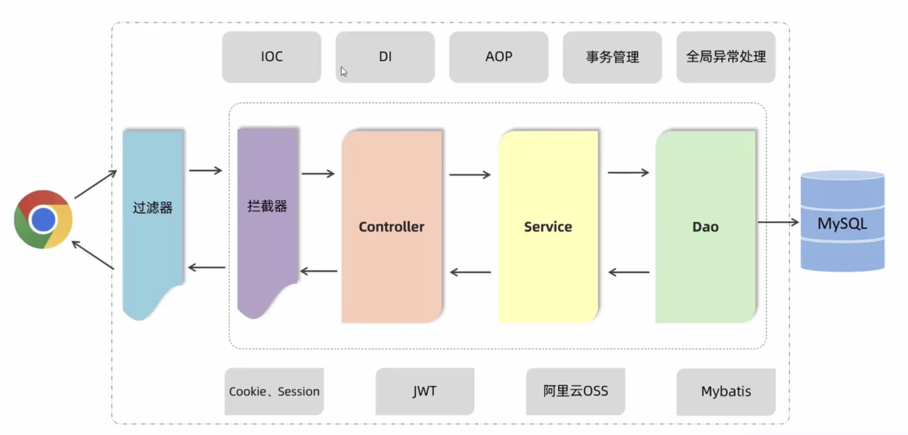
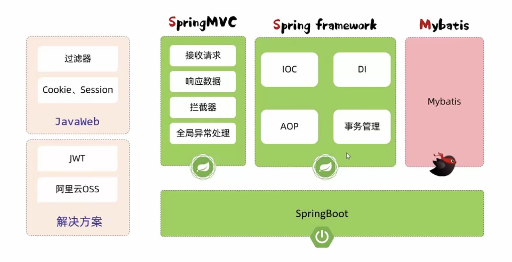

# java三层架构

# mysql关系型数据库

## 1.数据库设计

单表，多表(一对一，一对多，多对多)（外键）（数据《=》业务）

表字段：原型字段 + 基础字段（id/create_time/update_time）

多表查询（内连接、外连接、子查询）：限制显示交际之外的数据就用外连接（并集），没有特殊要求就用内连接（交集）

事务

索引：B+Tree数据结构（多路平衡搜索树）

## 2.数据库操作

## 3.数据库优化

# Mybatis

动态sql：更新接口，前端传了字段就更新，没传就不更新。

# 登录认证

合法身份凭证：会话和令牌。

令牌技术：jwt

* 第一部分：Header（头），记录令牌类型、签名算法等。例如：{ "alg": "hs256", "type": "jwt" }
* 第二部分：Paload（有效载荷），携带一些自定义信息、默认信息等。例如：{"id": "1", "username": "tom"}
* 第三部分：Signature（签名），防止token被篡改、确保安全性。将Header、Paload，并加入指定秘钥，通过指定签名算法计算而来。

# 异常处理

后端出错，返回给前端的结果有问题，需要处理异常：

1. 在controller层使用 try catch 处理异常
2. 使用全局异常处理器

# AOP

面向切面编程

* 连接点
* 切入点
* 通知
* 切面
* 目标对象

# maven高级

* 分模块设计与开发
* 继承与聚合
* 私服

# Web后端开发总结

