# mysql内容

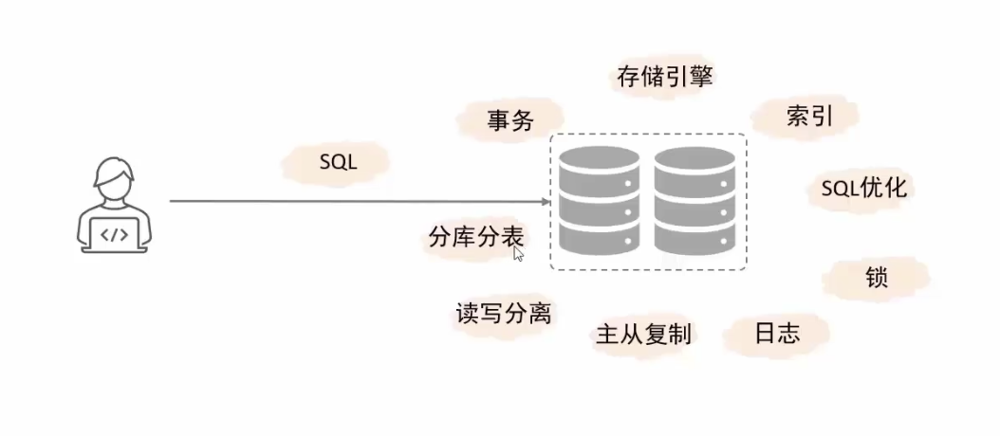

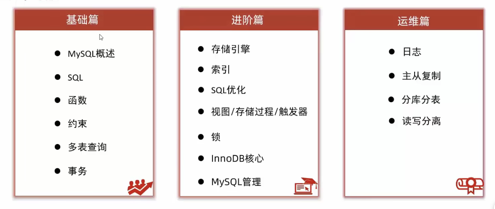

# mysql概述

**数据库相关概念**

数据库：是存储数据的仓库，数据是有组织的进行存储，简称DataBase（DB）。

数据库管理系统：操纵和管理数据库的大型软件，简称DataBase Management System（DBMS）。

SQL：操作关系型数据库的编程语言，定义了一套操作关系型数据库的统一标准，简称Structured Query Language（SQL）

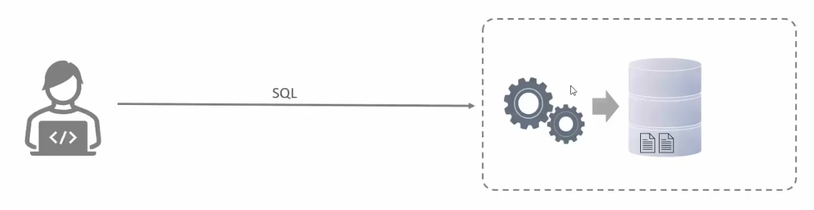

通过sql操作数据库管理系统，从而操作数据库。

主流的关系型数据库管理系统：

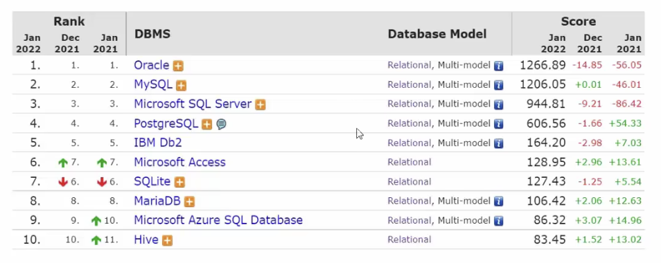

**mysql数据库**

版本：

* 社区版（MySQL Community Server）：免费，MySQL不提供任何技术支持
* 商业版（MySQL Enterprise Edition）：收费，可以试用30天，官方提供技术支持

本课程采用的是MySQL的最新社区版（MySQL Community Server 8.0.26）

安装：

* windows/linux：参照官网
* mac：使用homebrew安装`brew install mysql`

启动与停止：默认mysql是开机自启的

```bash
#windows
#启动
net start mysql80
#停止
net stop mysql80

#mac使用brew安装
#启动
brew services start mysql
#停止
brew services stop mysql
#设置根密码等安全选项
mysql_secure_installation
```

客户端连接：

* 方式一：MySQL提供的客户端命令行工具
* 方式二：系统自带的命令行工具执行指令 `mysql [-h 127.0.0.1] [-P 3306] -u root -p` ，windows中想要在任意命令行中执行mysql命令，需要配置path环境变量。

数据模型：

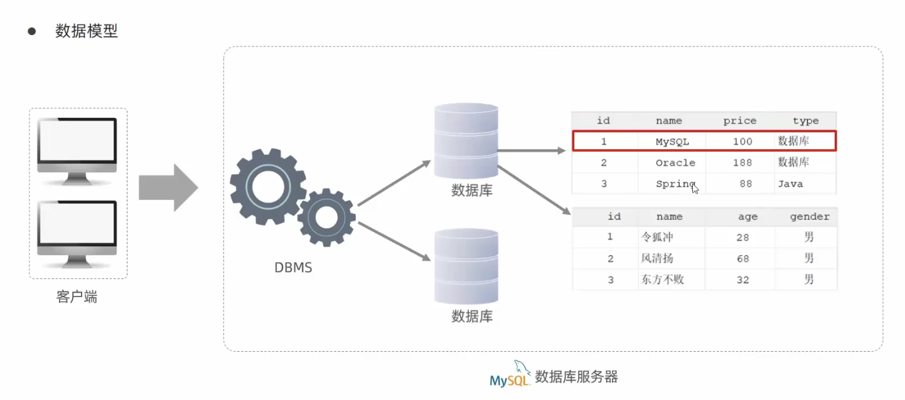

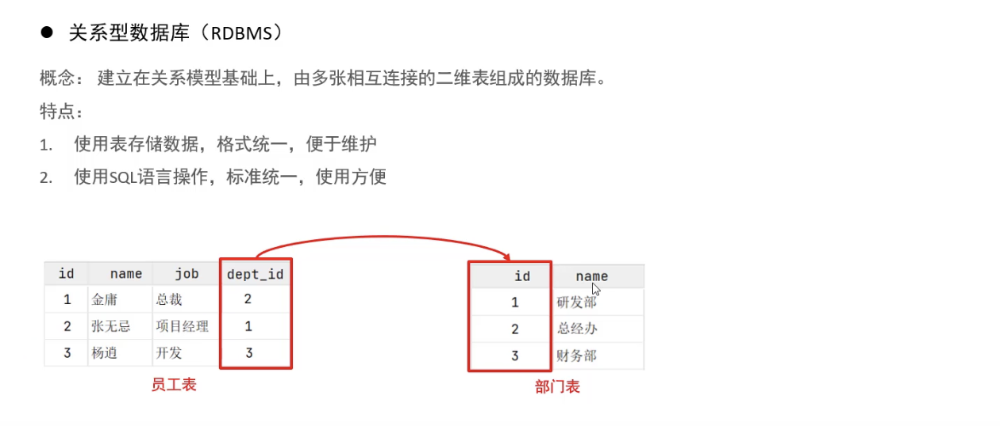

通过表结构存储数据的数据库就称为关系型数据库，不通过表结构存储数据的数据库就称为非关系型数据库。 

# SQL语句

## SQL通用语法

SQL语句可以单行或多行书写，以分号结尾。

SQL语句可以使用空格/缩进（不限制个数）来增强语句的可读性。

MySQL数据库的SQL语句不区分大小写，关键字建议使用大写。

注释：

* 单行注释：-- 注释内容  或  #注释内容（MySQL特有）
* 多行注释：/\*注释内容*/

## SQL语句分类

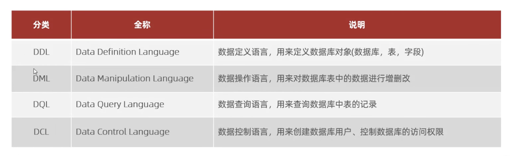

### DDL

DDL（Data Definition Language）：数据定义语言，用来定义数据库对象（数据库，表，字段）

**数据库操作**

* 查询

  ```sql
  -- 查询所有数据库
  show databases;
  -- 查询单签数据库
  select database();
  ```

* 创建

  ```sql
  create database [if not exists] 数据库名 [default charset 字符集] [collate 排序规则];
  ```

* 删除

  ```sql
  drop database [if exists] 数据库名;
  ```

* 使用

  ```sql
  use 数据库名;
  ```

**表操作**

* 查询

  ```sql
  -- 查询当前数据库所有表
  show tables;
  -- 查询表结构
  desc 表名;
  -- 查询指定表的建表语句
  show create table 表名;
  ```

* 创建

  ```sql
  create table 表名(
  	字段1 字段1类型[comment '字段1注释'],
    字段2 字段2类型[comment '字段2注释'],
    字段3 字段3类型[comment '字段3注释'],
    ...
    字段n 字段n类型[comment '字段n注释']
  )[comment '表注释'];
  
  #创建用户表
  create table tb_user(
      -> id int comment '编号',
      -> name varchar(50) comment '姓名',
      -> age int comment '年龄',
      -> gender varchar(1) comment '性别'
      -> ) comment '用户表';
  ```

  数据类型：mysql中的数据类型有很多，主要分为三类：数值类型、字符串类型、日期时间类型。

  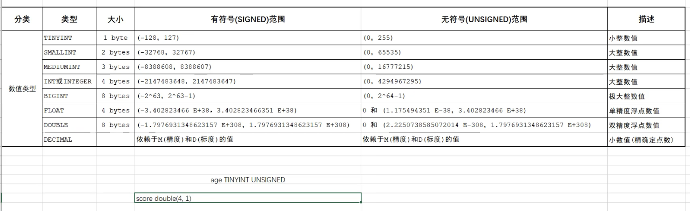

  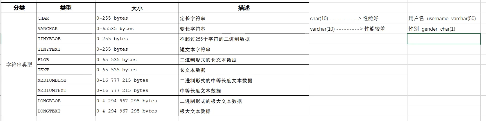

  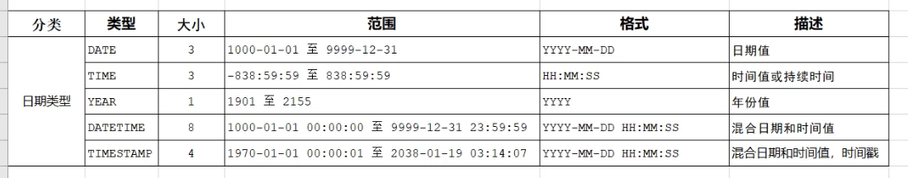

  案例：

  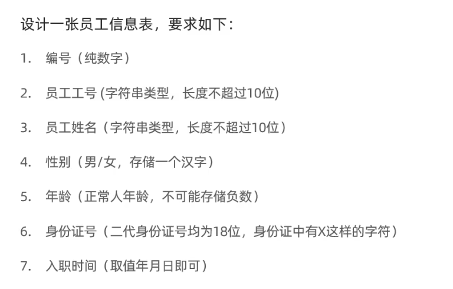

  ```sql
  create table emp(
    id int comment '编号',
    workno varchar(10) comment '工号',
    name varchar(10) comment '姓名',
    gender char(1) comment '性别',
    age tinyint unsigned comment '年龄',
    idcard char(18) comment '身份证号',
    entrydate date comment '入职时间'
  ) comment '员工表';
  ```

* 修改

  ```sql
  -- 往表中添加字段
  alter table 表名 add 字段名 类型(长度) [comment '注释'] [约束];
  -- 修改表中指定字段的数据类型
  alter table 表名 modify 字段名 新数据类型(长度);
  -- 修改表中字段名及其类型
  alter table 表名 change 旧字段名 新字段名 类型(长度) [comment '注释'] [约束];
  -- 删除表中的字段
  alter table 表名 drop 字段名;
  -- 修改表名
  alter table 表名 rename to 新表名;
  ```

* 删除

  ```sql
  -- 删除表
  drop table [if exists] 表名;
  -- 删除指定表，并重新创建该表(空的)
  truncate table 表名;
  ```

**mysql图形化界面工具**

常用的图形化工具有：Sqlyog、Navicat、DataGrip（idea中自动集成）

### DML

DML（Data Manipulation Language）：数据操作语言，用来对数据库表中的数据进行增删改操作。

* 添加数据（insert）
* 修改数据（update）
* 删除数据（delete）

**添加数据**

```sql
-- 给指定字段添加数据
insert into 表名 (字段名1,字段名2,...) values (值1,值2,...);
-- 给全部字段添加数据
insert into 表名 values (值1,值2,...);
-- 批量添加数据
insert into 表名 (字段名1,字段名2,...) values (值1,值2,...),(值1,值2,...),(值1,值2,...);
insert into 表名 values (值1,值2,...),(值1,值2,...),(值1,值2,...);
```

注意：

* 插入数据时，指定的字段顺序需要与值的顺序是一一对应的。
* 字符串和日期型数据应该包括在引号中。
* 插入的数据大小，应该在字段的规定范围内。

**修改数据**

```sql
update 表名 set 字段名1=值1,字段名2=值2,... [where 条件];
```

注意：如果没有where条件，则会修改整张表的所有数据。

**删除数据**

```sql
delete from 表名 [where 条件];
```

注意：

* 如果没有where条件，则会删除整张表的所有数据
* delete语句不能删除某一个字段的值，只能一行一行的删除（可以使用update将值设置为null就可以了）

### DQL

DQL（Data Query Language）：数据查询语言，用来查询数据库中表的记录。

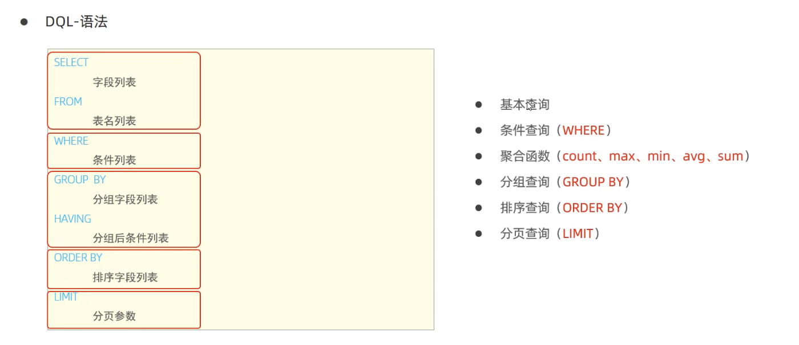

**基本查询**

```sql
-- 查询多个字段
select 字段1,字段2,字段3,... from 表名;
select * from 表名;
-- 设置别名
select 字段1 [as '别名1'], 字段2 [as '别名2'],... from 表名; -- as可以省略
-- 去除重复记录
select distinct 字段列表 from 表名;
```

**条件查询（where）**

```sql
select 字段列表 from 表名 where 条件列表;
```

条件：

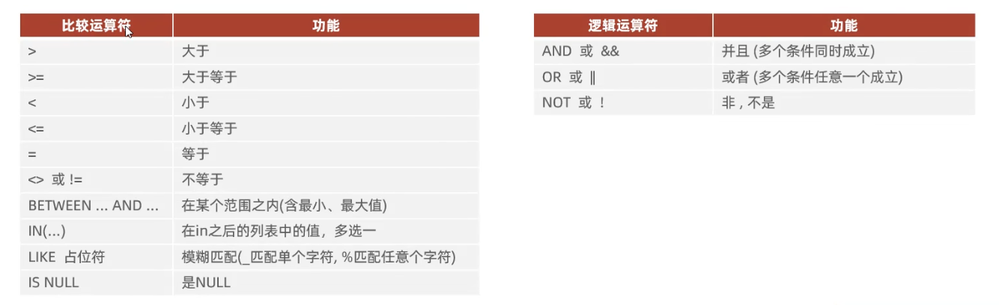

**聚合函数**

聚合函数：将一列数据作为一个整体，进行纵向计算。

常见聚合函数：


```sql
select 聚合函数(字段列表) from 表名 [where 条件];
```

注意：null值不参与所有聚合函数的运算。

**分组函数（group by）**

```sql
select 查询字段列表 from 表名 [where 条件] group by 分组字段名 [having 分组后过滤条件];
```

where与having区别：

* 执行时机不同：where是分组之前进行过滤，不满足条件，不参与分组；而having是分组之后对结果进行过滤。
* 判断条件不同：where不能使用聚合函数进行判断，having可以。
* 分组之后，查询的字段一般为聚合函数和分组字段，查询其他字段无任何意义。

**排序查询（order by）**

```sql
select 字段列表 from 表名 order by 字段1 排序方式1, 字段2 排序方式2;
```

排序方式：

* asc：升序（默认值）
* desc：降序

注意：如果是多字段排序，第一个字段值相同时，才会根据第二个字段进行排序。

**分页查询**

```sql
select 字段列表 from 表名 limit 起始索引,查询记录数;
```

注意：

* 起始索引从0开始，起始索引=(查询页码-1)*每页显示记录数。
* 分页查询是数据库的方言，不同的数据库有不同的实现，mysql中是limit
* 如果查询的是第一页数据，起始索引可以省略，直接简写为 limit 10

**DQL执行顺序**

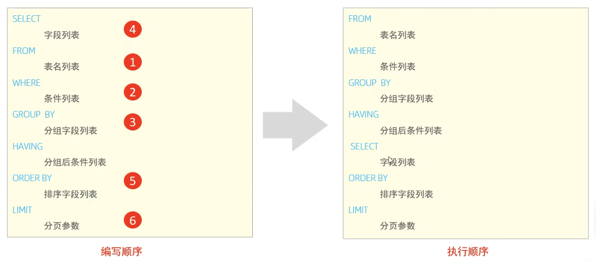

### DCL

DCL（Data Control Language）：数据控制语言，用来管理数据库用户、控制数据库的访问权限。

**管理用户**

```sql
-- 查询用户
use mysql;
select * from user;
-- 创建用户
create user '用户名'@'主机名' identified by '密码';
-- 修改用户密码
alter user '用户名'@'主机名' identified with mysql_native_password by '新密码';
-- 删除用户
drop user '用户名'@'主机名';
```

注意：

* 主机名可以使用%通配。
* 这类sql，开发人员操作的比较少，主要是DBA（Database Administrator 数据库管理员）使用。

**权限控制**

mysql中定义了很多种权限，常用就以下几种：

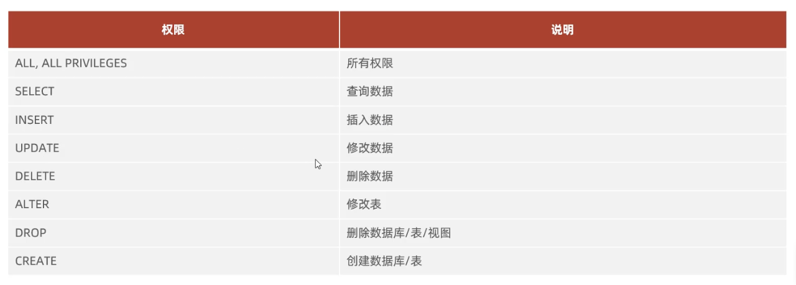

```sql
-- 查询权限
show grants for '用户名'@'主机名';
-- 授予权限
grant 权限列表 on 数据库名.表名 to '用户名'@'主机名';
-- 撤销权限
revoke 权限列表 on 数据库名.表名 from '用户名'@'主机名';
```


