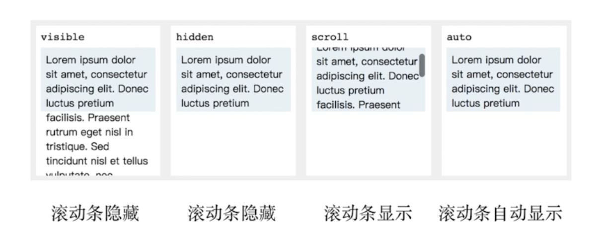

### css 选择器

css 层叠样式表，在控制台中最终生效的效果会在最上层。

选择器权重计算不进位。

### 字体

字体在浏览器中是怎么定义的。

字体族：serif（衬线字体）、sans-serif（非衬线字体）、monospace（等宽字体）、cursive（手写体）、fantasy（花体）。它不是具体的某一个字体，而是字体的一类，如果指定这个，就会在指定的字体族中找一个字体使用。使用中不加引号。

多字体 fallback 机制：系统会找自动寻找指定的字体，有哪个使用哪个，都没有就使用系统默认字体。顺序是根据平台独有的字体放前面。

网络字体（远程）、自定义字体（本地）的使用。

iconfont: 既然可以自定义字体，所谓自定义字体原理就是规定每个字长什么样，如果规定每个字是图标的样子，就可以把文字当做图标用了。

指定字体：

```css
body {
  font-family: 'PingFang SC', 'Microsoft Yahei', serif;
}
```

自定义字体：

```css
@font-face {
	font-family: 'IF';
  src: url('./IndieFlower.ttf');
}
.custom-font {
	font-family: 'IF';
}
```

### 行高

文字和图片排在一行，图片下面有空隙。原因就是 img 也是符合 inline 元素基线对齐的方式，baseliue 和底线之间是有偏差的，偏差大小跟字体大小有关。解决方案：

* vertical-align: bottom; 调整为底线对齐。
* 将图片改为 block 元素。

### 背景

* 渐变色背景
* 多背景叠加
* base64 和性能优化：base64 是一种文本格式，这串文本就是代表图片本身。base64 格式的图片体积会增大三分之一，放入这个 base64 的文件体积也会增大，所以只适用于非常小的图标。base64 在传输上性能是有优势的，减少http 连接数，但是增大了浏览器解码的开销，要先把它转成图片数据再做其他操作。所以要应用在小量的小图标上。

### 边框

边框背景图

```css
div {
	border-image: url(./border.png) 30 round;
}
```

### 滚动

当内容比容器多的时候会产生滚动。

* 滚动行为和滚动条



scroll：不管需不需要滚动，滚动条都存在。

auto：需要滚动时，滚动条才存在，不需要时不存在。

### 文本折行

文本折行跟滚动有一个相似的地方，都是面临显示不下的问题。当文字在一行显示不下的时候，就要考虑到换行的问题，换行的行为怎么控制，是否换行，什么时候换行，在哪换行。

* overflow-wrap(word-wrap) 通用换行控制，是否保留单词。
* word-break 针对多字节文字。是否把单词或字母看成一个单位。
* white-space 空白处是否换行。

装饰性属性及其他

* 字重（粗体）font-weight
* 斜体 font-style: italic
* 下划线 text-decoration
* 署标指针 cursor

### css  hack

hack 就是不合法但生效的写法。主要用于区分不同浏览器来做兼容的事情。

在一部分浏览器中生效的写法就被称为 css hack。作用是处理浏览器兼容性。

注意：标准属性写在前面，hach 写在后面。

缺点：难理解 难维护 易失效。

代替方案：检测浏览器有没有这样的特性，没有就针对性加 class。

css hack 虽然不是最优雅的最推荐的方式，但它确实是是一种简单粗暴的有效的 css 兼容性的解决方案。

### 案例

* 使用 css 做单选框/复选框的美化
  * label[for] 和 id
  * 隐藏原生 input
  * :checked + label
* 使用 css 和单选框/复选框做 tabs


6.清除浮动
	1.额外标签法（在最后一个浮动标签后，新加一个标签，给其设置clear：both；）（不推荐）
		优点：通俗易懂，方便
		缺点：添加无意义标签，语义化差
	2.父级添加overflow属性（父元素添加overflow:hidden）（不推荐）
		通过触发BFC方式，实现清除浮动
    .fahter{
        width: 400px;
        overflow: hidden;
    }
		优点：代码简洁
		缺点：内容增多的时候容易造成不会自动换行导致内容被隐藏掉，无法显示要溢出的元素
	3.使用after伪元素清除浮动（推荐使用）
    .clearfix:after{/*伪元素是行内元素 正常浏览器清除浮动方法*/
        content: "";
        display: block;
        height: 0;
        clear:both;
        visibility: hidden;
    }
		.clearfix{
        *zoom: 1; /*ie6清除浮动的方式 *号只有IE6-IE7执行，其他浏览器不执行*/
    }
		优点：符合闭合浮动思想，结构语义化正确
		缺点：ie6-7不支持伪元素：after，使用zoom:1触发hasLayout
	4.使用before和after双伪元素清除浮动（推荐使用）（万能清除法）
		.clearfix:before,
		.clearfix:after {
			display: block;
			content: " ";
		}
		.clearfix:after {
			clear: both;
		}
		.clearfix{
        *zoom: 1; /*ie6清除浮动的方式 *号只有IE6-IE7执行，其他浏览器不执行*/
    }
		优点：代码更简洁
		缺点：用zoom:1触发hasLayout.
	
css模块化
	1.复用，继承，覆盖
自适应
	1.像素
	  https://github.com/jawil/blog/issues/21
	2.viewport
	3.rem 
	  css单位
	  根据跟标签html的字体大小进行计算
	  em是相对于父元素字体大小进行计算
	4.http://www.woshipm.com/ucd/198774.html
		分辨率(像素) 1920PX * 1080PX
		设备尺寸 5.2英寸
		像素密度(ppi, 每英寸所拥有的像素数目)
		ppi = √(横向^2 + 纵向^2) / 屏幕尺寸(inch)
		小结：1.我们平时做的适配就是关心的分辨率而不是屏幕尺寸。
				 2.在同一个设备上，它的像素个数和像素大小是固定的了，也就是系统的最高分辨率，这是厂商在出厂时就设置好了的，
				 	 只有不同的设备之间，才有像素大小的区别。像素这个东西，就像金箍，能变大能变小。系统调节分辨率是使用虚拟
					 色彩块来充当部分像素块，以达到降低分辨率的效果。
				 3.像素密度是决定屏幕显示清晰度的。也就是分辨率和尺寸大小共同决定的。
ui框架重点
	1.设计或选择一个ui框架的要点
		1.交互友好，美观
		2.可复用，提高效率
		3.源码可修改可覆盖，易扩展
	2.ui框架的使用所关注的点
		1.结构和样式(样式一般都是使用类名来加载的)
		2.怎么覆盖或修改ui框架中的默认样式
			1.直接使用ui框架里面的类名进行样式的覆盖
			2.在ui组件上添加一个新的类名做ui框架的样式覆盖或新增一些我们需要的样式
			3.可以在原有ui组件上添加结构和样式来实现相应的样式需求