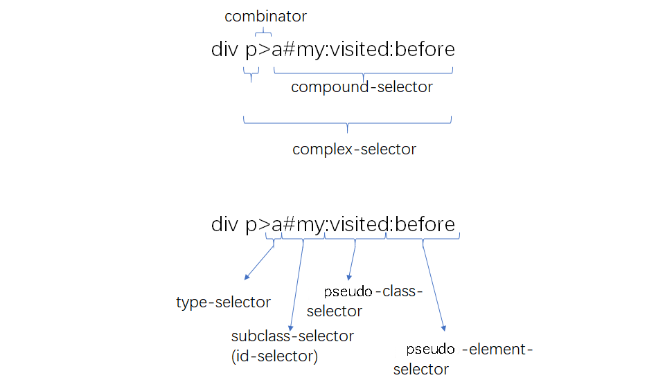
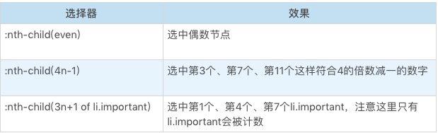

## 目录

* CSS 语法
* CSS 选择器
* CSS 排版
* CSS 动画与交互
* CSS 渲染
* CSS小实验：动手做，用代码挖掘CSS属性


## CSS 语法

任何 css 特性一定要通过一定的语法结构表达出来，最终总要有一个写出来的样子。所以语法可以帮助我们发现大多的 css 特性。

CSS 的顶层样式表由两种规则组成的规则列表构成，一种被称为 at-rule，也就是 at 规则，另一种是 qualified rule，也就是普通规则。

at-rule 由一个 @ 关键字和后续的一个区块组成，如果没有区块，则以分号结束。这些 at-rule 在开发中使用机会远远小于普通的规则，所以它的大部分内容，你可能会感觉很陌生。

这些 at 规则正是掌握 CSS 的一些高级特性所必须的内容。qualified rule 则是指普通的 CSS 规则，也就是我们所熟识的，由选择器和属性指定构成的规则。

### at 规则

好了，现在我们已经知道了，CSS 语法的整体结构，接下来我们要做的是一个体力活，从所有的 CSS 标准里找到所有可能的 at-rule。

* @charset ： https://www.w3.org/TR/css-syntax-3/
* @import ：https://www.w3.org/TR/css-cascade-4/
* @media ：https://www.w3.org/TR/css3-conditional/
* @page ： https://www.w3.org/TR/css-page-3/
* @counter-style ：https://www.w3.org/TR/css-counter-styles-3
* @keyframes ：https://www.w3.org/TR/css-animations-1/
* @fontface ：https://www.w3.org/TR/css-fonts-3/
* @supports ：https://www.w3.org/TR/css3-conditional/
* @namespace ：https://www.w3.org/TR/css-namespaces-3/

这里的每一种 @规则背后，都是一组 CSS 的知识。

#### @charset

@charset 用于提示 CSS 文件使用的字符编码方式，它如果被使用，必须出现在最前面。这个规则只在给出语法解析阶段前使用，并不影响页面上的展示效果。

```css
@charset "utf-8";
```

#### @import

@import 用于引入一个 CSS 文件，除了 @charset 规则不会被引入，@import 可以引入另一个文件的全部内容。

```css
@import "mystyle.css";
@import url("mystyle.css");
```

```css
@import [ <url> | <string> ]
        [ supports( [ <supports-condition> | <declaration> ] ) ]?
        <media-query-list>? ;
```

通过代码，我们可以看出，import 还支持 supports 和 media query 形式。

#### @media

media 就是大名鼎鼎的 media query 使用的规则了，它能够对设备的类型进行一些判断。在 media 的区块内，是普通规则列表。

```css
@media print {
    body { font-size: 10pt }
}
```


#### @page

page 用于分页媒体访问网页时的表现设置，页面是一种特殊的盒模型结构，除了页面本身，还可以设置它周围的盒。

```css
@page {
  size: 8.5in 11in;
  margin: 10%;

  @top-left {
    content: "Hamlet";
  }
  @top-right {
    content: "Page " counter(page);
  }
}
```

#### @ counter-style

counter-style 产生一种数据，用于定义列表项的表现。

```css
@counter-style triangle {
  system: cyclic;
  symbols: ‣;
  suffix: " ";
}
```

#### @ key-frames

keyframes 产生一种数据，用于定义动画关键帧。

```css
@keyframes diagonal-slide {

  from {
    left: 0;
    top: 0;
  }

  to {
    left: 100px;
    top: 100px;
  }

}
```

#### @ fontface

fontface 用于定义一种字体，icon font 技术就是利用这个特性来实现的。

```css
@font-face {
  font-family: Gentium;
  src: url(http://example.com/fonts/Gentium.woff);
}

p { font-family: Gentium, serif; }
```

#### @ support

support 检查环境的特性，它与 media 比较类似。

#### @ namespace

用于跟 XML 命名空间配合的一个规则，表示内部的 CSS 选择器全都带上特定命名空间。

#### @ viewport

用于设置视口的一些特性，不过兼容性目前不是很好，多数时候被 HTML 的 meta 代替。

#### 其它

除了以上这些，还有些目前不太推荐使用的 at 规则。

* @color-profile 是 SVG1.0 引入的 CSS 特性，但是实现状况不怎么好。
* @document 还没讨论清楚，被推迟到了 CSS4 中。
* @font-feature-values 。

### 普通规则

qualified rule 主要是由选择器和声明区块构成。声明区块又由属性和值构成。我在下面的列表中，介绍了这部分语法的组成要点。

* 普通规则
  * 选择器
  * 声明列表
    * 属性
    * 值
      * 值的类型
      * 函数

#### 选择器

我们先来看看选择器，它有一份独立的标准，我们可以参考这个网址：

https://www.w3.org/TR/selectors-4/

关于选择器的叠加规则等知识我们后文会专门的一节课程来讲，这里我们就从语法的角度介绍一下选择器。

我们从语法结构可以看出，任何选择器，都是由几个符号结构连接的：空格、大于号、加号、波浪线、双竖线，这里需要注意一下，空格，即为后代选择器的优先级较低。

然后对每一个选择器来说，如果它不是伪元素的话，由几个可选的部分组成，标签类型选择器，id、class、属性和伪类，它们中只要出现一个，就构成了选择器。

如果它是伪元素，则在这个结构之后追加伪元素。只有伪类可以出现在伪元素之后。我在下面用一个列表（不太严谨地）整理了选择器的语法结构：


我们在这里可以参考一个示例图：



#### 声明：属性和值

声明部分是一个由“属性: 值”组成的序列。

属性是由中划线、下划线、字母等组成的标识符，CSS 还支持使用反斜杠转义。我们需要注意的是：属性不允许使用连续的两个中划线开头，这样的属性会被认为是 CSS 变量。

在[CSS Variables 标准](https://www.w3.org/TR/css-variables/)中，以双中划线开头的属性被当作变量，与之配合的则是 var 函数：

```css
:root {
  --main-color: #06c;
  --accent-color: #006;
}
/* The rest of the CSS file */
#foo h1 {
  color: var(--main-color);
}
```

值的部分，主要[在标准 CSS Values and Unit](https://www.w3.org/TR/css-values-4/)，根据每个 CSS 属性可以取到不同的值，这里的值可能是字符串、标识符。

CSS 属性值可能是以下类型。

* CSS 范围的关键字：initial，unset，inherit，任何属性都可以的关键字。
* 字符串：比如 content 属性。
* URL：使用 url() 函数的 URL 值。
* 整数 / 实数：比如 flex 属性。
* 维度：单位的整数 / 实数，比如 width 属性。
* 百分比：大部分维度都支持。
* 颜色：比如 background-color 属性。
* 图片：比如 background-image 属性。
* 2D 位置：比如 background-position 属性。
* 函数：来自函数的值，比如 transform 属性。

这里我们要重点介绍一下函数。一些属性会要求产生函数类型的值，比如 easing-function 会要求 cubic-bezier() 函数的值：

CSS 支持一批特定的计算型函数：

* calc()
* max()
* min()
* clamp()
* toggle()
* attr()

calc() 函数是基本的表达式计算，它支持加减乘除四则运算。在针对维度进行计算时，calc() 函数允许不同单位混合运算，这非常的有用。

例如：

```css
section {
  float: left;
  margin: 1em; border: solid 1px;
  width: calc(100%/3 - 2*1em - 2*1px);
}
```

max()、min() 和 clamp() 则是一些比较大小的函数，max() 表示取两数中较大的一个，min() 表示取两数之中较小的一个，clamp() 则是给一个值限定一个范围，超出范围外则使用范围的最大或者最小值。

toggle() 函数在规则选中多于一个元素时生效，它会在几个值之间来回切换，比如我们要让一个列表项的样式圆点和方点间隔出现，可以使用下面代码：

```css
ul { list-style-type: toggle(circle, square); }
```

### 总结

在这一部分，我们介绍了 CSS 语法的总体结构，CSS 的语法总体结构是由两种规则列表构成，一种是 at 规则，另一种是普通规则。

在 at 规则中，我举了 13 个以上的例子，并逐个进行了简单的介绍。而在普通规则的部分，我介绍了选择器和声明区块是普通规则的主要组成部分。

并且，我给出了一个（不太严谨）的选择器语法结构，声明区块则由属性和值构成，这一部分我们重点介绍了函数。

从整体上去掌握内容，再去定位到单个细节，这对于我们学习 CSS 有非常重要的提示作用。


## CSS 选择器

选择器是什么，选择器是由 CSS 最先引入的一个机制（但随着 document.querySelector 等 API 的加入，选择器已经不仅仅是 CSS 的一部分了）。我们今天这一课，就重点讲讲 CSS 选择器的一些机制。

选择器的基本意义是：根据一些特征，选中元素树上的一批元素。

我们把选择器的结构分一下类，那么由简单到复杂可以分成以下几种。

* 简单选择器：针对某一特征判断是否选中元素。
* 复合选择器：连续写在一起的简单选择器，针对元素自身特征选择单个元素。
* 复杂选择器：由“（空格）”“ >”“ ~”“ +”“ ||”等符号连接的复合选择器，根据父元素或者前序元素检查单个元素。
* 选择器列表：由逗号分隔的复杂选择器，表示“或”的关系。

选择器是由简单选择器逐级组合而成的结构。

### 简单选择器


#### 类型选择器和全体选择器

根据一个元素的标签名来选中元素。

这里有一个特殊的选择器，就是“ * ” ，它称为全体选择器，可以选中任意元素。它的用法跟类型选择器是完全一致的，这里就把它们放到一起介绍了。

#### id 选择器与 class 选择器

id 选择器和 class 选择器都是针对特定属性的选择器。id 选择器是“#”号后面跟随 id 名，class 选择器是“.”后面跟随 class 名。

#### 属性选择器

属性选择器根据 HTML 元素的属性来选中元素。属性选择器有四种形态。

* 第一种，[att]

  直接在方括号中放入属性名，是检查元素是否具有这个属性，只要元素有这个属性，不论属性是什么值，都可以被选中。

* 第二种，[att=val]

  精确匹配，检查一个元素属性的值是否是 val。

* 第三种，[att~=val]

  多种匹配，检查一个元素的值是否是若干值之一，这里的 val 不是一个单一的值了，可以是用空格分隔的一个序列。

* 第四种，[att|=val]

  开头匹配，检查一个元素的值是否是以 val 开头，它跟精确匹配的区别是属性只要以 val 开头即可，后面内容不管。

有些 HTML 属性含有特殊字符，这个时候，可以把 val 用引号括起来，形成一个 CSS 字符串。CSS 字符串允许使用单双引号来规避特殊字符，也可以用反斜杠转义，这样，就可以表示出任意属性值啦。

#### 伪类选择器

伪类选择器是一系列由 CSS 规定好的选择器，它们以冒号开头。伪类选择器有普通型和函数型两种。

##### 树结构关系伪类选择器

* :root 伪类表示树的根元素，在选择器是针对完整的 HTML 文档情况，我们一般用 HTML 标签即可选中根元素。但是随着 scoped css 和 shadow root 等场景出现，选择器可以针对某一子树来选择，这时候就很需要 root 伪类了。

* :empty 伪类表示没有子节点的元素，这里有个例外就是子节点为空白文本节点的情况。

* :nth-child 和 :nth-last-child 这是两个函数型的伪类，CSS 的 An+B 语法设计的是比较复杂的，我们这里仅仅介绍基本用法。我们还是看几个例子：

  

* :nth-last-child 的区别仅仅是从后往前数。

* :first-child :last-child 分别表示第一个和最后一个元素。

* :only-child 按字面意思理解即可，选中唯一一个子元素。

* of-type 系列，是一个变形的语法糖，S:nth-of-type(An+B) 是:nth-child(|An+B| of S) 的另一种写法。

* 以此类推，还有 nth-last-of-type、first-of-type、last-of-type、only-of-type。

##### 链接与行为伪类选择器

链接与行为是第一批设计出来的伪类，也是最常用的一批。

* :any-link 表示任意的链接，包括 a、area 和 link 标签都可能匹配到这个伪类。
* :link 表示未访问过的链接， 
* :visited 表示已经访问过的链接。
* :hover 表示鼠标悬停在上的元素。
* :active 表示用户正在激活这个元素，如用户按下按钮，鼠标还未抬起时，这个按钮就处于激活状态。
* :focus 表示焦点落在这个元素之上。
* :target 用于选中浏览器 URL 的 hash 部分所指示的元素。

在 Selector Level 4 草案中，还引入了 target-within、focus-within 等伪类，用于表示 target 或者 focus 的父容器。

##### 逻辑伪类选择器

我们这里介绍一个逻辑伪类 —— :not 伪类。

这个伪类是个函数型伪类，它的作用时选中内部的简单选择器没命中的元素。

```css
*|*:not(:hover)
```

选择器 3 级标准中，not 只支持简单选择器，在选择器 4 级标准，则允许 not 接受一个选择器列表，这意味着选择器支持嵌套，仅靠 not 即可完成选择器的一阶真值逻辑完备，但目前还没有看到浏览器实现它。

在 Selector Level 4 草案中，还引入了:is :where :has 等逻辑伪类，但是它们有一些违背了选择器匹配 DOM 树不回溯的原则，所以这部分设计最终的命运如何还不太确定。

##### 其它伪类选择器

还有一些草案中或者不常用的选择器，你仅做大概了解即可。

* 国际化：用于处理国际化和多语言问题。
  * dir
  * lang
* 音频 / 视频：用于区分音视频播放状态。
  * play
  * pause
* 时序：用于配合读屏软件等时序性客户端的伪类。
  * current
  * past
  * future
* 表格：用于处理 table 的列的伪类。
  * nth-col
  * nth-last-col

伪类是很大的一类简单选择器，它是选择器能力的一种补充。在实际使用中，我还是建议你尽量通过合适的 id 和 class 来标识元素，约束伪类的使用。最好只在不得不使用伪类的场景使用伪类，这对于 CSS 代码的性能和可读性都有好处。

在上一篇文章中，我已经给你介绍了一些简单选择器，这一节课我会继续给你介绍选择器的几个机制：选择器的组合、选择器的优先级和伪元素。

### 选择器的组合

在 CSS 规则中，选择器部分是一个选择器列表。

选择器列表是用逗号分隔的复杂选择器序列；复杂选择器则是用空格、大于号、波浪线等符号连接的复合选择器；复合选择器则是连写的简单选择器组合。

根据选择器列表的语法，选择器的连接方式可以理解为像四则运算一样有优先级。

* 第一优先级
  * 无连接符号
* 第二优先级
  * “空格”
  * “~”
  * “+”
  * “>”
  * “||”
* 第三优先级
  * “,”

复合选择器表示简单选择器中“且”的关系，例如，例子中的“ .b.d ”，表示选中的元素必须同时具有 b 和 d 两个 class。

复杂选择器是针对节点关系的选择，它规定了五种连接符号。

* “空格”：后代，表示选中所有符合条件的后代节点， 例如“ .a .b ”表示选中所有具有 class 为 a 的后代节点中 class 为 b 的节点。
* “>” ：子代，表示选中符合条件的子节点，例如“ .a>.b ”表示：选中所有“具有 class 为 a 的子节点中，class 为 b 的节点”。
* “~” : 后继，表示选中所有符合条件的后继节点，后继节点即跟当前节点具有同一个父元素，并出现在它之后的节点，例如“ .a~.b ”表示选中所有具有 class 为 a 的后继中，class 为 b 的节点。
* “+”：直接后继，表示选中符合条件的直接后继节点，直接后继节点即 nextSlibling。例如 “.a+.b ”表示选中所有具有 class 为 a 的下一个 class 为 b 的节点。
* “||”：列选择器，表示选中对应列中符合条件的单元格。

我们在实际使用时，比较常用的连接方式是“空格”和“>”。

工程实践中一般会采用设置合理的 class 的方式，来避免过于复杂的选择器结构，这样更有利于维护和性能。

空格和子代选择器通常用于组件化场景，当组件是独立开发时，很难完全避免 class 重名的情况，如果为组件的最外层容器元素设置一个特别的 class 名，生成 CSS 规则时，则全部使用后代或者子代选择器，这样可以有效避免 CSS 规则的命名污染问题。

逗号表示“或”的关系，实际上，可以把它理解为“两条内容一样的 CSS 规则”的一种简写。

到这里，我们就讲完了如何用简单选择器组合成复合选择器和复杂选择器，形成选择器列表，这能够帮助我们应对各种复杂的需求。

CSS 选择器是基于规则生效的，同一个元素命中多条规则是非常常见的事情。不同规则指定同一个属性为不同值时，就需要一个机制来解决冲突。这个机制，就是接下来我们要讲的选择器优先级。

### 选择器的优先级

CSS 标准用一个三元组 (a, b, c) 来构成一个复杂选择器的优先级。

* id 选择器的数目记为 a；
* 伪类选择器和 class 选择器的数目记为 b；
* 伪元素选择器和标签选择器数目记为 c；
* “*” 不影响优先级。

行内属性的优先级永远高于 CSS 规则，浏览器提供了一个“口子”，就是在选择器前加上“!import”。

这个用法非常危险，因为它相当于一个新的优先级，而且此优先级会高于行内属性。

同一优先级的选择器遵循“后面的覆盖前面的”原则。

另外一个需要注意的是，选择器的优先级是针对复杂选择器的优先级，选择器列表不会合并计算优先级。

以上就是选择器优先级的相关规则了，虽然我们这里介绍了详细的计算方式，但是我认为选择器的使用上，如果产生复杂的优先级计算，代码的可读性一定是有问题的。

所以实践中，建议你“根据 id 选单个元素”“class 和 class 的组合选成组元素”“tag 选择器确定页面风格”这样的简单原则来使用选择器，不要搞出过于复杂的选择器。

### 伪元素

在上一课，我们有意忽略了一种重要的简单选择器：伪元素。

我之所以没有把它放在简单选择器中，是因为伪元素本身不单单是一种选择规则，它还是一种机制。

所以本节课，我就来讲一讲伪元素机制。伪元素的语法跟伪类相似，但是实际产生的效果却是把不存在的元素硬选出来。

目前兼容性达到可用的伪元素有以下几种。

* ::first-line
* ::first-letter
* ::before
* ::after

#### ::first-line 和 ::first-letter 伪元素

::first-line 和 ::first-letter 是比较类似的伪元素，其中一个表示元素的第一行，一个表示元素的第一个字母。

我们可以看一个示例：

```html
<p>This is a somewhat long HTML
paragraph that will be broken into several
lines. The first line will be identified
by a fictional tag sequence. The other lines
will be treated as ordinary lines in the
paragraph.</p>
```

```css
p::first-line { 
    text-transform: uppercase 
}
```

这一段代码把段落的第一行字母变为大写。注意这里的第一行指的是排版后显示的第一行，跟 HTML 代码中的换行无关。

::first-letter 则指第一个字母。首字母变大并向左浮动是一个非常常见的排版方式。

```html
<p>This is a somewhat long HTML
paragraph that will be broken into several
lines. The first line will be identified
by a fictional tag sequence. The other lines
will be treated as ordinary lines in the
paragraph.</p>
```

```css
p::first-letter { 
    text-transform: uppercase;
    font-size:2em;
    float:left; 
}
```

虽然听上去很简单，但是实际上，我们遇到的 HTML 结构要更为复杂，一旦元素中不是纯文本，规则就变得复杂了。

CSS 标准规定了 first-line 必须出现在最内层的块级元素之内。因此，我们考虑以下代码。

```html
<div>
  <p id=a>First paragraph</p>
  <p>Second paragraph</p>
</div>
```

```css
div>p#a {
    color:green;
}

div::first-line { 
    color:blue; 
}
```

这段代码最终结果第一行是蓝色，因为 p 是块级元素，所以伪元素出现在块级元素之内，所以内层的 color 覆盖了外层的 color 属性。

如果我们把 p 换成 span，结果就是相反的。

```html
<div>
  <span id=a>First paragraph</span><br/>
  <span>Second paragraph</span>
</div>
```

```css
div>span#a {
    color:green;
}

div::first-line { 
    color:blue; 
}
```

这段代码的最终结果是绿色，这说明伪元素在 span 之外。

::first-letter 的行为又有所不同，它的位置在所有标签之内，我们把前面的代码换成::first-letter。

```html
<div>
  <span id=a>First paragraph</span><br/>
  <span>Second paragraph</span>
</div>
```

```css
div>span#a {
    color:green;
}

div::first-letter { 
    color:blue; 
}
```

执行这段代码，我们可以看到，首字母变成了蓝色，这说明伪元素出现在 span 之内。

CSS 标准只要求 ::first-line 和 ::first-letter 实现有限的几个 CSS 属性，都是文本相关，这些属性是下面这些。


####  ::before 和 ::after 伪元素。

这两个伪元素跟前面两个不同的是，它不是把已有的内容套上一个元素，而是真正的无中生有，造出一个元素。

::before 表示在元素内容之前插入一个虚拟的元素，::after 则表示在元素内容之后插入。

这两个伪元素所在的 CSS 规则必须指定 content 属性才会生效，我们看下例子：

```html
<p class="special">I'm real element</p>
```

```css
p.special::before {
    display: block;
    content: "pseudo! ";
}
```

这里要注意一点，::before 和 ::after 还支持 content 为 counter，如：

```html
<p class="special">I'm real element</p>
```

```css
p.special::before {
    display: block;
    content: counter(chapno, upper-roman) ". ";
}
```

这对于实现一些列表样式是非常有用的。

::before 和 ::after 中支持所有的 CSS 属性。实际开发中，这两个伪元素非常有用，有了这两个伪元素，一些修饰性元素，可以使用纯粹的 CSS 代码添加进去，这能够很好地保持 HTML 代码中的语义，既完成了显示效果，又不会让 DOM 中出现很多无语义的空元素。


## CSS 排版

### 正常流的行为

从古代活字印刷开始，到现代的出版行业，再到今天的 Web，排版过程其实并没有什么本质的变化，只不过，今天在我们的 CSS 中，排版需要处理的内容，不再是简单的大小相同的木字或者铅字，而是有着不同字体和字号的富文本，以及插入在富文本中大小不等的盒。

我们可以用一句话来描述正常流的排版行为，那就是：依次排列，排不下了换行。


## CSS Flex排版


## CSS Grid排版


## CSS 动画与交互


## CSS 渲染

今天我们介绍了 CSS 中渲染相关的属性：颜色和形状。

我们重点介绍了 CSS 的颜色系统，从颜色基本原理讲解了 RGB 颜色、CMYK 颜色和 HSV 颜色，我们还讲解了 Alpha 通道。

接下来我们又讲了颜色的一个重要应用：渐变，我们可以把渐变看作是一个更复杂的颜色，它非常实用，能够用渐变绘制很多的图像。

最后我们讲解了形状相关的属性，以及 SVG 应用的一个小技巧。


## CSS小实验：动手做，用代码挖掘CSS属性


