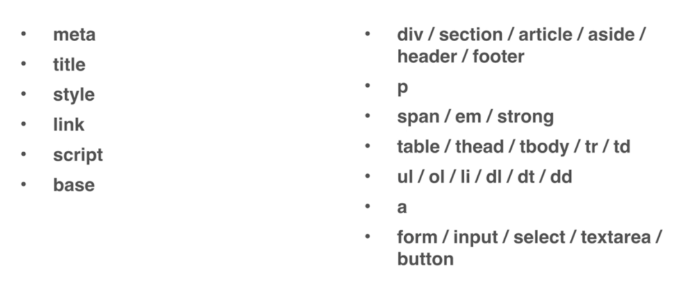
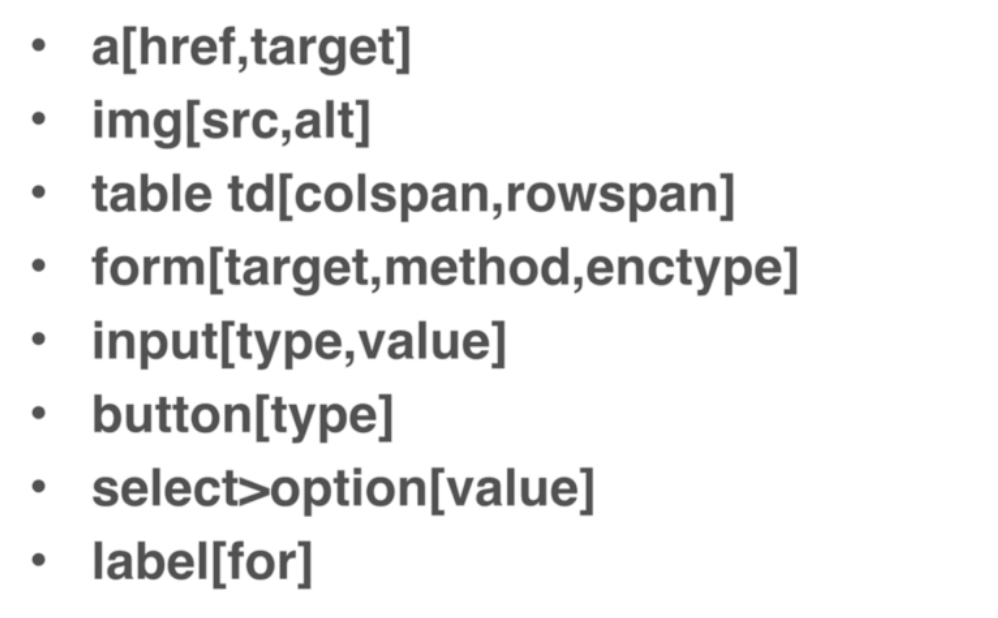
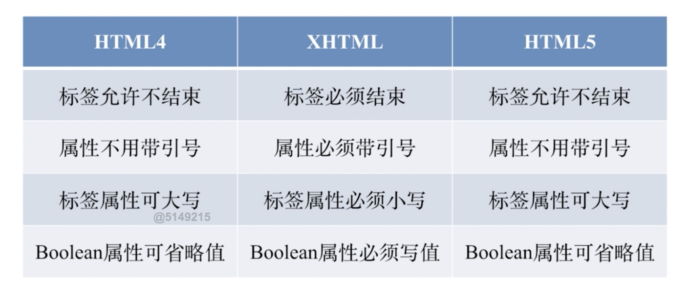

### HTML 常见元素

### HTML 重要属性

form 的 enctype 是用的编码格式，针对 post 的时候主要有两种编码

* url encode 的方式提交文本。
* formdata 是把数据做编码之后提交，这种方式的好处是它可以上传文件。

label 的 for 对应单选框/复选框的 id，点击 label 文字即点击了单选框/复选框。

### 如何理解 HTML

HTML 是页面的结构，可以按文档理解它，有标题，内容，区块，大纲，就是结构的语义化。有清晰的语义化结构的 html 页面有利于搜索引擎、爬虫、读屏软件等机器、阅读器了解你页面的结构。我们自己写页面的结构也会好理解，并且这个 HTML 结构是合理的。

### HTML 版本

### css reset

https://meyerweb.com/eric/tools/css/reset/

https://yuilibrary.com/yui/docs/cssreset

https://necolas.github.io/normalize.css/

