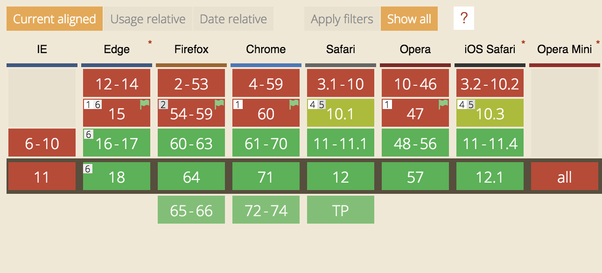

## 课程介绍

webpack 的基本概念和日常开发的实用技巧

以工程化的方式组织 webpack 构建配置，和 webpack 打包优化

详细剖析 webpack 打包原理和插件、Loader 的实现

从实际 Web 商城项目出发， 讲解 webpack 实际使用


## 目 录

01 基础篇：webpack 与构建发展简史

02 基础篇：webpack 基础用法

03 基础篇：webpack 进阶用法

04 进阶篇：编写可维护的 webpack 构建配置

05 进阶篇：webpack 构建速度和体积优化策略

06 原理篇：通过源码掌握 webpack 打包原理

07 原理篇：编写 Loader 和插件

08 实战篇：React 全家桶 和 webpack 开发商城项目


## 为什么需要构建工具

转换 ES6 语法

转换 JSX

CSS 前缀补全/预处理器

压缩混淆

图片压缩




​																ES6 module 主流浏览器支持情况


## 前端构建演变之路

无代码压缩和混淆  ——》 通过在线工具压缩混淆代码  ——》 ant + YUI Toll 在本地对代码压缩混淆 ——》 requirejs commonjs模块化概念的出现，前端模块化的编写方式也越来越复杂，演变出了grunt ——》 gulp fis3 ——》 rollup webpack parcel

 

## 为什么选择webpack

|              | ***\*webpack\**** | ***\*grunt\**** | ***\*gulp\**** |
| ------------ | ----------------- | --------------- | -------------- |
| 定义         | Module bundler    | Task runner     | Task runner    |
| 语言         | JavaScript        | Node.js         | Node.js        |
| 发布时间     | 2012.3            | 2012.6          | 2013.7         |
| GitHub stars | 40766             | 11796           | 29427          |
| 周下载量     | 3,385,392         | 478,876         | 816,228        |

社区生态丰富

配置灵活和插件化扩展

官方更新迭代速度快


## 初识webpack

### 配置文件名称

webpack 默认配置文件：webpack.config.js

可以通过 webpack --config 指定配置文件

### webpack配置组成

```js
module.exports = { 
	entry: './src/index.js', 
  output: './dist/main.js',
  mode: 'production',
	module: {
    rules: [	
    	{ 
        test: /\.txt$/, 
        use: 'raw-loader' 
      }
    ]
  },
  plugins: [
  	new HtmlwebpackPlugin({ 
      template: './src/index.html’
  	})
  ]
}
```

### 零配置 webpack 包含哪些内容？

 ```js
module.exports = { 
	entry: './src/index.js', 
  output: './dist/main.js'
}
 ```


## 环境搭建

### 安装 Node.js 和 NPM

#### 安装 nvm（https://github.com/nvm-sh/nvm）

* 通过 curl 安装：curl -o- https://raw.githubusercontent.com/nvm-sh/nvm/v0.34.0/install.sh | bash
* 通过 wget 安装：wget -qO- https://raw.githubusercontent.com/nvm-sh/nvm/v0.34.0/install.sh | bash

#### 将nvm添加到环境变量里面

* source ~/.bash_profile

#### 安装 Node.js 和 NPM

* nvm install v10.15.3

* 检查是否安装成功：node -v, npm -v

### 安装 webpack 和 webpack-cli

#### 创建空目录和 package.json

* mkdir 

* my-project

* npm init -y

#### 安装 webpack 和 webpack-cli

* npm install webpack webpack-cli --save-dev

* 检查是否安装成功：./node_modules/.bin/webpack -v

  

## 运行打包

### 直接与性

./node_modules/.bin/webpack 

### 通过 npm script 运⾏ webpack

```json
{
  "name": "hello-webpack",
  "version": "1.0.0", 
  "description": "Hello webpack", 
  "main": "index.js",
  "scripts": {
  	"build": "webpack"
  },
  "keywords": [],
  "author": "",
  "license": "ISC"
}
```

通过 npm run build 运行构建

原理：局部安装的依赖，如果有创建一些命令，会在 node_modules/.bin目录创建软链接，package.json是可以默认的读取到.bin目录下的这些命令。
