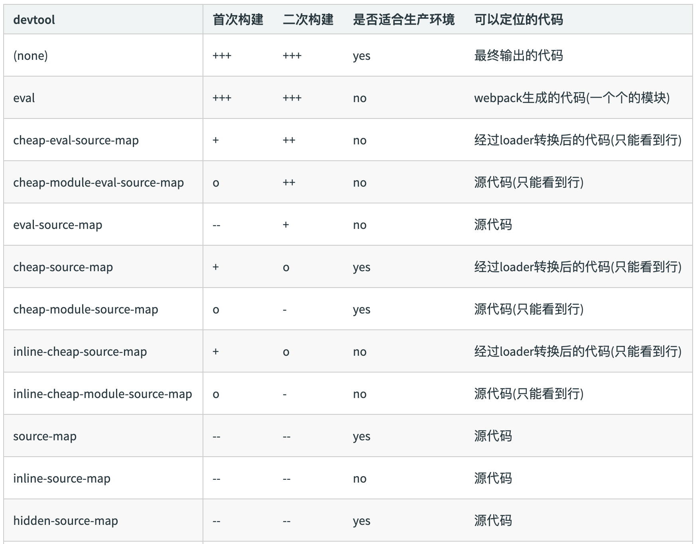
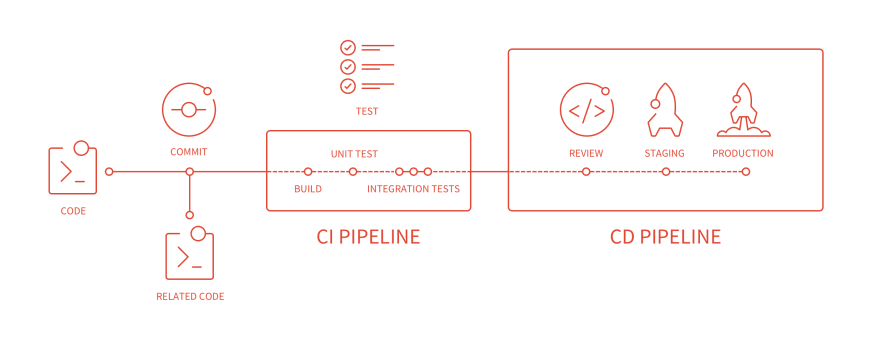
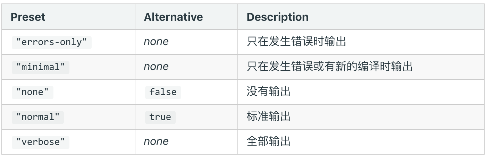

## 自动清理构建目录

每次构建的时候不会清理⽬录，造成构建的输出⽬录 output ⽂件越来越多

### 通过 npm scripts 清理构建⽬录

rm -rf ./dist && webpack

rimraf ./dist && webpack

### ⾃动清理构建⽬录

使⽤ clean-webpack-plugin。它会默认删除 output 指定的输出⽬录。

```js
const { CleanWebpackPlugin } = require('clean-webpack-plugin')

module.exports = {
  plugins: [
    new CleanWebpackPlugin()
  ]
}
```


## PostCSS 插件 autoprefixer 自动补齐 CSS3 前缀

由于现在移动设备的浏览器众多，因此需要面对很多兼容性的问题，有些兼容问题可以在构建阶段去尽量避免的，比如 css3 前缀的问题，为什么 css3 的属性需要添加前缀呢，因为由于浏览器的标准并没有完全的统一，目前来看还是有四种浏览器内核，IE Trident(-ms), Firefox Geko(-moz), Chrome Webkit(-webkit), Opera Presto(-o)。

通过 PostCSS 的插件 autoprefixer 来自动补齐 css3 前缀的。

postcss 是 css 的后置处理器，与 less 和 sass 不同，less 和 sass 是 css 的预处理器，预处理器一般是在打包前置去处理，autoprefixer 是在样式处理好之后，代码生成完之后，再对 css 进行后置处理。通过postcss去优化css代码。优化的过程就是通过一系列的组件去优化。

### 使用autoprefixer

autoprefixer 插件通常是和 postcss-loader 一起使用的。postcss-loader 的功能是比较强大的，除了做 css 样式补全之外，它还可以做支持 css module，style lint 等。

```js
module.exports = {
  module: {
    rules: [
      {
        test: /\.less$/,
        use: [
          'style-loader',
          'css-loader',
          'less-loader',
          {
            loader: 'postcss-loader',
            options: {
              plugins: () => [
                require('autoprefixer')({
                  overrideBrowserslist: ["last 2 version", ">1%", "IOS 7"] // 指定autoprefixer所需要兼容的浏览器的版本
                })
              ]
            }
          }
        ]
      }
    ]
  }
}
```


## 移动端 CSS px 自动转换成 rem

### 浏览器分辨率

移动设备流行之后，不同机型的分辨率是不一样的，这对前端开发来说，就会造成比较大的问题，需要不断的对
页面进行适配。


### CSS 媒体查询实现响应式布局

以前有一种比较常用的方式，就是使用 css 的媒体查询去实现响应式的布局。

缺陷：需要写多套适配样式代码，影响开发效率的。

```css
@media screen and (max-width: 980px) {
  .header {
  	width: 900px;
  } 
}
@media screen and (max-width: 480px) {
  .header {
  	height: 400px;
  } 
}
@media screen and (max-width: 350px) {
  .header {
  	height: 300px;
  } 
}
```

### rem 是什么？

css3 里面提出了一个 rem 的单位，根元素 font-size 的大小，也就是说 rem 是一个相对的单位。px 是绝对单位。

### 移动端 CSS px ⾃动转换成 rem

编写代码的时候，按照 px 的单位去写，通过构建工具，自动的将 px 转换成 rem，这个工具就是 px2rem-loader。

```js
module.exports = {
  module: {
    rules: [
      {
        test: /\.less$/,
        use: [
          'style-loader',
          'css-loader',
          'less-loader',
          {
            loader: 'px2rem-loader',
            options: {
              remUnit: 75, // rem相对于px的转换的单位，75代表1rem=75px，这个比较适合750的设计稿，750个像素对应着10个rem。
              remPrecision: 8 // px转成rem，后面小数点的位数。
            }
          }
        ]
      }
    ]
  }
}
```

使用手淘比较成熟的方案 [lib-flexible ](https://github.com/amfe/lib-flexible) 库计算实际的设备分辨率根元素的 font-size 大小。

页面打开的时候就需要马上的计算这个值，所以它的位置需要前置放在前面的位置。


## 静态资源内联

### 资源内联的意义

#### 代码层面：

* ⻚⾯框架的初始化脚本：如上节中 rem 计算的 js 库，要在打开页面的时候就要去计算。

* 上报相关打点：page start，css 初始化，css 加载完成，js 初始化和 js 加载完成等代码，这些都是需要内联到 html 里面去，而不能直接放到最终打包的 js 脚本中去。

* css 内联避免⻚⾯闪动

#### 请求层⾯：减少 HTTP ⽹络请求数

⼩图⽚或者字体内联 (url-loader)

### html和js的内联

raw-loader的功能是读取一个文件，把这个文件的内容返回成一个string，把这个string插入到对应的位置。
#### raw-loader内联html
```html
 <%= require('raw-loader!./meta.html') %>
```

#### raw-loader内联js

```html
<script>
  <%= require('raw-loader!babel-loader!../../node_modules/lib-flexible/flexible.js') %></script>
```

### css内联

#### 方案一：借助style-loader

```js
module.exports = {
  module: {
    rules: [
      {
        test: /\.less$/,
        use: [
          {
            loader: 'style-loader',
            options: {
              insertAt: 'top', // 样式插入到 <head>
              singleton: true, // 将所有的style标签合并成一个
            }
          },
          "css-loader",
          "less-loader"
        ]
      }
    ]
  }
}
```

#### 方案二：html-inline-css-webpack-plugin

它针对打包好的css chunk的代码，把它内联到html的head中。

```js
const HTMLInlineCSSWebpackPlugin = require("html-inline-css-webpack-plugin").default;

module.exports = {
  plugins: [
    new HTMLInlineCSSWebpackPlugin(),
  ]
}
```


## 多页面应用打包通用方案

### 多页面应用（MPA）概念

多页面发布上线之后，它有很多个入口。

每一次页面跳转的时候，后台服务器都会返回一个新的 html 文档。

多页面优势

​	1.每个页面之间是解偶的

​	2.对 seo 更友好

### 多页面打包基本思路

每个页面对应一个 entry，一个 html-webpack-plugin。

缺点：每次新增或删除页面需要手动修改 webpack 配置构建脚本。

### 多⻚⾯打包通⽤⽅案

动态获取 entry 和设置 html-webpack-plugin 数量。

通过程序的思维动态获取某个目录下面指定的入口文件，需要有一个约定，把所有的页面都放在 src 的目录下面，每个页面的入口文件都约定为 index.js，这样我们就可以通过 js 脚本去获取src里面所有的目录，就可以知道入口文件的数量，打包的时候动态的设置 html-webpack-plugin。相比于自己写这个脚本，webpack 里面有一个更通用的做法是通过 glob 这个库，glob 的原理类似 linux 操作系统下面文件通配匹配的概念，根据匹配信息返回匹配到的目录内容，我们根据这个目录内容进行操作就可以了。

```js
const setMPA = () => {
  const entry = {}
  const htmlWebpackPlugins = []
  const entryFiles = glob.sync(path.join(__dirname, './src/*/index.js'))
  Object.keys(entryFiles)
    .map(index => {
    const entryFile = entryFiles[index]
    const match = entryFile.match(/src\/(.*)\/index\.js/)
    const pageName = match && match[1]
    entry[pageName] = entryFile
    htmlWebpackPlugins.push(new HtmlWebpackPlugin({
      template: path.join(__dirname, `./src/${pageName}/index.html`),
      filename: `${pageName}.html`,
      chunks: [pageName],
      inject: true,
      minify: {
        html5: true,
        collapseWhitespace: true,
        perserveLineBreaks: false,
        minifyCSS: true,
        minifyJS: true,
        removeComments: false
      }
    }))
  })
  return {
    entry,
    htmlWebpackPlugins
  }
}
const {entry, htmlWebpackPlugins} = setMPA()
```


## 使用 source map

作⽤：通过 source map 定位到源代码

开发环境开启，线上环境关闭

* 如果线上不关闭，会把我们的业务逻辑暴露出来，线上排查问题的时候可以将 sourcemap 上传到错误监控系统。

### source map 关键字

eval: 使⽤ eval 包裹模块代码

source map: 产⽣ .map ⽂件

cheap: 不包含列信息，只包含行信息

inline: 将 .map 作为 DataURI 嵌⼊，不单独⽣成 .map ⽂件

module:包含 loader 的 sourcemap

### source map类型

可以根据前面的关键字排列组合得到。



### 本地开发时使用 sourcemap 进行代码调试

在webpack.dev.js devtool 中加入 sourcemap。


## 提取页面公共资源

### 使用 html-webpack-externals-plugin 分离基础包

思路：将 react react-dom vue 基包包通过 cdn 引入，不打入 bundle 中。

```js
module.exports = {
  plugins: [
    new HtmlWebpackExternalsPlugin({
      externals: [
        {
          module: 'react',
          entry: 'https://cdn.bootcdn.net/ajax/libs/react/15.6.0/react.min.js', // 本地或cdn文件
          global: 'React'
        },
        {
          module: 'react-dom',
          entry: 'https://cdn.bootcdn.net/ajax/libs/react/15.6.0/react-dom.min.js',
          global: 'ReactDOM'
        }
      ]
    })
  ]
}
```

然后手动在 html 中将 react 和 react-dom 脚本引入进来。

### SplitChunksPlugin

webpack4 内置的，替代 CommonsChunkPlugin 插件。

```js
module.exports = {
  optimization: {
    splitChunks: {
      chunks: 'async',
      minSize: 30000, // 抽离的公共包最小的大小，单位是字节
      maxSize: 0,			// 抽离的公共包最大的大小，单位是字节
      minChunks: 1,   // 使用的次数超过这个就提取成公共的文件
      maxAsyncRequests: 5,
      maxInitialRequests: 3, // 同时请求的异步资源的次数
      automaticNameDelimiter: '~',
      name: true,
      cacheGroups: {
        vendors: {
          test: /[\\/]node_modules[\\/]/,
          priority: -10
        },
        default: {
          minChunks: 2,
          priority: -20,
          reuseExistingChunk: true
        }
      }
    }
  }
}
```

chunks 参数说明：

* async：只异步引入的库进行分离（默认） 
*  initial：只同步引入的库进行分离
* all：所有引入的库进行分析（推荐）

### 利⽤ SplitChunksPlugin 分离基础包

test：匹配出需要分离的包。

把 react 和 react-dom 提取出来，名字为 vendors。

```js
module.exports = {
  optimization: {
    splitChunks: {
      cacheGroups: {
        commons: {
          test: /(react|react-dom)/,
          name: "vendors",
          chunks: "all"
        }
      }
    }
  }
}
```

使用时需要把 vendors 添加到 HtmlWebpackPlugin 的 chunks 里面。

```js
new HtmlWebpackPlugin({
  template: path.join(__dirname, `./src/${pageName}/index.html`),
  filename: `${pageName}.html`,
  chunks: ['vendors', pageName],
  inject: true,
  minify: {
    html5: true,
    collapseWhitespace: true,
    perserveLineBreaks: false,
    minifyCSS: true,
    minifyJS: true,
    removeComments: false
  }
})
```

### 利用 SplitChunksPlugin 分离页面公共文件

```js
module.exports = {
	optimization: {
    splitChunks: {
      minSize: 0,  // 分离的包体积的最小限制
      cacheGroups: {
        commons: {
          name: "commons",
          chunks: "all",
          minChunks: 2  // 设置最⼩引⽤次数为2次
        }
      }
    }
  }
}
```

使用时需要把 commons 添加到 HtmlWebpackPlugin 的 chunks 里面。

```js
new HtmlWebpackPlugin({
  template: path.join(__dirname, `./src/${pageName}/index.html`),
  filename: `${pageName}.html`,
  chunks: ['vendors', 'commons', pageName],
  inject: true,
  minify: {
    html5: true,
    collapseWhitespace: true,
    perserveLineBreaks: false,
    minifyCSS: true,
    minifyJS: true,
    removeComments: false
  }
})
```

### 使用 CommonsChunkPlugin 分离基础包

webpack3 使用。

```js
module.exports = {
	entry: {
    app: path(__dirname, 'src/index.js'),
    vendor: ['vue']
  }
  plugins: [
    new webpack.optimize.CommonsChunkPlugin({
      name: 'vendor'
    },
  	// 分离 webpack 相关的代码
  	new webpack.optimize.CommonsChunkPlugin({
      name: 'runtime' // name指定一个在entry里面没有声明过的任何一个名字，一般会声明为runtime
    })
  ]
}
```


## Tree Shaking的使用和原理分析

### Tree Shaking（摇树优化）

概念：1 个模块可能有多个⽅法，只要其中的某个⽅法使⽤到了，则整个⽂件都会被打到 bundle ⾥⾯去，tree shaking 就是只把⽤到的⽅法打⼊ bundle ，没⽤到的⽅法会在 uglify 阶段被擦除掉。

使⽤：webpack4 默认⽀持，在 .babelrc ⾥设置 modules: false 即可，production mode 的情况下默认开启。

要求：必须是 ES6 的语法，CJS 的⽅式不⽀持	

### DCE (Dead code elimination)

代码不会被执行，不可到达

代码执行的结果不会被用到

代码只会影响死变量（只写不读），前面定义改变了这个变量，最后并没有用到这个变量

### Tree-shaking 原理

Tree Shaking 利用 DCE 的特点来分析哪些代码是需要被删除掉的。

代码擦除：Tree Shaking 将没有用到的代码加一些注释来标记，在 uglify 阶段删除无用代码。


## Scope Hoisting使用和原理分析

### 没有开启Scope Hoisting的现象：

构建之后的代码存在大量的闭包代码。对于每一个模块打包出来是会有一个函数的包裹。

### 会导致的问题：

大量函数的闭包包裹代码，会导致打包出来的 bundle 文件体积增大（模块越多越明显）。

通过函数闭包的形式包裹代码，运行代码时创建的函数作用域变多，内存开销变大。

### 模块转换分析

被 webpack 转换后的模块会带上⼀层包裹。

import 会被转换成 __webpack_require，export也会做相应的转换。

### 进⼀步分析 webpack 的模块机制

打包出来的是⼀个 IIFE (匿名闭包)

modules 是⼀个数组，每⼀项是⼀个模块初始化函数

__webpack_require ⽤来加载模块，返回 module.exports

通过 WEBPACK_REQUIRE_METHOD(0) 启动程序

### scope hoisting 原理

原理：将所有模块的代码按照引⽤顺序放在⼀个函数作⽤域⾥，然后适当的重命名⼀些变量以防⽌变量名冲突。

对⽐：通过 scope hoisting 可以减少函数声明代码和内存开销。

### scope hoisting 使⽤

webpack3需要手动开启。

```js
module.exports = {
  plugins: [
    new webpack.optimize.ModuleConcatenationPlugin()
  ]
}
```

webpack4 mode 为 production 默认开启。

必须是 ES6 语法，CJS 不⽀持。


## 代码分割和动态import

### 代码分割的意义
对于大的 web 应用而言，将所有的代码都放在一个文件中显然是不够有效的，特别是你的代码在一些情况下才会用到，首屏加载不会用到的。这时候我们针对首屏会打出一个 js 文件，对于其他的页面或 tab 切换的场景可以通过按需加载，也就是js懒加载的形式，它和懒加载图片是一样的道理，我们用到了这个脚本再加载它。这就是webpack 里面提供的一个懒加载的功能，webpack 将你的代码库分割成 chunks（语块），当代码运行到需要它们的时候再进行加载。

### 懒加载 JS 脚本的⽅式

CommonJS：require.ensure

ES6：动态 import（⽬前还没有原⽣⽀持，需要 babel 转换）

### 如何使⽤动态 import?

import xxx from 'xxx' 是静态的，动态的是我们使用到的时候再import，动态的import功能和require比较像，可以通过逻辑按需加载，而不是要一开始就把这个模块加载进来。

安装 babel 插件

```bash
npm install @babel/plugin-syntax-dynamic-import -D
```

.babelrc

```json
{
  "plugins": [
    "@babel/plugin-syntax-dynamic-import"
  ]
}
```

然后就可以在我们的代码中使用动态的import语法了。

```js
import('./text.js') // 返回的是promise对象
  .then(Text => {
    // Text就是import的这个文件export出去的内容
    console.log(Text)
  })
```

### 代码分割的效果

使用了动态import的文件会分割出去一个js文件，当你代码用到的时候再异步的请求加载这个js文件。

### 原理
webpack 使用 jsonp 的形式动态的添加一个 \<script\> 脚本进来。


## 在webpack中使用ESLint

### eslint的必要性

代码检查，代码规范。写js代码时将明显的问题及时的暴露出来。

### 行业里面优秀的eslint规范实践

airbnb：eslint-config-airbnb eslint-config-airbnb-base

### 制定团队的eslint规范，遵循以下原则

* 不重复造轮子，基于eslint:recommend配置去改进

* 能够帮助发现代码错误的规则，全部开启 
* 帮助保持团队的代码风格统一，而不是限制开发体验


### ESLint 如何执⾏落地？

#### ⽅案⼀：与CI/CD系统集成



把代码检查放在CI/CD的pipeline build里面去。

本地开发阶段增加 precommit 钩⼦。

安装husky

```bash
npm i husky -D
```

增加 npm script，通过 lint-staged 增量检查修改的⽂件。

```json
"scripts": {
	"precommit": "lint-staged"
},
"lint-staged": {
  "linters": {
  	"*.{js,scss}": ["eslint --fix", "git add"]
  }
}
```

#### 方案二：与webpack等构建工具集成

webpack 构建的时候，遇见 eslint 的语法问题，直接中断构建，语法修改正确后才能构建成功。 

比较适合新的，一开始就使用 eslint 的项目。不适合老的项目去接入，因为这种方案，webpack 构建的时候它会默认把所有的文件都会进行检查。

使⽤ eslint-loader，构建时检查 JS 规范

```js
module.exports = {
	module: {
    rules: [
      {
        test: /\.js$/,
        exclude: /node_modules/,
        use: {
          'babel-loader',
          'eslint-loader'
        }
      }
    ]
  }
}
```


## webpack 打包组件和基础库

webpack 除了可以⽤来打包应⽤，也可以⽤来打包 js 库。

对于打包组件或基础库，除了 webpack，rollup 更加适合，因为它打包相对 webpack 更加纯粹，使用更加简单。但是由于 webpack 功能比较强大，使用 webpack 打包组件和库的场景还是很多的。

### 实现⼀个⼤整数加法库的打包

需要打包压缩版和⾮压缩版本。

⽀持 AMD/CJS/ESM 模块引⼊，也支持script标签方式引入。

### 库的目录结构

dist
    large-number.js
    large-number.min.js
webpack.config.js
package.json
index.js
src
    index.js

### 支持的模块使用方式

#### 支持ES module

```js
import * as largeNumber from 'large-number'
largeNumber.add('999', '1')
```

#### 支持CJS

```js
const largeNumber = require('large-number')
largeNumber.add('999', '1')
```

#### 支持AMD

```js
require(['large-number'], function(large-number) {
  largeNumber.add('999', '1')
})
```

#### 直接通过script引入，脚本发布到cdn上去

```html
<script src="https://unpkg.com/large-numer"></script>
<script>
  largeNumber.add('999', '1')
</script>
```

### 如何将库暴露出去

```js
module.exports = {
  mode: 'production',
  entry: {
    'large-number': './src/index.js',
    'large-number.min': './src/index.js'
  },
  output: {
    filename: '[name].js',   
    library: 'largeNumber',   // 指定库它暴露出去的库的名称，同时也可以通过全局变量的方式去引入到它。
    libraryTarget: 'umd',     // 支持库引入的方式，设置成umd就可以支持上述四种方式的引用。
    libraryExport: 'default'  // 如果不设置成default，要通过largeNumber.default使用，不是很方便。
  }
}
```

### 如何只对 .min 压缩

通过 include 设置只压缩 min.js 结尾的⽂件

```js
const TerserWebpackPlugin = require('terser-webpack-plugin')

module.exports = {
	optimization: {
    minimize: true,
    minimizer: [
      // 压缩js，遇到se6不会报错
      new TerserWebpackPlugin({
        include: /\.min\.js$/
      })
    ]
  }
}
```

### 设置⼊⼝⽂件

package.json 的 main 字段为 index.js

index.js

```js
if (process.env.NODE_ENV === "production") {
	module.exports = require("./dist/large-number.min.js");
} else {
	module.exports = require("./dist/large-number.js");
}
```

### 发布到npm上面去
增加npm script钩子，每次npm publish的时候会执行一下打包

```json
"scripts": {
	"prepublish": "webpack"
}
```

登陆npm账号

```bash
npm login
```

发布

```bash
npm publish
```


## webpack实现SSR打包


## 优化构建时命令行的显示日志

构建的过程，命令行里面会有一大堆的信息打印出来，很多不需要开发者关注，开发者更加关注的是，构建是否成功，构建报错的信息，构建 warning 的信息。对于构建成功的详细的信息，比如 loader 里输出的日志，插件的处理日志等并不是太需要关注的。

### 统计信息stats

统计信息，可以分析构建速度或构建体积，也可以分析一些其他的数据出来。



### 命令行更加明显的提示信息

使用 friendly-errors-webpack-plugin，对于构建成功，警告，错误都有很明显的信息提示。

stats 设置成 errors-only，生产环境直接设置。开发环境如果用的是 webpack-dev-server，就设置到这里。

```js
const FriendlyErrorsWebpackPlugin = require('friendly-errors-webpack-plugin')

module.exports = {
  plugins: [
  	new FriendlyErrorsWebpackPlugin()
  ],
  stats: 'errors-only'
};
```

### 使⽤效果

success：构建成功的日志提示

warning：构建警告的日志提示

error：构建报错的日志提示


## 构建异常和中断处理

在 webpack 里面怎么做错误的捕获和异常的处理。

### 如何判断构建是否成功？

构建完之后，接下来要部署或一些其他的操作，像 CI/CD 的系统或者发布系统它怎么知道这次构建是否成功呢。

每次构建完之后输入一个 echo $? 获取错误码。如果错误码不为 0 的话，说明这次构建是失败的。也可以获取到error 的信息。

### 构建异常和中断处理

webpack4 之前的版本构建失败不会抛出错误码 (error code)。

webpack4 给我们抛出了错误码，但是我们想针对异常的情况需要加额外的处理怎么做呢？

通过 node.js 中的 process.exit 规范去把错误码抛出来。这个规范也是尊从命令行里面的 error

* 0 表示成功完成，回调函数中，err 为 null

* 非 0 表示执行失败，回调函数中，err 不为 null，err.code 就是传给 exit 的数字

### 如何主动捕获并处理构建错误？

compiler 在每次构建结束后会触发 done 这个 hook，我们只要监听 done 这个 hook，就可以对它进行额外的一些操作。比如数据上报相关的信息。错误信息可以通过 stats 获取到。

process.exit 主动处理构建报错。

```js
module.exports = {
	plugins: [
    function() {
      this.hooks.done.tap('done', stats => {
        if (
          stats.compilation.errors && 
          stats.compilation.errors.length && 
          process.argv.indexOf('--watch') === -1
        ) {
          console.log('build error')
          process.exit(1)
        }
      })
    }
  ]
}
```