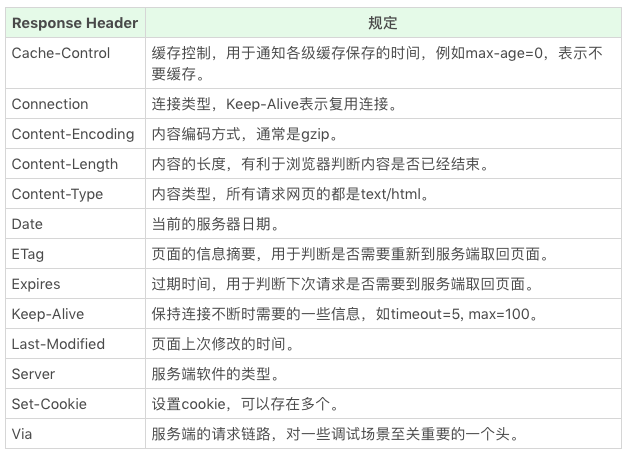

### HTTP 协议格式

##### 请求部分

* 请求行 request line

  * 请求的方法：表示此次 HTTP 请求希望执行的操作类型。实际上这只是语义上的一种约定，并没有强约束。

    GET, POST, HEAD, PUT, DELETE, CONNECT, OPTIONS, TRACE。

    浏览器通过地址栏访问页面都是 GET 方法。表单提交产生 POST 方法。

    HEAD 则是跟 GET 类似，只返回请求头，多数由 JavaScript 发起。

    PUT 和 DELETE 分别表示添加资源和删除资源。

    CONNECT 现在多用于 HTTPS 和 WebSocket。

    OPTIONS 和 TRACE 一般用于调试，多数线上服务都不支持。

  * 请求的路径

  * 协议和版本

* 请求头 request header：这些头由若干行组成，每行是用冒号分隔的名称和值。

  HTTP 头可以看作一个键值对。原则上，HTTP 头也是一种数据，我们可以自由定义 HTTP 头和值。不过在 HTTP 规范中，规定了一些特殊的 HTTP 头，我们现在就来了解一下它们。

  * Accept：告诉服务端我想要怎么样的一个数据类型
  * Accept-Encoding：代表我这个数据是怎么样的一个编码方式来进行一个传输，主要的就是用来限制服务端如何进行一个数据的压缩。
  * Accept-Language：语言。
  * User-Agent：用来表示浏览器的一些相关的信

  

* 请求体：头之后，以一个空行为分隔，请求体可能包含文件或者表单数据

  HTTP 请求的 body 主要用于提交表单场景。实际上，HTTP 请求的 body 是比较自由的，只要浏览器端发送的 body 服务端认可就可以了。一些常见的 body 格式是：

  * application/json
  * application/x-www-form-urlencoded
  * multipart/form-data
  * text/xml

  我们使用 HTML 的 form 标签提交产生的 HTML 请求，默认会产生 application/x-www-form-urlencoded 的数据格式，当有文件上传时，则会使用 multipart/form-data。

##### 响应部分

* 响应行 response line

  * 协议和版本
  * 状态码
    * 1xx：临时回应，表示客户端请继续。对前端来说，1xx 系列的状态码是非常陌生的，原因是 1xx 的状态被浏览器 HTTP 库直接处理掉了，不会让上层应用知晓。
    * 2xx：请求成功。
      * 200：请求成功。
    * 3xx: 表示请求的目标有变化，希望客户端进一步处理。
      * 301&302：永久性与临时性跳转。表示当前资源已经被转移。
      * 304：跟客户端缓存没有更新。
    * 4xx：客户端请求错误。
      * 401：就代表你发送这个请求的时候你没有做认证，那么你是没有权限去获取你请求的。
      * 403：无权限。禁止访问，服务器收到请求，但是拒绝提供服务
      * 404：表示请求的页面不存在。
      * 418：It’s a teapot. 这是一个彩蛋，来自 ietf 的一个愚人节玩笑。（超文本咖啡壶控制协议）
    * 5xx：服务端请求错误。
      * 500：服务端错误。
      * 502：网关错误。
      * 503：由于超载或停机维护，服务器目前无法使用，请求超时，一段时间后可恢复正常，服务端暂时性错误，可以一会再试。
  * 状态文本

* 响应头 response header：这些头由若干行组成，每行是用冒号分隔的名称和值。

  HTTP 头可以看作一个键值对。原则上，HTTP 头也是一种数据，我们可以自由定义 HTTP 头和值。不过在 HTTP 规范中，规定了一些特殊的 HTTP 头，我们现在就来了解一下它们。

  * Content
  * Content-Type：那么与之对应的就是服务端返回的时候，服务端返回的 Content，它里面会有 Content-Type 来对应 Accept，Accept 里面可以接收好几种不同的数据格式，那么 Content-Type 可以从里面选择一种然后做为它真正返回的数据格式进行一个返回 a，客户端根据这个来进行一个怎么样的显示。一个是 text/plain,一个是 multipart/form-data，还有一个是 application/x-www-from-urlencoded。
  * Content-Encoding：对应的是 Accept-Encoding，我服务端具体到底是用了 gzip 还是 deflate 这种数据压缩的方式。
  * Content-Language：语言。

  

* 响应体：头之后，以一个空行为分隔，响应体则是 HTML 代码

### HTTP 缓存

这些缓存配置都是由服务端控制的，第一次请求成功之后，响应头中会携带相关的缓存信息。

命中强缓存后不会发送请求，没有命中强缓存后才走协商缓存，协商缓存每次都要发送请求，是否命中协商缓存由后端对比相关 header 字段来确定。

##### 强缓存

cache-control 优先级高于 expires

* **expires**：它的值为一个绝对时间的 GMT 格式的时间字符串。发送请求的时间在 expires 之前，本地缓存始终有效，强缓存命中。
* **cache-control**：max-age=number，它是一个相对值，根据资源第一次的请求时间和在这个相对值，计算出一个资源过期时间，请求时间在过期时间之前，就能命中缓存。
  * no-cache：不使用强缓存，需要使用缓存协商。
  * no-store：禁止使用强缓存和协商缓存等任何缓存行为，每次请求都重新到服务器拉取最新资源。
  * public：可以被所有的用户缓存，包括终端和 CDN 等中间代理服务器。
  * private：只能被终端用户的浏览器缓存，不允许 CDN 等中继缓存服务器对其缓存。

##### 协商缓存

协商缓存的这两组搭档是成对出现的，即第一次请求的响应头带上某个字段（Last-Modified 或者 Etag），则后续请求的请求头就会带上对应字段（If-Modified-Since或者If-None-Match），若响应头没有相应字段，则请求头也不会有对应的字段。

服务器会优先验证 ETag，一致的情况下，才会继续比对 Last-Modified。

* **Last-Modified/If-Modified-Since**：

  这两个值是 GMT 格式的时间字符串。

  * 浏览器第一次跟服务器请求一个资源，服务器在返回这个资源的同时，在 respone 的 header 加上 Last-Modified 的 header，这个 header 表示这个资源在服务器上的最后修改时间。
  * 浏览器再次跟服务器请求这个资源时，在 request 的 header 上加上 If-Modified-Since 的 header，这个 header 的值就是上一次请求时返回的 Last-Modified 的值。
  * 服务器再次收到资源请求时，根据浏览器传过来 If-Modified-Since 和资源在服务器上的最后修改时间判断资源是否有变化，如果没有变化则返回 304 Not Modified，但是不会返回资源内容；如果有变化，就正常返回资源内容和新的 Last-Modified 的 header。当服务器返回 304 Not Modified 的响应时，response header 中不会再添加 Last-Modified 的 header，因为既然资源没有变化，那么 Last-Modified 也就不会改变。
  * 浏览器收到 304 的响应后，就会从缓存中加载资源。

* **Etag/If-None-Match**

  这两个值是由服务器生成的每个资源的唯一标识字符串，只要资源有变化就这个值就会改变。

  判断过程与 Last-Modified/If-Modified-Since 类似。不同的是，当服务器返回 304 Not Modified 的响应时，由于 ETag 重新生成过，response header 中还会把这个 ETag 返回，即使这个 ETag 跟之前的没有变化。

* 优缺点

  * Last-Modified
    * 一些文件也许会周期性的更改，但是他的内容并不改变(仅仅改变的修改时间)，这个时候我们并不希望客户端认为这个文件被修改了，而重新GET；
    * 某些文件修改非常频繁，比如在秒以下的时间内进行修改，(比方说1s内修改了N次)，If-Modified-Since能检查到的粒度是s级的，这种修改无法判断(或者说UNIX记录MTIME只能精确到秒)；
    * 某些服务器不能精确的得到文件的最后修改时间。
  * Etag
    * Etag 能很好的解决上面 Last-Modified 遇到的问题，但由于要生成 hash，会消耗性能。

##### 用户行为对缓存的影响

