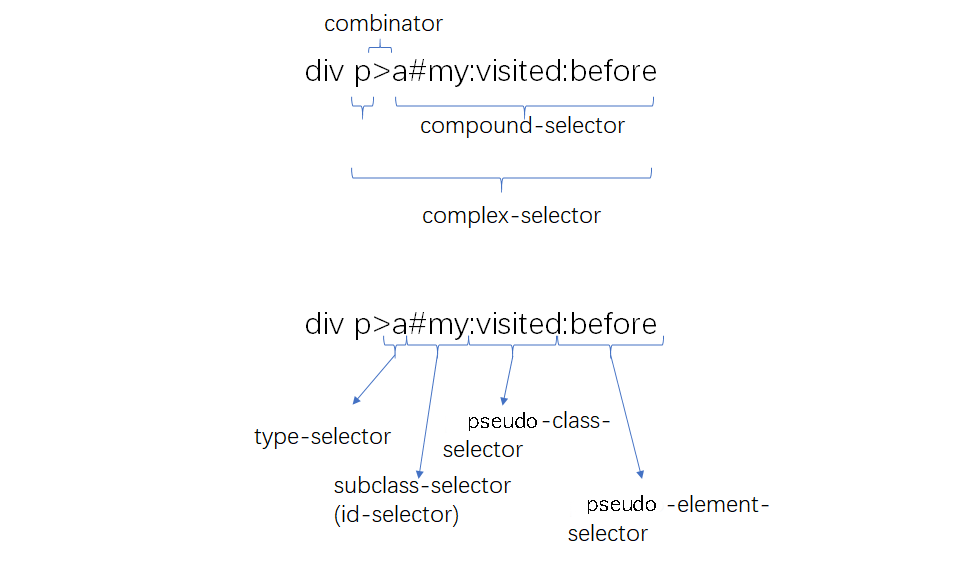
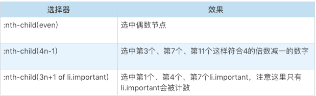
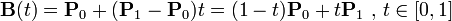
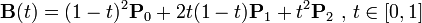
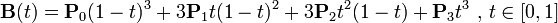
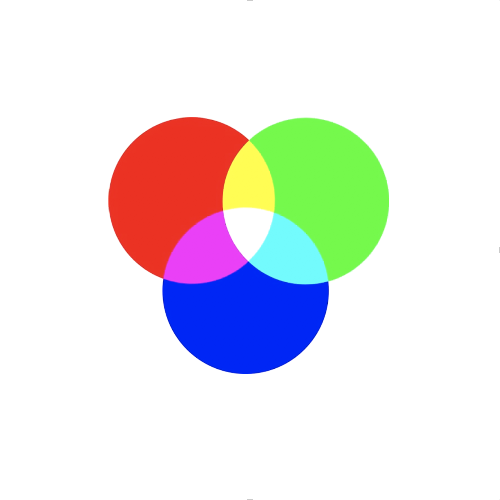
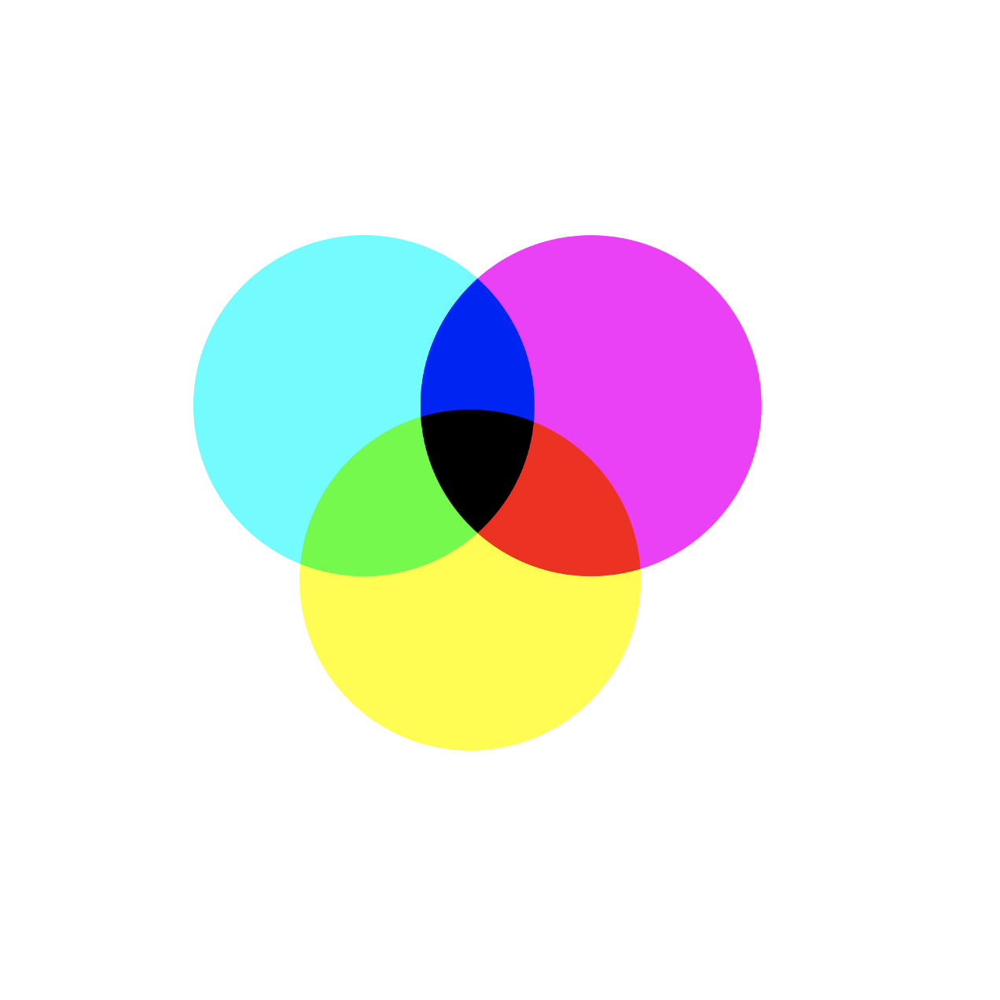
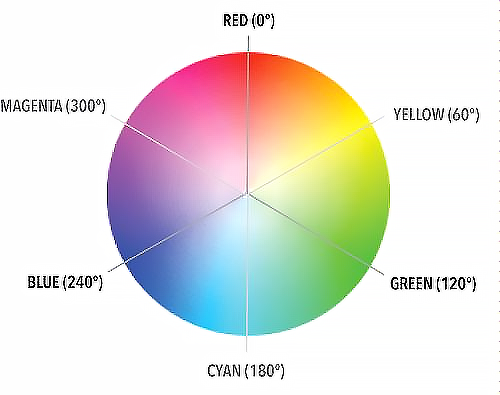
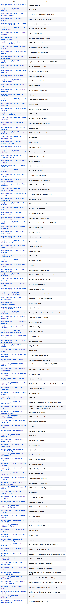

## 目录

* CSS 语法
* CSS 选择器
* CSS 排版
* CSS Flex排版
* CSS 动画与交互
* CSS 渲染
* CSS小实验：动手做，用代码挖掘CSS属性


## CSS 语法

今天我们进入 CSS 的学习。CSS 是前端工程师几乎每天都要用的技术了，不过 CSS 的学习资料却是最糟糕的，这是因为 CSS 并没有像 HTML 和 JavaScript 那样的一份标准文档。

如果我们到 W3C 的网站上搜索看看，可以得到一些信息：

https://www.w3.org/TR/?title=css

在这里，我们一共看到了 98 份 CSS 相关的标准，它们各自从一些角度规定了 CSS 的特性。

这里我们暂且去掉 Working Draft 状态的标准，可以得到 22 份候选标准和 6 份推荐标准。

既然我们的专栏内容强调去系统性学习 CSS，于是，面对这 22+6 份标准，我们就又需要一条线索，才能把这些离散的标准组织成易于理解和记忆的形式。

在这样的需求下，我找到的线索就是 CSS 语法，任何 CSS 的特性都必须通过一定的语法结构表达出来，所以语法可以帮助我们发现大多数 CSS 特性。

CSS 语法的最新标准，你可以戳这里查看：

https://www.w3.org/TR/css-syntax-3/

这篇文档的阅读体验其实是非常糟糕的，它对 CSS 语法的描述使用了类似 LL 语法分析的伪代码，而且没有描述任何具体的规则。

这里你就不必自己去阅读了，我来把其中一些有用的关键信息抽取出来描述一下，我们一起来看看。

我们拿到这份标准可以看到，去除空格、HTML 注释等无效信息，**CSS 的顶层样式表由两种规则组成的规则列表构成，一种被称为 at-rule，也就是 at 规则，另一种是 qualified rule，也就是普通规则。 **

at-rule 由一个 @ 关键字和后续的一个区块组成，如果没有区块，则以分号结束。这些 at-rule 在开发中使用机会远远小于普通的规则，所以它的大部分内容，你可能会感觉很陌生。

这些 at 规则正是掌握 CSS 的一些高级特性所必须的内容。qualified rule 则是指普通的 CSS 规则，也就是我们所熟识的，由选择器和属性指定构成的规则。

### at 规则

好了，现在我们已经知道了，CSS 语法的整体结构，接下来我们要做的是一个体力活，从所有的 CSS 标准里找到所有可能的 at-rule（不用谢，我已经帮你找好了，如果页面定位不准，你可以打开页面搜索关键字）。

* @charset ： https://www.w3.org/TR/css-syntax-3/
* @import ：https://www.w3.org/TR/css-cascade-4/
* @media ：https://www.w3.org/TR/css3-conditional/
* @page ： https://www.w3.org/TR/css-page-3/
* @counter-style ：https://www.w3.org/TR/css-counter-styles-3
* @keyframes ：https://www.w3.org/TR/css-animations-1/
* @fontface ：https://www.w3.org/TR/css-fonts-3/
* @supports ：https://www.w3.org/TR/css3-conditional/
* @namespace ：https://www.w3.org/TR/css-namespaces-3/

这里的每一种 @规则背后，都是一组 CSS 的知识。在我们的课程中，有些会重点介绍，不过，为了先给你建立起一个整体的认知，我们这里会给所有的 @规则提供一些简单的例子和介绍。

#### @charset

@charset 用于提示 CSS 文件使用的字符编码方式，它如果被使用，必须出现在最前面。这个规则只在给出语法解析阶段前使用，并不影响页面上的展示效果。

```css
@charset "utf-8";
```

#### @import

@import 用于引入一个 CSS 文件，除了 @charset 规则不会被引入，@import 可以引入另一个文件的全部内容。

```css
@import "mystyle.css";
@import url("mystyle.css");
```

```css
@import [ <url> | <string> ]
        [ supports( [ <supports-condition> | <declaration> ] ) ]?
        <media-query-list>? ;
```

通过代码，我们可以看出，import 还支持 supports 和 media query 形式。

#### @media

media 就是大名鼎鼎的 media query 使用的规则了，它能够对设备的类型进行一些判断。在 media 的区块内，是普通规则列表。

```css
@media print {
    body { font-size: 10pt }
}
```

#### @page

page 用于分页媒体访问网页时的表现设置，页面是一种特殊的盒模型结构，除了页面本身，还可以设置它周围的盒。

```css
@page {
  size: 8.5in 11in;
  margin: 10%;

  @top-left {
    content: "Hamlet";
  }
  @top-right {
    content: "Page " counter(page);
  }
}
```

#### @ counter-style

counter-style 产生一种数据，用于定义列表项的表现。

```css
@counter-style triangle {
  system: cyclic;
  symbols: ‣;
  suffix: " ";
}
```

#### @ key-frames

keyframes 产生一种数据，用于定义动画关键帧。

```css
@keyframes diagonal-slide {

  from {
    left: 0;
    top: 0;
  }

  to {
    left: 100px;
    top: 100px;
  }

}
```

#### @ fontface

fontface 用于定义一种字体，icon font 技术就是利用这个特性来实现的。

```css
@font-face {
  font-family: Gentium;
  src: url(http://example.com/fonts/Gentium.woff);
}

p { font-family: Gentium, serif; }
```

#### @ support

support 检查环境的特性，它与 media 比较类似。

#### @ namespace

用于跟 XML 命名空间配合的一个规则，表示内部的 CSS 选择器全都带上特定命名空间。

#### @ viewport

用于设置视口的一些特性，不过兼容性目前不是很好，多数时候被 HTML 的 meta 代替。

#### 其它

除了以上这些，还有些目前不太推荐使用的 at 规则。

* @color-profile 是 SVG1.0 引入的 CSS 特性，但是实现状况不怎么好。
* @document 还没讨论清楚，被推迟到了 CSS4 中。
* @font-feature-values 。

### 普通规则

接下来我们进入 qualified rule，也就是普通规则的部分，看看这里有什么需要我们记住的内容。

qualified rule 主要是由选择器和声明区块构成。声明区块又由属性和值构成。我在下面的列表中，介绍了这部分语法的组成要点。

* 普通规则
  * 选择器
  * 声明列表
    * 属性
    * 值
      * 值的类型
      * 函数

#### 选择器

我们先来看看选择器，它有一份独立的标准，我们可以参考这个网址：

https://www.w3.org/TR/selectors-4/

这份标准不在我们前面的过滤条件中，它属于 CSS 和 HTML 共用的标准。

关于选择器的叠加规则等知识我们后文会专门的一节课程来讲，这里我们就从语法的角度介绍一下选择器。

我们从语法结构可以看出，任何选择器，都是由几个符号结构连接的：空格、大于号、加号、波浪线、双竖线，这里需要注意一下，空格，即为后代选择器的优先级较低。

然后对每一个选择器来说，如果它不是伪元素的话，由几个可选的部分组成，标签类型选择器，id、class、属性和伪类，它们中只要出现一个，就构成了选择器。

如果它是伪元素，则在这个结构之后追加伪元素。只有伪类可以出现在伪元素之后。我在下面用一个列表（不太严谨地）整理了选择器的语法结构：


我们在这里可以参考一个示例图：



（语法结构分析示例）

看完了选择器，我们继续来看看声明部分的语法。

#### 声明：属性和值

声明部分是一个由“属性: 值”组成的序列。

**属性**是由中划线、下划线、字母等组成的标识符，CSS 还支持使用反斜杠转义。我们需要注意的是：属性不允许使用连续的两个中划线开头，这样的属性会被认为是 CSS 变量。

在[CSS Variables 标准](https://www.w3.org/TR/css-variables/)中，以双中划线开头的属性被当作变量，与之配合的则是 var 函数：

```css
:root {
  --main-color: #06c;
  --accent-color: #006;
}
/* The rest of the CSS file */
#foo h1 {
  color: var(--main-color);
}
```

**值**的部分，主要[在标准 CSS Values and Unit](https://www.w3.org/TR/css-values-4/)，根据每个 CSS 属性可以取到不同的值，这里的值可能是字符串、标识符。

CSS 属性值可能是以下类型。

* CSS 范围的关键字：initial，unset，inherit，任何属性都可以的关键字。
* 字符串：比如 content 属性。
* URL：使用 url() 函数的 URL 值。
* 整数 / 实数：比如 flex 属性。
* 维度：单位的整数 / 实数，比如 width 属性。
* 百分比：大部分维度都支持。
* 颜色：比如 background-color 属性。
* 图片：比如 background-image 属性。
* 2D 位置：比如 background-position 属性。
* 函数：来自函数的值，比如 transform 属性。

这里我们要重点介绍一下函数。一些属性会要求产生函数类型的值，比如 easing-function 会要求 cubic-bezier() 函数的值：

CSS 支持一批特定的计算型函数：

* calc()
* max()
* min()
* clamp()
* toggle()
* attr()

**calc()** 函数是基本的表达式计算，它支持加减乘除四则运算。在针对维度进行计算时，calc() 函数允许不同单位混合运算，这非常的有用。

例如：

```css
section {
  float: left;
  margin: 1em; border: solid 1px;
  width: calc(100%/3 - 2*1em - 2*1px);
}
```

**max()、min() 和 clamp()** 则是一些比较大小的函数，max() 表示取两数中较大的一个，min() 表示取两数之中较小的一个，clamp() 则是给一个值限定一个范围，超出范围外则使用范围的最大或者最小值。

toggle() 函数在规则选中多于一个元素时生效，它会在几个值之间来回切换，比如我们要让一个列表项的样式圆点和方点间隔出现，可以使用下面代码：

```css
ul { list-style-type: toggle(circle, square); }
```

attr() 函数允许 CSS 接受属性值的控制。

### 总结

在这一部分，我们介绍了 CSS 语法的总体结构，CSS 的语法总体结构是由两种规则列表构成，一种是 at 规则，另一种是普通规则。

在 at 规则中，我举了 13 个以上的例子，并逐个进行了简单的介绍。而在普通规则的部分，我介绍了选择器和声明区块是普通规则的主要组成部分。

并且，我给出了一个（不太严谨）的选择器语法结构，声明区块则由属性和值构成，这一部分我们重点介绍了函数。

从整体上去掌握内容，再去定位到单个细节，这对于我们学习 CSS 有非常重要的提示作用。

最后，给你留一个思考问题，CSS 的函数有很多，本文也提到了不少，请你也一起查阅资料，试着总结一下，你能找到多少种 CSS 函数？


## CSS 选择器

我们在之前 CSS 语法课程中，已经介绍了关于选择器的一部分基础知识。在今天的这一课里，我们来系统学习一下 CSS 选择器。

在 CSS 语法课程中，我们已经见过一些选择器了，但在进入到具体的选择器介绍之前，我们首先要对选择器有一个整体的认识。

我先来讲讲选择器是什么，选择器是由 CSS 最先引入的一个机制（但随着 document.querySelector 等 API 的加入，选择器已经不仅仅是 CSS 的一部分了）。我们今天这一课，就重点讲讲 CSS 选择器的一些机制。

**选择器的基本意义是：根据一些特征，选中元素树上的一批元素。**

我们把选择器的结构分一下类，那么由简单到复杂可以分成以下几种。

* 简单选择器：针对某一特征判断是否选中元素。
* 复合选择器：连续写在一起的简单选择器，针对元素自身特征选择单个元素。
* 复杂选择器：由“（空格）”“ >”“ ~”“ +”“ ||”等符号连接的复合选择器，根据父元素或者前序元素检查单个元素。
* 选择器列表：由逗号分隔的复杂选择器，表示“或”的关系。

我们可以看到，选择器是由简单选择器逐级组合而成的结构，那么我们就来首先看一下简单选择器。

### 简单选择器

我们在前面说过，简单选择器是针对某一特征判断是否为选中元素。今天我会为你介绍一系列常见的简单选择器，我们把相似的简单选择器放在一起，这样更易于你去记忆。


#### 类型选择器和全体选择器

我们要介绍的第一个简单选择器就是类型选择器，它根据一个元素的标签名来选中元素。

比如：

```css
div {

}
```

这看上去非常简单，但是实际上，我们还必须要考虑 HTML 或者 XML 元素的命名空间问题。

比如我们的 svg 元素，实际上在： http://www.w3.org/2000/svg 命名空间之下。

svg 和 HTML 中都有 a 元素，我们若要想区分选择 svg 中的 a 和 HTML 中的 a，就必须用带命名空间的类型选择器。

```html
<!DOCTYPE html>
<html>
<head>
  <meta charset="utf-8">
  <title>JS Bin</title>
</head>
<body>
<svg width="100" height="28" viewBox="0 0 100 28" version="1.1"
     xmlns="http://www.w3.org/2000/svg" xmlns:xlink="http://www.w3.org/1999/xlink">
  <desc>Example link01 - a link on an ellipse
  </desc>
  <a xlink:href="http://www.w3.org">
    <text y="100%">name</text>
  </a>
</svg>
<br/>
<a href="javascript:void 0;">name</a>
</body>
</html>

@namespace svg url(http://www.w3.org/2000/svg);
@namespace html url(http://www.w3.org/1999/xhtml);
svg|a {
  stroke:blue;
  stroke-width:1;
}

html|a {
  font-size:40px
}
```

这里有一个特殊的选择器，就是“ * ” ，它称为全体选择器，可以选中任意元素。它的用法跟类型选择器是完全一致的，这里就把它们放到一起介绍了。

#### id 选择器与 class 选择器

id 选择器和 class 选择器都是针对特定属性的选择器。id 选择器是“#”号后面跟随 id 名，class 选择器是“.”后面跟随 class 名。我们来看看基本用法：

```css
#myid {
  stroke:blue;
  stroke-width:1;
}

.mycls {
  font-size:40px
}
```

这两个选择器都是在属性选择器之前就设计出来的选择器，属性选择器出来了以后，理论上可以一定程度上替代它们。但是要注意，class 选择器识别的是：用空格分隔的 class 语法。

```html
<a class="a b c">xxx</a>
.a {
    color:red;
}
```

在这个例子中，我们使用了用空格分隔的 class 属性，使用“.a”“.b”或者“.c”都能够选中元素，也可以使用多个 class 选择器来要求元素具有多个类。

#### 属性选择器

属性选择器根据 HTML 元素的属性来选中元素。属性选择器有四种形态。

* 第一种，[att]

  直接在方括号中放入属性名，是检查元素是否具有这个属性，只要元素有这个属性，不论属性是什么值，都可以被选中。

* 第二种，[att=val]

  精确匹配，检查一个元素属性的值是否是 val。

* 第三种，[att~=val]

  多种匹配，检查一个元素的值是否是若干值之一，这里的 val 不是一个单一的值了，可以是用空格分隔的一个序列。

* 第四种，[att|=val]

  开头匹配，检查一个元素的值是否是以 val 开头，它跟精确匹配的区别是属性只要以 val 开头即可，后面内容不管。

有些 HTML 属性含有特殊字符，这个时候，可以把 val 用引号括起来，形成一个 CSS 字符串。CSS 字符串允许使用单双引号来规避特殊字符，也可以用反斜杠转义，这样，就可以表示出任意属性值啦。

#### 伪类选择器

接下来我们开始介绍伪类选择器，伪类选择器是一系列由 CSS 规定好的选择器，它们以冒号开头。伪类选择器有普通型和函数型两种。

我们首先来介绍一下伪类中最常用的部分：树结构关系伪类。

##### 树结构关系伪类选择器

* :root 伪类表示树的根元素，在选择器是针对完整的 HTML 文档情况，我们一般用 HTML 标签即可选中根元素。但是随着 scoped css 和 shadow root 等场景出现，选择器可以针对某一子树来选择，这时候就很需要 root 伪类了。

* :empty 伪类表示没有子节点的元素，这里有个例外就是子节点为空白文本节点的情况。

* :nth-child 和 :nth-last-child 这是两个函数型的伪类，CSS 的 An+B 语法设计的是比较复杂的，我们这里仅仅介绍基本用法。我们还是看几个例子：

  

* :nth-last-child 的区别仅仅是从后往前数。

* :first-child :last-child 分别表示第一个和最后一个元素。

* :only-child 按字面意思理解即可，选中唯一一个子元素。

of-type 系列，是一个变形的语法糖，S:nth-of-type(An+B) 是:nth-child(|An+B| of S) 的另一种写法。

以此类推，还有 nth-last-of-type、first-of-type、last-of-type、only-of-type。

##### 链接与行为伪类选择器

链接与行为是第一批设计出来的伪类，也是最常用的一批。

* :any-link 表示任意的链接，包括 a、area 和 link 标签都可能匹配到这个伪类。
* :link 表示未访问过的链接， 
* :visited 表示已经访问过的链接。
* :hover 表示鼠标悬停在上的元素。
* :active 表示用户正在激活这个元素，如用户按下按钮，鼠标还未抬起时，这个按钮就处于激活状态。
* :focus 表示焦点落在这个元素之上。
* :target 用于选中浏览器 URL 的 hash 部分所指示的元素。

在 Selector Level 4 草案中，还引入了 target-within、focus-within 等伪类，用于表示 target 或者 focus 的父容器。

##### 逻辑伪类选择器

我们这里介绍一个逻辑伪类 —— :not 伪类。

这个伪类是个函数型伪类，它的作用时选中内部的简单选择器没命中的元素。

```css
*|*:not(:hover)
```

选择器 3 级标准中，not 只支持简单选择器，在选择器 4 级标准，则允许 not 接受一个选择器列表，这意味着选择器支持嵌套，仅靠 not 即可完成选择器的一阶真值逻辑完备，但目前还没有看到浏览器实现它。

在 Selector Level 4 草案中，还引入了:is :where :has 等逻辑伪类，但是它们有一些违背了选择器匹配 DOM 树不回溯的原则，所以这部分设计最终的命运如何还不太确定。

##### 其它伪类选择器

还有一些草案中或者不常用的选择器，你仅做大概了解即可。

* 国际化：用于处理国际化和多语言问题。
  * dir
  * lang
* 音频 / 视频：用于区分音视频播放状态。
  * play
  * pause
* 时序：用于配合读屏软件等时序性客户端的伪类。
  * current
  * past
  * future
* 表格：用于处理 table 的列的伪类。
  * nth-col
  * nth-last-col

伪类是很大的一类简单选择器，它是选择器能力的一种补充。在实际使用中，我还是建议你尽量通过合适的 id 和 class 来标识元素，约束伪类的使用。最好只在不得不使用伪类的场景使用伪类，这对于 CSS 代码的性能和可读性都有好处。

### 结语

这一节课程中，我们介绍了 CSS 选择器的整体结构，并且介绍了一系列简单选择器。它们包括了下面这些内容。

* 类型选择器：根据一个元素的标签名来选中元素。
* 全体选择器：与类型选择器类似，选择任意元素。
* id 选择器：# 后面跟随 id 名。
* class 选择器：. 后面跟随 class 名。
* 伪类选择器：一系列由 CSS 规定好的选择器，它们以冒号开头，伪类有普通型和函数型。

在下一节课，我们开始进入到更复杂的情况，我们将会介绍选择器的组合使用方式和选择器的一些机制。

今天留给你的思考题是：用 JavaScript 实现一个能够处理所有简单选择器的 querySelector（行为伪类除外），你可以把你的答案分享出来，我们一起来探讨吧。

***

在上一篇文章中，我已经给你介绍了一些简单选择器，这一节课我会继续给你介绍选择器的几个机制：选择器的组合、选择器的优先级和伪元素。

### 选择器的组合

在 CSS 规则中，选择器部分是一个选择器列表。

选择器列表是用逗号分隔的复杂选择器序列；复杂选择器则是用空格、大于号、波浪线等符号连接的复合选择器；复合选择器则是连写的简单选择器组合。

根据选择器列表的语法，选择器的连接方式可以理解为像四则运算一样有优先级。

* 第一优先级
  * 无连接符号
* 第二优先级
  * “空格”
  * “~”
  * “+”
  * “>”
  * “||”
* 第三优先级
  * “,”

例如以下选择器：

```css
.c,.a>.b.d {
    /*......*/
}
```

我们应该理解为这样的结构。

* .c,.a>.b.d
  * .c
  * .a>.b.d
    * .a
    * .b.d
      * .b
      * .d

复合选择器表示简单选择器中“且”的关系，例如，例子中的“ .b.d ”，表示选中的元素必须同时具有 b 和 d 两个 class。

复杂选择器是针对节点关系的选择，它规定了五种连接符号。

* “空格”：后代，表示选中所有符合条件的后代节点， 例如“ .a .b ”表示选中所有具有 class 为 a 的后代节点中 class 为 b 的节点。
* “>” ：子代，表示选中符合条件的子节点，例如“ .a>.b ”表示：选中所有“具有 class 为 a 的子节点中，class 为 b 的节点”。
* “~” : 后继，表示选中所有符合条件的后继节点，后继节点即跟当前节点具有同一个父元素，并出现在它之后的节点，例如“ .a~.b ”表示选中所有具有 class 为 a 的后继中，class 为 b 的节点。
* “+”：直接后继，表示选中符合条件的直接后继节点，直接后继节点即 nextSlibling。例如 “.a+.b ”表示选中所有具有 class 为 a 的下一个 class 为 b 的节点。
* “||”：列选择器，表示选中对应列中符合条件的单元格。

我们在实际使用时，比较常用的连接方式是“空格”和“>”。

工程实践中一般会采用设置合理的 class 的方式，来避免过于复杂的选择器结构，这样更有利于维护和性能。

空格和子代选择器通常用于组件化场景，当组件是独立开发时，很难完全避免 class 重名的情况，如果为组件的最外层容器元素设置一个特别的 class 名，生成 CSS 规则时，则全部使用后代或者子代选择器，这样可以有效避免 CSS 规则的命名污染问题。

逗号表示“或”的关系，实际上，可以把它理解为“两条内容一样的 CSS 规则”的一种简写。如我们开头的例子，可以理解成与下面的代码等效：

```css
.c {
    /*......*/
}
.a>.b.d {
    /*......*/
}
```

到这里，我们就讲完了如何用简单选择器组合成复合选择器和复杂选择器，形成选择器列表，这能够帮助我们应对各种复杂的需求。

CSS 选择器是基于规则生效的，同一个元素命中多条规则是非常常见的事情。不同规则指定同一个属性为不同值时，就需要一个机制来解决冲突。这个机制，就是接下来我们要讲的选择器优先级。

### 选择器的优先级

CSS 标准用一个三元组 (a, b, c) 来构成一个复杂选择器的优先级。

* id 选择器的数目记为 a；
* 伪类选择器和 class 选择器的数目记为 b；
* 伪元素选择器和标签选择器数目记为 c；
* “*” 不影响优先级。

CSS 标准建议用一个足够大的进制，获取“ a-b-c ”来表示选择器优先级。

即：

```js
specificity = base * base * a + base * b + c
```

其中，base 是一个“足够大”的正整数。关于 base，历史中有些趣闻，早年 IE6 采用 256 进制，于是就产生“256 个 class 优先级等于一个 id”这样的奇葩问题，后来扩大到 65536，基本避免了类似的问题。

现代浏览器多采用了更大的数量，我们正常编写的 CSS 规则数量不太可能达到数万，因此我们可以认为这样的 base 就足够大了。

行内属性的优先级永远高于 CSS 规则，浏览器提供了一个“口子”，就是在选择器前加上“!import”。

这个用法非常危险，因为它相当于一个新的优先级，而且此优先级会高于行内属性。

同一优先级的选择器遵循“后面的覆盖前面的”原则，我们可以看一个例子：

```html
<div id="my" class="x y">text<div>
```

```css
.x {
    background-color:lightblue;
}
.y {
    background-color:lightgreen;
}
```

调换“.x”和“.y”我们可以得到不同的显示效果。选择器的优先级是针对单条规则的，多条规则的选择器同时命中元素，优先级不会发生叠加。

```html
<div id="my" class="x y z">text<div>
```

```css
.x {
    background-color:lightblue;
}
.z {
    background-color:lightblue;
}
.y {
    background-color:lightgreen;
}
```

在这个例子中，“.x ”和“.z ”都指定了背景色为浅蓝色，但是因为“.y ”规则在最后，所以最终显示结果为浅绿色。另外一个需要注意的是，选择器的优先级是针对复杂选择器的优先级，选择器列表不会合并计算优先级。

我们看一个例子：

```html
<div id="my" class="x y z">text<div>
```

```css
.x, .z {
    background-color:lightblue;
}
.y {
    background-color:lightgreen;
}
```

这里选择器列表“ .x, .z”命中了 div，但是它的两项分别计算优先级，所以最终优先级仍跟“ .y” 规则相同。

以上就是选择器优先级的相关规则了，虽然我们这里介绍了详细的计算方式，但是我认为选择器的使用上，如果产生复杂的优先级计算，代码的可读性一定是有问题的。

所以实践中，建议你“根据 id 选单个元素”“class 和 class 的组合选成组元素”“tag 选择器确定页面风格”这样的简单原则来使用选择器，不要搞出过于复杂的选择器。

### 伪元素

在上一课，我们有意忽略了一种重要的简单选择器：伪元素。

我之所以没有把它放在简单选择器中，是因为伪元素本身不单单是一种选择规则，它还是一种机制。

所以本节课，我就来讲一讲伪元素机制。伪元素的语法跟伪类相似，但是实际产生的效果却是把不存在的元素硬选出来。

目前兼容性达到可用的伪元素有以下几种。

* ::first-line
* ::first-letter
* ::before
* ::after

下面我们就来分别讲讲它们。

#### ::first-line 和 ::first-letter 伪元素

::first-line 和 ::first-letter 是比较类似的伪元素，其中一个表示元素的第一行，一个表示元素的第一个字母。

我们可以看一个示例：

```html
<p>This is a somewhat long HTML
paragraph that will be broken into several
lines. The first line will be identified
by a fictional tag sequence. The other lines
will be treated as ordinary lines in the
paragraph.</p>
```

```css
p::first-line { 
    text-transform: uppercase 
}
```

这一段代码把段落的第一行字母变为大写。注意这里的第一行指的是排版后显示的第一行，跟 HTML 代码中的换行无关。

::first-letter 则指第一个字母。首字母变大并向左浮动是一个非常常见的排版方式。

```html
<p>This is a somewhat long HTML
paragraph that will be broken into several
lines. The first line will be identified
by a fictional tag sequence. The other lines
will be treated as ordinary lines in the
paragraph.</p>
```

```css
p::first-letter { 
    text-transform: uppercase;
    font-size:2em;
    float:left; 
}
```

虽然听上去很简单，但是实际上，我们遇到的 HTML 结构要更为复杂，一旦元素中不是纯文本，规则就变得复杂了。

CSS 标准规定了 first-line 必须出现在最内层的块级元素之内。因此，我们考虑以下代码。

```html
<div>
  <p id=a>First paragraph</p>
  <p>Second paragraph</p>
</div>
```

```css
div>p#a {
    color:green;
}

div::first-line { 
    color:blue; 
}
```

这段代码最终结果第一行是蓝色，因为 p 是块级元素，所以伪元素出现在块级元素之内，所以内层的 color 覆盖了外层的 color 属性。

如果我们把 p 换成 span，结果就是相反的。

```html
<div>
  <span id=a>First paragraph</span><br/>
  <span>Second paragraph</span>
</div>
```

```css
div>span#a {
    color:green;
}

div::first-line { 
    color:blue; 
}
```

这段代码的最终结果是绿色，这说明伪元素在 span 之外。

::first-letter 的行为又有所不同，它的位置在所有标签之内，我们把前面的代码换成::first-letter。

```html
<div>
  <span id=a>First paragraph</span><br/>
  <span>Second paragraph</span>
</div>
```

```css
div>span#a {
    color:green;
}

div::first-letter { 
    color:blue; 
}
```

执行这段代码，我们可以看到，首字母变成了蓝色，这说明伪元素出现在 span 之内。

CSS 标准只要求 ::first-line 和 ::first-letter 实现有限的几个 CSS 属性，都是文本相关，这些属性是下面这些。


####  ::before 和 ::after 伪元素。

这两个伪元素跟前面两个不同的是，它不是把已有的内容套上一个元素，而是真正的无中生有，造出一个元素。

::before 表示在元素内容之前插入一个虚拟的元素，::after 则表示在元素内容之后插入。

这两个伪元素所在的 CSS 规则必须指定 content 属性才会生效，我们看下例子：

```html
<p class="special">I'm real element</p>
```

```css
p.special::before {
    display: block;
    content: "pseudo! ";
}
```

这里要注意一点，::before 和 ::after 还支持 content 为 counter，如：

```html
<p class="special">I'm real element</p>
```

```css
p.special::before {
    display: block;
    content: counter(chapno, upper-roman) ". ";
}
```

这对于实现一些列表样式是非常有用的。

::before 和 ::after 中支持所有的 CSS 属性。实际开发中，这两个伪元素非常有用，有了这两个伪元素，一些修饰性元素，可以使用纯粹的 CSS 代码添加进去，这能够很好地保持 HTML 代码中的语义，既完成了显示效果，又不会让 DOM 中出现很多无语义的空元素。

### 结语

这一课，我们讲了 CSS 选择器的三种机制：选择器的组合、选择器优先级、以及伪元素。

在选择器组合这一部分，我们讲到了，选择器的连接方式像四则运算一样有优先级。

第一优先级是无连接符号；第二优先级是：“空格”“~”“+”“>”“||”；第三优先级是“,”。

然后我们又介绍了选择器优先级的计算方式。

最后我们介绍了伪元素，我们逐次讲解了：

* ::first-line
* ::first-letter
* ::before
* ::after

四种伪元素。伪元素的语法跟伪类相似，但是实际产生的效果是把不存在的元素硬选出来。这一点就与伪类不太一样了。

结合上一节课我们讲的简单选择器，对它们灵活运用，就能够满足大部分 CSS 的使用场景的需求了。

最后，留给你一个问题，你所在的团队，如何规定 CSS 选择器的编写规范？你觉得它好吗？


## CSS 排版

今天我们来聊聊 CSS 的正常流。

我想，在 CSS 中，大家最讨厌的大概就是排版部分了。因为早年的 CSS 设计上不能够很好地支持软件排版需求，导致大家需要使用很多黑科技，让很多新人望而却步。

现在 CSS 提供了很多种排版方式，我们有很多选项可以选择自己适合的那一种，然而，正常流却是我们绕不开的一种排版。

我们能够在网上看到关于正常流的各种资料，比如：块级格式化上下文、margin 折叠等等……这一系列的概念光是听起来就令人非常头痛。

所以我相信很多同学一定会奇怪：正常流到底正常在哪里。事实上，我认为正常流本身是简单和符合直觉的东西。

我们之所以会觉得它奇怪，是因为如果我们从严苛的 CSS 标准角度去理解正常流，规定排版的算法，就需要引入上述那些复杂的概念。但是，如果我们单纯地从感性认知的层面去理解正常流，它其实是简单的。

下面，就让我们先抛弃掉所有的已知概念，从感性认知的角度出发，一起去理解一下正常流。

### 正常流的行为

首先，我们先从词源来讲一讲排版这件事。

在毕昇发明活字印刷之前，排版这项工作是不存在的，相应的操作叫做“雕版”。人们要想印刷书籍，就需要依靠雕版工人去手工雕刻印版。

活字印刷的出现，将排版这个词引入进来，排版是活字印刷的 15 道工序之一，不论是古代的木质活字印刷，还是近代的铅质活字印刷，排版的过程是由排版工人一个字一个字从字架捡出，再排入版框中。实际上，这个过程就是一个流式处理的过程。

从古代活字印刷开始，到现代的出版行业，再到今天的 Web，排版过程其实并没有什么本质的变化，只不过，今天在我们的 CSS 中，排版需要处理的内容，不再是简单的大小相同的木字或者铅字，而是有着不同字体和字号的富文本，以及插入在富文本中大小不等的盒。

并且，在这些过程中，都会有一个正常流的存在。那么，正常流是什么样的呢？

**我们可以用一句话来描述正常流的排版行为，那就是：依次排列，排不下了换行。**这个操作很简单吧，我想，任何一个不懂排版的人都会将其作为排版时的第一反应。

理解了正常流的基本概念，剩下的功能只需要在它的基础上延伸一下就好。

在正常流基础上，我们有 float 相关规则，使得一些盒占据了正常流需要的空间，我们可以把 float 理解为“文字环绕”。


我们还有 vertical-align 相关规则规定了如何在垂直方向对齐盒。vertical-align 相关规则看起来复杂，但是实际上，基线、文字顶 / 底、行顶 / 底都是我们正常书写文字时需要用到的概念，只是我们平时不一定会总结它们。

下图展示了在不同的 vertical-align 设置时，盒与文字是如何混合排版的。为了方便你理解，我们用代码给大家标注了基线、文字顶 / 底、行顶 / 底等概念。


除此之外，margin 折叠是很多人非常不理解的一种设计，但是实际上我们可以把 margin 理解为“一个元素规定了自身周围至少需要的空间”，这样，我们就非常容易理解为什么 margin 需要折叠了。

### 正常流的原理

我们前面描述了正常流的行为，接下来我们要切换一下模式，用比较严谨的姿势来理解一下正常流。

在 CSS 标准中，规定了如何排布每一个文字或者盒的算法，这个算法依赖一个排版的“当前状态”，CSS 把这个当前状态称为“格式化上下文（formatting context）”。

我们可以认为排版过程是这样的：

> 格式化上下文 + 盒 / 文字 = 位置

> formatting context + boxes/charater = positions

我们需要排版的盒，是分为块级盒和行内级盒的，所以排版需要分别为它们规定了块级格式化上下文和行内级格式化上下文。

与正常流一样，如果我们单纯地看格式化上下文，规则其实是非常简单的。

块级格式化上下文顺次排列元素：


行内级格式化上下文顺次排列元素：


注意，块级和行内级元素的排版，受文字书写方向的影响，这里我们讲上下左右只是为了方便你直观理解。

当我们要把正常流中的一个盒或者文字排版，需要分成三种情况处理。

* 当遇到块级盒：排入块级格式化上下文。
* 当遇到行内级盒或者文字：首先尝试排入行内级格式化上下文，如果排不下，那么创建一个行盒，先将行盒排版（行盒是块级，所以到第一种情况），行盒会创建一个行内级格式化上下文。
* 遇到 float 盒：把盒的顶部跟当前行内级上下文上边缘对齐，然后根据 float 的方向把盒的对应边缘对到块级格式化上下文的边缘，之后重排当前行盒。

我们以上讲的都是一个块级格式化上下文中的排版规则，实际上，页面中的布局没有那么简单，一些元素会在其内部创建新的块级格式化上下文，这些元素有：

1. 浮动元素；
2. 绝对定位元素；
3. 非块级但仍能包含块级元素的容器（如 inline-blocks, table-cells, table-captions）；
4. 块级的能包含块级元素的容器，且属性 overflow 不为 visible。

这里的最后一条比较绕，实际上，我个人喜欢用另一种思路去理解它：

自身为块级，且 overflow 为 visible 的块级元素容器，它的块级格式化上下文和外部的块级格式化上下文发生了融合，也就是说，如果不考虑盒模型相关的属性，这样的元素从排版的角度就好像根本不存在。

好了，到这里我们已经讲完了正常流的排版详细规则，但是理解规则仅仅是基础，我们还需要掌握一些技巧。

### 正常流的使用技巧

现在，我们就一起来动手用实际的例子来研究一下。我们今天来看看等分布局和自适应宽，从这两种经典布局问题入手，一起来探索一下正常流的使用技巧。

#### 等分布局问题

横向等分布局是一个很常见的需求，按照一般的思路，我们可以使用百分比宽度来解决，我们参考以下代码：

```html
<div class="outer">
    <div class="inner"></div>
    <div class="inner"></div>
    <div class="inner"></div>
</div>
.inner {
    width:33.33%;
    height:300px;
    display:inline-block;
    outline:solid 1px blue;
}
```

在这段 HTML 代码中，我们放了三个 div，用 CSS 给它们指定了百分比宽度，并且指定为 inline-block。

但是这段代码执行之后，效果跟我们预期不同，我们可以发现，每个 div 并非紧挨，中间有空白，这是因为我们为了代码格式加入的换行和空格被 HTML 当作空格文本，跟 inline 盒混排了的缘故。

解决方案是修改 HTML 代码，去掉空格和换行：

```html
<div class="outer"><div class="inner"></div><div class="inner"></div><div class="inner"></div></div>
```

但是这样做影响了源代码的可读性，一个变通的方案是，改变 outer 中的字号为 0。

```css
.inner {
    width:33.33%;
    height:300px;
    display:inline-block;
    outline:solid 1px blue;
    font-size:30px;
}
.outer {
    font-size:0;
}
```

在某些浏览器中，因为像素计算精度问题，还是会出现换行，我们给 outer 添加一个特定宽度：

```css
.inner {
    width:33.33%;
    height:300px;
    display:inline-block;
    outline:solid 1px blue;
}
.outer {
    width:101px
}
```

这个代码在某些旧版本浏览器中会出现换行。为了保险起见，我们给最后一个 div 加上一个负的右 margin：

```css
.outer {
    width:101px
}

.inner {
    width:33.33%;
    height:300px;
    display:inline-block;
    outline:solid 1px blue;
}

.inner:last-child {
    margin-right:-5px;
}
```

这样就可以解决旧版本浏览器的问题了。

除了使用 inline-block，float 也可以实现类似的效果，但是 float 元素只能做顶对齐，不如 inline-block 灵活。

#### 自适应宽

我们再来说说自适应宽。在 IE6 统治浏览器市场的旧时代，自适应宽（一个元素固定宽度，另一个元素填满父容器剩余宽度）是个经典的布局问题，我们现在就看一下如何使用正常流来解决。

我们首先来看一下问题。

```html
<div class="outer">
    <div class="fixed"></div>
    <div class="auto"></div>
</div>
.fixed {
    width:200px;
}
.fixed, .auto {
    height:300px;
    outline:solid 1px blue;
}
```

这里 fixed 这个 div 宽度已经被指定好，我们需要添加 css 代码尝试让.auto 填满剩余宽度。

使用正常流解决这个问题的思路是，利用负 margin：

```css
.fixed {
    display:inline-block;
    vertical-align:top;
}
.auto {
    margin-left:-200px;
    width:100%;
    display:inline-block;
    vertical-align:top;
}
```

但是，这样做会导致 auto 中的内容位置不对，所以我们还需要使用 padding 把内容挤出来，最终完整代码如下：

```css
.fixed {
    display:inline-block;
    vertical-align:top;
}
.auto {
    margin-left:-200px;
    padding-left:200px;
    box-sizing:border-box;
    width:100%;
    display:inline-block;
    vertical-align:top;
}
```

这样就给 auto 添加了 padding-left 和 box-sizing 两个属性。

总的来说，正常流布局主要是使用 inline-block 来作为内容的容器，利用块级格式化上下文的纵向排布和行内级格式化上下文的横向排布来完成布局的，我们需要根据需求的横向和纵向排布要求，来选择元素的 display 属性。

### 结语

这次的文章中，我们一起学习了正常流，我们可以用一句话来描述正常流的排版行为，那就是：依次排列，排不下了换行。这也是理解它最简单最源头的方式。

我们将正常流的知识分成了三个部分。

* 正常流的行为部分，我们从一些感性认知出发，帮助你从思路和源头上理解正常流的行为。
* 正常流的原理部分，我用更严格的描述方式，给你讲解了 CSS 标准中规定的正常流排版逻辑。
* 最后的正常流应用部分，我以两个经典布局问题等分布局和自适应宽为例，为你讲解了正常流实际使用的一些技巧。

最后，留给你一个思考题：用 JavaScript 写一个仅包含 inline-block 的正常流布局算法。你写好的话，可以留言给我，我们一起讨论。


## CSS Flex排版

今天我们来谈谈 Flex 排版。

我们在前面多次讲过，正常流排版的设计来源于数百年来出版行业的排版经验，而 HTML 诞生之初，也确实是作为一种“超文本”存在的。

但是，自上世纪 90 年代以来，Web 标准和各种 Web 应用蓬勃发展，网页的功能逐渐从“文本信息”向着“软件功能”过渡，这个思路的变化导致了：CSS 的正常流逐渐不满足人民群众的需求了。

这是因为文字排版的思路是“改变文字和盒的相对位置，把它放进特定的版面中”，而软件界面的思路则是“改变盒的大小，使得它们的结构保持固定”。

因此，在早年的 CSS 中，“使盒按照外部尺寸变化”的能力非常弱。在我入行前端的时间（大约 2006 年），CSS 三大经典问题：垂直居中问题，两列等高问题，自适应宽问题。这是在其它 UI 系统中最为基本的问题，而到了 CSS 中，却变成了困扰工程师的三座大山。

机智的前端开发者们，曾经创造了各种黑科技来解决问题，包括著名的 table 布局、负 margin、float 与 clear 等等。在这种情况下，Flex 布局被随着 CSS3 一起提出（最初叫 box 布局），可以说是解决了大问题。

React Native 则更为大胆地使用了纯粹的 Flex 排版，不再支持正常流，最终也很好地支持了大量的应用界面布局，这一点也证明了 Flex 排版的潜力。

今天，我们就从设计、原理和应用三个方面来学习一下 Flex 布局，我们先从设计开始。

### Flex 的设计

Flex 在英文中是可伸缩的意思，一些翻译会把它译作弹性，我觉得有点不太准确，但是确实中文中没有更好的词。

Flex 排版的核心是 display:flex 和 flex 属性，它们配合使用。具有 display:flex 的元素我们称为 flex 容器，它的子元素或者盒被称作 flex 项。

flex 项如果有 flex 属性，会根据 flex 方向代替宽 / 高属性，形成“填补剩余尺寸”的特性，这是一种典型的“根据外部容器决定内部尺寸”的思路，也是我们最常用的 Windows 和 Apple 窗口系统的设计思路。

### Flex 的原理

说完了设计，我们再来看看原理，Flex 的实现并不复杂，我曾经写过一个基本实现提交给 spritejs 项目，代码可以[参考这里](https://github.com/spritejs/sprite-core/commit/8757b4d3888b4f237b1089e94e075ab58ca952a6#diff-677d382da9f8d81f61d50af24f937b32R32)。

下面我们就来讲解一下，如何实现一个 Flex 布局。

首先，Flex 布局支持横向和纵向，这样我们就需要做一个抽象，我们把 Flex 延伸的方向称为“主轴”，把跟它垂直的方向称为“交叉轴”。这样，flex 项中的 width 和 height 就会称为交叉轴尺寸或者主轴尺寸。

而 Flex 又支持反向排布，这样，我们又需要抽象出交叉轴起点、交叉轴终点、主轴起点、主轴终点，它们可能是 top、left、bottom、right。

Flex 布局中有一种特殊的情况，那就是 flex 容器没有被指定主轴尺寸，这个时候，实际上 Flex 属性完全没有用了，所有 Flex 尺寸都可以被当做 0 来处理，Flex 容器的主轴尺寸等于其它所有 flex 项主轴尺寸之和。

接下来我们开始做 Flex 排版。

##### 第一步是把 flex 项分行，有 flex 属性的 flex 项可以暂且认为主轴尺寸为 0，所以，它可以一定放进当前行。

接下来我们把 flex 项逐个放入行，不允许换行的话，我们就“无脑地”把 flex 项放进同一行。允许换行的话，我们就先设定主轴剩余空间为 Flex 容器主轴尺寸，每放入一个就把主轴剩余空间减掉它的主轴尺寸，直到某个 flex 项放不进去为止，换下一行，重复前面动作。

分行过程中，我们会顺便对每一行计算两个属性：交叉轴尺寸和主轴剩余空间，交叉轴尺寸是本行所有交叉轴尺寸的最大值，而主轴剩余空间前面已经说过。

##### 第二步我们来计算每个 flex 项主轴尺寸和位置。

如果 Flex 容器是不允许换行的，并且最后主轴尺寸超出了 Flex 容器，就要做等比缩放。

如果 Flex 容器有多行，那么根据我们前面的分行算法，必然有主轴剩余空间，这时候，我们要找出本行所有的带 Flex 属性的 flex 项，把剩余空间按 Flex 比例分给它们即可。

做好之后，我们就可以根据主轴排布方向，确定每个 flex 项的主轴位置坐标了。

如果本行完全没有带 flex 属性的 flex 项，justify-content 机制就要生效了，它的几个不同的值会影响剩余空白如何分配，作为实现者，我们只要在计算 flex 项坐标的时候，加上一个数值即可。

例如，如果是 flex-start 就要加到第一个 flex 项身上，如果是 center 就给第一个 flex 项加一半的尺寸，如果是 space-between，就要给除了第一个以外的每个 flex 项加上“flex 项数减一分之一”。

##### 第三步我们来计算 flex 项的交叉轴尺寸和位置。

交叉轴的计算首先是根据 align-content 计算每一行的位置，这部分跟 justify-content 非常类似。

再根据 alignItems 和 flex 项的 alignSelf 来确定每个元素在行内的位置。

计算完主轴和交叉轴，每个 flex 项的坐标、尺寸就都确定了，这样我们就完成了整个的 Flex 布局。

### Flex 的应用

接下来我们来尝试用 flex 排版来解决一下当年的 CSS 三大经典问题（简直易如反掌）。

垂直居中：

```html
<div id="parent">
  <div id="child">
  </div>
</div>
```

```css
#parent {
  display:flex;
  width:300px;
  height:300px;
  outline:solid 1px;
  justify-content:center;
  align-content:center;
  align-items:center;
}
#child {
  width:100px;
  height:100px;
  outline:solid 1px;
}
```

思路是创建一个只有一行的 flexbox，然后用 align-items:center; 和 align-content:center; 来保证行位于容器中，元素位于行中。

两列等高：

```html
<div class="parent">
  <div class="child" style="height:300px;">
  </div>
  <div class="child">
  </div>
</div>
<br/>
<div class="parent">
  <div class="child" >
  </div>
  <div class="child" style="height:300px;">
  </div>
</div>
```

```css
.parent {
  display:flex;
  width:300px;
  justify-content:center;
  align-content:center;
  align-items:stretch;
}
.child {
  width:100px;
  outline:solid 1px;
}
```

思路是创建一个只有一行的 flexbox，然后用 stretch 属性让每个元素高度都等于行高。

自适应宽：

```html
<div class="parent">
  <div class="child1">
  </div>
  <div class="child2">
  </div>
</div>
```

```css
.parent {
  display:flex;
  width:300px;
  height:200px;
  background-color:pink;
}
.child1 {
  width:100px;
  background-color:lightblue;
}
.child2 {
  width:100px;
  flex:1;
  outline:solid 1px;
}
```

这个就是 Flex 设计的基本能力了，给要自适应的元素添加 flex 属性即可。

### 总结

今天我们从 Flex 的设计、原理和应用三个方面一起学习了 Flex 排版。

我们先从感性的角度，介绍了 Flex 的设计，Flex 的设计是一种不同于流布局的，自外而内的设计思路。

接下来我们讲解了 Flex 的实现原理，也就是具体的排版算法。要想理解 Flex 排版的原理，主轴和交叉轴是非常重要的抽象，Flex 排版三个步骤：分行、计算主轴、计算交叉轴。

最后我们给出了几个例子，解决了旧时代的 CSS 三大经典问题。

最后，给你留一个小问题，请根据我的代码和文字，编写一段使用“position:absolute”来模拟 Flex 布局的 js。大家可以根据自己的水平，简化需求，比如可以实现一个仅仅支持横向的、单行的所有 flex 项必须指定高度的 Flex 布局。


## CSS 动画与交互

今天我们来学习一下 CSS 的动画和交互。

在 CSS 属性中，有这么一类属性，它负责的不是静态的展现，而是根据用户行为产生交互。这就是今天我们要讲的属性。

首先我们先从属性来讲起。CSS 中跟动画相关的属性有两个：animation 和 transition。

### animation 属性和 transition 属性

我们先来看下 animation 的示例，通过示例来了解一下 animation 属性的基本用法:

```css
@keyframes mykf
{
  from {background: red;}
  to {background: yellow;}
}

div
{
    animation:mykf 5s infinite;
}
```

这里展示了 animation 的基本用法，实际上 animation 分成六个部分：

* animation-name 动画的名称，这是一个 keyframes 类型的值（我们在第 9 讲“CSS 语法：除了属性和选择器，你还需要知道这些带 @的规则”讲到过，keyframes 产生一种数据，用于定义动画关键帧）；
* animation-duration 动画的时长；
* animation-timing-function	动画的时间曲线；
* animation-delay	动画开始前的延迟；
* animation-iteration-count	动画的播放次数；
* animation-direction	动画的方向。

我们先来看 animation-name，这个是一个 keyframes 类型，需要配合 @规则来使用。

比如，我们前面的示例中，就必须配合定义 mymove 这个 keyframes。keyframes 的主体结构是一个名称和花括号中的定义，它按照百分比来规定数值，例如：

```css
@keyframes mykf {
  0% { top: 0; }
  50% { top: 30px; }
  75% { top: 10px; }
  100% { top: 0; }
}
```

这里我们可以规定在开始时把 top 值设为 0，在 50% 是设为 30px，在 75% 时设为 10px，到 100% 时重新设为 0，这样，动画执行时就会按照我们指定的关键帧来变换数值。

这里，0% 和 100% 可以写成 from 和 to，不过一般不会混用，画风会变得很奇怪，比如：

```css
@keyframes mykf {
  from { top: 0; }
  50% { top: 30px; }
  75% { top: 10px; }
  to { top: 0; }
}
```

这里关键帧之间，是使用 animation-timing-function 作为时间曲线的，稍后我会详细介绍时间曲线。

接下来我们来介绍一下 transition。transition 与 animation 相比来说，是简单得多的一个属性。

它有四个部分：

* transition-property 要变换的属性；
* transition-duration 变换的时长；
* transition-timing-function 时间曲线；
* transition-delay 延迟。

这里的四个部分，可以重复多次，指定多个属性的变换规则。

实际上，有时候我们会把 transition 和 animation 组合，抛弃 animation 的 timing-function，以编排不同段用不同的曲线。

```css
@keyframes mykf {
  from { top: 0; transition:top ease}
  50% { top: 30px;transition:top ease-in }
  75% { top: 10px;transition:top ease-out }
  to { top: 0; transition:top linear}
}
```

在这个例子中，在 keyframes 中定义了 transition 属性，以达到各段曲线都不同的效果。

接下来，我们就来详细讲讲刚才提到的 timing-function，动画的时间曲线。

### 三次贝塞尔曲线

我想，你能从很多 CSS 的资料中都找到了贝塞尔曲线，但是为什么 CSS 的时间曲线要选用（三次）贝塞尔曲线呢？

我们在这里首先要了解一下贝塞尔曲线，贝塞尔曲线是一种插值曲线，它描述了两个点之间差值来形成连续的曲线形状的规则。

一个量（可以是任何矢量或者标量）从一个值到变化到另一个值，如果我们希望它按照一定时间平滑地过渡，就必须要对它进行插值。

最基本的情况，我们认为这个变化是按照时间均匀进行的，这个时候，我们称其为线性插值。而实际上，线性插值不大能满足我们的需要，因此数学上出现了很多其它的插值算法，其中贝塞尔插值法是非常典型的一种。它根据一些变换中的控制点来决定值与时间的关系。

贝塞尔曲线是一种被工业生产验证了很多年的曲线，它最大的特点就是“平滑”。时间曲线平滑，意味着较少突兀的变化，这是一般动画设计所追求的。

贝塞尔曲线用于建筑设计和工业设计都有很多年历史了，它最初的应用是汽车工业用贝塞尔曲线来设计车型。

K 次贝塞尔插值算法需要 k+1 个控制点，最简单的一次贝塞尔插值就是线性插值，将时间表示为 0 到 1 的区间，一次贝塞尔插值公式是：



“二次贝塞尔插值”有 3 个控制点，相当于对 P0 和 P1，P1 和 P2 分别做贝塞尔插值，再对结果做一次贝塞尔插值计算



“三次贝塞尔插值”则是“两次‘二次贝塞尔插值’的结果，再做一次贝塞尔插值”：



贝塞尔曲线的定义中带有一个参数 t，但是这个 t 并非真正的时间，实际上贝塞尔曲线的一个点 (x, y)，这里的 x 轴才代表时间。

这就造成了一个问题，如果我们使用贝塞尔曲线的直接定义，是没办法直接根据时间来计算出数值的，因此，浏览器中一般都采用了数值算法，其中公认做有效的是牛顿积分，我们可以看下 JavaScript 版本的代码：

```js
function generate(p1x, p1y, p2x, p2y) {
    const ZERO_LIMIT = 1e-6;
    // Calculate the polynomial coefficients,
    // implicit first and last control points are (0,0) and (1,1).
    const ax = 3 * p1x - 3 * p2x + 1;
    const bx = 3 * p2x - 6 * p1x;
    const cx = 3 * p1x;

    const ay = 3 * p1y - 3 * p2y + 1;
    const by = 3 * p2y - 6 * p1y;
    const cy = 3 * p1y;

    function sampleCurveDerivativeX(t) {
        // `ax t^3 + bx t^2 + cx t' expanded using Horner 's rule.
        return (3 * ax * t + 2 * bx) * t + cx;
    }

    function sampleCurveX(t) {
        return ((ax * t + bx) * t + cx ) * t;
    }

    function sampleCurveY(t) {
        return ((ay * t + by) * t + cy ) * t;
    }

    // Given an x value, find a parametric value it came from.
    function solveCurveX(x) {
        var t2 = x;
        var derivative;
        var x2;

        // https://trac.webkit.org/browser/trunk/Source/WebCore/platform/animation
        // First try a few iterations of Newton's method -- normally very fast.
        // http://en.wikipedia.org/wiki/Newton's_method
        for (let i = 0; i < 8; i++) {
            // f(t)-x=0
            x2 = sampleCurveX(t2) - x;
            if (Math.abs(x2) < ZERO_LIMIT) {
                return t2;
            }
            derivative = sampleCurveDerivativeX(t2);
            // == 0, failure
            /* istanbul ignore if */
            if (Math.abs(derivative) < ZERO_LIMIT) {
                break;
            }
            t2 -= x2 / derivative;
        }

        // Fall back to the bisection method for reliability.
        // bisection
        // http://en.wikipedia.org/wiki/Bisection_method
        var t1 = 1;
        /* istanbul ignore next */
        var t0 = 0;

        /* istanbul ignore next */
        t2 = x;
        /* istanbul ignore next */
        while (t1 > t0) {
            x2 = sampleCurveX(t2) - x;
            if (Math.abs(x2) < ZERO_LIMIT) {
                return t2;
            }
            if (x2 > 0) {
                t1 = t2;
            } else {
                t0 = t2;
            }
            t2 = (t1 + t0) / 2;
        }

        // Failure
        return t2;
    }

    function solve(x) {
        return sampleCurveY(solveCurveX(x));
    }

    return solve;
}

```

这段代码其实完全翻译自 WebKit 的 C++ 代码，牛顿积分的具体原理请参考相关数学著作，注释中也有相关的链接。

这个 JavaScript 版本的三次贝塞尔曲线可以用于实现跟 CSS 一模一样的动画。

### 贝塞尔曲线拟合

理论上，贝塞尔曲线可以通过分段的方式拟合任意曲线，但是有一些特殊的曲线，是可以用贝塞尔曲线完美拟合的，比如抛物线。

这里我做了一个示例，用于模拟抛物线：

```html
<!DOCTYPE html>
<html>
<head>
  <meta charset="utf-8">
  <meta name="viewport" content="width=device-width">
  <title>Simulation</title>
  <style>
    .ball {
      width:10px;
      height:10px;
      background-color:black;
      border-radius:5px;
      position:absolute;
      left:0;
      top:0;
      transform:translateY(180px);
    }
  </style>
</head>
<body>
  <label>运动时间：<input value="3.6" type="number" id="t" />s</label><br/>
  <label>初速度：<input value="-21" type="number" id="vy" /> px/s</label><br/>
  <label>水平速度：<input value="21" type="number" id="vx" /> px/s</label><br/>
  <label>重力：<input value="10" type="number" id="g" /> px/s²</label><br/>
  <button onclick="createBall()">来一个球</button>
</body>
</html>
```

```js
function generateCubicBezier (v, g, t){
    var a = v / g;
    var b = t + v / g;

    return [[(a / 3 + (a + b) / 3 - a) / (b - a), (a * a / 3 + a * b * 2 / 3 - a * a) / (b * b - a * a)],
        [(b / 3 + (a + b) / 3 - a) / (b - a), (b * b / 3 + a * b * 2 / 3 - a * a) / (b * b - a * a)]];
}

function createBall() {
  var ball = document.createElement("div");
  var t = Number(document.getElementById("t").value);
  var vx = Number(document.getElementById("vx").value);
  var vy = Number(document.getElementById("vy").value);
  var g = Number(document.getElementById("g").value);
  ball.className = "ball";
  document.body.appendChild(ball)
  ball.style.transition = `left linear ${t}s, top cubic-bezier(${generateCubicBezier(vy, g, t)}) ${t}s`;
  setTimeout(function(){ 
    ball.style.left = `${vx * t}px`; 
    ball.style.top = `${vy * t + 0.5 * g * t * t}px`; 
  }, 100);
  setTimeout(function(){ document.body.removeChild(ball); }, t * 1000);
}

```

这段代码中，我实现了抛物线运动的小球，其中核心代码就是 generateCubicBezier 函数。

这个公式完全来自于一篇论文，推理过程我也不清楚，但是不论如何，它确实能够用于模拟抛物线。

实际上，我们日常工作中，如果需要用贝塞尔曲线拟合任何曲线，都可以找到相应的论文，我们只要取它的结论即可。

### 总结

我们今天的课程，重点介绍了动画和它背后的一些机制。

CSS 用 transition 和 animation 两个属性来实现动画，这两个属性的基本用法很简单，我们今天还介绍了它们背后的原理：贝塞尔曲线。

我们中介绍了贝塞尔曲线的实现原理和贝塞尔曲线的拟合技巧。

最后，留给你一个小问题，请纯粹用 JavaScript 来实现一个 transition 函数，用它来跟 CSS 的 transition 来做一下对比，看看有哪些区别。


## CSS 渲染

你好，我是 winter，今天我们来学习一下 CSS 的渲染相关的属性。

我们在布局篇讲到，CSS 的一些属性决定了盒的位置，那么今天我讲到的属性就决定了盒如何被渲染。

按照惯例，还是先从简单得讲起，首先我们来讲讲颜色。

### 颜色的原理

首先我们来讲讲颜色，最常见的颜色相关的属性就是 color 和 background-color。

这两个属性没什么好讲的，它们分别表示文字颜色和背景颜色，我们这里重点讲讲颜色值。

#### RGB 颜色

我们在计算机中，最常见的颜色表示法是 RGB 颜色，**它符合光谱三原色理论：红、绿、蓝三种颜色的光可以构成所有的颜色。**



为什么是这三种颜色呢？这跟人类的视神经系统相关，人类的视觉神经分别有对红、绿、蓝三种颜色敏感的类型。

顺便提一下，人类对红色的感觉最为敏感，所以危险信号提示一般会选择红色；而红绿色盲的人，就是红和绿两种神经缺失一种。其它的动物视觉跟人可能不太一样，比如皮皮虾拥有 16 种视锥细胞，所以我猜它们看到的世界一定特别精彩。

现代计算机中多用 0 - 255 的数字表示每一种颜色，这正好占据了一个字节，每一个颜色就占据三个字节。

这个数字远远超过了人体的分辨能力，因此，上世纪 90 年代刚推出这样的颜色系统的时候，它被称作真彩色。早年间还有更节约空间，但是精度更低的 16 色、256 色、8 位色和 16 位色表示法。

红绿蓝三种颜色的光混合起来就是白光，没有光就是黑暗，所以在 RGB 表示法中，三色数值最大表示白色，三色数值为 0 表示黑色。

#### CMYK 颜色

如果你上过小学美术课，应该听过“红黄蓝”三原色的说法，这好像跟我们说的不太一样。实际上是这样的，颜料显示颜色的原理是它吸收了所有别的颜色的光，只反射一种颜色，所以颜料三原色其实是红、绿、蓝的补色，也就是：品红、黄、青。因为它们跟红、黄、蓝相近，所以有了这样的说法。



在印刷行业，使用的就是这样的三原色（品红、黄、青）来调配油墨，这种颜色的表示法叫做 CMYK，它用一个四元组来表示颜色。

你一定会好奇，为什么它比三原色多了一种，其实答案并不复杂，在印刷行业中，黑色颜料价格最低，而品红、黄、青颜料价格较贵，如果要用三原色调配黑色，经济上是不划算的，所以印刷时会单独指定黑色。

对 CMYK 颜色表示法来说，同一种颜色会有多种表示方案，但是我们参考印刷行业的习惯，会尽量优先使用黑色。

#### HSL 颜色

好了，讲了这么多，其实还没有涉及今天的主角：HSL 颜色。接下来我们就讲一讲。

我们刚才讲的颜色是从人类的视觉原理建模，应该说是十分科学了。但是，人类对颜色的认识却并非来自自己的神经系统，当我们把阳光散射，可以得到七色光：红橙黄绿蓝靛紫，实际上，阳光接近白光，它包含了各种颜色的光，它散射之后，应该是个基本连续的。这说明对人的感知来说，颜色远远大于红、绿、蓝。

因此，HSL 这样的颜色模型被设计出来了，它用一个值来表示人类认知中的颜色，我们用专业的术语叫做色相（H）。加上颜色的纯度（S）和明度（L），就构成了一种颜色的表示。



在这里，我需要特别推荐 HSL 颜色，因为它是一种语义化的颜色。当我们对一张图片改变色相时，人们感知到的是“图片的颜色变了”。这里先容我卖个关子，具体的例子待我们讲完了渐变再看。

#### 其它颜色

接下来我们讲一讲 RGBA，RGBA 是代表 Red（红色）、Green（绿色）、Blue（蓝色）和 Alpha 的色彩空间。RGBA 颜色被用来表示带透明度的颜色，实际上，Alpha 通道类似一种颜色值的保留字。在 CSS 中，Alpha 通道被用于透明度，所以我们的颜色表示被称作 RGBA，而不是 RGBO（Opacity）。

为了方便使用，CSS 还规定了名称型的颜色，它内置了大量（140 种）的颜色名称。不过这里我要挑出两个颜色来讲一讲：金（gold）和银（silver）。

如果你使用过这两个颜色，你会发现，金（gold）和银（silver）的视觉表现跟我们想象中的金色和银色相差甚远。与其被叫做金色和银色，它们看起来更像是难看的暗黄色和浅灰色。

为什么会这样呢？在人类天然的色彩认知中，实际上混杂了很多其它因素，金色和银色不仅仅是一种颜色，它还意味着一定的镜面反光程度，在同样的光照条件下，金属会呈现出更亮的色彩，这并非是用一个色值可以描述的，这就引出了我们接下来要讲的渐变。

#### 渐变

在 CSS 中，background-image这样的属性，可以设为渐变。CSS 中支持两种渐变，一种是线性渐变，一种是放射性渐变，我们先了解一下它们的基本用法：

线性渐变的写法是：

```css
linear-gradient(direction, color-stop1, color-stop2, ...);
```

这里的 direction 可以是方向，也可以是具体的角度。例如：

* to bottom
* to top
* to left
* to right
* to bottom left
* to bottom right
* to top left
* to top right
* 120deg
* 3.14rad

以上这些都是合理的方向取值。

color-stop 是一个颜色和一个区段，例如：

* rgba(255,0,0,0)
* orange
* yellow 10%
* green 20%
* lime 28px

我们组合一下，产生一个“真正的金色”的背景：

```html
<style>
#grad1 {
    height: 200px;
    background: linear-gradient(45deg, gold 10%, yellow 50%, gold 90%); 
}
</style>
<div id="grad1"></div>
```

放射性渐变需要一个中心点和若干个颜色：

```css
radial-gradient(shape size at position, start-color, ..., last-color);
```

当我们应用的每一种颜色都是 HSL 颜色时，就产生了一些非常有趣的效果，比如，我们可以通过变量来调整一个按钮的风格：

```html
<style>
.button {
    display: inline-block;
    outline: none;
    cursor: pointer;
    text-align: center;
    text-decoration: none;
    font: 14px/100% Arial, Helvetica, sans-serif;
    padding: .5em 2em .55em;
    text-shadow: 0 1px 1px rgba(0,0,0,.3);
    border-radius: .5em;
    box-shadow: 0 1px 2px rgba(0,0,0,.2);
    color: white;
    border: solid 1px ;
}

</style>
<div class="button orange">123</div>

```

```js
var btn = document.querySelector(".button");
var h = 25;
setInterval(function(){
  h ++;
  h = h % 360;
  btn.style.borderColor=`hsl(${h}, 95%, 45%)`
  btn.style.background=`linear-gradient(to bottom,  hsl(${h},95%,54.1%),  hsl(${h},95%,84.1%))`
},100);
```

### 形状

CSS 中的很多属性还会产生形状，比如我们常见的属性：

* border
* box-shadow
* border-radius

这些产生形状的属性非常有趣，我们也能看到很多利用它们来产生的 CSS 黑魔法。然而，这里我有一个相反的建议，我们仅仅把它们用于基本的用途，把 border 用于边框、把阴影用于阴影，把圆角用于圆角，所有其它的场景，都有一个更好的替代品：datauri+svg。

### 总结

今天我们介绍了 CSS 中渲染相关的属性：颜色和形状。

我们重点介绍了 CSS 的颜色系统，从颜色基本原理讲解了 RGB 颜色、CMYK 颜色和 HSV 颜色，我们还讲解了 Alpha 通道。

接下来我们又讲了颜色的一个重要应用：渐变，我们可以把渐变看作是一个更复杂的颜色，它非常实用，能够用渐变绘制很多的图像。

最后我们讲解了形状相关的属性，以及 SVG 应用的一个小技巧。

折衷鹦鹉是一种可爱的鸟类，但是雄性折衷鹦鹉居然是跟雌性颜色不一样！你能用 JavaScript 和 canvas，把这只雄性折衷鹦鹉变成跟雌性一样可爱的红色吗？


## CSS小实验：动手做，用代码挖掘CSS属性

我们的课程中已经讲解了一部分 CSS 属性，但是 CSS 属性数量繁多，我们的课程只能覆盖其中一小部分，所以我设计了这个小实验，教你用代码挖掘 W3C 标准中的属性。

### 浏览器中已经实现的属性

首先我们来看看浏览器中实现了哪些属性。我们用一段代码来看一下。

```js
Object.keys(document.body.style).filter(e => !e.match(/^webkit/))
```

这段代码思路非常简单，就是枚举 document.body.style 上的所有属性，并且去掉 webkit 前缀的私有属性。

在我的 Chrome 中，得到了这样一组属性：

```
alignContent, alignItems, alignSelf, alignmentBaseline, all, animation, animationDelay, animationDirection, animationDuration, animationFillMode, animationIterationCount, animationName, animationPlayState, animationTimingFunction, backfaceVisibility, background, backgroundAttachment, backgroundBlendMode, backgroundClip, backgroundColor, backgroundImage, backgroundOrigin, backgroundPosition, backgroundPositionX, backgroundPositionY, backgroundRepeat, backgroundRepeatX, backgroundRepeatY, backgroundSize, baselineShift, blockSize, border, borderBlockEnd, borderBlockEndColor, borderBlockEndStyle, borderBlockEndWidth, borderBlockStart, borderBlockStartColor, borderBlockStartStyle, borderBlockStartWidth, borderBottom, borderBottomColor, borderBottomLeftRadius, borderBottomRightRadius, borderBottomStyle, borderBottomWidth, borderCollapse, borderColor, borderImage, borderImageOutset, borderImageRepeat, borderImageSlice, borderImageSource, borderImageWidth, borderInlineEnd, borderInlineEndColor, borderInlineEndStyle, borderInlineEndWidth, borderInlineStart, borderInlineStartColor, borderInlineStartStyle, borderInlineStartWidth, borderLeft, borderLeftColor, borderLeftStyle, borderLeftWidth, borderRadius, borderRight, borderRightColor, borderRightStyle, borderRightWidth, borderSpacing, borderStyle, borderTop, borderTopColor, borderTopLeftRadius, borderTopRightRadius, borderTopStyle, borderTopWidth, borderWidth, bottom, boxShadow, boxSizing, breakAfter, breakBefore, breakInside, bufferedRendering, captionSide, caretColor, clear, clip, clipPath, clipRule, color, colorInterpolation, colorInterpolationFilters, colorRendering, columnCount, columnFill, columnGap, columnRule, columnRuleColor, columnRuleStyle, columnRuleWidth, columnSpan, columnWidth, columns, contain, content, counterIncrement, counterReset, cursor, cx, cy, d, direction, display, dominantBaseline, emptyCells, fill, fillOpacity, fillRule, filter, flex, flexBasis, flexDirection, flexFlow, flexGrow, flexShrink, flexWrap, float, floodColor, floodOpacity, font, fontDisplay, fontFamily, fontFeatureSettings, fontKerning, fontSize, fontStretch, fontStyle, fontVariant, fontVariantCaps, fontVariantEastAsian, fontVariantLigatures, fontVariantNumeric, fontVariationSettings, fontWeight, gap, grid, gridArea, gridAutoColumns, gridAutoFlow, gridAutoRows, gridColumn, gridColumnEnd, gridColumnGap, gridColumnStart, gridGap, gridRow, gridRowEnd, gridRowGap, gridRowStart, gridTemplate, gridTemplateAreas, gridTemplateColumns, gridTemplateRows, height, hyphens, imageRendering, inlineSize, isolation, justifyContent, justifyItems, justifySelf, left, letterSpacing, lightingColor, lineBreak, lineHeight, listStyle, listStyleImage, listStylePosition, listStyleType, margin, marginBlockEnd, marginBlockStart, marginBottom, marginInlineEnd, marginInlineStart, marginLeft, marginRight, marginTop, marker, markerEnd, markerMid, markerStart, mask, maskType, maxBlockSize, maxHeight, maxInlineSize, maxWidth, maxZoom, minBlockSize, minHeight, minInlineSize, minWidth, minZoom, mixBlendMode, objectFit, objectPosition, offset, offsetDistance, offsetPath, offsetRotate, opacity, order, orientation, orphans, outline, outlineColor, outlineOffset, outlineStyle, outlineWidth, overflow, overflowAnchor, overflowWrap, overflowX, overflowY, overscrollBehavior, overscrollBehaviorX, overscrollBehaviorY, padding, paddingBlockEnd, paddingBlockStart, paddingBottom, paddingInlineEnd, paddingInlineStart, paddingLeft, paddingRight, paddingTop, page, pageBreakAfter, pageBreakBefore, pageBreakInside, paintOrder, perspective, perspectiveOrigin, placeContent, placeItems, placeSelf, pointerEvents, position, quotes, r, resize, right, rowGap, rx, ry, scrollBehavior, scrollMargin, scrollMarginBlock, scrollMarginBlockEnd, scrollMarginBlockStart, scrollMarginBottom, scrollMarginInline, scrollMarginInlineEnd, scrollMarginInlineStart, scrollMarginLeft, scrollMarginRight, scrollMarginTop, scrollPadding, scrollPaddingBlock, scrollPaddingBlockEnd, scrollPaddingBlockStart, scrollPaddingBottom, scrollPaddingInline, scrollPaddingInlineEnd, scrollPaddingInlineStart, scrollPaddingLeft, scrollPaddingRight, scrollPaddingTop, scrollSnapAlign, scrollSnapStop, scrollSnapType, shapeImageThreshold, shapeMargin, shapeOutside, shapeRendering, size, speak, src, stopColor, stopOpacity, stroke, strokeDasharray, strokeDashoffset, strokeLinecap, strokeLinejoin, strokeMiterlimit, strokeOpacity, strokeWidth, tabSize, tableLayout, textAlign, textAlignLast, textAnchor, textCombineUpright, textDecoration, textDecorationColor, textDecorationLine, textDecorationSkipInk, textDecorationStyle, textIndent, textOrientation, textOverflow, textRendering, textShadow, textSizeAdjust, textTransform, textUnderlinePosition, top, touchAction, transform, transformBox, transformOrigin, transformStyle, transition, transitionDelay, transitionDuration, transitionProperty, transitionTimingFunction, unicodeBidi, unicodeRange, userSelect, userZoom, vectorEffect, verticalAlign, visibility, whiteSpace, widows, width, willChange, wordBreak, wordSpacing, wordWrap, writingMode, x, y, zIndex, zoom
```

数了一下，这里有 390 个属性，这非常壮观了，要想了解它们可不是一件容易的事情。接下来我们试着找到它们背后对应的标准。

### 小实验：找出 W3C 标准中的 CSS 属性

我们知道 CSS2.1 是一份标准，但是 CSS3 分布在无数标准中，我们需要用代码把它们整理出来，这就是我们今天的小实验内容了。

为了达到我们的目的，我们需要写一个简单的爬虫，来找一找 W3C 标准中都覆盖了哪些属性。

**我们这个爬虫的思路是：用 iframe 来加载所有标准的网页，然后用 JavaScript 找出它们中间定义的属性。**

#### 第一步：找到 CSS 相关的标准。

我们来到 W3C 的 TR 页面：

* https://www.w3.org/TR/?tag=css

我们必须从这个页面里抓取所有的标准名称和链接，打开它的代码，我们会发现它是有规律的，这个页面由一个巨大的列表构成，我们只需要根据 tag 选取需要的标准即可。

```js
document.querySelectorAll("#container li[data-tag~=css] h2:not(.Retired):not(.GroupNote)")
```

这段代码可以找到所有 CSS 相关的标准，我们用代码把从 HTML 结构中把它们抽取出来。可以得到一个列表。



#### 第二步：分析每个标准中的 CSS 属性

得到了这个标准的列表，下一步我们就是分析每个标准中的 CSS 属性。

我们打开第一个标准，试着找出属性定义：

* https://www.w3.org/TR/2019/WD-css-lists-3-20190425/

经过分析，我们会发现，属性总是在一个具有 propdef 的容器中，有属性 data-dfn-type 值为 property。

这里我不得不感慨，W3C 的标准写得真的是十分严谨，这给我们带来了很大的方便。我们用以下代码获取属性：

```js
document.querySelectorAll(".propdef [data-dfn-type=property]")
```

对于第一个标准 CSS  Lists  Module  Level 3 得到了这个列表：

```css
list-style-image
list-style-type
list-style-position
list-style
marker-side
counter-reset
counter-set
counter-increment
```

好了，接下来，我们来用 iframe 打开这些标准，并且用我们分析好的规则，来找出里面的属性就可以了。最终成品代码如下：

```js
var iframe = document.createElement("iframe");

document.body.appendChild(iframe);

iframe.src = "https://www.w3.org/TR/2019/WD-css-lists-3-20190425/"

function happen(element, type){
  return new Promise(resolve => {
    element.addEventListener(type, resolve, {once: true})
  })
}

happen(iframe, "load").then(function(){
  //Array.prototype.map.call(document.querySelectorAll("#container li[data-tag~=css] h2"), e=> e.children[0].href + " |\t" + e.children[0].textContent).join("\n")
  console.log(iframe.contentWindow);
})
async function start(){
  var output = []
  for(let standard of  Array.prototype.slice.call(document.querySelectorAll("#container li[data-tag~=css] h2:not(.Retired):not(.GroupNote)"))) {
    console.log(standard.children[0].href);
    iframe.src = standard.children[0].href;
    await happen(iframe, "load");
    var properties = Array.prototype.map.call(iframe.contentWindow.document.querySelectorAll(".propdef [data-dfn-type=property]"), e => e.childNodes[0].textContent);
    if(properties.length)
        output.push(standard.children[0].textContent + " | " + properties.join(", "));
  }
  console.log(output.join("\n"))
}
start();
```

这样，我们就得到了每个属性属于哪个标准，我们来看看最终结果。我把它整理成了一个列表。


至此，我们已经找出了标准中讲解的所有属性。

### 结语

今天的这节课我们通过代码对标准做了分析，找出了属性和标准的对应关系。

我们的第一步是找到所有的标准列表，第二步是找到每个标准中的属性。最后得到的这个列表比较全面地覆盖了 CSS 属性，并根据标准划分好了分类，我觉得这可以作为你后续学习和精研的重要依据。

我在本篇内容的前面还有一份浏览器中已经实现的属性列表，理论上属性列表中的属性应该都出现在了我们的标准中。

那么，这次课后的小任务，就是找出被我们的代码遗漏的属性，和重复出现在多份标准中的属性，让我们的列表更为完善。