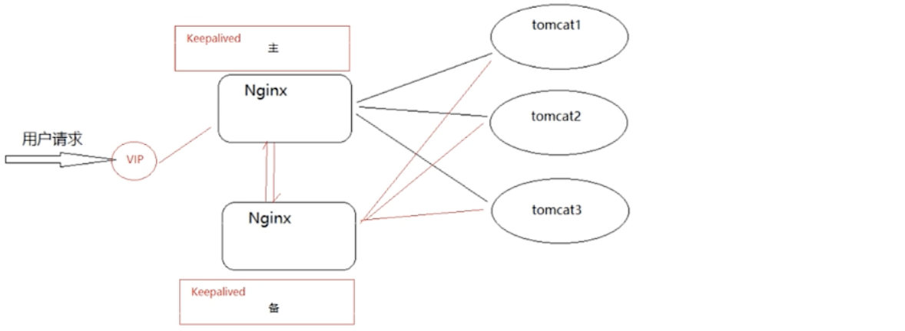

# nginx简介

nginx是一个高性能的HTTP和反向代理Web服务器，也可以做邮件代理服务器，优点是占用内存小，高性能，高并发。

市面常见服务器：

* IIS：微软提供的基于windows系统的服务器，windows服务器在性能上和稳定性上都不如类UNIX操作系统，因此需要高性能web服务器的场合，不合适。
* Tomcat：是一个重量级的Web服务器，对静态文件和高并发的处理比较弱。

nginx优点：

* 速度更快，并发更高（采用了多进程和IO多路复用）：无论单词请求还是高并发请求，nginx都比其他web服务器响应速度更快。
* 配置简单，扩展性强：nginx的设计极具扩展性，可以通过配置文件来天津有很多官方模块和第三方模块。
* 高可靠性：nginx的多进程有一个master主进程和多个worker进程，主进程可以再某一个worker进程出错时，会快速拉起新的worker进程提供服务。
* 热部署：可以再对nginx不停止的情况下，对nginx进行文件升级，更新配置和跟换日志文件等功能。
* 成本低、BSD许可：nginx是使用的BSD开源许可证。免费、可修改源码、无版权说明。所以nginx可以应用在商业领域，并修改源码定制需求。如：OpenRestry[nginx + lua]   Tengine[淘宝定制的nginx]。

nginx功能特性：

* 基本http服务
  * 静态资源部署、处理索引文件以及支持自动索引
  * 反向代理，并可以使用缓存加上反向代理，同时完成负载均衡和容错
  * 提供对FastCGI、memcached等服务的缓存机制，同时完成负载均衡和容错
  * 使用nginx的模块化特性提供过滤器功能，nginx基本过滤器包括gzip压缩、ranges支持、chunked响应、XSLT、SSI以及图像缩放等，其中针对包含多个SSI的页面，经由FastCGI或反向代理，SSI过滤器可以并行处理。
  * 支持HTTP下的安全套接层安全协议SSL
  * 支持基于加权和依赖的优先权的HTTP/2
* 高级http服务
  * 支持基于名字和IP的虚拟主机设置
  * 支持HTTP/1.0中的KEEP-Alive模式和管线（PipeLined）模型连接
  * 字段有访问日志格式、带缓存的日志写操作以及快速日志轮转
  * 提供3xx-5xx错误代码重定向功能
  * 支持重写（Rewrite）模块扩展
  * 支持重新加载配置以及在线升级时无需终端正在处理的请求
  * 支持网络监控
  * 支持FLV和MP4流媒体传输
* 邮件服务（不常见）
  * 支持IMPA/POP3代理服务功能
  * 支持内部SMTP代理服务功能

nginx常用功能：

* 静态资源部署
* Rewrite地址重写（正则表达式）
* 反向代理
* 负载均衡（算法：轮询、加权轮询、ip_hash、url_hash、fair）
* web缓存
* 环境部署（搭建高可用的环境）
* 用户认证模块
* ...

nginx核心组成：

* 二进制可执行文件（启动、重新加载、关闭nginx）
* nginx.conf配置文件
* error.log错误日志记录
* access.log访问日志记录

nginx进程：

* master主进程：负责管理所有的worker进程
* worker工作进程：用来接收和处理用户的请求

nginx路径问题：

nginx其实最终关心的就是两个路径：一个是客户端在浏览器中输入的访问地址，一个是要访问的实际资源的地址。

# 安装

## 环境准备

1. 确认centos内核

   准备一个内核为2.6及以上的操作系统，因为linux2.6及以上才支持epoll，而nginx解决高并发用的就是epoll。

   ```bash
   #查询linux内核版本
   uname -a 
   ```

2. 确保centos能联网

   ```bash
   ping www.baidu.com
   ```

3. 确认关闭防火墙

   关闭防火墙可以省略nginx学习过程中遇到的诸多问题。

   ```bash
   systemctl status firewalld #查看防火墙状态
   systemctl stop firewalld #关闭防火墙，系统重新启动后，防火墙重新打开
   systemctl disable firewalld #关闭防火墙，系统重新启动后，防火墙依然关闭
   ```

4. 确认停用selinux

   selinux是linux中的安全子系统，学习nginx时，会多很多设置，所以建议关闭。

   ```bash
   #查看selinux状态
   sestatus
   #如果不是disabled状态，可以通过修改配置来关闭
   vim /etc/selinux/config #注释SELINUX=enforcing 填写SELINUX=disabled
   ```

## nginx安装

**安装方式（centos）**

* 通过nginx源码安装
  * 源码安装提前准备
  * 通过nginx源码简单安装
  * 通过nginx源码复杂安装
* 通过yum安装

**源码安装提前准备**

* GCC编译器：nginx是使用C语言编写的程序，因此想要运行nginx就需要安装一个编译工具。GCC是一个开源的编译器集合，用户处理各种各样的语言，其中就包含C语言。

  ```bash
  yum install -y gcc #安装
  gcc --version #检查是否安装成功
  ```

* PCRE：nginx在编译过程中需要使用到PCRE库（兼容正则表达式库），nginx的一些模块中会使用到正则表达式。

  ```bash
  yum install -y pcre pcre-devel #安装
  rpm -qa pcre pcre-devel #检查是否安装成功
  ```

* zlib：zlib库提供了压缩算法，在nginx的各个模块中需要使用gzip压缩算法

  ```bash
  yum install -y zlib zlib-devel #安装
  rpm -qa zlib zlib-devel #检查是否安装成功
  ```

* OpenSSL：应用程序可以通过这个开源软件库包进行安全通信，nginx中如果想要使用https就需要用到OpenSSL

  ```bash
  yum install -y openssl openssl-devel #安装
  rpm -qa zlib zlib-devel #检查是否安装成功
  ```

**通过nginx源码简单安装**

1. 进入官网查找要下载版本的链接地址，然后使用wget命令进行下载

   ```basj
   wget https://nginx.org/download/nginx-1.16.1.tar.gz
   ```

2. 将下载的资源放入指定目录

   ```bash
   mkdir -p nginx/core
   mv nginx-1.16.1.tar.gz nginx/core
   ```

3. 解压缩

   ```bash
   tar -xzf nginx-1.16.1.tar.gz
   ```

4. 进入解压后的文件中，找到configure并执行

   ```bash
   ./configure
   ```

5. 编译

   ```bash
   make
   ```

6. 安装

   ```bash
   make install
   ```

注：安装成功后，默认会将nginx安装到`/usr/local/nginx`中，可以进入nginx中的sbin目录找到nginx可执行文件来启动nginx，启动后就可以在浏览器中访问到ngnix服务了。

**通过yum安装**

根据官方文档步骤安装即可

1. 安装yum-utils

   ```bash
   sudo yum install -y yum-utils
   ```

2. 编辑`/etc/yum.repos.d/nginx.repo`文件，复制官网内容

   ```bash
   vim /etc/yum.repos.d/nginx.repo
   ```

   ```repo
   [nginx-stable]
   name=nginx stable repo
   baseurl=http://nginx.org/packages/centos/$releasever/$basearch/
   gpgcheck=1
   enabled=1
   gpgkey=https://nginx.org/keys/nginx_signing.key
   module_hotfixes=true
   
   [nginx-mainline]
   name=nginx mainline repo
   baseurl=http://nginx.org/packages/mainline/centos/$releasever/$basearch/
   gpgcheck=1
   enabled=0
   gpgkey=https://nginx.org/keys/nginx_signing.key
   module_hotfixes=true
   ```

3. 安装

   ```bash
   sudo yum install -y nginx
   ```

**macOS安装nginx** 

- 安装brew `/bin/zsh -c "$(curl -fsSL https://gitee.com/cunkai/HomebrewCN/raw/master/Homebrew.sh)"`
- `brew install nginx`
- `brew info nginx` 查看nginx

# nginx目录

linux yum

```bash
whereis nginx #查找跟nginx相关的所有目录
find / -name nginx.conf #从根目录开始查找nginx配置文件位置

/etc/nginx/   #nginx安装目录
/etc/nginx/nginx.conf   #配置文件
/usr/sbin/   #可执行文件目录 启动./nginx
/usr/share/nginx/html/   #html文件目录 
/var/log/nginx/   #日志目录 cat /var/log/nginx/error.log #查看nginx错误日志
```

mac brew

```bash
/opt/homebrew/Cellar/nginx/1.25.0 #nginx安装目录
/opt/homebrew/etc/nginx/nginx.conf #nginx配置文件
```

# 常用命令

管理员可以给nginx主进程发送信号来管理worker进程。

```bash
#nginx命令
sudo nginx -v 										#检查nginx版本号
sudo nginx -V											#检查nginx版本号及其详细安装信息
sudo nginx                        #启动nginx
sudo nginx -s stop                #停止nginx
sudo nginx -s reopen              #重启nginx
sudo nginx -t                     #检查nginx配置文件语法
sudo nginx -T                     #检查nginx配置文件语法，并显示配置文件内容
sudo nginx -s reload              #重载nginx配置文件
sudo nginx -c /etc/nginx/nginx.conf  #指定配置文件路径

#使用systemctl服务（更加安全）
sudo systemctl start nginx      #启动nginx
sudo systemctl stop nginx       #停止nginx
sudo systemctl restart nginx    #重启nginx
sudo systemctl reload nginx     #重载nginx配置文件
sudo systemctl status nginx     #查看nginx是否启动成功
sudo systemctl enable nginx     #开机启动nginx
```

如果没配置path环境变量，想要使用nginx命令，必须进入nginx的目录。

* linux源码安装：`usr/local/nginx/sbin` 
* linux yum：`/usr/sbin/`
* mac：`/usr/local/etc/nginx`
* mac homebrew： `/opt/homebrew/etc/nginx/nginx.conf` 

# nginx启动常见问题

* nginx无法启动原因

  * 端口占用：nginx默认启动80端口，端口被占用则无法启动

    ```bash
    #查看端口占用情况
    sudo lsof -i :80
    #或
    netstat -anp | grep 80
    ```

  * 防火墙没关

    ```bash
    systemctl status firewalld #查看防火墙状态
    systemctl stop firewalld #关闭防火墙，系统重新启动后，防火墙重新打开
    systemctl disable firewalld #关闭防火墙，系统重新启动后，防火墙依然关闭
    ```

  * sestatus没关：selinux是linux中的安全子系统，学习nginx时，会多很多设置，所以建议关闭。

    ```bash
    #查看selinux状态
    sestatus
    #如果不是disabled状态，可以通过修改配置来关闭
    vim /etc/selinux/config #注释SELINUX=enforcing 填写SELINUX=disabled
    ```

* nginx服务无法访问原因：阿里云服务器需要配置安全组入口端口号

* 通过查看进程判断nginx是否启动

  ```bash
  ps aux | grep nginx
  ```

* 无法通过查看nginx进程判断nginx是否启动成功：nginx启动失败也有可能会查询到nginx的进程，这可能是因为Nginx的主进程成功启动，但在某些配置或错误情况下，工作进程（worker process）无法正常启动，导致启动失败。主进程通常在启动时会读取配置文件并监听指定端口，即使工作进程无法启动，主进程也会继续运行。

  ```bash
  #可以使用systemctl服务查看nginx是否启动成功
  sudo systemctl status nginx     
  ```

# 配置文件

管理员可以给nginx主进程发送信号来管理worker进程。

配置文件位置：linux：`usr/local/nginx/conf/nginx.conf` 

nginx配置文件组成：

1. 全局块：从配置开始一直到events块之间的内容，主要会设置一些影响nginx服务器整体运行的配置指令。

   * user：用于配置运行nginx服务器的worker进程的用户和用户组，这样对于系统的权限访问控制会更加精细和安全。

     ```nginx
     user 用户名 [用户组名，可选，如果不写默认跟用户名一致]; #默认值nobody
     ```

   * master_process：用来指定是否开启工作进程

     ```nginx
     master_process on|off; #默认值on
     ```

   * worker_process：允许生成的worder进程的数量，这是nginx服务器实现并发处理服务的关键。理论上配置的数量越大，可以支持的并发处理量越多，但事实上这个值的设定是需要受到服务器自身的限制，建议将该值和服务器cpu内核数保持一致。

     ```nginx
     worder_process num|auto; #默认值1
     ```

   * deamon：设定nginx是否以守护进程的方式启动。守护进程是linux后台执行的一种服务进程，特点是独立于控制终端，不会随着终端关闭而停止。

     ```nginx
     deamon on|off; #默认值on
     ```

   * pid：用来配置nginx当前master进程的进程号id存储的文件路径。

     ```nginx
     pid 文件路径; #默认值/usr/local/nginx/logs/nginx.pid
     ```

   * error_log：用来配置nginx的错误日志存放路径和日志级别

     ```nginx
     error_log 文件路径 [日志级别]; #默认值logs/error.log error
     ```

     error_log的配置位置可以在：全局块、http块、server块、location块。

     日志级别：debug|info|notice|warn|error|crit|alert|emerg，分别为调试|信息|通知|警告|错误|临界|警报|紧急，日志级别越来越高，日志基本越高输出的内容越少。这块建议不要设置成info以下的等级，因为会带来大量的磁盘I/O销毁，影响nginx性能。

   * include：用来引入其他的ngnix配置文件，使nginx的配置更加灵活，可以在配置文件中的任何位置配置include。

     ```nginx
     include 文件路径;
     ```

2. events块：主要用于设置nginx服务器与用户的网络连接，这部分配置对nginx服务器的性能影响比较大，在实际中应该灵活配置。nginx性能优化时也会用到这里的内容。

   * accept_mutex：用来设置nginx网络连接序列化。

     这个配置主要用来解决“惊群”问题。大致意思是在某一个时刻，客户端发来一个请求连接，nginx后台是多进程的工作模式，也就是说会有多个worker进程被同事唤醒，但最终只有一个进程可以获取到连接，如果每次唤醒的进程数太多，会影响nginx的整体性能，如果设置为on（开启状态），将会对多个nginx进程接收连接进行序列化，一个个来唤醒接收，就防止了多个进程对连接的争抢。设置为off同时唤醒多个进程，效率更高。具体设置成什么取决于生产环境。

     ```nginx
     accept_mutex on|off; #默认值on
     ```

   * multi_accept：用来设置worker进程是否允许同时接收多个网络连接，如果设置为off，nginx一个worker进程同一时间内只能接收一个新的链接，否则一个worker进程可以同时接收所有新连接。建议设置为on，这样效率高一点。

     ```nginx
     multi_accept on|off; #默认值off
     ```

   * worker_connections：用来配置单个worker进程最大连接数。这里的连接数不仅仅包括和前端用户建立的连接，而是包括所有可能的连接数，num的值不能大于操作系统支持打开的最大文件句柄数量。

     ```nginx
     worker_connections num; #默认值512
     ```

   * use：用来设置nginx服务器选择哪种事件驱动来处理网络消息。此处所选择的事件处理模型是nginx优化部分的一个重要内容，method的可选值有select/poll/epoll/kqueue等，之前环境准备时，需要使用linux内核在2.6以上的centos操作系统时，就是为了能使用epoll函数来优化nginx。这个配置也可以在nginx源码安装时来指定。

     ```nginx
     use method; #默认值根据操作系统定
     ```

3. http块：包括http全局块和多个server块。

   1. http全局块：

      * http全局块包括文件引入

      * 定义MIME-TYPE：MIME-TYPE是网络资源媒体类型，nginx作为web服务器，也需要能够识别前端请求的资源类型。

        * types：定义支持的MIME类型（默认是通过include引入进来的）

        * default_type：用来配置nginx相应前端请求的默认MIME类型，可以在http块、server块、location块中设置。

          ```nginx
          default_type mime-type; #默认值 text/plain
          ```

      * 自定义日志

        nginx中的日志类型分access.log、error.log。

        access.log用来记录用户所有的访问请求。

        error.log记录的是nginx运行时的错误信息。

        自定义日志主要是对access.log来进行设置，支持对日志的格式大小输出等进行设置，需要用到下面两个指令。

        * access_log：设置用户访问日志的相关属性。可以在http块、server块、location块中设置。

          ```nginx
          access_log path [日志格式名 [buffer=日志大小]]; #默认值access_log logs/access.log combined;
          ```

        * log_format：设置指定日志的输出格式。只能在http块中设置。

          ```nginx
          log_format name [escape=default|json|none] "string...."; #默认值log_format combined "...";
          ```

      * sendfile：用来设置nginx服务器是否使用sendfile()函数传输文件，该属性可以大大提高nginx从磁盘读取静态资源的性能。可以在http块、server块、location块中设置。

        ```nginx
        sendfile on|of; #默认值off
        ```

      * keepalive_timeout：用来设置keep-alive长连接的超时时间。可以在http块、server块、location块中设置。

        ```nginx
        keepalive_timeout time; #默认值75; 单位是s
        ```

      * keepalive_requests：用来设置keep-alive长连接的最大使用次数，超过这个次数长连接就会断开。可以在http块、server块、location块中设置。

        ```nginx
        keepalive_requests num; #默认值100
        ```

   2. server块：包括全局server块和多个location块。server块和虚拟主机有密切关系，每个server块就相当于一个虚拟主机，虚拟主机从用户角度看，和一台独立的硬件主机是完全一样的，该技术的产生是为了节省互联网服务器硬件成本。

      1. 全局server块

         * listen：用来配置监听的端口

           ```nginx
           listen address[:post] [default_server] ...;
           # 或者
           listen port [default_server] ...;
           
           listen *:80 | *:8080; #默认值
           ```

           ```nginx
           listen 127.0.0.1:8080; #监听指定的IP和端口
           listen 127.0.0.1; #监听指定IP的所有端口
           listen 8080;   #监听指定端口
           listen *:8080; #监听指定端口
           ```

           注：default_server用来将此虚拟主机设置成默认主机，所谓默认主机指的是如果没有匹配到对应的主机地址，则会默认执行的主机。如果不指定默认主机是第一个server。

         * server_name：用来设置虚拟主机名称（域名或IP）

           ```nginx
           server_name name ...; #name可以提供多个，中间用空格分隔
           server_name ""; #默认值
           ```

           方式一：精确匹配

           ```nginx
           server_name www.baidu.com www.jd.com;
           ```

           补充小知识：主机映射可以在/etc/hosts文件中配置IP和域名的映射关系。访问域名时电脑会先到这里找域名对应的IP，没找到才会走DNS域名解析。

           方式二：通配符匹配

           server_name支持通配符”*“，通配符不能出现在域名的中间，只能出现在整个首段或整个尾段，如：

           ```nginx
           #正确的写法
           server_name *.baidu.com www.jd.*;
           
           #错误的写法
           server_name www.*.com www.baidu.c*;
           ```

           方式三：正则表达式匹配

           server_name支持使用正则表达式，并且需要使用`~`作为正则表达式字符串的开始标记。

           ```nginx
           server_name ~^www\.\w+\.com$;
           ```

         * error_page：设置网站的错误页面，根据状态码响应相应页面。一个server块中可以配置多个。

           ```nginx
           error_page code ... [=response] uri; #没有默认值
           #response可以重新设置状态码
           error_page 404 =200 /50x.html;
           location =/50x.html {
             root html;
           }
           ```

           方式一：指定具体的页面跳转地址

           ```nginx
           error_page 404 http://www.xxx.com;
           ```

           方式二：指定重定向地址

           ```nginx
           error_page 404 /50x.html;
           location =/50x.html {
             root html;
           }
           ```

           方式三：使用location的@符号完成错误信息展示

           ```nginx
           error_page 404 @jump_to_error;
           location @jump_to_error {
             root html;
           }
           ```

      2. location块：设置请求的URI，并对请求进行响应

         ```nginx
         location [= | ~ | ~* | ^~ | @] uri {...}
         
         #1.不带符号：以指定模式开始的都可以访问到
         location /abc {...}
         #以下都可以匹配
         http://192.168.1.1/abc
         http://192.168.1.1/abc?p=tom
         http://192.168.1.1/abc/
         http://192.168.1.1/abcdef
         
         #2.=：用于不包含正则表达式的uri的精确匹配
         location =/abc {...}
         #可以匹配
         http://192.168.1.1/abc
         http://192.168.1.1/abc?p=tom
         #不可以匹配
         http://192.168.1.1/abc/
         http://192.168.1.1/abcdef
         
         #3.~：用于表示包含了正则表达式的uri，区分大小写
         #4.~*：用于表示包含了正则表达式的uri，不区分大小写
         location ~^/abc\w$ {}
         location ~*^/abc\w$ {}
         
         #5.^~：和不带符号功能一致，区别是如果匹配到了，就停止匹配其他模式。
         location ^~/abc {}
         ```

         * 指定访问资源的路径

           * root：设置请求资源根目录

             ```nginx
             root path; #默认值html
             ```

           * alias：用来更改location的URI

             ```nginx
             alias path; #没有默认值
             ```

           * 区别

             * root的处理结果（服务器中的资源的具体路径）是：root路径 + location路径
             * alias的处理结果是：使用alias路径替换location路径
             * root资源根目录的含义，alias是一个目录别名的含义
             * 如果location路径以`/`结尾，那么alias也必须以`/`结尾，root没有要求

         * index：指定访问资源首页内容（这个首页内容必须在root所在的目录下）

           ```nginx
           index file ...; #默认值index.html
           ```

         * 数据缓存

         * 应答控制

         * 配置第三方模块

# 静态资源部署

## 配置指令

主要是server块和location块中的配置指令

## 配置优化

主要从下面三个属性配置进行优化：

```nginx
sendfile on;
tcp_nopush on;
tcp_nodelay on;
```

**sendfile**

sendfile用来开启高效的文件传输模式。可以在http块（常见）、server块、location块中设置。

```nginx
sendfile on|off; #默认值off
```

**tcp_nopush**

该指令必须在sendfile打开的状态下才会生效，主要是用来提升网络包的传输效率，但实时性会降低。可以在http块（常见）、server块、location块中设置。

```nginx
tcp_nodeplay on|off; #默认值off
```

**tcp_nodelay**

该指令必须在keep-alive连接开启的情况下才会生效，来提高网络包传输的实时性。可以在http块（常见）、server块、location块中设置。

```nginx
tcp_nodelay on|off; #默认值on
```

## gzip压缩

nginx配置文件中可以通过配置gzip来对静态资源进行压缩，相关的指令可以在http块（常见）、server块、location块中设置。

配置压缩指令需要用到如下三个模块：

* ngx_http_gzip_module模块
* ngx_http_gzip_static_module模块
* ngx_http_gunzip_module模块

**ngx_http_gzip_module模块**

该模块会在nginx安装时内置到nginx安装环境中，我们可以直接使用该模块提供的指令。

1. gzip指令：该指令用于开启或关闭gzip功能

   ```nginx
   gzip on|off; #默认值off
   ```

2. gzip_types指令：该指令可以根据响应页的MIME类型选择性的开启gzip压缩功能。所选择的值可以从mime.types文件中进行查找，也可以使用`*`代表所有（不建议配置，因为图片视频等资源已经做了高度压缩，没必要再进行gzip压缩，从而浪费cpu资源）。不配置时默认只会对html类型的文件进行压缩。

   ```nginx
   gzip_types mime-type ...; #默认值text/html
   ```

3. gzip_comp_level指令：该指令用于设置gzip压缩级别，级别从1-9,1表示最低，效率最高，9表示压缩程度最高，但效率最低耗时长。压缩级别越高压缩效果越不明显，建议设置为6。

   ```nginx
   gzip_comp_level level; #默认值1
   ```

4. gzip_vary指令：该指令用于设置使用gzip进行压缩，是否发送`Vary: Accept-Encoding`响应头。主要是告诉接收方，所发送的数据经过了gzip压缩处理。

   ```nginx
   gzip_vary on|off; #默认值off
   ```

5. gzip_buffers指令：该指令用于处理压缩的缓冲区数量和大小。

   其中num指定nginx服务器向系统申请缓存空间个数，size指定每个缓存空间的大小。这个值的设定和服务器的操作系统有关，所以不建议设置，使用默认值即可。

   ```nginx
   gzip_buffers num size; #默认值32 4k | 16 8k
   ```

6. gzip_disable指令：针对不同种类客户端发起的请求，可以选择性的开启和关闭gzip功能。根据客户端的浏览器标志（user-agent）来设置，支持使用正则表达式。指定某些浏览器不使用gzip，该指令一般是用来排除一些明显不支持gzip的低版本的浏览器，不支持gzip压缩的浏览器还进行gzip压缩的话会显示乱码。

   ```nginx
   gzip disable 正则字符串 ...; #没有默认值
   ```

   IE6以下的浏览器版本都不进行gzip压缩：

   ```nginx
   gzip disable "MSIE [1-6]\."
   ```

7. gzip_http_version指令：该指令指定使用gzip的最低http版本，一般采用默认值即可。

   ```nginx
   gzip_http_version 1.0|1.1; #默认值1.1
   ```

8. gzip_min_length指令：该指令针对传输数据的大小，可以选择性的开启和关闭gzip功能。

   ```nginx
   gzip_min_length length; #默认值20
   #nginx计量大小的单位：bytes[字节] / k|K[千字节] / m|M[兆]
   #例如：1024 / 10k / 10M
   ```

   gzip压缩功能对大数据的压缩效果明显，如果压缩的数据比较小，可能出现越压缩越大的情况。因此我们需要根据响应内容的大小来决定是否使用gzip功能，响应页面的大小可以通过头信息中的Content-Length来获取，但如果使用了Chunk编码动态压缩，该指令将被忽略。建议设置为1k或以上。

9. gzip_proxied指令：该指令设置的是在使用nginx做反向代理时，是否对服务端返回的结果进行gzip压缩。

   ```nginx
   gzip_proxied off|expired|no-cache|no-store|private|no_last_modified|no_etag|auth|any; #默认值off
   ```

   off - 关闭Nginx服务器对后台服务器返回结果的Gzip压缩
   expired - 启用压缩，如果header头中包含 "Expires" 头信息
   no-cache - 启用压缩，如果header头中包含 "Cache-Control:no-cache" 头信息
   no-store - 启用压缩，如果header头中包含 "Cache-Control:no-store" 头信息
   private - 启用压缩，如果header头中包含 "Cache-Control:private" 头信息
   no_last_modified - 启用压缩,如果header头中不包含 "Last-Modified" 头信息
   no_etag - 启用压缩 ,如果header头中不包含 "ETag" 头信息
   auth - 启用压缩 , 如果header头中包含 "Authorization" 头信息
   any - 无条件启用压缩

**gzip和sendfile共存问题**

开启sendfile以后，在读取磁盘上的静态资源文件的时候，可以减少拷贝的次数，可以不经过用户进程将静态文件通过网络设备发送出去，但是Gzip要想对资源压缩，是需要经过用户进程进行操作的。可以使用ngx_http_gzip_static_module模块的gzip_static指令来解决。

gzip_static: 检查与访问资源同名的.gz文件时，返回给客户端，并添加相应的gzip响应头信息。

```nginx
gzip_static on|off|always; #默认值off
```

## 浏览器缓存

主要是通过nginx指令控制浏览器缓存。

强缓存响应头可以通过nginx或上游服务器添加。

协商缓存一般由上游服务器添加，而Nginx负责将这些头信息传递给客户端。

1. expires指令：通过该指令可以控制响应头中的“Expires"和”Cache-Control"。位置http、server、location。

   ```nginx
   expires [modified] time;
   expires epoch|max|off; #默认值off
   ```

   time：指定过期时间，可以正数也可以是负数。

   * 如果是负数，Cache-Control则为no-cache，表示不走强缓存而是走协商缓存
   * 如果为整数或0，则Cache-Control的值为max-age=time，如果是0表示不走强缓存而是走协商缓存

   epoch：指定Expires的值为'1 January,1970,00:00:01 GMT'(1970-01-01 00:00:00)，Cache-Control的值no-cache

   max：指定Expires的值为'31 December2037 23:59:59GMT' (2037-12-31 23:59:59) ，Cache-Control的值为10年

   off：默认不缓存。

2. add_header指令：用来添加指定的响应头和值。位置http、server、location。

   ```nginx
   add_header name value,value... [always]; #没有默认值
   ```

   Cache-Control作为响应头，可以设置如下值，如果添加多个值中间用`,`分隔：

   * must-revalidate 可缓存但必须再向源服务器进行确认
   * no-cache 缓存前必须确认其有效性
   * no-store 不缓存请求或响应的任何内容
   * no-transform 代理不可更改媒体类型
   * public 可向任意方提供响应的缓存
   * private 仅向特定用户返回响应
   * proxy-revalidate 要求中间缓存服务器对缓存的响应有效性再进行确认
   * max-age=\<seconds> 响应最大Age值
   * s-maxage=\<seconds> 公共缓存服务器响应的最大Age值

## 解决跨域

解决跨域的响应头一般由上游服务器添加，而Nginx负责将这些头信息传递给客户端。

使用add_header指令，该指令可以用来添加一些头信息。

```nginx
add_header name value,value... [always]; #没有默认值
```

此处用来解决跨域问题，需要添加两个头信息，一个是`Access-Control-Allow-Origin`，`Access-Control-Allow-Methods`

```nginx
location /getUser {
    add_header Access-Control-Allow-Origin 协议域名端口或*;
    add_header Access-Control-Allow-Methods GET,POST,PUT,DELETE;
    default_type application/json;
    return 200 '{"id":1,"name":"TOM","age":18}';
}
```

允许跨域的响应头：

* Access-Control-Allow-Origin：允许跨域访问的源地址信息，可以配置多个(多个用逗号分隔)，也可以使用`*`代表所有源。

* Access-Control-Allow-Methods：允许跨域访问的请求方式，值可以为 GET POST PUT DELETE...,可以全部设置，也可以根据需要设置，多个用逗号分隔。

* Access-Control-Allow-Headers：指定哪些HTTP请求头可以被包含在请求中。这通常用于允许客户端发送自定义的请求头。例如：

  Access-Control-Allow-Headers: Content-Type, Authorization：允许包含 `Content-Type` 和 `Authorization` 请求头。

* Access-Control-Expose-Headers：指定哪些响应头可以被暴露给客户端。默认情况下，只有一些基本的响应头（如 `Cache-Control`、`Content-Language` 等）会被暴露给客户端。使用该头部可以自定义暴露的响应头。例如：`Access-Control-Expose-Headers: X-Custom-Header`：允许暴露自定义响应头 `X-Custom-Header` 给客户端。

* Access-Control-Allow-Credentials：指定是否允许携带凭证（如Cookies或HTTP认证）进行跨域请求。如果值为 `true`，则表示允许，如果值为 `false`，则表示不允许。

* Access-Control-Max-Age：指定预检请求（OPTIONS请求）的缓存时间，以秒为单位。预检请求是在实际请求之前发送的，用于检查是否允许跨域请求。例如：Access-Control-Max-Age: 3600表示预检请求的结果将在3600秒内缓存，减少不必要的预检请求。

补充知识点：何时浏览器会发送预检请求

1. 跨域请求中使用了自定义的请求头：如果跨域请求中包含了自定义的请求头（不是常见的标准请求头，例如 `Content-Type`），浏览器会发起预检请求。自定义请求头指的是不在跨域请求的白名单中的请求头。
2. 跨域请求中使用了某些非简单请求方法：非简单请求方法指的是不是常见的标准HTTP方法（GET、POST、HEAD）的请求方法，例如 PUT、DELETE 等。如果跨域请求使用了这些非简单请求方法，浏览器会发起预检请求。
3. 跨域请求中设置了 `withCredentials` 为 `true`：如果跨域请求需要携带凭证（例如Cookies或HTTP认证信息），并且设置了 `withCredentials` 为 `true`，浏览器会发起预检请求。
4. 跨域请求使用了某些不常见的请求头值：有些情况下，即使请求头在标准请求头范围内，但其值可能触发预检请求，这取决于浏览器的具体实现。

## 防盗链

**资源盗链**：指的是此内容不在自己服务器上，而是通过技术手段，绕过别人的限制将别人的资源内容放到自己页面上最终展示给用户。以此来盗取大网站的空间和流量。简而言之就是用别人的东西成就自己的网站。

**防盗链**：指的是保证我们服务器上的资源不会随意被别人使用。

**Referer**：了解防盗链的原理之前，先了解一个HTTP的头信息Referer，当浏览器向web服务器发送请求的时候，一般都会带上Referer请求头，来告诉服务器该网页是从哪个页面链接过来的。服务器可以获取到这个Referer信息来判断是否为自己信任的网站地址，如果是则放行继续访问，如果不是则可以返回403(服务端拒绝访问)的状态信息。

**nginx防盗链的具体实现**

valid_referers指令：nginx会通过查看referer自动和valid_referers后面的内容进行匹配，如果匹配到了就将`$invalid_referer`变量置0，如果没有匹配到，则将`$invalid_referer`变量置为1，匹配的过程中不区分大小写。可以在server块、location块中设置。

```nginx
valid_referers none|blocked|server_names|string...;
```

* none：如果Header中的Referer为空，允许访问。

* blocked：在Header中的Referer不为空，但是该值被防火墙或代理进行伪装过，如不带"http://" 、"https://"等协议头的资源允许访问。

* server_names：指定具体的域名或者IP。

* string：可以支持正则表达式和*的字符串。如果是正则表达式，需要以`~`开头表示

示例：

```nginx
#针对文件类型配置防盗链
location ~*\.(png|jpg|gif){
	valid_referers none blocked www.baidu.com 192.168.200.222 *.example.com example.* ~\.google\.;
  if ($invalid_referer){
    return 403;
  }
  root /usr/local/nginx/html;
}
#针对目录配置防盗链
location /images {
	valid_referers none blocked www.baidu.com 192.168.200.222 *.example.com example.* ~\.google\.;
  if ($invalid_referer){
    return 403;
  }
  root /usr/local/nginx/html;
}
```

遇到的问题：Referer的限制比较粗，比如随意加一个Referer，上面的方式是无法进行限制的，此时我们需要用到nginx的第三方模块`ngx_http_accesskey_module`实现防盗链。

## rewrite

Rewrite是Nginx服务器提供的一个重要基本功能，是Web服务器产品中几乎必备的功能。主要的作用是用来实现URL的重写。

注意：Nginx服务器的Rewrite功能的实现依赖于PCRE的支持，因此在编译安装Nginx服务器之前，需要安装PCRE库。Nginx使用的是ngx_http_rewrite_module模块来解析和处理Rewrite功能的相关配置。

"地址重写"与"地址转发"的区别:

```
地址重写浏览器地址会发生变化而地址转发则不变
一次地址重写会产生两次请求而一次地址转发只会产生一次请求
地址重写到的页面必须是一个完整的路径而地址转发则不需要
地址重写因为是两次请求所以request范围内属性不能传递给新页面而地址转发因为是一次请求所以可以传递值
地址转发速度快于地址重写
```

**rewrite常用指令**

set指令：该指令用来设置一个新的变量。可以再server、location、if中使用。

```nginx
set $variable 变量值; #没有默认值
```

$variable：变量名，该变量名称要用"$"作为变量的第一个字符，且不能与Nginx服务器预设的全局变量同名。

value：变量值，可以是字符串、其他变量或者变量的组合等。

Rewrite常用全局变量：

| 变量               | 说明                                                         |
| ------------------ | ------------------------------------------------------------ |
| $args              | 变量中存放了请求URL中的请求指令。比如http://192.168.200.133:8080?arg1=value1&args2=value2中的"arg1=value1&arg2=value2"，功能和$query_string一样 |
| $http_user_agent   | 变量存储的是用户访问服务的代理信息(如果通过浏览器访问，记录的是浏览器的相关版本信息) |
| $host              | 变量存储的是访问服务器的server_name值                        |
| $document_uri      | 变量存储的是当前访问地址的URI。比如http://192.168.200.133/server?id=10&name=zhangsan中的"/server"，功能和$uri一样 |
| $document_root     | 变量存储的是当前请求对应location的root值，如果未设置，默认指向Nginx自带html目录所在位置 |
| $content_length    | 变量存储的是请求头中的Content-Length的值                     |
| $content_type      | 变量存储的是请求头中的Content-Type的值                       |
| $http_cookie       | 变量存储的是客户端的cookie信息，可以通过add_header Set-Cookie 'cookieName=cookieValue'来添加cookie数据 |
| $limit_rate        | 变量中存储的是Nginx服务器对网络连接速率的限制，也就是Nginx配置中对limit_rate指令设置的值，默认是0，不限制。 |
| $remote_addr       | 变量中存储的是客户端的IP地址                                 |
| $remote_port       | 变量中存储了客户端与服务端建立连接的端口号                   |
| $remote_user       | 变量中存储了客户端的用户名，需要有认证模块才能获取           |
| $scheme            | 变量中存储了访问协议                                         |
| $server_addr       | 变量中存储了服务端的地址                                     |
| $server_name       | 变量中存储了客户端请求到达的服务器的名称                     |
| $server_port       | 变量中存储了客户端请求到达服务器的端口号                     |
| $server_protocol   | 变量中存储了客户端请求协议的版本，比如"HTTP/1.1"             |
| $request_body_file | 变量中存储了发给后端服务器的本地文件资源的名称               |
| $request_method    | 变量中存储了客户端的请求方式，比如"GET","POST"等             |
| $request_filename  | 变量中存储了当前请求的资源文件的路径名                       |
| $request_uri       | 变量中存储了当前请求的URI，并且携带请求参数，比如http://192.168.200.133/server?id=10&name=zhangsan中的"/server?id=10&name=zhangsan" |

if指令：该指令用来支持条件判断，并根据条件判断结果选择不同的Nginx配置。位置：server、location。

```nginx
if (condition) {...}
```

condition为判定条件，可以支持以下写法：

1. 变量名。如果变量名对应的值为空字符串或者是0，if都判断为false，其他条件为true。

   ```nginx
   if ($变量){
   	
   }
   ```

2. 使用"="和"!="比较变量和字符串是否相等，满足条件为true，不满足为false。注意：此处和Java不太一样的地方是字符串不需要添加引号。

   ```nginx
   if ($request_method = POST){
   	return 405;
   }
   ```

3. 使用正则表达式对变量进行匹配，匹配成功返回true，否则返回false。变量与正则表达式之间使用"~","~*","!~","!~\*"来连接。

   "~"代表匹配正则表达式过程中区分大小写，

   "~\*"代表匹配正则表达式过程中不区分大小写

   "!~"和"!~\*"刚好和上面取相反值，如果匹配上返回false,匹配不上返回true

   ```nginx
   if ($http_user_agent ~ MSIE){
     #MSIE就是正则字符串
   	#$http_user_agent的值中是否包含MSIE字符串，如果包含返回true
   }
   ```

   注意：正则表达式字符串一般不需要加引号，但是如果字符串中包含"}"或者是";"等字符时，就需要把引号加上。

4. 判断请求的文件是否存在使用"-f"和"!-f"

   当使用"-f"时，如果请求的文件存在返回true，不存在返回false。

   当使用"!-f"时，如果请求文件不存在，但该文件所在目录存在返回true，文件和目录都不存在返回false，如果文件存在返回false

   ```nginx
   if (-f $request_filename){
   	#判断请求的文件是否存在
   }
   if (!-f $request_filename){
   	#判断请求的文件是否不存在
   }
   ```

5. 判断请求的目录是否存在使用"-d"和"!-d",

   当使用"-d"时，如果请求的目录存在，if返回true，如果目录不存在则返回false

   当使用"!-d"时，如果请求的目录不存在但该目录的上级目录存在则返回true，该目录和它上级目录都不存在则返回false,如果请求目录存在也返回false.

6. 判断请求的 存在使用"-e"和"!-e"

   当使用"-e",如果请求的目录或者文件存在时，if返回true,否则返回false.

   当使用"!-e",如果请求的文件和文件所在路径上的目录都不存在返回true,否则返回false

7. 判断请求的文件是否可执行使用"-x"和"!-x"

   当使用"-x",如果请求的文件可执行，if返回true,否则返回false

   当使用"!-x",如果请求文件不可执行，返回true,否则返回false

break指令：该指令用于中断当前相同作用域中的其他Nginx配置。与该指令处于同一作用域的Nginx配置中，位于它前面的指令配置生效，位于后面的指令配置无效。并且break可以终止当前的匹配并把当前的URI在本location进行重定向访问处理。位置：server、location、if。

```nginx
break;
```

示例:

```
location /{
	if ($变量){
		set $id $1;
		break;
		limit_rate 10k;
	}
}
```

return指令：该指令用于完成对请求的处理，直接向客户端返回响应状态代码。在return后的所有Nginx配置都是无效的。位置：server、location、if。

```nginx
return code [text];
return code URL;
return URL;
```

* code：为返回给客户端的HTTP状态代理。可以返回的状态代码为0~999的任意HTTP状态代理
* text：为返回给客户端的响应体内容，支持变量的使用
* URL：为返回给客户端的URL地址（临时重定向）

rewrite指令：该指令通过正则表达式的使用来改变URI。可以同时存在一个或者多个指令，按照顺序依次对URL进行匹配和处理。位置：server、location、if。

URL和URI的区别：

```
URI:统一资源标识符
URL:统一资源定位符
```

```nginx
rewrite reg replacement [flag];
```

* reg：用来匹配URI的正则表达式

* replacement：用于替换URI中被匹配内容的字符串。如果该字符串是以"http://"或者"https://"开头的，则不会继续向下对URI进行其他处理，而是直接返回重写后的URI给客户端。

* flag：用来设置rewrite对URI的处理行为，可选值有如下：

  - last和不加一个效果

  - break在当前作用域中匹配，不会继续向下寻找。

  - redirect临时重定向

  - permanent永久重定向


示例：

```nginx
location /rewrite {
  rewrite ^/rewrite/url\w*$ https://www.baidu.com;
  rewrite ^/rewrite/(test)\w*$ /$1;
  rewrite ^/rewrite/(demo)\w*$ /$1;
}
location /test {
	default_type text/plain;
  return 200 test_success;
}
location /demo {
	default_type text/plain;
  return 200 demo_success;
}
```

rewrite_log指令：该指令配置是否开启URL重写日志的输出功能，开启后，URL重写的相关日志将以notice级别输出到error_log指令配置的日志文件汇总。位置：http、server、location、if。

```nginx
rewrite_log on|off; #默认值off
```

## Rewrite的案例

**域名跳转**

问题分析：

如果我们想访问京东网站，可以输入`www.jd.com`，但当我们输入`www.360buy.com`后，地址也会变成`www.jd.com`。这个其实是因为京东刚开始的时候域名就是`www.360buy.com`，后面由于各种原因把自己的域名换成了`www.jd.com`, 虽然说域名变量，但是对于以前只记住了`www.360buy.com`的用户来说，就要把这部分用户也迁移到我们新域名上来，针对于这个问题，我们就可以使用Nginx中Rewrite的域名跳转来解决。

1.域名跳转

环境准备：

- 准备两个域名  `www.360buy.com`  `www.jd.com`

```
vim /etc/hosts
```

```
192.168.200.133 www.360buy.com
192.168.200.133 www.jd.com
```

- 在/usr/local/nginx/html/jd目录下创建一个访问页面

```html
<html>
  <head>
		<title>京东商城</title>
  </head>
	<body>
		<h1>欢迎来到京东</h1>
	</body>
</html>
```

- 通过Nginx实现`www.jd.com`的服务器

```
server {
	listen 80;
	server_name www.jd.com;
	location /{
		root /usr/local/nginx/html/jd;
		index index.html;
	}
}
```

* 通过Rewrite完成将`www.360buy.com`的请求跳转到`www.jd.com`

```
server {
	listen 80;
	server_name www.360buy.com;
	rewrite ^/ http://www.jd.com permanent;
}
```

2. 域名跳转时携带请求的URI：

* 修改配置信息

```
server {
	listen 80;
	server_name www.itheima.com;
	rewrite ^(.*) http://www.hm.com$1 permanent;
}
```

3.多域名跳转：

我们除了上述说的`www.jd.com` 、`www.360buy.com`其实还有我们也可以通过`www.jingdong.com`来访问，那么如何通过Rewrite来实现多个域名的跳转?

* 添加域名

```
vim /etc/hosts
192.168.200.133 www.jingdong.com
```

* 修改配置信息

```
server{
	listen 80;
	server_name www.360buy.com www.jingdong.com;
	rewrite ^(.*) http://www.jd.com$1 permanent;
}
```

**域名镜像**

上述案例中，将`www.360buy.com` 和 `www.jingdong.com`都能跳转到`www.jd.com`，那么`www.jd.com`我们就可以把它起名叫主域名，其他两个就是我们所说的镜像域名，当然如果我们不想把整个网站做镜像，只想为其中某一个子目录下的资源做镜像，我们可以在location块中配置rewrite功能，比如:

```
server {
	listen 80;
	server_name rewrite.myweb.com;
	location ^~ /source1{
		rewrite ^/source1(.*) http://rewrite.myweb.com/web$1 last;
	}
	location ^~ /source2{
		rewrite ^/source2(.*) http://rewrite.myweb.com/web$1 last;
	}
}
```

**独立域名**

一个完整的项目包含多个模块，比如购物网站有商品商品搜索模块、商品详情模块已经购物车模块等，那么我们如何为每一个模块设置独立的域名。

需求：

```
http://search.hm.com  访问商品搜索模块
http://item.hm.com	  访问商品详情模块
http://cart.hm.com	  访问商品购物车模块
```

```
server{
	listen 80;
	server_name search.hm.com;
	rewrite ^(.*) http://www.hm.com/bbs$1 last;
}
server{
	listen 81;
	server_name item.hm.com;
	rewrite ^(.*) http://www.hm.com/item$1 last;
}
server{
	listen 82;
	server_name cart.hm.com;
	rewrite ^(.*) http://www.hm.com/cart$1 last;
}
```

**目录自动添加"/"**

问题描述

通过一个例子来演示下问题:

```
server {
	listen	80;
	server_name localhost;
	location / {
		root html;
		index index.html;
	}
}

```

要想访问上述资源，很简单，只需要通过http://192.168.200.133直接就能访问，地址后面不需要加/，但是如果将上述的配置修改为如下内容:

```
server {
	listen	80;
	server_name localhost;
	location /hm {
		root html;
		index index.html;
	}
}
```

这个时候，要想访问上述资源，按照上述的访问方式，我们可以通过http://192.168.200.133/hm/来访问,但是如果地址后面不加斜杠，页面就会出问题。如果不加斜杠，Nginx服务器内部会自动做一个301的重定向，重定向的地址会有一个指令叫server_name_in_redirect on|off;来决定重定向的地址：

```
如果该指令为on
	重定向的地址为:  http://server_name/目录名/;
如果该指令为off
	重定向的地址为:  http://原URL中的域名/目录名/;
```

所以就拿刚才的地址来说，http://192.168.200.133/hm如果不加斜杠，那么按照上述规则，如果指令server_name_in_redirect为on，则301重定向地址变为 http://localhost/hm/,如果为off，则301重定向地址变为http://192.168.200.133/hm/。后面这个是正常的，前面地址就有问题。

注意server_name_in_redirect指令在Nginx的0.8.48版本之前默认都是on，之后改成了off,所以现在我们这个版本不需要考虑这个问题，但是如果是0.8.48以前的版本并且server_name_in_redirect设置为on，我们如何通过rewrite来解决这个问题？

解决方案

我们可以使用rewrite功能为末尾没有斜杠的URL自动添加一个斜杠

```
server {
	listen	80;
	server_name localhost;
	server_name_in_redirect on;
	location /hm {
		if (-d $request_filename){
			rewrite ^/(.*)([^/])$ http://$host:$server_port/$1$2/ permanent;
		}
	}
}
```

**合并目录**

搜索引擎优化(SEO)是一种利用搜索引擎的搜索规则来提供目的网站的有关搜索引擎内排名的方式。我们在创建自己的站点时，可以通过很多中方式来有效的提供搜索引擎优化的程度。其中有一项就包含URL的目录层级一般不要超过三层，否则的话不利于搜索引擎的搜索也给客户端的输入带来了负担，但是将所有的文件放在一个目录下又会导致文件资源管理混乱并且访问文件的速度也会随着文件增多而慢下来，这两个问题是相互矛盾的，那么使用rewrite如何解决上述问题?

举例，网站中有一个资源文件的访问路径时 /server/11/22/33/44/20.html,也就是说20.html存在于第5级目录下，如果想要访问该资源文件，客户端的URL地址就要写成 `http://www.web.name/server/11/22/33/44/20.html`,

```
server {
	listen 80;
	server_name www.web.name;
	location /server{
		root html;
	}
}
```

但是这个是非常不利于SEO搜索引擎优化的，同时客户端也不好记.使用rewrite我们可以进行如下配置:

```
server {
	listen 80;
	server_name www.web.name;
	location /server{
		rewrite ^/server-([0-9]+)-([0-9]+)-([0-9]+)-([0-9]+)\.html$ /server/$1/$2/$3/$4/$5.html last;
	}
}
```

这样的花，客户端只需要输入http://www.web.name/server-11-22-33-44-20.html就可以访问到20.html页面了。这里也充分利用了rewrite指令支持正则表达式的特性。

**防盗链功能优化**

防盗链之前我们已经介绍过了相关的知识，在rewrite中的防盗链和之前将的原理其实都是一样的，只不过通过rewrite可以将防盗链的功能进行完善下，当出现防盗链的情况，我们可以使用rewrite将请求转发到自定义的一张图片或页面，给用户比较好的提示信息。

```nginx
#针对文件类型配置防盗链
location ~*\.(png|jpg|gif){
	valid_referers none blocked www.baidu.com 192.168.200.222 *.example.com example.* ~\.google\.;
  if ($invalid_referer){
    #return 403;
    rewrite ^/ /images/forbidden.png break;
  }
}
#针对目录配置防盗链
location /images {
	valid_referers none blocked www.baidu.com 192.168.200.222 *.example.com example.* ~\.google\.;
  if ($invalid_referer){
    #return 403;
    rewrite ^/ /images/forbidden.png break;
  }
}
```

# 反向代理

正向代理：为客户端服务，隐藏客户端，在客户端配置代理服务器，通过代理服务器进行互联网的访问（翻墙）

反向代理：为服务器服务，隐藏服务端。客户端对代理是无感知的，因为客户端不需要做任何代理配置就可以访问，客户端只需要将请求发送给反向代理服务器，由反向代理服务器去选择目标服务器，获取数据后再返回给客户端，反向代理服务器和目标服务器对外就是一个服务器，暴露的是代理服务器，隐藏了真实服务器的IP地址。

Nginx反向代理模块的指令是由`ngx_http_proxy_module`模块进行解析，该模块在安装Nginx的时候已经自己加装到Nginx中了

## 反向代理中的常用指令

**proxy_pass**

该指令用来设置被代理服务器地址，可以是主机名称、IP地址加端口号形式。位置location。

```nginx
proxy_pass URL;
```

URL:为要设置的被代理服务器地址，包含传输协议(`http`,`https://`)、主机名称或IP地址加端口号、URI等要素。

举例：

```nginx
location /server {
  proxy_pass http://www.baidu.com;
  #实际访问的资源地址：
  # 1.proxy_pass中如果存在uri，就不会加上location的地址
  # 2.proxy_pass中如果不存在uri，就会加上location的地址。
  proxy_pass http://192.168.200.146/;  #实际要访问的资源的地址：http://192.168.200.146/index.html
  proxy_pass http://192.168.200.146; #实际要访问的资源的地址：http://192.168.200.146/server/index.html
}
```

**proxy_set_header**

该指令可以更改Nginx服务器接收到的客户端请求的请求头信息并做一些维护工作，然后将新的请求头发送给被代理的服务器。位置：http、server、location。可以使用该功能让被代理的服务器获取到真实的客户端ip端口等信息。

```nginx
proxy_set_header field value; #默认值 proxy_set_header Host $proxy_host; proxy_set_header Connection close;
```

被代理服务器： [192.168.200.146]

```nginx
server {
  listen  8080;
  server_name localhost;
  default_type text/plain;
  return 200 $http_username; #$http_头信息名：获取到该头信息的值
}
```

代理服务器: [192.168.200.133]

```nginx
server {
  listen  8080;
  server_name localhost;
  location /server {
    proxy_pass http://192.168.200.146:8080/;
    proxy_set_header username TOM;
  }
}
```

客户端访问测试

```
http://192.168.200.133:8080/server/
```

**proxy_redirect**

该指令是用来重置头信息中的"Location"和"Refresh"的值。位置http、server、location

```nginx
proxy_redirect location重定向的地址 要替换的地址;
proxy_redirect default; #将location块的uri变量作为要替换的地址，将proxy_pass变量作为location重定向的地址，进行替换
proxy_redirect off; #关闭proxy_redirect的功能
#默认值default
```

作用：可以在重定向时，防止客户端看到被代理的服务器的地址。

被代理服务端[192.168.200.146]

```nginx
server {
    listen  8081;
    server_name localhost;
    if (!-f $request_filename){
    	return 302 http://192.168.200.146;
    }
}
```

代理服务端[192.168.200.133]

```nginx
server {
	listen  8081;
	server_name localhost;
	location / {
		proxy_pass http://192.168.200.146:8081/;
		proxy_redirect http://192.168.200.146 http://192.168.200.133;
	}
}
```

## Nginx反向代理实战

nginx在代理转发给多台服务器时有两种情况：

* 多台服务器的资源不一样（反向代理：根据用户请求来分发到不同的服务器）
* 多台服务器的资源一样（负载均衡）

示例：多台服务器的资源不一样（反向代理：根据用户请求来分发到不同的服务器）

代理服务器：

```nginx
server {
  listen          8082;
  server_name     localhost; #客户端访问的nginx地址
  location /server1 {
    proxy_pass http://192.168.200.146:9001/; #nginx转发的目标地址
  }
  location /server2 {
    proxy_pass http://192.168.200.146:9002/; #nginx转发的目标地址
  }
  location /server3 {
    proxy_pass http://192.168.200.146:9003/; #nginx转发的目标地址
  }
}
```

多台被代理服务器：

```nginx
#server1
server {
  listen          9001;
  server_name     localhost;
  default_type text/html;
  return 200 '<h1>192.168.200.146:9001</h1>'
}
#server2
server {
  listen          9002;
  server_name     localhost;
  default_type text/html;
  return 200 '<h1>192.168.200.146:9002</h1>'
}
#server3
server {
  listen          9003;
  server_name     localhost;
  default_type text/html;
  return 200 '<h1>192.168.200.146:9003</h1>'
}
```

## Nginx的安全控制

关于web服务器的安全是比较大的一个话题，里面所涉及的内容很多，Nginx反向代理是通过安全隔离来提升web服务器的安全的。

安全隔离：通过代理分开了客户端到应服务器端的连接，所实现的安全措施。

通过反向代理实现安全隔离：给web服务器设置防火墙，仅留一个入口供代理服务器访问，然后分发给具体的web服务器。然后只需要维护代理服务器的安全配置就可以了，不需要给每个web服务器设置安全配置，这样就降低了开发和维护成本。

**如何使用SSL对流量进行加密**

翻译成大家能熟悉的说法就是将我们常用的http请求转变成https请求，那么这两个之间的区别简单的来说两个都是HTTP协议，只不过https是身披SSL外壳的http.

HTTPS是一种通过计算机网络进行安全通信的传输协议。它经由HTTP进行通信，利用SSL/TLS建立全通信，加密数据包，确保数据的安全性。

SSL(Secure Sockets Layer)安全套接层

TLS(Transport Layer Security)传输层安全

上述这两个是为网络通信提供安全及数据完整性的一种安全协议，TLS和SSL在传输层和应用层对网络连接进行加密。

总结来说为什么要使用https：http协议是明文传输数据，存在安全问题，而https是加密传输，相当于http+ssl，并且可以防止**流量劫持**。

流量劫持：可以劫持请求，发送给劫持的服务器，劫持的服务器会做一些不友好的事，这样会存在安全问题，https就是解决流量劫持的。

1. nginx添加SSL的支持

Nginx要想使用SSL，需要添加一个模块`--with-http_ssl_module`，该模块在编译的过程中又需要OpenSSL的支持，OpenSSL的支持之前已经准备好了。

完成 `--with-http_ssl_module`模块的增量添加：

```
》将原有/usr/local/nginx/sbin/nginx进行备份
》拷贝nginx之前的配置信息
》在nginx的安装源码进行配置指定对应模块  ./configure --with-http_ssl_module
》通过make模板进行编译
》将objs下面的nginx移动到/usr/local/nginx/sbin下
》在源码目录下执行make upgrade进行升级，这个可以实现不停机添加新模块的功能
```

2. Nginx的SSL相关指令

nginx的ssl指令都是通过ngx_http_ssl_module模块来解析的。

》ssl指令：该指令用来在指定的服务器开启HTTPS，也可以使用 listen 443 ssl，后面这种方式更通用些。位置http、server。

```nginx
ssl on|off; # 默认值off

#or
server{
	listen 443 ssl;
}
```

》ssl_certificate指令：为当前这个虚拟主机指定一个带有PEM格式证书的证书（.crt文件）。位置http、server。

```nginx
ssl_certificate file; #没有默认值
```

》ssl_certificate_key指令：该指令用来指定PEM secret key文件的路径。位置http、server。

```nginx
ssl_ceritificate_key file; #没有默认值
```

》ssl_session_cache指令：该指令用来配置用于SSL会话的缓存。位置http、server。使用该指令可以提升https访问效率。  

```nginx
ssl_sesion_cache off|none|[builtin[:size]] [shared:name:size] #默认值none
```

off：禁用会话缓存，客户端不得重复使用会话

none：禁止使用会话缓存，客户端可以重复使用，但是并没有在缓存中存储会话参数

builtin：内置OpenSSL缓存，仅在一个工作进程中使用。

shared：所有工作进程之间共享缓存，缓存的相关信息用name和size来指定

》ssl_session_timeout指令：开启SSL会话功能后，设置客户端能够反复使用储存在缓存中的会话参数时间。位置http、server。

```nginx
ssl_session_timeout time; #默认值5m
```

》ssl_ciphers指令：指出允许的密码，密码指定为OpenSSL支持的格式。位置http、server。

```nginx
ssl_ciphers ciphers; #默认值HIGH:!aNULL:!MD5;
```

可以使用`openssl ciphers`查看openssl支持的格式。

》ssl_prefer_server_ciphers：该指令指定是否服务器密码优先客户端密码。位置http、server。

```nginx
ssl_perfer_server_ciphers on|off; #默认值off
```

3. 生成证书

方式一：使用阿里云/腾讯云等第三方服务进行购买。

方式二：使用openssl生成证书

先要确认当前系统是否有安装openssl

```bash
openssl version
```

执行下面的命令进行生成

```bash
mkdir /root/cert
cd /root/cert
openssl genrsa -des3 -out server.key 1024
openssl req -new -key server.key -out server.csr
cp server.key server.key.org
openssl rsa -in server.key.org -out server.key
openssl x509 -req -days 365 -in server.csr -signkey server.key -out server.crt
```

4. 开启SSL实例

```nginx
server {
  listen       443 ssl;
  server_name  localhost;

  ssl_certificate      server.cert; #证书
  ssl_certificate_key  server.key; #key

  ssl_session_cache    shared:SSL:1m;
  ssl_session_timeout  5m;

  ssl_ciphers  HIGH:!aNULL:!MD5;
  ssl_prefer_server_ciphers  on;

  location / {
    root   html;
    index  index.html index.htm;
  }
}
```

## 反向代理系统调优

反向代理值Buffer和Cache。

Buffer翻译过来是"缓冲"，Cache翻译过来是"缓存"。

相同点：两种方式都是用来提供IO吞吐效率，都是用来提升Nginx代理的性能。

不同点：

* 缓冲主要用来解决不同设备之间数据传递速度不一致导致的性能低的问题，缓冲中的数据一旦此次操作完成后，就可以删除。
* 缓存主要是备份，将被代理服务器的数据缓存一份到代理服务器，这样的话，客户端再次获取相同数据的时候，就只需要从代理服务器上获取，效率较高，缓存中的数据可以重复使用，只有满足特定条件才会删除.

**Proxy Buffer相关指令**

1. proxy_buffering指令：该指令用来开启或者关闭代理服务器的缓冲区。位置http、server、location。

   ```nginx
   proxy_buffering on|off; #默认值on
   ```

2. proxy_buffers指令：该指令用来指定单个连接从代理服务器读取响应的缓存区的个数和大小。位置http、server、location。

   ```nginx
   proxy_buffers number size; #默认值 8 4k|8K （与系统平台有关）
   ```

   number：缓冲区的个数。

   size：每个缓冲区的大小，缓冲区的总大小就是number*size。

3. proxy_buffer_size指令：该指令用来设置从被代理服务器获取的第一部分响应数据的大小。保持与proxy_buffers中的size一致即可，当然也可以更小。位置http、server、location。

   ```nginx
   proxy_buffer_size size; #默认值 4k|8k（与系统平台有关）
   ```

4. proxy_busy_buffers_size指令：该指令用来限制同时处于BUSY状态的缓冲总大小。位置http、server、location。

   ```nginx
   proxy_busy_buffers_size size; #默认值 8k|16K
   ```

5. proxy_temp_path指令：当缓冲区存满后，仍未被Nginx服务器完全接受，响应数据就会被临时存放在磁盘文件上，该指令设置文件路径。位置http、server、location。

   ```nginx
   proxy_temp_path  path; #默认值proxy_temp
   ```

   注意path最多设置三层。  

6. proxy_temp_file_write_size指令：该指令用来设置磁盘上缓冲文件的大小。位置http、server、location。

   ```nginx
   proxy_temp_file_write_size size; #默认值 8K|16K
   ```

**通用网站的配置**

根据项目的具体内容进行相应的调节。

```nginx
proxy_buffering on;
proxy_buffer_size 4 32k;
proxy_busy_buffers_size 64k;
proxy_temp_file_write_size 64k;
```


# 负载均衡

负载均衡是一种在多个服务器或资源之间分配网络流量的技术，以确保没有单个服务器变得过于繁忙，从而优化网络服务的性能，提高响应速度和系统的可靠性。当客户端发送多个请求到服务器，单个服务器解决不了时，我们可以增加服务器的数量（集群），然后将请求平均分发到各个服务器上，这个过程就是负载均衡。

## 负载均衡的原理及处理流程

系统的扩展可以分为纵向扩展和横向扩展。

纵向扩展是从单机的角度出发，通过增加系统的硬件处理能力来提升服务器的处理能力

横向扩展是通过添加机器来满足大型网站服务的处理能力。

这里面涉及到两个重要的角色分别是"应用集群"和"负载均衡器"。

应用集群：将同一应用部署到多台机器上，组成处理集群，接收负载均衡设备分发的请求，进行处理并返回响应的数据。

负载均衡器：将用户访问的请求根据对应的负载均衡算法，分发到集群中的一台服务器进行处理。

负载均衡的作用：

1、解决服务器的高并发压力，提高应用程序的处理性能。

2、提供故障转移，实现高可用。

3、通过添加或减少服务器数量，增强网站的可扩展性。

4、在负载均衡器上进行过滤，可以提高系统的安全性。

## 负载均衡常用的处理方式

**方式一:用户手动选择**

这种方式比较原始，只要实现的方式就是在网站主页上面提供不同线路、不同服务器链接方式，让用户来选择自己访问的具体服务器，来实现负载均衡。


**方式二:DNS轮询方式**

DNS：域名系统（服务）协议（DNS）是一种分布式网络目录服务，主要用于域名与IP地址的相互转换。

大多域名注册商都支持对同一个主机名添加多条A记录，意思是一个域名可以绑定多个IP地址，这就是DNS轮询，DNS服务器将解析请求按照A记录的顺序，随机分配到不同的IP上，这样就能完成简单的负载均衡。DNS轮询的成本非常低，在一些不重要的服务器，被经常使用。

如下是我们为某一个域名添加的IP地址，用2台服务器来做负载均衡。

验证:

```
ping www.nginx521.cn
```

清空本地的dns缓存

```
ipconfig/flushdns
```

我们发现使用DNS来实现轮询，不需要投入过多的成本，虽然DNS轮询成本低廉，但是DNS负载均衡存在明显的缺点。

1.可靠性低（有缓存）

假设一个域名DNS轮询多台服务器，如果其中的一台服务器发生故障，由于缓存的存才，那么所有的访问该服务器的请求将不会有所回应，即使你将该服务器的IP从DNS中去掉，但是由于各大宽带接入商将众多的DNS存放在缓存中，以节省访问时间，导致DNS不会实时更新。所以DNS轮流上一定程度上解决了负载均衡问题，但是却存在可靠性不高的缺点。

2.负载不均衡

DNS负载均衡采用的是简单的轮询负载算法，不能区分服务器的差异，不能反映服务器的当前运行状态，不能做到为性能好的服务器多分配请求，另外本地计算机也会缓存已经解析的域名到IP地址的映射，这也会导致使用该DNS服务器的用户在一定时间内访问的是同一台Web服务器，从而引发Web服务器减的负载不均衡。负载不均衡则会导致某几台服务器负荷很低，而另外几台服务器负荷确很高，处理请求的速度慢，配置高的服务器分配到的请求少，而配置低的服务器分配到的请求多。

**方式三:四/七层负载均衡**

介绍四/七层负载均衡之前，我们先了解一个概念，OSI(open system interconnection),叫开放式系统互联模型，这个是由国际标准化组织ISO指定的一个不基于具体机型、操作系统或公司的网络体系结构。该模型将网络通信的工作分为七层。

1. 应用层：为应用程序提供网络服务。
2. 表示层：对数据进行格式化、编码、加密、压缩等操作。

3. 会话层：建立、维护、管理会话连接。

4. 传输层：建立、维护、管理端到端的连接，常见的有TCP/UDP。

5. 网络层：IP寻址和路由选择

6. 数据链路层：控制网络层与物理层之间的通信。

7. 物理层：比特流传输。

所谓四层负载均衡指的是OSI七层模型中的传输层，主要是基于IP+PORT的负载均衡

```
实现四层负载均衡的方式：
硬件：F5 BIG-IP、Radware等
软件：LVS、Nginx、Hayproxy等
```

所谓的七层负载均衡指的是在应用层，主要是基于虚拟的URL或主机IP的负载均衡

```
实现七层负载均衡的方式：
软件：Nginx、Hayproxy等
```

四层和七层负载均衡的区别

```
四层负载均衡数据包是在底层就进行了分发，而七层负载均衡数据包则在最顶端进行分发，所以四层负载均衡的效率比七层负载均衡的要高。
四层负载均衡不识别域名，而七层负载均衡识别域名。
```

处理四层和七层负载以外，其实还有二层、三层负载均衡，二层是在数据链路层基于mac地址来实现负载均衡，三层是在网络层一般采用虚拟IP地址的方式实现负载均衡。

实际环境采用的模式

```
四层负载(LVS)+七层负载(Nginx) 组合实现
```

## Nginx七层负载均衡

Nginx要实现七层负载均衡需要用到proxy_pass代理模块配置。Nginx默认安装支持这个模块，我们不需要再做任何处理。Nginx的负载均衡是在Nginx的反向代理基础上把用户的请求根据指定的算法分发到一组【upstream虚拟服务池】。

**Nginx七层负载均衡的指令**

1. upstream指令：该指令是用来定义一组服务器，它们可以是监听不同端口的服务器，并且也可以是同时监听TCP和Unix socket的服务器。服务器可以指定不同的权重，默认为1。

| 语法   | upstream name {...} |
| ------ | ------------------- |
| 默认值 | —                   |
| 位置   | http                |

2. server指令：该指令用来指定后端服务器的名称和一些参数，可以使用域名、IP、端口或者unix socket

| 语法   | server name [paramerters] |
| ------ | ------------------------- |
| 默认值 | —                         |
| 位置   | upstream                  |

**Nginx七层负载均衡的实现流程**

服务端设置

```nginx
server {
    listen   9001;
    server_name localhost;
    default_type text/html;
    location /{
    	return 200 '<h1>192.168.200.146:9001</h1>';
    }
}
server {
    listen   9002;
    server_name localhost;
    default_type text/html;
    location /{
    	return 200 '<h1>192.168.200.146:9002</h1>';
    }
}
server {
    listen   9003;
    server_name localhost;
    default_type text/html;
    location /{
    	return 200 '<h1>192.168.200.146:9003</h1>';
    }
}
```

负载均衡器设置

```nginx
upstream backend{
	server 192.168.200.146:9091;
	server 192.168.200.146:9092;
	server 192.168.200.146:9093;
}
server {
	listen 8083;
	server_name localhost;
	location /{
		proxy_pass http://backend;
	}
}
```

**负载均衡状态**

代理服务器在负责均衡调度中的状态有以下几个：

| 状态         | 概述                              |
| ------------ | --------------------------------- |
| down         | 当前的server暂时不参与负载均衡    |
| backup       | 预留的备份服务器                  |
| max_fails    | 允许请求失败的次数                |
| fail_timeout | 经过max_fails失败后, 服务暂停时间 |
| max_conns    | 限制最大的接收连接数              |

1. down：将该服务器标记为永久不可用，那么该代理服务器将不参与负载均衡。该状态一般会对需要停机维护的服务器进行设置。

```nginx
upstream backend{
	server 192.168.200.146:9001 down;
	server 192.168.200.146:9002
	server 192.168.200.146:9003;
}
server {
	listen 8083;
	server_name localhost;
	location /{
		proxy_pass http://backend;
	}
}
```

2. backup

backup:将该服务器标记为备份服务器，当主服务器不可用时，将用来传递请求。

```nginx
upstream backend{
	server 192.168.200.146:9001 down;
	server 192.168.200.146:9002 backup;
	server 192.168.200.146:9003;
}
server {
	listen 8083;
	server_name localhost;
	location /{
		proxy_pass http://backend;
	}
}
```

此时需要将9094端口的访问禁止掉来模拟下唯一能对外提供访问的服务宕机以后，backup的备份服务器就要开始对外提供服务，此时为了测试验证，我们需要使用防火墙来进行拦截。

介绍一个工具`firewall-cmd`,该工具是Linux提供的专门用来操作firewall的。

查询防火墙中指定的端口是否开放

```bash
firewall-cmd --query-port=9001/tcp
```

如何开放一个指定的端口

```bash
firewall-cmd --permanent --add-port=9002/tcp
```

批量添加开发端口

```bash
firewall-cmd --permanent --add-port=9001-9003/tcp
```

如何移除一个指定的端口

```bash
firewall-cmd --permanent --remove-port=9003/tcp
```

重新加载

```bash
firewall-cmd --reload
```

其中

​	 --permanent表示设置为持久

​	 --add-port表示添加指定端口

​	 --remove-port表示移除指定端口

3. max_conns

max_conns=number:用来设置代理服务器同时活动链接的最大数量，默认为0，表示不限制，使用该配置可以根据后端服务器处理请求的并发量来进行设置，防止后端服务器被压垮。

4. max_fails和fail_timeout

max_fails=number:设置允许请求代理服务器失败的次数，默认为1。

fail_timeout=time:设置经过max_fails失败后，服务暂停的时间，默认是10秒。

```nginx
upstream backend{
	server 192.168.200.133:9001 down;
	server 192.168.200.133:9002 backup;
	server 192.168.200.133:9003 max_fails=3 fail_timeout=15;
}
server {
	listen 8083;
	server_name localhost;
	location /{
		proxy_pass http://backend;
	}
}
```

**负载均衡策略**

介绍完Nginx负载均衡的相关指令后，我们已经能实现将用户的请求分发到不同的服务器上，那么除了采用默认的分配方式以外，我们还能采用什么样的负载算法?

Nginx的upstream支持如下六种方式的分配算法，分别是:

| 算法名称   | 说明             |
| ---------- | ---------------- |
| 轮询       | 默认方式         |
| weight     | 权重方式         |
| ip_hash    | 依据ip分配方式   |
| least_conn | 依据最少连接方式 |
| url_hash   | 依据URL分配方式  |
| fair       | 依据响应时间方式 |

1. 轮询

是upstream模块负载均衡默认的策略。每个请求会按时间顺序逐个分配到不同的后端服务器。轮询不需要额外的配置。

```nginx
upstream backend{
	server 192.168.200.146:9001 weight=1;
	server 192.168.200.146:9002;
	server 192.168.200.146:9003;
}
server {
	listen 8083;
	server_name localhost;
	location /{
		proxy_pass http://backend;
	}
}
```

2. weight加权[加权轮询]

weight=number:用来设置服务器的权重，默认为1，权重数据越大，被分配到请求的几率越大；该权重值，主要是针对实际工作环境中不同的后端服务器硬件配置进行调整的，所有此策略比较适合服务器的硬件配置差别比较大的情况。

```nginx
upstream backend{
	server 192.168.200.146:9001 weight=10;
	server 192.168.200.146:9002 weight=5;
	server 192.168.200.146:9003 weight=3;
}
server {
	listen 8083;
	server_name localhost;
	location /{
		proxy_pass http://backend;
	}
}
```

3. ip_hash

当对后端的多台动态应用服务器做负载均衡时，ip_hash指令能够将某个客户端IP的请求通过哈希算法定位到同一台后端服务器上。这样，当来自某一个IP的用户在后端Web服务器A上登录后，在访问该站点的其他URL，能保证其访问的还是后端web服务器A。

| 语法   | ip_hash; |
| ------ | -------- |
| 默认值 | —        |
| 位置   | upstream |

```nginx
upstream backend{
	ip_hash;
	server 192.168.200.146:9001;
	server 192.168.200.146:9002;
	server 192.168.200.146:9003;
}
server {
	listen 8083;
	server_name localhost;
	location /{
		proxy_pass http://backend;
	}
}
```

需要额外多说一点的是使用ip_hash指令无法保证后端服务器的负载均衡，可能导致有些后端服务器接收到的请求多，有些后端服务器接收的请求少，而且设置后端服务器权重等方法将不起作用。

4. least_conn

最少连接，把请求转发给连接数较少的后端服务器。轮询算法是把请求平均的转发给各个后端，使它们的负载大致相同；但是，有些请求占用的时间很长，会导致其所在的后端负载较高。这种情况下，least_conn这种方式就可以达到更好的负载均衡效果。

```nginx
upstream backend{
	least_conn;
	server 192.168.200.146:9001;
	server 192.168.200.146:9002;
	server 192.168.200.146:9003;
}
server {
	listen 8083;
	server_name localhost;
	location /{
		proxy_pass http://backend;
	}
}
```

此负载均衡策略适合请求处理时间长短不一造成服务器过载的情况。

5. url_hash

按访问url的hash结果来分配请求，使每个url定向到同一个后端服务器，要配合缓存命中来使用。同一个资源多次请求，可能会到达不同的服务器上，导致不必要的多次下载，缓存命中率不高，以及一些资源时间的浪费。而使用url_hash，可以使得同一个url（也就是同一个资源请求）会到达同一台服务器，一旦缓存住了资源，再此收到请求，就可以从缓存中读取。

```nginx
upstream backend{
	hash &request_uri;
	server 192.168.200.146:9001;
	server 192.168.200.146:9002;
	server 192.168.200.146:9003;
}
server {
	listen 8083;
	server_name localhost;
	location /{
		proxy_pass http://backend;
	}
}
```

访问如下地址：

```
http://192.168.200.133:8083/a
http://192.168.200.133:8083/b
http://192.168.200.133:8083/c
```

6. fair

fair采用的不是内建负载均衡使用的轮换的均衡算法，而是可以根据页面大小、加载时间长短智能的进行负载均衡。那么如何使用第三方模块的fair负载均衡策略。

```nginx
upstream backend{
	fair;
	server 192.168.200.146:9001;
	server 192.168.200.146:9002;
	server 192.168.200.146:9003;
}
server {
	listen 8083;
	server_name localhost;
	location /{
		proxy_pass http://backend;
	}
}
```

但是如何直接使用会报错，因为fair属于第三方模块实现的负载均衡。需要添加`nginx-upstream-fair`,如何添加对应的模块:

下载nginx-upstream-fair模块

```
下载地址为: https://github.com/gnosek/nginx-upstream-fair
```

将下载的文件上传到服务器并进行解压缩

```bash
unzip nginx-upstream-fair-master.zip
```

重命名资源

```bash
mv nginx-upstream-fair-master fair
```

使用./configure命令将资源添加到Nginx模块中

```bash
./configure --add-module=/root/fair
```

编译

```bash
make
```

编译可能会出现如下错误，ngx_http_upstream_srv_conf_t结构中缺少default_port

解决方案:

在Nginx的源码中 src/http/ngx_http_upstream.h,找到`ngx_http_upstream_srv_conf_s`，在模块中添加添加default_port属性

```
in_port_t	   default_port
```

然后再进行make.

更新Nginx


​	 6.1 将sbin目录下的nginx进行备份

```bash
mv /usr/local/nginx/sbin/nginx /usr/local/nginx/sbin/nginxold
```

​	6.2 将安装目录下的objs中的nginx拷贝到sbin目录

```bash
cd objs
cp nginx /usr/local/nginx/sbin
```

​	 6.3 更新Nginx

```bash
cd ../
make upgrade
```

编译测试使用Nginx

上面介绍了Nginx常用的负载均衡的策略，有人说是5种，是把轮询和加权轮询归为一种，也有人说是6种。那么在咱们以后的开发中到底使用哪种，这个需要根据实际项目的应用场景来决定的。

**负载均衡案例**

案例一：对所有请求实现一般轮询规则的负载均衡

```nginx
upstream backend{
	server 192.168.200.146:9001;
	server 192.168.200.146:9002;
	server 192.168.200.146:9003;
}
server {
	listen 8083;
	server_name localhost;
	location /{
		proxy_pass http://backend;
	}
}
```

案例二：对所有请求实现加权轮询规则的负载均衡

```nginx
upstream backend{
	server 192.168.200.146:9001 weight=7;
	server 192.168.200.146:9002 weight=5;
	server 192.168.200.146:9003 weight=3;
}
server {
	listen 8083;
	server_name localhost;
	location /{
		proxy_pass http://backend;
	}
}
```

案例三：对特定资源实现负载均衡

```nginx
upstream videobackend{
	server 192.168.200.146:9001;
	server 192.168.200.146:9002;
}
upstream filebackend{
	server 192.168.200.146:9003;
	server 192.168.200.146:9004;
}
server {
	listen 8084;
	server_name localhost;
	location /video/ {
		proxy_pass http://videobackend;
	}
	location /file/ {
		proxy_pass http://filebackend;
	}
}
```

案例四：对不同域名实现负载均衡

```nginx
upstream itcastbackend{
	server 192.168.200.146:9001;
	server 192.168.200.146:9002;
}
upstream itheimabackend{
	server 192.168.200.146:9003;
	server 192.168.200.146:9004;
}
server {
	listen	8085;
	server_name www.itcast.cn;
	location / {
		proxy_pass http://itcastbackend;
	}
}
server {
	listen	8086;
	server_name www.itheima.cn;
	location / {
		proxy_pass http://itheimabackend;
	}
}
```

案例五：实现带有URL重写的负载均衡

```nginx
upstream backend{
	server 192.168.200.146:9001;
	server 192.168.200.146:9002;
	server 192.168.200.146:9003;
}
server {
	listen	80;
	server_name localhost;
	location /file/ {
		rewrite ^(/file/.*) /server/$1 last;
	}
	location / {
		proxy_pass http://backend;
	}
}
```

## Nginx四层负载均衡

Nginx在1.9之后，增加了一个stream模块，用来实现四层协议的转发、代理、负载均衡等。stream模块的用法跟http的用法类似，允许我们配置一组TCP或者UDP等协议的监听，然后通过proxy_pass来转发我们的请求，通过upstream添加多个后端服务，实现负载均衡。

四层协议负载均衡的实现，一般都会用到LVS、HAProxy、F5等，要么很贵要么配置很麻烦，而Nginx的配置相对来说更简单，更能快速完成工作。

**添加stream模块的支持**

Nginx默认是没有编译这个模块的，需要使用到stream模块，那么需要在编译的时候加上`--with-stream`。

完成添加`--with-stream`的实现步骤:

```
》将原有/usr/local/nginx/sbin/nginx进行备份
》拷贝nginx之前的配置信息
》在nginx的安装源码进行配置指定对应模块  ./configure --with-stream
》通过make模板进行编译
》将objs下面的nginx移动到/usr/local/nginx/sbin下
》在源码目录下执行  make upgrade进行升级，这个可以实现不停机添加新模块的功能
```

**Nginx四层负载均衡的指令**

1. stream指令：该指令提供在其中指定流服务器指令的配置文件上下文。和http指令同级。

| 语法   | stream { ... } |
| ------ | -------------- |
| 默认值 | —              |
| 位置   | 全局块         |

2. upstream指令：该指令和http的upstream指令是类似的。

**四层负载均衡的案例**

实现步骤

(1)准备Redis服务器,在一条服务器上准备三个Redis，端口分别是6379,6378

1.上传redis的安装包，`redis-4.0.14.tar.gz`

2.将安装包进行解压缩

```bash
tar -zxf redis-4.0.14.tar.gz
```

3.进入redis的安装包

```bash
cd redis-4.0.14
```

4.使用make和install进行编译和安装

```bash
make PREFIX=/usr/local/redis/redis01 install
```

5.拷贝redis配置文件`redis.conf`到/usr/local/redis/redis01/bin目录中

```bash
cp redis.conf	/usr/local/redis/redis01/bin
```

6.修改redis.conf配置文件

```bash
port  6379      #redis的端口
daemonize yes   #后台启动redis
```

7.将redis01复制一份为redis02

```bash
cd /usr/local/redis
cp -r redis01 redis02
```

8.将redis02文件文件夹中的redis.conf进行修改

```bash
port  6378      #redis的端口
daemonize yes   #后台启动redis
```

9.分别启动，即可获取两个Redis.并查看

```bash
ps -ef | grep redis
```

使用Nginx将请求分发到不同的Redis服务器上。

(2)准备Tomcat服务器.

1.上传tomcat的安装包，`apache-tomcat-8.5.56.tar.gz`

2.将安装包进行解压缩

```bash
tar -zxf apache-tomcat-8.5.56.tar.gz
```

3.进入tomcat的bin目录

```bash
cd apache-tomcat-8.5.56/bin
./startup
```

nginx.conf配置

```nginx
stream {
  upstream redisbackend {
    server 192.168.200.146:6379;
    server 192.168.200.146:6378;
  }
  upstream tomcatbackend {
    server 192.168.200.146:8080;
  }
  server {
    listen  81;
    proxy_pass redisbackend;
  }
  server {
    listen	82;
    proxy_pass tomcatbackend;
  }
}
```

访问测试。

# Nginx服务器缓存集成

## 缓存的概念

缓存就是数据交换的缓冲区(称作:Cache),当用户要获取数据的时候，会先从缓存中去查询获取数据，如果缓存中有就会直接返回给用户，如果缓存中没有，则会发请求从服务器重新查询数据，将数据返回给用户的同时将数据放入缓存，下次用户就会直接从缓存中获取数据。

缓存其实在很多场景中都有用到，比如：

| 场景             | 作用                     |
| ---------------- | ------------------------ |
| 操作系统磁盘缓存 | 减少磁盘机械操作         |
| 数据库缓存       | 减少文件系统的IO操作     |
| 应用程序缓存     | 减少对数据库的查询       |
| Web服务器缓存    | 减少对应用服务器请求次数 |
| 浏览器缓存       | 减少与后台的交互次数     |

缓存的优点

​	1.减少数据传输，节省网络流量，加快响应速度，提升用户体验；

​	2.减轻服务器压力；

​	3.提供服务端的高可用性；

缓存的缺点

​	1.数据的不一致

​	2.增加成本

本次课程注解讲解的是Nginx,Nginx作为web服务器，Nginx作为Web缓存服务器，它介于客户端和应用服务器之间，当用户通过浏览器访问一个URL时，web缓存服务器会去应用服务器获取要展示给用户的内容，将内容缓存到自己的服务器上，当下一次请求到来时，如果访问的是同一个URL，web缓存服务器就会直接将之前缓存的内容返回给客户端，而不是向应用服务器再次发送请求。web缓存降低了应用服务器、数据库的负载，减少了网络延迟，提高了用户访问的响应速度，增强了用户的体验。

## Nginx的web缓存服务

Nginx是从0.7.48版开始提供缓存功能。Nginx是基于Proxy Store来实现的，其原理是把URL及相关组合当做Key,在使用MD5算法对Key进行哈希，得到硬盘上对应的哈希目录路径，从而将缓存内容保存在该目录中。它可以支持任意URL连接，同时也支持404/301/302这样的非200状态码。Nginx即可以支持对指定URL或者状态码设置过期时间，也可以使用purge命令来手动清除指定URL的缓存。

## Nginx缓存设置的相关指令

Nginx的web缓存服务主要是使用`ngx_http_proxy_module`模块相关指令集来完成，接下来我们把常用的指令来进行介绍下。

1. proxy_cache_path指令：该指定用于设置缓存文件的存放路径

| 语法   | proxy_cache_path path [levels=number] <br/>keys_zone=zone_name:zone_size [inactive=time]\[max_size=size]; |
| ------ | ------------------------------------------------------------ |
| 默认值 | —                                                            |
| 位置   | http                                                         |

path:缓存路径地址,如：

```
/usr/local/proxy_cache
```

levels: 指定该缓存空间对应的目录，最多可以设置3层，每层取值为1|2如 :

```
levels=1:2   缓存空间有两层目录，第一次是1个字母，第二次是2个字母
举例说明:
itheima[key]通过MD5加密以后的值为 43c8233266edce38c2c9af0694e2107d
levels=1:2   最终的存储路径为/usr/local/proxy_cache/d/07
levels=2:1:2 最终的存储路径为/usr/local/proxy_cache/7d/0/21
levels=2:2:2 最终的存储路径为??/usr/local/proxy_cache/7d/10/e2
```

keys_zone:用来为这个缓存区设置名称和指定大小，如：

```
keys_zone=itcast:200m  缓存区的名称是itcast,大小为200M,1M大概能存储8000个keys
```

inactive:指定缓存的数据多次时间未被访问就将被删除，如：

```
inactive=1d   缓存数据在1天内没有被访问就会被删除
```

max_size:设置最大缓存空间，如果缓存空间存满，默认会覆盖缓存时间最长的资源，如:

```
max_size=20g
```

配置实例:

```nginx
http{
	proxy_cache_path /usr/local/proxy_cache keys_zone=itcast:200m  levels=1:2:1 inactive=1d max_size=20g;
}
```

2. proxy_cache指令：该指令用来开启或关闭代理缓存，如果是开启则自定使用哪个缓存区来进行缓存。

| 语法   | proxy_cache zone_name\|off; |
| ------ | --------------------------- |
| 默认值 | proxy_cache off;            |
| 位置   | http、server、location      |

zone_name：指定使用缓存区的名称

3. proxy_cache_key指令：该指令用来设置web缓存的key值，Nginx会根据key值MD5哈希存缓存。

| 语法   | proxy_cache_key key;                              |
| ------ | ------------------------------------------------- |
| 默认值 | proxy_cache_key \$scheme\$proxy_host$request_uri; |
| 位置   | http、server、location                            |

4. proxy_cache_valid指令：该指令用来对不同返回状态码的URL设置不同的缓存时间

| 语法   | proxy_cache_valid [code ...] time; |
| ------ | ---------------------------------- |
| 默认值 | —                                  |
| 位置   | http、server、location             |

如：

```
proxy_cache_valid 200 302 10m;
proxy_cache_valid 404 1m;
为200和302的响应URL设置10分钟缓存，为404的响应URL设置1分钟缓存
proxy_cache_valid any 1m;
对所有响应状态码的URL都设置1分钟缓存
```

5. proxy_cache_min_uses指令：该指令用来设置资源被访问多少次后被缓存

| 语法   | proxy_cache_min_uses number; |
| ------ | ---------------------------- |
| 默认值 | proxy_cache_min_uses 1;      |
| 位置   | http、server、location       |

6. proxy_cache_methods指令：该指令用户设置缓存哪些HTTP方法

| 语法   | proxy_cache_methods GET\|HEAD\|POST; |
| ------ | ------------------------------------ |
| 默认值 | proxy_cache_methods GET HEAD;        |
| 位置   | http、server、location               |

默认缓存HTTP的GET和HEAD方法，不缓存POST方法。

## Nginx缓存设置案例

1.环境准备

应用服务器的环境准备

（1）在192.168.200.146服务器上的tomcat的webapps下面添加一个js目录，并在js目录中添加一个jquery.js文件

（2）启动tomcat

（3）访问测试

```
http://192.168.200.146:8080/js/jquery.js
```

Nginx的环境准备

（1）完成Nginx反向代理配置

```
http{
	upstream backend{
		server 192.168.200.146:8080;
	}
	server {
		listen       8080;
        server_name  localhost;
        location / {
        	proxy_pass http://backend/js/;
        }
	}
}
```

（2）完成Nginx缓存配置

2. 添加缓存配置

```nginx
http{
	proxy_cache_path /usr/local/proxy_cache levels=2:1 keys_zone=itcast:200m inactive=1d max_size=20g;
	upstream backend{
		server 192.168.200.146:8080;
	}
	server {
		listen       8080;
        server_name  localhost;
        location / {
        	proxy_cache itcast;
          proxy_cache_key itheima;
          proxy_cache_min_uses 5;
          proxy_cache_valid 200 5d;
          proxy_cache_valid 404 30s;
          proxy_cache_valid any 1m;
          add_header nginx-cache "$upstream_cache_status";
        	proxy_pass http://backend/js/;
        }
	}
}
```

## Nginx缓存的清除

**方式一:删除对应的缓存目录**

```
rm -rf /usr/local/proxy_cache/......
```

**方式二:使用第三方扩展模块ngx_cache_purge**

（1）下载ngx_cache_purge模块对应的资源包，并上传到服务器上。

```
ngx_cache_purge-2.3.tar.gz
```

（2）对资源文件进行解压缩

```
tar -zxf ngx_cache_purge-2.3.tar.gz
```

（3）修改文件夹名称，方便后期配置

```
mv ngx_cache_purge-2.3 purge
```

（4）查询Nginx的配置参数

```
nginx -V
```

（5）进入Nginx的安装目录，使用./configure进行参数配置

```
./configure --add-module=/root/nginx/module/purge
```

（6）使用make进行编译

```
make
```

（7）将nginx安装目录的nginx二级制可执行文件备份

```
mv /usr/local/nginx/sbin/nginx /usr/local/nginx/sbin/nginxold
```

（8）将编译后的objs中的nginx拷贝到nginx的sbin目录下

```
cp objs/nginx /usr/local/nginx/sbin
```

（9）使用make进行升级

```
make upgrade
```

（10）在nginx配置文件中进行如下配置

```nginx
server{
	location ~/purge(/.*) {
		proxy_cache_purge itcast itheima;
	}
}
```

## Nginx设置资源不缓存

前面咱们已经完成了Nginx作为web缓存服务器的使用。但是我们得思考一个问题就是不是所有的数据都适合进行缓存。比如说对于一些经常发生变化的数据。如果进行缓存的话，就很容易出现用户访问到的数据不是服务器真实的数据。所以对于这些资源我们在缓存的过程中就需要进行过滤，不进行缓存。

Nginx也提供了这块的功能设置，需要使用到如下两个指令

1. proxy_no_cache指令：该指令是用来定义不将数据进行缓存的条件。

| 语法   | proxy_no_cache string ...; |
| ------ | -------------------------- |
| 默认值 | —                          |
| 位置   | http、server、location     |

配置实例

```nginx
proxy_no_cache $cookie_nocache $arg_nocache $arg_comment;
```

2. proxy_cache_bypass指令：该指令是用来设置不从缓存中获取数据的条件。

| 语法   | proxy_cache_bypass string ...; |
| ------ | ------------------------------ |
| 默认值 | —                              |
| 位置   | http、server、location         |

配置实例

```nginx
proxy_cache_bypass $cookie_nocache $arg_nocache $arg_comment;
```

上述两个指令都有一个指定的条件，这个条件可以是多个，并且多个条件中至少有一个不为空且不等于"0",则条件满足成立。上面给的配置实例是从官方网站获取的，里面使用到了三个变量，分别是\$cookie_nocache、\$arg_nocache、\$arg_comment

$cookie_nocache、\$arg_nocache、\$arg_comment这三个参数分别代表的含义是:

```
$cookie_nocache
指的是当前请求的cookie中键的名称为nocache对应的值
$arg_nocache和$arg_comment
指的是当前请求的参数中属性名为nocache和comment对应的属性值
```

案例演示下:

```nginx
log_format params $cookie_nocache | $arg_nocache | $arg_comment；
server{
	listen	8081;
	server_name localhost;
	location /{
		access_log logs/access_params.log params;
		add_header Set-Cookie 'nocache=999';
		root html;
		index index.html;
	}
}
```

**案例实现**

设置不缓存资源的配置方案

```nginx
server{
	listen	8080;
	server_name localhost;
	location / {
		if ($request_uri ~ /.*\.js$){
           set $nocache 1;
        }
		proxy_no_cache $nocache $cookie_nocache $arg_nocache $arg_comment;
        proxy_cache_bypass $nocache $cookie_nocache $arg_nocache $arg_comment;
	}
}
```

# Nginx实现服务器端集群搭建

## Nginx与Tomcat部署

前面课程已经将Nginx的大部分内容进行了讲解，我们都知道了Nginx在高并发场景和处理静态资源是非常高性能的，但是在实际项目中除了静态资源还有就是后台业务代码模块，一般后台业务都会被部署在Tomcat，weblogic或者是websphere等web服务器上。那么如何使用Nginx接收用户的请求并把请求转发到后台web服务器？

步骤分析:

```
1.准备Tomcat环境，并在Tomcat上部署一个web项目
2.准备Nginx环境，使用Nginx接收请求，并把请求分发到Tomat上
```

### 环境准备(Tomcat)

浏览器访问:

```
http://192.168.200.146:8080/demo/index.html
```

获取动态资源的链接地址:

```
http://192.168.200.146:8080/demo/getAddress
```

本次课程将采用Tomcat作为后台web服务器

（1）在Centos上准备一个Tomcat

```
1.Tomcat官网地址:https://tomcat.apache.org/
2.下载tomcat,本次课程使用的是apache-tomcat-8.5.59.tar.gz
3.将tomcat进行解压缩
mkdir web_tomcat
tar -zxf apache-tomcat-8.5.59.tar.gz -C /web_tomcat
```

（2）准备一个web项目，将其打包为war

```
1.将资料中的demo.war上传到tomcat8目录下的webapps包下
2.将tomcat进行启动，进入tomcat8的bin目录下
./startup.sh
```

（3）启动tomcat进行访问测试。

```
静态资源: http://192.168.200.146:8080/demo/index.html
动态资源: http://192.168.200.146:8080/demo/getAddress
```

### 环境准备(Nginx)

（1）使用Nginx的反向代理，将请求转给Tomcat进行处理。

```
upstream webservice {
	server 192.168.200.146:8080;
}
server{
    listen		80;
    server_name localhost;
    location /demo {
    	proxy_pass http://webservice;
    }
}
```

（2）启动访问测试

学习到这，可能大家会有一个困惑，明明直接通过tomcat就能访问，为什么还需要多加一个nginx，这样不是反而是系统的复杂度变高了么?
那接下来我们从两个方便给大家分析下这个问题，

第一个使用Nginx实现动静分离

第二个使用Nginx搭建Tomcat的集群

## Nginx实现动静分离

动静分离将静态内容（**静态内容**指的是不经常变化或不依赖于用户输入和服务器处理的内容，如HTML文件、CSS样式表、JavaScript文件、图像、视频等）部署到专门的静态资源服务器上，将动态内容（**动态内容**指的是根据用户输入、数据库查询或服务器处理而生成的内容，如通过PHP、Java、Ruby等服务器端语言动态生成的HTML页面。）部署到主服务器上，将不同资源部署在不同服务器，这样做能够加快解析速度，降低原来单个服务器的压力。然后nginx会根据请求的资源类型，分别到不同的服务器上获取资源。

什么是动静分离?

动:后台应用程序的业务处理

静:网站的静态资源(html,javaScript,css,images等文件)

分离:将两者进行分开部署访问，提供用户进行访问。举例说明就是以后所有和静态资源相关的内容都交给Nginx来部署访问，非静态内容则交个类似于Tomcat的服务器来部署访问。

为什么要动静分离?

​	前面我们介绍过Nginx在处理静态资源的时候，效率是非常高的，而且Nginx的并发访问量也是名列前茅，而Tomcat则相对比较弱一些，所以把静态资源交个Nginx后，可以减轻Tomcat服务器的访问压力并提高静态资源的访问速度。

​	动静分离以后，降低了动态资源和静态资源的耦合度。如动态资源宕机了也不影响静态资源的展示。

如何实现动静分离?

实现动静分离的方式很多，比如静态资源可以部署到CDN、Nginx等服务器上，动态资源可以部署到Tomcat,weblogic或者websphere上。本次课程只要使用Nginx+Tomcat来实现动静分离。

### 动静分离实现步骤

1.将demo.war项目中的静态资源都删除掉，重新打包生成一个war包，在资料中有提供。

2.将war包部署到tomcat中，把之前部署的内容删除掉

```
进入到tomcat的webapps目录下，将之前的内容删除掉
将新的war包复制到webapps下
将tomcat启动
```

3.在Nginx所在服务器创建如下目录，并将对应的静态资源放入指定的位置

其中index.html页面的内容如下:

```html
<!DOCTYPE html>
<html lang="en">
<head>
    <meta charset="UTF-8">
    <title>Title</title>
    <script src="js/jquery.min.js"></script>
    <script>
        $(function(){
           $.get('http://192.168.200.133/demo/getAddress',function(data){
               $("#msg").html(data);
           });
        });
    </script>
</head>
<body>
    
    <h1>Nginx如何将请求转发到后端服务器</h1>
    <h3 id="msg"></h3>
    
</body>
</html>
```

4.配置Nginx的静态资源与动态资源的访问

```nginx
upstream webservice{
   server 192.168.200.146:8080;
}
server {
  listen       80;
  server_name  localhost;

  #动态资源
  location /demo {
    proxy_pass http://webservice;
  }
  #静态资源
  location ~/.*\.(png|jpg|gif|js){
    root html/web;
    gzip on;
  }

  location / {
    root   html/web;
    index  index.html index.htm;
  }
}
```

5.启动测试，访问http://192.168.200.133/index.html

假如某个时间点，由于某个原因导致Tomcat后的服务器宕机了，我们再次访问Nginx,会得到如下效果，用户还是能看到页面，只是缺失了访问次数的统计，这就是前后端耦合度降低的效果，并且整个请求只和后的服务器交互了一次，js和images都直接从Nginx返回，提供了效率，降低了后的服务器的压力。

## Nginx实现Tomcat集群搭建

在使用Nginx和Tomcat部署项目的时候，我们使用的是一台Nginx服务器和一台Tomcat服务器，效果图如下:

那么问题来了，如果Tomcat的真的宕机了，整个系统就会不完整，所以如何解决上述问题，一台服务器容易宕机，那就多搭建几台Tomcat服务器，这样的话就提升了后的服务器的可用性。这也就是我们常说的集群，搭建Tomcat的集群需要用到了Nginx的反向代理和赋值均衡的知识，具体如何来实现?我们先来分析下原理

环境准备：

(1)准备3台tomcat,使用端口进行区分[实际环境应该是三台服务器]，修改server.ml，将端口修改分别修改为8080,8180,8280

(2)启动tomcat并访问测试，

```
http://192.168.200.146:8080/demo/getAddress
```

```
http://192.168.200.146:8180/demo/getAddress
```

```
http://192.168.200.146:8280/demo/getAddress
```

(3)在Nginx对应的配置文件中添加如下内容:

```
upstream webservice{
        server 192.168.200.146:8080;
        server 192.168.200.146:8180;
        server 192.168.200.146:8280;
    }

```

好了，完成了上述环境的部署，我们已经解决了Tomcat的高可用性，一台服务器宕机，还有其他两条对外提供服务，同时也可以实现后台服务器的不间断更新。但是新问题出现了，上述环境中，如果是Nginx宕机了呢，那么整套系统都将服务对外提供服务了，这个如何解决？

## Nginx高可用解决方案

针对于上面提到的问题，我们来分析下要想解决上述问题，需要面临哪些问题?

```
需要两台以上的Nginx服务器对外提供服务，这样的话就可以解决其中一台宕机了，另外一台还能对外提供服务，但是如果是两台Nginx服务器的话，会有两个IP地址，用户该访问哪台服务器，用户怎么知道哪台是好的，哪台是宕机了的?
```

### Keepalived

使用Keepalived来解决，Keepalived 软件由 C 编写的，最初是专为 LVS 负载均衡软件设计的，Keepalived 软件主要是通过 VRRP 协议实现高可用功能。

### VRRP介绍

VRRP（Virtual Route Redundancy Protocol）协议，翻译过来为虚拟路由冗余协议。VRRP协议将两台或多台路由器设备虚拟成一个设备，对外提供虚拟路由器IP,而在路由器组内部，如果实际拥有这个对外IP的路由器如果工作正常的话就是MASTER,MASTER实现针对虚拟路由器IP的各种网络功能。其他设备不拥有该虚拟IP，状态为BACKUP,处了接收MASTER的VRRP状态通告信息以外，不执行对外的网络功能。当主机失效时，BACKUP将接管原先MASTER的网络功能。

从上面的介绍信息获取到的内容就是VRRP是一种协议，那这个协议是用来干什么的？

1.选择协议

```
VRRP可以把一个虚拟路由器的责任动态分配到局域网上的 VRRP 路由器中的一台。其中的虚拟路由即Virtual路由是由VRRP路由群组创建的一个不真实存在的路由，这个虚拟路由也是有对应的IP地址。而且VRRP路由1和VRRP路由2之间会有竞争选择，通过选择会产生一个Master路由和一个Backup路由。
```

2.路由容错协议

```
Master路由和Backup路由之间会有一个心跳检测，Master会定时告知Backup自己的状态，如果在指定的时间内，Backup没有接收到这个通知内容，Backup就会替代Master成为新的Master。Master路由有一个特权就是虚拟路由和后端服务器都是通过Master进行数据传递交互的，而备份节点则会直接丢弃这些请求和数据，不做处理，只是去监听Master的状态
```

用了Keepalived后，解决方案如下:



### 环境搭建

环境准备

| VIP             | IP              | 主机名      | 主/从  |
| --------------- | --------------- | ----------- | ------ |
|                 | 192.168.200.133 | keepalived1 | Master |
| 192.168.200.222 |                 |             |        |
|                 | 192.168.200.122 | keepalived2 | Backup |

keepalived的安装

```
步骤1:从官方网站下载keepalived,官网地址https://keepalived.org/
步骤2:将下载的资源上传到服务器
	keepalived-2.0.20.tar.gz
步骤3:创建keepalived目录，方便管理资源
	mkdir keepalived
步骤4:将压缩文件进行解压缩，解压缩到指定的目录
	tar -zxf keepalived-2.0.20.tar.gz -C keepalived/
步骤5:对keepalived进行配置，编译和安装
	cd keepalived/keepalived-2.0.20
	./configure --sysconf=/etc --prefix=/usr/local
	make && make install
```

安装完成后，有两个文件需要我们认识下，一个是 `/etc/keepalived/keepalived.conf`(keepalived的系统配置文件，我们主要操作的就是该文件)，一个是/usr/local/sbin目录下的`keepalived`，是系统配置二进制可执行脚本文件，用来启动和关闭keepalived。

### Keepalived配置文件介绍

打开keepalived.conf配置文件

这里面会分三部，第一部分是global全局配置、第二部分是vrrp相关配置、第三部分是LVS相关配置。
本次课程主要是使用keepalived实现高可用部署，没有用到LVS，所以我们重点关注的是前两部分

```
global全局部分：
global_defs {
   #通知邮件，当keepalived发送切换时需要发email给具体的邮箱地址
   notification_email {
     tom@itcast.cn
     jerry@itcast.cn
   }
   #设置发件人的邮箱信息
   notification_email_from zhaomin@itcast.cn
   #指定smpt服务地址
   smtp_server 192.168.200.1
   #指定smpt服务连接超时时间
   smtp_connect_timeout 30
   #运行keepalived服务器的一个标识，可以用作发送邮件的主题信息
   router_id LVS_DEVEL
   
   #默认是不跳过检查。检查收到的VRRP通告中的所有地址可能会比较耗时，设置此命令的意思是，如果通告与接收的上一个通告来自相同的master路由器，则不执行检查(跳过检查)
   vrrp_skip_check_adv_addr
   #严格遵守VRRP协议。
   vrrp_strict
   #在一个接口发送的两个免费ARP之间的延迟。可以精确到毫秒级。默认是0
   vrrp_garp_interval 0
   #在一个网卡上每组na消息之间的延迟时间，默认为0
   vrrp_gna_interval 0
}
```

```
VRRP部分，该部分可以包含以下四个子模块
1. vrrp_script
2. vrrp_sync_group
3. garp_group
4. vrrp_instance
我们会用到第一个和第四个，
#设置keepalived实例的相关信息，VI_1为VRRP实例名称
vrrp_instance VI_1 {
    state MASTER  		#有两个值可选MASTER主 BACKUP备
    interface ens33		#vrrp实例绑定的接口，用于发送VRRP包[当前服务器使用的网卡名称]
    virtual_router_id 51#指定VRRP实例ID，范围是0-255
    priority 100		#指定优先级，优先级高的将成为MASTER
    advert_int 1		#指定发送VRRP通告的间隔，单位是秒
    authentication {	#vrrp之间通信的认证信息
        auth_type PASS	#指定认证方式。PASS简单密码认证(推荐)
        auth_pass 1111	#指定认证使用的密码，最多8位
    }
    virtual_ipaddress { #虚拟IP地址设置虚拟IP地址，供用户访问使用，可设置多个，一行一个
        192.168.200.222
    }
}
```

配置内容如下:

服务器1

```
global_defs {
   notification_email {
        tom@itcast.cn
        jerry@itcast.cn
   }
   notification_email_from zhaomin@itcast.cn
   smtp_server 192.168.200.1
   smtp_connect_timeout 30
   router_id keepalived1
   vrrp_skip_check_adv_addr
   vrrp_strict
   vrrp_garp_interval 0
   vrrp_gna_interval 0
}

vrrp_instance VI_1 {
    state MASTER
    interface ens33
    virtual_router_id 51
    priority 100
    advert_int 1
    authentication {
        auth_type PASS
        auth_pass 1111
    }
    virtual_ipaddress {
        192.168.200.222
    }
}
```

服务器2

```
! Configuration File for keepalived

global_defs {
   notification_email {
        tom@itcast.cn
        jerry@itcast.cn
   }
   notification_email_from zhaomin@itcast.cn
   smtp_server 192.168.200.1
   smtp_connect_timeout 30
   router_id keepalived2
   vrrp_skip_check_adv_addr
   vrrp_strict
   vrrp_garp_interval 0
   vrrp_gna_interval 0
}

vrrp_instance VI_1 {
    state BACKUP
    interface ens33
    virtual_router_id 51
    priority 90
    advert_int 1
    authentication {
        auth_type PASS
        auth_pass 1111
    }
    virtual_ipaddress {
        192.168.200.222
    }
}
```

### 访问测试

1. 启动keepalived之前，咱们先使用命令 `ip a`,查看192.168.200.133和192.168.200.122这两台服务器的IP情况。

2. 分别启动两台服务器的keepalived

```
cd /usr/local/sbin
./keepalived
```

再次通过 `ip a`查看ip

3. 当把192.168.200.133服务器上的keepalived关闭后，再次查看ip

通过上述的测试，我们会发现，虚拟IP(VIP)会在MASTER节点上，当MASTER节点上的keepalived出问题以后，因为BACKUP无法收到MASTER发出的VRRP状态通过信息，就会直接升为MASTER。VIP也会"漂移"到新的MASTER。

上面测试和Nginx有什么关系?

我们把192.168.200.133服务器的keepalived再次启动下，由于它的优先级高于服务器192.168.200.122的，所有它会再次成为MASTER，VIP也会"漂移"过去，然后我们再次通过浏览器访问:

```
http://192.168.200.222/
```

如果把192.168.200.133服务器的keepalived关闭掉，再次访问相同的地址

效果实现了以后， 我们会发现要想让vip进行切换，就必须要把服务器上的keepalived进行关闭，而什么时候关闭keepalived呢?应该是在keepalived所在服务器的nginx出现问题后，把keepalived关闭掉，就可以让VIP执行另外一台服务器，但是现在这所有的操作都是通过手动来完成的，我们如何能让系统自动判断当前服务器的nginx是否正确启动，如果没有，要能让VIP自动进行"漂移"，这个问题该如何解决?

### keepalived之vrrp_script

keepalived只能做到对网络故障和keepalived本身的监控，即当出现网络故障或者keepalived本身出现问题时，进行切换。但是这些还不够，我们还需要监控keepalived所在服务器上的其他业务，比如Nginx,如果Nginx出现异常了，仅仅keepalived保持正常，是无法完成系统的正常工作的，因此需要根据业务进程的运行状态决定是否需要进行主备切换，这个时候，我们可以通过编写脚本对业务进程进行检测监控。

实现步骤:

1. 在keepalived配置文件中添加对应的配置像

```
vrrp_script 脚本名称
{
    script "脚本位置"
    interval 3 #执行时间间隔
    weight -20 #动态调整vrrp_instance的优先级
}
```

2. 编写脚本

ck_nginx.sh

```
#!/bin/bash
num=`ps -C nginx --no-header | wc -l`
if [ $num -eq 0 ];then
 /usr/local/nginx/sbin/nginx
 sleep 2
 if [ `ps -C nginx --no-header | wc -l` -eq 0 ]; then
  killall keepalived
 fi
fi
```

Linux ps命令用于显示当前进程 (process) 的状态。

-C(command) :指定命令的所有进程

--no-header 排除标题

3. 为脚本文件设置权限

```
chmod 755 ck_nginx.sh
```

4. 将脚本添加到

```
vrrp_script ck_nginx {
   script "/etc/keepalived/ck_nginx.sh" #执行脚本的位置
   interval 2		#执行脚本的周期，秒为单位
   weight -20		#权重的计算方式
}
vrrp_instance VI_1 {
    state MASTER
    interface ens33
    virtual_router_id 10
    priority 100
    advert_int 1
    authentication {
        auth_type PASS
        auth_pass 1111
    }
    virtual_ipaddress {
        192.168.200.111
    }
    track_script {
      ck_nginx
    }
}
```

5. 如果效果没有出来，可以使用 `tail -f /var/log/messages`查看日志信息，找对应的错误信息。
6. 测试

问题思考:

通常如果master服务死掉后backup会变成master，但是当master服务又好了的时候 master此时会抢占VIP，这样就会发生两次切换对业务繁忙的网站来说是不好的。所以我们要在配置文件加入 nopreempt 非抢占，但是这个参数只能用于state 为backup，故我们在用HA的时候最好master 和backup的state都设置成backup 让其通过priority来竞争。

# Nginx制作下载站点

首先我们先要清楚什么是下载站点?

我们先来看一个网站`http://nginx.org/download/`这个我们刚开始学习Nginx的时候给大家看过这样的网站，该网站主要就是用来提供用户来下载相关资源的网站，就叫做下载网站。

如何制作一个下载站点:

nginx使用的是模块ngx_http_autoindex_module来实现的，该模块处理以斜杠("/")结尾的请求，并生成目录列表。

nginx编译的时候会自动加载该模块，但是该模块默认是关闭的，我们需要使用下来指令来完成对应的配置

（1）autoindex:启用或禁用目录列表输出

| 语法   | autoindex on\|off;     |
| ------ | ---------------------- |
| 默认值 | autoindex off;         |
| 位置   | http、server、location |

（2）autoindex_exact_size:对应HTLM格式，指定是否在目录列表展示文件的详细大小

默认为on，显示出文件的确切大小，单位是bytes。
改为off后，显示出文件的大概大小，单位是kB或者MB或者GB

| 语法   | autoindex_exact_size  on\|off; |
| ------ | ------------------------------ |
| 默认值 | autoindex_exact_size  on;      |
| 位置   | http、server、location         |

（3）autoindex_format：设置目录列表的格式

| 语法   | autoindex_format html\|xml\|json\|jsonp; |
| ------ | ---------------------------------------- |
| 默认值 | autoindex_format html;                   |
| 位置   | http、server、location                   |

注意:该指令在1.7.9及以后版本中出现

（4）autoindex_localtime:对应HTML格式，是否在目录列表上显示时间。

默认为off，显示的文件时间为GMT时间。
改为on后，显示的文件时间为文件的服务器时间

| 语法   | autoindex_localtime on \| off; |
| ------ | ------------------------------ |
| 默认值 | autoindex_localtime off;       |
| 位置   | http、server、location         |

配置方式如下:

```
location /download{
    root /usr/local;
    autoindex on;
    autoindex_exact_size on;
    autoindex_format html;
    autoindex_localtime on;
}

```

XML/JSON格式[一般不用这两种方式]

# Nginx的用户认证模块

对应系统资源的访问，我们往往需要限制谁能访问，谁不能访问。这块就是我们通常所说的认证部分，认证需要做的就是根据用户输入的用户名和密码来判定用户是否为合法用户，如果是则放行访问，如果不是则拒绝访问。

Nginx对应用户认证这块是通过ngx_http_auth_basic_module模块来实现的，它允许通过使用"HTTP基本身份验证"协议验证用户名和密码来限制对资源的访问。默认情况下nginx是已经安装了该模块，如果不需要则使用--without-http_auth_basic_module。

该模块的指令比较简单，

（1）auth_basic:使用“ HTTP基本认证”协议启用用户名和密码的验证

| 语法   | auth_basic string\|off;           |
| ------ | --------------------------------- |
| 默认值 | auth_basic off;                   |
| 位置   | http,server,location,limit_except |

开启后，服务端会返回401，指定的字符串会返回到客户端，给用户以提示信息，但是不同的浏览器对内容的展示不一致。

（2）auth_basic_user_file:指定用户名和密码所在文件

| 语法   | auth_basic_user_file file;        |
| ------ | --------------------------------- |
| 默认值 | —                                 |
| 位置   | http,server,location,limit_except |

指定文件路径，该文件中的用户名和密码的设置，密码需要进行加密。可以采用工具自动生成

实现步骤:

1.nginx.conf添加如下内容

```
location /download{
    root /usr/local;
    autoindex on;
    autoindex_exact_size on;
    autoindex_format html;
    autoindex_localtime on;
    auth_basic 'please input your auth';
    auth_basic_user_file htpasswd;
}
```

2.我们需要使用`htpasswd`工具生成

```
yum install -y httpd-tools
```

```
htpasswd -c /usr/local/nginx/conf/htpasswd username //创建一个新文件记录用户名和密码
htpasswd -b /usr/local/nginx/conf/htpasswd username password //在指定文件新增一个用户名和密码
htpasswd -D /usr/local/nginx/conf/htpasswd username //从指定文件删除一个用户信息
htpasswd -v /usr/local/nginx/conf/htpasswd username //验证用户名和密码是否正确
```

上述方式虽然能实现用户名和密码的验证，但是大家也看到了，所有的用户名和密码信息都记录在文件里面，如果用户量过大的话，这种方式就显得有点麻烦了，这时候我们就得通过后台业务代码来进行用户权限的校验了。

# Nginx的扩展模块

Nginx是可扩展的，可用于处理各种使用场景。本节中，我们将探讨使用Lua扩展Nginx的功能。

## Lua

### 概念

Lua是一种轻量、小巧的脚本语言，用标准C语言编写并以源代码形式开发。设计的目的是为了嵌入到其他应用程序中，从而为应用程序提供灵活的扩展和定制功能。

### 特性

跟其他语言进行比较，Lua有其自身的特点：

（1）轻量级

```
Lua用标准C语言编写并以源代码形式开发，编译后仅仅一百余千字节，可以很方便的嵌入到其他程序中。
```

（2）可扩展

```
Lua提供非常丰富易于使用的扩展接口和机制，由宿主语言(通常是C或C++)提供功能，Lua可以使用它们，就像内置的功能一样。
```

（3）支持面向过程编程和函数式编程

### 应用场景

Lua在不同的系统中得到大量应用，场景的应用场景如下:

游戏开发、独立应用脚本、web应用脚本、扩展和数据库插件、系统安全上。

### Lua的安装

在linux上安装Lua非常简单，只需要下载源码包并在终端解压、编译即可使用。

Lua的官网地址为:`https://www.lua.org`


1. 点击download可以找到对应版本的下载地址，我们本次课程采用的是lua-5.3.5,其对应的资源链接地址为https://www.lua.org/ftp/lua-5.4.1.tar.gz,也可以使用wget命令直接下载:

```
wget https://www.lua.org/ftp/lua-5.4.1.tar.gz
```

2. 编译安装

```
cd lua-5.4.1
make linux test
make install
```

如果在执行make linux test失败，报如下错误:


说明当前系统缺少libreadline-dev依赖包，需要通过命令来进行安装

```
yum install -y readline-devel
```

验证是否安装成功

```
lua -v
```

### Lua的语法

Lua和C/C++语法非常相似，整体上比较清晰，简洁。条件语句、循环语句、函数调用都与C/C++基本一致。如果对C/C++不太熟悉的同学来说，也没关系，因为天下语言是一家，基本上理解起来都不会太困难。我们一点点来讲。

#### 第一个Lua程序

大家需要知道的是，Lua有两种交互方式，分别是:交互式和脚本式，这两者的区别，下面我们分别来讲解下：

交互式之HELLOWORLD

```
交互式是指可以在命令行输入程序，然后回车就可以看到运行的效果。
```

Lua交互式编程模式可以通过命令lua -i 或lua来启用:


在命令行中key输入如下命令，并按回车,会有输出在控制台：


脚本式之HELLOWORLD

脚本式是将代码保存到一个以lua为扩展名的文件中并执行的方式。

方式一:

我们需要一个文件名为 hello.lua,在文件中添加要执行的代码，然后通过命令 `lua hello.lua`来执行，会在控制台输出对应的结果。

hello.lua

```
print("Hello World!!")
```


方式二:

将hello.lua做如下修改

```
#!/usr/local/bin/lua
print("Hello World!!!")
```

第一行用来指定Lua解释器所在位置为 /usr/local/bin/lua，加上#号标记解释器会忽略它。一般情况下#!就是用来指定用哪个程序来运行本文件。但是hello.lua并不是一个可执行文件，需要通过chmod来设置可执行权限，最简单的方式为:

```
chmod 755 hello.lua
```

然后执行该文件 

```
./hello.lua
```


补充一点，如果想在交互式中运行脚本式的hello.lua中的内容，我们可以使用一个dofile函数，如：

```
dofile("lua_demo/hello.lua")
```

注意:在Lua语言中，连续语句之间的分隔符并不是必须的，也就是说后面不需要加分号，当然加上也不会报错，

在Lua语言中，表达式之间的换行也起不到任何作用。如以下四个写法，其实都是等效的

```
写法一
a=1
b=a+2
写法二
a=1;
b=a+2;
写法三
a=1; b=a+2;
写法四
a=1 b=a+2
```

不建议使用第四种方式，可读性太差。

#### Lua的注释

关于Lua的注释要分两种，第一种是单行注释，第二种是多行注释。

单行注释的语法为：

```
--注释内容
```

多行注释的语法为:

```
--[[
	注释内容
	注释内容
--]]
```

如果想取消多行注释，只需要在第一个--之前在加一个-即可，如：

```
---[[
	注释内容
	注释内容
--]]
```

#### 标识符

换句话说标识符就是我们的变量名，Lua定义变量名以一个字母 A 到 Z 或 a 到 z 或下划线 _ 开头后加上0个或多个字母，下划线，数字（0到9）。这块建议大家最好不要使用下划线加大写字母的标识符，因为Lua的保留字也是这样定义的，容易发生冲突。注意Lua是区分大小写字母的。

<u>A</u>0

#### 关键字

下列是Lua的关键字，大家在定义常量、变量或其他用户自定义标识符都要避免使用以下这些关键字：

| and      | break | do    | else   |
| -------- | ----- | ----- | ------ |
| elseif   | end   | false | for    |
| function | if    | in    | local  |
| nil      | not   | or    | repeat |
| return   | then  | true  | until  |
| while    | goto  |       |        |

一般约定，以下划线开头连接一串大写字母的名字（比如 _VERSION）被保留用于 Lua 内部全局变量。这个也是上面我们不建议这么定义标识符的原因。

#### 运算符

Lua中支持的运算符有算术运算符、关系运算符、逻辑运算符、其他运算符。

算术运算符:

```
+   加法
-	减法
*	乘法
/	除法
%	取余
^	乘幂
-	负号
```

例如:

```
10+20	-->30
20-10	-->10
10*20	-->200
20/10	-->2
3%2		-->1
10^2	-->100
-10		-->-10
```

关系运算符

```
==	等于
~=	不等于
>	大于
<	小于
>=	大于等于
<=	小于等于
```

例如:

```
10==10		-->true
10~=10		-->false
20>10		-->true
20<10		-->false
20>=10		-->true
20<=10		-->false
```

逻辑运算符

```
and	逻辑与	 A and B     &&   
or	逻辑或	 A or B     ||
not	逻辑非  取反，如果为true,则返回false  !
```

逻辑运算符可以作为if的判断条件，返回的结果如下:

```
A = true
B = true

A and B	-->true
A or  B -->true
not A 	-->false

A = true
B = false

A and B	-->false
A or  B -->true
not A 	-->false

A = false
B = true

A and B	-->false
A or  B -->true
not A 	-->true

```

其他运算符

```
..	连接两个字符串
#	一元预算法，返回字符串或表的长度
```

例如:

```
> "HELLO ".."WORLD"		-->HELLO WORLD
> #"HELLO"			-->5
```

#### 全局变量&局部变量

在Lua语言中，全局变量无须声明即可使用。在默认情况下，变量总是认为是全局的，如果未提前赋值，默认为nil:


要想声明一个局部变量，需要使用local来声明


#### Lua数据类型

Lua有8个数据类型

```
nil(空，无效值)
boolean(布尔，true/false)
number(数值)
string(字符串)
function(函数)
table（表）
thread(线程)
userdata（用户数据）
```

可以使用type函数测试给定变量或者的类型：

```
print(type(nil))				-->nil
print(type(true))               --> boolean
print(type(1.1*1.1))             --> number
print(type("Hello world"))      --> string
print(type(io.stdin))			-->userdata
print(type(print))              --> function
print(type(type))               -->function
print(type{})					-->table
print(type(type(X)))            --> string
```

##### nil

nil是一种只有一个nil值的类型，它的作用可以用来与其他所有值进行区分，也可以当想要移除一个变量时，只需要将该变量名赋值为nil,垃圾回收就会会释放该变量所占用的内存。

##### boolean

boolean类型具有两个值，true和false。boolean类型一般被用来做条件判断的真与假。在Lua语言中，只会将false和nil视为假，其他的都视为真，特别是在条件检测中0和空字符串都会认为是真，这个和我们熟悉的大多数语言不太一样。


##### number

在Lua5.3版本开始，Lua语言为数值格式提供了两种选择:integer(整型)和float(双精度浮点型)[和其他语言不太一样，float不代表单精度类型]。

数值常量的表示方式:

```
>4			-->4
>0.4		-->0.4
>4.75e-3	-->0.00475
>4.75e3		-->4750
```

不管是整型还是双精度浮点型，使用type()函数来取其类型，都会返回的是number

```
>type(3)	-->number
>type(3.3)	-->number
```

所以它们之间是可以相互转换的，同时，具有相同算术值的整型值和浮点型值在Lua语言中是相等的

##### string

Lua语言中的字符串即可以表示单个字符，也可以表示一整本书籍。在Lua语言中，操作100K或者1M个字母组成的字符串的程序很常见。

可以使用单引号或双引号来声明字符串

```
>a = "hello"
>b = 'world'
>print(a)	-->hello
>print(b) 	-->world
```

如果声明的字符串比较长或者有多行，则可以使用如下方式进行声明

```
html = [[
<html>
<head>
<title>Lua-string</title>
</head>
<body>
<a href="http://www.lua.org">Lua</a>
</body>
</html>
]]
```

##### table

​	table是Lua语言中最主要和强大的数据结构。使用表， Lua 语言可以以一种简单、统一且高效的方式表示数组、集合、记录和其他很多数据结构。 Lua语言中的表本质上是一种辅助数组。这种数组比Java中的数组更加灵活，可以使用数值做索引，也可以使用字符串或其他任意类型的值作索引(除nil外)。

创建表的最简单方式:

```
> a = {}
```

创建数组:

​	我们都知道数组就是相同数据类型的元素按照一定顺序排列的集合，那么使用table如何创建一个数组呢?

```
>arr = {"TOM","JERRY","ROSE"}
```

​	要想获取数组中的值，我们可以通过如下内容来获取:

```
print(arr[0])		nil
print(arr[1])		TOM
print(arr[2])		JERRY
print(arr[3])		ROSE
```

​	从上面的结果可以看出来，数组的下标默认是从1开始的。所以上述创建数组，也可以通过如下方式来创建

```
>arr = {}
>arr[1] = "TOM"
>arr[2] = "JERRY"
>arr[3] = "ROSE"
```

上面我们说过了，表的索引即可以是数字，也可以是字符串等其他的内容，所以我们也可以将索引更改为字符串来创建

```
>arr = {}
>arr["X"] = 10
>arr["Y"] = 20
>arr["Z"] = 30
```

当然，如果想要获取这些数组中的值，可以使用下面的方式

```
方式一
>print(arr["X"])
>print(arr["Y"])
>print(arr["Z"])
方式二
>print(arr.X)
>print(arr.Y)
>print(arr.Z)
```

当前table的灵活不进于此，还有更灵活的声明方式

```
>arr = {"TOM",X=10,"JERRY",Y=20,"ROSE",Z=30}
```

如何获取上面的值?

```
TOM :  arr[1]
10  :  arr["X"] | arr.X
JERRY: arr[2]
20  :  arr["Y"] | arr.Y
ROESE?
```

##### function

在 Lua语言中，函数（ Function ）是对语句和表达式进行抽象的主要方式。

定义函数的语法为:

```
function functionName(params)

end
```

函数被调用的时候，传入的参数个数与定义函数时使用的参数个数不一致的时候，Lua 语言会通过 抛弃多余参数和将不足的参数设为 nil 的方式来调整参数的个数。

```
function  f(a,b)
print(a,b)
end

f()		--> nil  nil
f(2)	--> 2 nil
f(2,6)	--> 2 6
f(2.6.8)	--> 2 6 (8被丢弃)
```

可变长参数函数

```
function add(...)
a,b,c=...
print(a)
print(b)
print(c)
end

add(1,2,3)  --> 1 2 3
```

函数返回值可以有多个，这点和Java不太一样

```
function f(a,b)
return a,b
end

x,y=f(11,22)	--> x=11,y=22	
```

##### thread

thread翻译过来是线程的意思，在Lua中，thread用来表示执行的独立线路，用来执行协同程序。

##### userdata

userdata是一种用户自定义数据，用于表示一种由应用程序或C/C++语言库所创建的类型。

#### Lua控制结构

Lua 语言提供了一组精简且常用的控制结构，包括用于条件执行的证 以及用于循环的 while、 repeat 和 for。 所有的控制结构语法上都有一个显式的终结符： end 用于终结 if、 for 及 while 结构， until 用于终结 repeat 结构。

##### if then elseif else

if语句先测试其条件，并根据条件是否满足执行相应的 then 部分或 else 部分。 else 部分 是可选的。

```
function testif(a)
 if a>0 then
 	print("a是正数")
 end
end

function testif(a)
 if a>0 then
 	print("a是正数")
 else
 	print("a是负数")
 end
end
```

如果要编写嵌套的 if 语句，可以使用 elseif。 它类似于在 else 后面紧跟一个if。根据传入的年龄返回不同的结果，如

```
age<=18 青少年，
age>18 , age <=45 青年
age>45 , age<=60 中年人
age>60 老年人

function show(age)
if age<=18 then
 return "青少年"
elseif age>18 and age<=45 then
 return "青年"
elseif age>45 and age<=60 then
 return "中年人"
elseif age>60 then
 return "老年人"
end
end
```

##### while循环

顾名思义，当条件为真时 while 循环会重复执行其循环体。 Lua 语言先测试 while 语句 的条件，若条件为假则循环结束；否则， Lua 会执行循环体并不断地重复这个过程。

语法：

```
while 条件 do
  循环体
end
```

例子:实现数组的循环

```
function testWhile()
 local i = 1
 while i<=10 do
  print(i)
  i=i+1
 end
end
```

##### repeat循环

顾名思义， repeat-until语句会重复执行其循环体直到条件为真时结束。 由于条件测试在循环体之后执行，所以循环体至少会执行一次。

语法

```
repeat
 循环体
 until 条件
```


```
function testRepeat()
 local i = 10
 repeat
  print(i)
  i=i-1
 until i < 1
end
```

##### for循环

数值型for循环

语法

```
for param=exp1,exp2,exp3 do
 循环体
end
```

param的值从exp1变化到exp2之前的每次循环会执行 循环体，并在每次循环结束后将步长(step)exp3增加到param上。exp3可选，如果不设置默认为1

```
for i = 1,100,10 do
print(i)
end
```

泛型for循环

泛型for循环通过一个迭代器函数来遍历所有值，类似于java中的foreach语句。

语法

```
for i,v in ipairs(x) do
	循环体
end
```

i是数组索引值，v是对应索引的数组元素值，ipairs是Lua提供的一个迭代器函数，用来迭代数组，x是要遍历的数组。

例如:

```
arr = {"TOME","JERRY","ROWS","LUCY"}
for i,v in ipairs(arr) do
 print(i,v)
end
```

上述实例输出的结果为

```
1	TOM
2	JERRY
3	ROWS
4	LUCY
```

但是如果将arr的值进行修改为

```
arr = {"TOME","JERRY","ROWS",x="JACK","LUCY"}
```

同样的代码在执行的时候，就只能看到和之前一样的结果，而其中的x为JACK就无法遍历出来，缺失了数据，如果解决呢?

我们可以将迭代器函数变成pairs,如

```
for i,v in pairs(arr) do
 print(i,v)
end
```

上述实例就输出的结果为

```
1	TOM
2	JERRY
3	ROWS
4	LUCY
x	JACK
```

## ngx_lua模块概念

淘宝开发的ngx_lua模块通过将lua解释器集成进Nginx，可以采用lua脚本实现业务逻辑，由于lua的紧凑、快速以及内建协程，所以在保证高并发服务能力的同时极大地降低了业务逻辑实现成本。

## ngx_lua模块环境准备

### 方式一:lua-nginx-module

1. LuaJIT是采用C语言编写的Lua代表的解释器。

官网地址为:<http://luajit.org/>

在官网上找到对应的下载地址:http://luajit.org/download/LuaJIT-2.0.5.tar.gz

在centos上使用wget来下载: wget http://luajit.org/download/LuaJIT-2.0.5.tar.gz

将下载的资源进行解压: tar -zxf LuaJIT-2.0.5.tar.gz

进入解压的目录: cd LuaJIT-2.0.5

执行编译和安装: make && make install


2. 下载lua-nginx-module

下载地址:<https://github.com/openresty/lua-nginx-module/archive/v0.10.16rc4.tar.gz>

在centos上使用wget来下载: wget https://github.com/openresty/lua-nginx-module/archive/v0.10.16rc4.tar.gz

将下载的资源进行解压: tar -zxf lua-nginx-module-0.10.16rc4.tar.gz

更改目录名:mv lua-nginx-module-0.10.16rc4 lua-nginx-module

导入环境变量，告诉Nginx去哪里找luajit

```
export LUAJIT_LIB=/usr/local/lib
export LUAJIT_INC=/usr/local/include/luajit-2.0
```

进入Nginx的目录执行如下命令:

```
./configure --prefix=/usr/local/nginx --add-module=../lua-nginx-module
make && make install
```

注意事项:

（1）如果启动Nginx出现如下错误:


解决方案:

设置软链接，使用如下命令

```
 ln -s /usr/local/lib/libluajit-5.1.so.2 /lib64/libluajit-5.1.so.2
```

（2）如果启动Nginx出现以下错误信息


分析原因:因为lua-nginx-module是来自openrestry,错误中提示的resty.core是openrestry的核心模块，对其下的很多函数进行了优化等工作。以前的版本默认不会把该模块编译进去，所以需要使用的话，我们得手动安装，或者禁用就可以。但是最新的lua-nginx-module模块已经强制性安装了该模块，所以此处因为缺少resty模块导致的报错信息。

解决方案有两个:一种是下载对应的模块，另一种则是禁用掉restry模块，禁用的方式为:

```
http{
	lua_load_resty_core off;
}
```

3. 测试

在nginx.conf下配置如下内容:

```
location /lua{
    default_type 'text/html';
    content_by_lua 'ngx.say("<h1>HELLO,LUA</h1>")';
}
```

配置成功后，启动nginx,通过浏览器进行访问，如果获取到如下结果，则证明安装成功。


### 方式二:OpenRestry

#### 概述

​	前面我们提到过，OpenResty是由淘宝工程师开发的，所以其官方网站(<http://openresty.org/>)我们读起来是非常的方便。OpenResty是一个基于Nginx与 Lua 的高性能 Web 平台，其内部集成了大量精良的 Lua 库、第三方模块以及大多数的依赖项。用于方便地搭建能够处理超高并发、扩展性极高的动态 Web 应用、Web 服务和动态网关。所以本身OpenResty内部就已经集成了Nginx和Lua，所以我们使用起来会更加方便。

#### 安装

```
(1) 下载OpenResty：https://openresty.org/download/openresty-1.15.8.2.tar.gz
(2)使用wget下载: wget https://openresty.org/download/openresty-1.15.8.2.tar.gz
(3)解压缩: tar -zxf openresty-1.15.8.2.tar.gz
(4)进入OpenResty目录: cd openresty-1.15.8.2
(5) 执行命令:./configure
(6) 执行命令:make && make install
(7)进入OpenResty的目录，找到nginx：cd /usr/local/openresty/nginx/
(8)在conf目录下的nginx.conf添加如下内容
location /lua{
    default_type 'text/html';
    content_by_lua 'ngx.say("<h1>HELLO,OpenRestry</h1>")';
}
(9)在sbin目录下启动nginx
(10)通过浏览器访问测试
```


## ngx_lua的使用

使用Lua编写Nginx脚本的基本构建块是指令。指令用于指定何时运行用户Lua代码以及如何使用结果。下图显示了执行指令的顺序。


先来解释下*的作用

```
*：无 ， 即 xxx_by_lua ,指令后面跟的是 lua指令
*:_file，即 xxx_by_lua_file 指令后面跟的是 lua文件
*:_block,即 xxx_by_lua_block 在0.9.17版后替换init_by_lua_file
```

### init_by_lua*

```
该指令在每次Nginx重新加载配置时执行，可以用来完成一些耗时模块的加载，或者初始化一些全局配置。
```

### init_worker_by_lua*

```
该指令用于启动一些定时任务，如心跳检查、定时拉取服务器配置等。
```

### set_by_lua*

```
该指令只要用来做变量赋值，这个指令一次只能返回一个值，并将结果赋值给Nginx中指定的变量。
```

### rewrite_by_lua*

```
该指令用于执行内部URL重写或者外部重定向，典型的如伪静态化URL重写，本阶段在rewrite处理阶段的最后默认执行。
```

### access_by_lua*

```
该指令用于访问控制。例如，如果只允许内网IP访问。
```

### content_by_lua*

```
该指令是应用最多的指令，大部分任务是在这个阶段完成的，其他的过程往往为这个阶段准备数据，正式处理基本都在本阶段。
```

### header_filter_by_lua*

```
该指令用于设置应答消息的头部信息。
```

### body_filter_by_lua*

```
该指令是对响应数据进行过滤，如截断、替换。
```

### log_by_lua*

```
该指令用于在log请求处理阶段，用Lua代码处理日志，但并不替换原有log处理。
```

### balancer_by_lua*

```
该指令主要的作用是用来实现上游服务器的负载均衡器算法
```

### ssl_certificate_by_*

```
该指令作用在Nginx和下游服务开始一个SSL握手操作时将允许本配置项的Lua代码。
```

### 需求:

```
http://192.168.200.133?name=张三&gender=1
Nginx接收到请求后，根据gender传入的值，如果gender传入的是1，则在页面上展示
张三先生,如果gender传入的是0，则在页面上展示张三女士,如果未传或者传入的不是1和2则在页面上展示张三。
```

实现代码

```
location /getByGender {
	default_type 'text/html';
	set_by_lua $name "
		local uri_args = ngx.req.get_uri_args()
		gender = uri_args['gender']
		name = uri_args['name']
		if gender=='1' then
			return name..'先生'
		elseif gender=='0' then
			return name..'女士'
		else
			return name
		end
	";
	header_filter_by_lua "
		ngx.header.aaa='bbb'
	";
	return 200 $name;
}
```


## ngx_lua操作Redis

Redis在系统中经常作为数据缓存、内存数据库使用，在大型系统中扮演着非常重要的作用。在Nginx核心系统中，Redis是常备组件。Nginx支持3种方法访问Redis,分别是HttpRedis模块、HttpRedis2Module、lua-resty-redis库。这三种方式中HttpRedis模块提供的指令少，功能单一，适合做简单缓存，HttpRedis2Module模块比HttpRedis模块操作更灵活，功能更强大。而Lua-resty-redis库是OpenResty提供的一个操作Redis的接口库，可根据自己的业务情况做一些逻辑处理，适合做复杂的业务逻辑。所以本次课程将主要以Lua-resty-redis来进行讲解。

### lua-resty-redis环境准备

步骤一:准备一个Redis环境

```
连接地址
host= 192.168.200.111
port=6379
```


步骤二:准备对应的API

```
lua-resty-redis提供了访问Redis的详细API，包括创建对接、连接、操作、数据处理等。这些API基本上与Redis的操作一一对应。
（1）redis = require "resty.redis"
（2）new
	语法: redis,err = redis:new(),创建一个Redis对象。
（3）connect
	语法:ok,err=redis:connect(host,port[,options_table]),设置连接Redis的连接信息。
	ok:连接成功返回 1，连接失败返回nil
	err:返回对应的错误信息
（4）set_timeout
	语法: redis:set_timeout(time) ，设置请求操作Redis的超时时间。
（5）close
	语法: ok,err = redis:close(),关闭当前连接，成功返回1，失败返回nil和错误信息
（6）redis命令对应的方法
	在lua-resty-redis中，所有的Redis命令都有自己的方法，方法名字和命令名字相同，只是全部为小写。

```

步骤三:效果实现

```
location / {
    default_type "text/html";
    content_by_lua_block{
        local redis = require "resty.redis" -- 引入Redis
        local redisObj = redis:new()  --创建Redis对象
        redisObj:set_timeout(1000) --设置超时数据为1s
        local ok,err = redisObj:connect("192.168.200.1",6379) --设置redis连接信息
        if not ok then --判断是否连接成功
         ngx.say("failed to connection redis",err)
         return
        end
        ok,err = redisObj:set("username","TOM")--存入数据
        if not ok then --判断是否存入成功
         ngx.say("failed to set username",err)
         return
        end
        local res,err = redisObj:get("username") --从redis中获取数据
        ngx.say(res)	--将数据写会消息体中
        redisObj:close()
    }
}
```

步骤四:运行测试效果


## ngx_lua操作Mysql

MySQL是一个使用广泛的关系型数据库。在ngx_lua中，MySQL有两种访问模式,分别是使

（1）用ngx_lua模块和lua-resty-mysql模块：这两个模块是安装OpenResty时默认安装的。

（2）使用drizzle_nginx_module(HttpDrizzleModule)模块：需要单独安装，这个库现不在OpenResty中。

### lua-resty-mysql

lua-resty-mysql是OpenResty开发的模块，使用灵活、功能强大，适合复杂的业务场景，同时支持存储过程的访问。

#### 使用lua-resty-mysql实现数据库的查询

步骤一:

准备MYSQL

```
host: 192.168.200.111
port: 3306
username:root
password:123456
```

创建一个数据库表及表中的数据。

```
create database nginx_db;

use nginx_db;

create table users(
   id int primary key auto_increment,
   username varchar(30),
   birthday date,
   salary double
);

insert into users(id,username,birthday,salary) values(null,"TOM","1988-11-11",10000.0);
insert into users(id,username,birthday,salary) values(null,"JERRY","1989-11-11",20000.0);
insert into users(id,username,birthday,salary) values(null,"ROWS","1990-11-11",30000.0);
insert into users(id,username,birthday,salary) values(null,"LUCY","1991-11-11",40000.0);
insert into users(id,username,birthday,salary) values(null,"JACK","1992-11-11",50000.0);
```

数据库连接四要素:

```
driverClass=com.mysql.jdbc.Driver
url=jdbc:mysql://192.168.200.111:3306/nginx_db
username=root
password=123456
```

步骤二:API学习

```
（1）引入"resty.mysql"模块
	local mysql = require "resty.mysql"
（2）new
	创建一个MySQL连接对象，遇到错误时，db为nil，err为错误描述信息
	语法: db,err = mysql:new()
（3）connect
	尝试连接到一个MySQL服务器
	语法:ok,err=db:connect(options),options是一个参数的Lua表结构，里面包含数据库连接的相关信息
    host:服务器主机名或IP地址
    port:服务器监听端口，默认为3306
    user:登录的用户名
    password:登录密码
    database:使用的数据库名
（4）set_timeout
	设置子请求的超时时间(ms)，包括connect方法
	语法:db:set_timeout(time)
（5）close
	关闭当前MySQL连接并返回状态。如果成功，则返回1；如果出现任何错误，则将返回nil和错误描述。
	语法:db:close()
（6）send_query
	异步向远程MySQL发送一个查询。如果成功则返回成功发送的字节数；如果错误，则返回nil和错误描述
	语法:bytes,err=db:send_query(sql)
（7）read_result
	从MySQL服务器返回结果中读取一行数据。res返回一个描述OK包或结果集包的Lua表,语法:
	res, err, errcode, sqlstate = db:read_result() 
	res, err, errcode, sqlstate = db:read_result(rows) :rows指定返回结果集的最大值，默认为4
	如果是查询，则返回一个容纳多行的数组。每行是一个数据列的key-value对，如

    {
      {id=1,username="TOM",birthday="1988-11-11",salary=10000.0},
      {id=2,username="JERRY",birthday="1989-11-11",salary=20000.0}
    }
	如果是增删改，则返回类上如下数据
    {
    	insert_id = 0,
    	server_status=2,
    	warning_count=1,
    	affected_rows=2,
    	message=nil
    }
	返回值:
		res:操作的结果集
		err:错误信息
		errcode:MySQL的错误码，比如1064
		sqlstate:返回由5个字符组成的标准SQL错误码，比如42000

```

步骤三:效果实现

```
location /{
    content_by_lua_block{
        local mysql = require "resty.mysql"
        local db = mysql:new()
        local ok,err = db:connect{
            host="192.168.200.111",
            port=3306,
            user="root",
            password="123456",
            database="nginx_db"
        }
        db:set_timeout(1000)

        db:send_query("select * from users where id =1")
        local res,err,errcode,sqlstate = db:read_result()
        	ngx.say(res[1].id..","..res[1].username..","..res[1].birthday..","..res[1].salary)
    	db:close()
    }

}
```


问题:

```
1.如何获取返回数据的内容
2.如何实现查询多条数据
3.如何实现数据库的增删改操作
```


#### 使用lua-cjson处理查询结果

通过上述的案例学习，read_result()得到的结果res都是table类型，要想在页面上展示，就必须知道table的具体数据结构才能进行遍历获取。处理起来比较麻烦，接下来我们介绍一种简单方式cjson，使用它就可以将table类型的数据转换成json字符串，把json字符串展示在页面上即可。具体如何使用?

步骤一：引入cjson

```
local cjson = require "cjson"
```

步骤二：调用cjson的encode方法进行类型转换

```
cjson.encode(res) 
```

步骤三:使用

```
location /{
    content_by_lua_block{

        local mysql = require "resty.mysql"
        local cjson = require "cjson"

        local db = mysql:new()

        local ok,err = db:connect{
            host="192.168.200.111",
            port=3306,
            user="root",
            password="123456",
            database="nginx_db"
        }
        db:set_timeout(1000)

        --db:send_query("select * from users where id = 2")
        db:send_query("select * from users")
        local res,err,errcode,sqlstate = db:read_result()
        ngx.say(cjson.encode(res))
         for i,v in ipairs(res) do
       ngx.say(v.id..","..v.username..","..v.birthday..","..v.salary)
        end
    	db:close()
    }

}
```


#### lua-resty-mysql实现数据库的增删改

优化send_query和read_result

本方法是send_query和read_result组合的快捷方法。

语法:

```
res, err, errcode, sqlstate = db:query(sql[,rows])
```

有了该API，上面的代码我们就可以进行对应的优化，如下:

```
location /{
    content_by_lua_block{

        local mysql = require "resty.mysql"

        local db = mysql:new()

        local ok,err = db:connect{
        host="192.168.200.1",
        port=3306,
        user="root",
        password="123456",
        database="nginx_db",
        max_packet_size=1024,
        compact_arrays=false
        }
        db:set_timeout(1000)
        local res,err,errcode,sqlstate = db:query("select * from users")
        --local res,err,errcode,sqlstate = db:query("insert into users(id,username,birthday,salary) values(null,'zhangsan','2020-11-11',32222.0)")
        --local res,err,errcode,sqlstate = db:query("update users set username='lisi' where id = 6")
        --local res,err,errcode,sqlstate = db:query("delete from users where id = 6")
        db:close()
    }

}
```


### 综合小案例

使用ngx_lua模块完成Redis缓存预热。

分析: 

（1）先得有一张表(users)

（2）浏览器输入如下地址

```
http://191.168.200.133?username=TOM
```

（3）从表中查询出符合条件的记录，此时获取的结果为table类型

（4）使用cjson将table数据转换成json字符串

（5）将查询的结果数据存入Redis中

```
init_by_lua_block{

	redis = require "resty.redis"
    mysql = require "resty.mysql"
    cjson = require "cjson"
}
location /{
			default_type "text/html";
			content_by_lua_block{
				
				--获取请求的参数username
				local param = ngx.req.get_uri_args()["username"]
				--建立mysql数据库的连接
				local db = mysql:new()
				local ok,err = db:connect{
					host="192.168.200.111",
					port=3306,
					user="root",
					password="123456",
					database="nginx_db"
				}
				if not ok then
				 ngx.say("failed connect to mysql:",err)
				 return
				end
				--设置连接超时时间
				db:set_timeout(1000)
				--查询数据
				local sql = "";
				if not param then
					sql="select * from users"
				else
					sql="select * from users where username=".."'"..param.."'"
				end
				local res,err,errcode,sqlstate=db:query(sql)
				if not res then
				 ngx.say("failed to query from mysql:",err)
				 return
				end
				--连接redis
				local rd = redis:new()
				ok,err = rd:connect("192.168.200.111",6379)
				if not ok then
				 ngx.say("failed to connect to redis:",err)
				 return
				end
				rd:set_timeout(1000)
				--循环遍历数据
				for i,v in ipairs(res) do
				 rd:set("user_"..v.username,cjson.encode(v))
				end
				ngx.say("success")
				rd:close()
				db:close()
			}
			
		}
```

# nginx原理

nginx启动后会有master和worker两个进程，master用于管理和分配任务，worker用于完成实际任务。

多个worker使用争抢的机制去master中争抢任务。

# nginx总结

**概念**

nginx是一个高性能的HTTP和反向代理Web服务器，优点是占用内存小，高性能，高并发。

**nginx常用功能**

* 静态资源部署及优化
* rewrite重写URL
* gzip压缩
* 反向代理
* 负载均衡
* 动静分离
* 安全控制https
* 服务器缓存
* 制作下载站点
* 搭建高可用环境

**nginx进程**

* master主进程：负责管理所有的worker进程
* worker工作进程：用来接收和处理用户的请求

**nginx路径**

nginx其实最终关心的就是两个路径：一个是客户端在浏览器中输入的访问地址，一个是要访问的实际资源的地址。

**nginx目录**

```bash
whereis nginx #查找跟nginx相关的所有目录
find / -name nginx.conf #从根目录开始查找nginx配置文件位置

/etc/nginx/   #nginx安装目录
/etc/nginx/nginx.conf   #配置文件
/usr/sbin/   #可执行文件目录 启动./nginx
/usr/share/nginx/html/   #html文件目录 
/var/log/nginx/   #日志目录 cat /var/log/nginx/error.log #查看nginx错误日志
```

**常用命令**

```bash
#nginx命令
sudo nginx -v 										#检查nginx版本号
sudo nginx -V											#检查nginx版本号及其详细安装信息
sudo nginx                        #启动nginx
sudo nginx -s stop                #停止nginx
sudo nginx -s reopen              #重启nginx
sudo nginx -t                     #检查nginx配置文件语法
sudo nginx -T                     #检查nginx配置文件语法，并显示配置文件内容
sudo nginx -s reload              #重载nginx配置文件
sudo nginx -c /etc/nginx/nginx.conf  #指定配置文件路径

#使用systemctl服务（更加安全）
sudo systemctl start nginx      #启动nginx
sudo systemctl stop nginx       #停止nginx
sudo systemctl restart nginx    #重启nginx
sudo systemctl reload nginx     #重载nginx配置文件
sudo systemctl status nginx     #查看nginx是否启动成功
sudo systemctl enable nginx     #开机启动nginx
```

**配置文件**

```nginx
全局块
events块 {
  
}
http块 {
  server块 {
    location块 {
      
    }
  }
}
```

**配置实例**

```nginx
#1.全局块：主要配置一些影响nginx服务器整体运行的指令
#1.1配置nginx worker进程的用户和用户组
user nginx;
#1.2配置是否开启worker进程（默认）
master_process on;
#1.3配置允许生成的worder进程的数量，理论越多越好，建议将该值和服务器cpu内核数保持一致。
worder_process auto;
#1.4配置nginx是否以守护进程的方式启动（默认）
deamon on;
#1.5配置master进程的进程号id存储的文件路径。
pid /var/run/nginx.pid;
#1.6配置错误日志存放路径和日志级别
error_log /var/log/nginx/error.log error;
#1.7include 用来引入其他ngnix配置文件，可以在配置文件中的任何位置使用。

#2.events块：主要配置nginx服务器与用户的网络连接，该配置对nginx服务器的性能影响比较大
events {
	#2.1配置nginx网络连接序列化。解决“惊群”问题。（默认）
  accept_mutex on;
  #2.2配置worker进程是否允许同时接收多个网络连接
  multi_accept on;
  #2.3配置单个worker进程最大连接数
  worker_connections 1024;
  #2.4配置nginx服务器选择哪种事件驱动来处理网络消息（默认）
  use epoll;
}

#3.http块
http {
  #1.其他配置文件引入
  
  #2.定义MIME-TYPE
  #2.1types：定义支持的MIME类型，默认是通过include引入进来的
  include /etc/nginx/mime.types;
  #2.2default_type：配置nginx相应前端请求的默认MIME类型（位置：http、server、location）
  default_type application/octet-stream;
  
  #3.自定义访问日志access_log（位置：http、server、location）
  #3.1log_format：配置指定日志的输出格式。
  log_format  main  '$remote_addr - $remote_user [$time_local] "$request" '
                      '$status $body_bytes_sent "$http_referer" '
                      '"$http_user_agent" "$http_x_forwarded_for"';
  #3.2access_log：配置访问日志的相关属性
  access_log  /var/log/nginx/access.log  main;
  
  #4.优化配置
  #4.1开启高效的文件传输模式
  sendfile on;
  #4.2提升网络包的传输效率，但实时性降低
  tcp_nopush on;
  #4.3提升网络包传输的实时性，但传输效率降低（默认）
  tcp_nodelay on; 
  
  #5.配置长连接的超时时间
  keepalive_timeout 65;
  
  #6.配置长连接的最大使用次数，超过后长连接会断开（默认）
  keepalive_requests 100;
  
  #7.gzip压缩（常见在http块中配置，也可以在server、location中配置）
  #7.1开启gzip压缩功能
  gzip on;
  #7.2根据响应页面的MIME类型选择性的开启gzip压缩功能（默认）
  gzip_types text/html;
  #7.3配置gzip压缩级别
  gzip_comp_level 6;
  #7.4配置使用gzip进行压缩，是否发送Vary: Accept-Encoding响应头
  gzip_vary on;
  #7.5配置处理压缩的缓冲区数量和大小（默认）
  gzip_buffers 32 4k | 16 8k;
  #7.6针对不同客户端，选择性的开启和关闭gzip功能，排除不支持gzip的低版本的浏览器，不进行gzip压缩
  gzip disable "MSIE [1-6]\.";
  #7.7指定使用gzip的最低http版本（默认）
  gzip_http_version 1.1;
  #7.8针对传输数据的大小，选择性的开启和关闭gzip功能
  gzip_min_length 1k;
  #7.9使用nginx做反向代理时，是否对服务端返回的结果进行gzip压缩（默认）
  gzip_proxied off;
  #7.10解决gzip和sendfile共存问题
  gzip_static on;
  
  #8.nginx服务器缓存
  #8.1配置缓存文件的存放路径（位置：http）
  proxy_cache_path /usr/local/proxy_cache keys_zone=itcast:200m  levels=1:2:1 inactive=1d max_size=20g;
  #8.2其他缓存指令（位置：http、server、location）
  proxy_cache itcast;
  proxy_cache_key itheima;
  proxy_cache_min_uses 5;
  proxy_cache_valid 200 5d;
  proxy_cache_valid 404 30s;
  proxy_cache_valid any 1m;
  add_header nginx-cache "$upstream_cache_status";

  #9.server块：配置虚拟主机
  server {
    #1.配置监听的端口
    listen 8080;
    
    #2.配置虚拟主机名称（域名或IP）
    #2.1精确匹配（常用）
    server_name www.baidu.com www.jd.com localhost;
    #2.2通配符匹配（不能在中间使用通配符）
    server_name *.baidu.com www.jd.*;
    #2.3 正则表达式匹配
    server_name ~^www\.\w+\.com$;
    
    #3.配置网站的错误页面（一个server块中可以配置多个）
    error_page  404 /404.html;
    error_page  500 502 503 504 /50x.html;
    
    #4.location块：配置请求匹配的URI，并进行响应
    #4.1配置请求匹配的URI
    #4.1.1不带符号：以指定模式开始的都可以匹配到
    location /abc {...}
    #4.1.2 =：不包含正则表达式的uri的精确匹配
    location =/abc {...} 
		#4.1.3 ~：包含了正则表达式的uri的匹配，区分大小写
    location ~^/abc\w$ {}
    #4.1.4 ~*：包含了正则表达式的uri的匹配，不区分大小写
    location ~*^/abc\w$ {}
    #4.1.5 ^~：和不带符号功能一致，区别是如果匹配到了，就停止匹配其他模式。
		location ^~/abc {}
    #4.2并进行响应
    location /abc {
      #1.配置请求资源根目录（root路径 + location路径）
      root /usr/share/nginx/html;
      
      #2.更改location的URI
      alias path;
      
      #3.配置访问资源的页面（该首页内容必须在root所在的目录下）
      index index.html index.htm;
    }
    
    #5.rewrite：用于重写URL（位置：server、location、if）
    #5.1URL重定向
    location /old-url {
      rewrite ^/old-url(.*)$ /new-url$1 permanent;
    }
    #5.2隐藏文件扩展名
    location /images {
      rewrite ^/images/(.*).jpg$ /images/$1 permanent;
    }
    #5.3重写参数
    location /search {
      rewrite ^/search/(.*)$ /search.php?q=$1 last;
    }
		#5.4强制HTTPS
    if ($scheme != "https") {
      rewrite ^ https://$host$request_uri permanent;
    }
    #5.5URL隐藏
    location /admin {
      rewrite ^/admin/(.*)$ /$1 last;
    }
		#5.6域名跳转（重定向）
    server {
      listen 80;
      server_name www.itheima.com;
      rewrite ^(.*) http://www.hm.com$1 permanent;
    }
    
    #6.反向代理
		location /api {
      #6.1设置被代理服务器地址（可以是主机名称、IP地址加端口号形式）（位置：location）
      #实际访问的资源地址：
      #1.proxy_pass中如果存在uri，就不会加上location的地址
      #2.proxy_pass中如果不存在uri，就会加上location的地址。
      proxy_pass http://192.168.200.146/;  #实际要访问的资源的地址：http://192.168.200.146/index.html
      proxy_pass http://192.168.200.146; #实际要访问的资源的地址：http://192.168.200.146/api/index.html
    
      #6.2接收客户端的请求头信息并做一些维护工作，并将新的请求头发送给被代理的服务器。可以使用该功能让被代理的服务器获取到真实的客户端ip端口等信息。（位置：http、server、location）
    	proxy_set_header username TOM;
      
      #6.3重置响应头信息中的"Location"和"Refresh"。可以在重定向时，防止客户端看到被代理的服务器的地址。
      proxy_redirect http://192.168.200.146 http://192.168.200.133;
      
      #6.4反向代理调优（位置：http、server、location）
      proxy_buffering            on;
      proxy_buffer_size          4 32k;
      proxy_busy_buffers_size    64k;
      proxy_temp_file_write_size 64k;
    }
    
    
    #7.使用nginx制作下载站点（位置：http、server、location）
    location /download{
      root /usr/local;
      autoindex on;
      autoindex_exact_size on;
      autoindex_format html;
      autoindex_localtime on;
    }
  }
  
  #10.安全控制https（所有指令位置：http、server）
  server {
    listen       443 ssl;
    server_name  localhost;

    ssl_certificate      server.cert; #证书
    ssl_certificate_key  server.key; #key

    ssl_session_cache    shared:SSL:1m;
    ssl_session_timeout  5m;

    ssl_ciphers  HIGH:!aNULL:!MD5;
    ssl_prefer_server_ciphers  on;

    location / {
      root   html;
      index  index.html index.htm;
    }
  }
  
  #11.负载均衡：在反向代理基础上，把用户的请求根据指定的算法分发到一组upstream虚拟服务池
  upstream backend{
    server 192.168.200.146:9091;
    server 192.168.200.146:9092;
    server 192.168.200.146:9093;
  }
  server {
    listen 8083;
    server_name localhost;
    location /{
      proxy_pass http://backend;
    }
  }
  
  #12.动静分离
  upstream webservice{
  	server 192.168.200.146:8080;
  }
  server {
    listen       80;
    server_name  localhost;

    #动态资源
    location /demo {
      proxy_pass http://webservice;
    }
    
    #静态资源
    location ~/.*\.(png|jpg|gif|js){
      root html/web;
      gzip on;
    }

    location / {
      root   html/web;
      index  index.html index.htm;
    }
  }
}

#13.搭建高可用环境：使用Keepalived实现nginx的高可用，再使用nginx实现上游服务器的高可用
```
