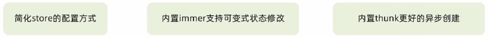
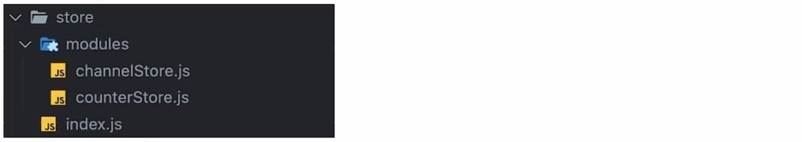

# 开发环境

创建react项目：

```bash
npx create-react-app react-demo
```

# JSX

**循环渲染**

```jsx
const list = ['Vue', 'React', 'Angular']
function App() {
	return (
    <div>
      <ul>
        { list.map(item => <li key={item}>{ item }</li>) }
      </ul>
    </div>
  )
}
```

**条件渲染**

```jsx
const isLogin = true
const type = 1
function getArticleContent() {
  if (type === 0) {
    return <div>无图文案</div>
  } else if (type === 1) {
		return <div>单图文案</div>
  } else {
    return <div>三图文案</div>
  }
}
function App() {
	return (
    <div>
    	{ /* 1.逻辑与 */ }
      { isLogin && <span>this is span</span>}
      { /* 2.三元 */ }
      { isLogin ? <span>tom</span> : <span>loading...</span>}
      { /* 3.复杂情况：函数+if */ }
      { getArticleContent() }
    </div>
  )
}
```

**事件绑定**

语法：`on + 事件名称 = { 事件处理函数 }`，命名小驼峰。

```jsx
function App() {
  // 1.基础情况
  const handleClick = () => {
    console.log('点击了')
  }
  // 2.事件对象
  const handleClick = (e) => {
    console.log('点击了', e)
  }
  // 3.自定义传参
  const handleClick = (name) => {
    console.log('点击了', name)
  }
  // 4.自定义传参+时间对象
  const handleClick = (name, e) => {
    console.log('点击了', name, e)
  }
	return (
    <div>
      { /* 1 2 */ }
    	<button onClick={handleClick}></button>
      { /* 3 */ }
      <button onClick={() => handleClick('tom')}></button>
      { /* 4 */ }
      <button onClick={(e) => handleClick('tom', e)}></button>
    </div>
  )
}
```

# 函数组件

**函数组件**

react组件就是一个首字母大写的函数。

```jsx
// 1.定义组件
// 普通函数
function Button() {
  // 组件逻辑...
  
  // 组件结构
  return <button>click me!</button>
}
// 箭头函数
const Button = () => {
  // 组件逻辑...
  
  // 组件结构
  return <button>click me!</button>
}

// 2.使用组件
function App() {
	return (
    <div>
    	{ /* 单标签 */ }
      <Button/>
      { /* 双标签 */ }
      <Button></Button>
    </div>
  )
}
```

**组件状态**

useState是一个React Hook函数，它允许向组件添加一个状态变量，从而控制组件渲染结果（数据响应式）。

```jsx
import { useState } from 'react'

function App() {
  // count：状态变量
  // setCount：修改状态变量的方法
  const [ count, setCount ] = useState(0)
  const handleClick = () => {
    setCount(count + 1)
  }
	return (
    <div>
      <button onClick={ handleClick }>+1</button>
      <p>{ count }</p>
    </div>
  )
}
```

状态不可变：

react中状态是只读的，不能直接修改状态，而要替换。直接修改状态不能引发视图更新。

```jsx
// 错误写法
count++
// 正确写法
setCount(count + 1)
```

修改对象状态：

不能直接修改对象的属性，要始终使用set方法并传入全新的对象。

```jsx
import { useState } from 'react'

function App() {
  // count：状态变量
  // setCount：修改状态变量的方法
  const [ form, setForm ] = useState({
    name: 'tom'
  })
  const handleClick = () => {
    // 错误
    form.name = 'jack'
    // 正确
    setForm({
      ...form,
      name: 'jack'
    })
  }
	return (
    <div>
      <button onClick={ handleClick }>change name</button>
      <p>{ form }</p>
    </div>
  )
}
```

**样式控制**

```css
.foo {
  color: blue;
}
```

```jsx
function App() {
	return (
    <div>
      {/* 行内样式 */}
      <span style={ {color: 'red', fontSize: '50px'} }>this is span</span>
      {/* class类名 */}
      <span className="foo">this is span</span>
    </div>
  )
}
```

**双向绑定**

```jsx
import { useState } from 'react'
function App() {
  const [value, setValue] = useState('')
	return (
    <div>
      <input 
        value={value} 
        onChange={(e) => setValue(e.target.value)} 
        type="text"/>
    </div>
  )
}
```

**获取dom**

```jsx
import { useRef } from 'react'
function App() {
  // 1.使用useRef创建ref对象，并于jsx绑定
	const inputRef = useRef(null)
  const getDom = () => {
    // 2.在dom可用时，通过ref对象的current获取dom
    console.log(inputRef.current)
  }
	return (
    <div>
      <input ref={inputRef} type="text"/>
      <button onClick={getDom}></button>
    </div>
  )
}
```

**组件通信**

父传子：

```jsx
// 父传子
// 1.父组件传递数据：子组件标签上绑定自定义属性
// 2.子组件接收数据：props参数
function Son(props) {
  return <div>this is son，{props.name}</div>
}
function App() {
	const name = 'this is app name'
  return {
    <div>
      <Son name={name} />
    </div>
  }
}
```

props说明：

* props可以传递任意数据：数字、字符串、数组、对象、函数、JSX

* props是只读对象，子组件只能读取props中的数据，不能直接修改，父组件的数据只能由父组件修改

props children：

```jsx
function Son(props) {
  // props.children用于接收组件内嵌套的jsx
  return <div>this is son，{props.children}</div>
}
function App() {
  return {
    <div>
      <Son>
        <div>this is span</div>
      </Son>
    </div>
  }
}
```

子传父：

```jsx
// 子传父
// 1.父组件传递函数
// 2.子组件接收函数，并调用传参
function Son({ onGetSonMsg }) {
  const sonMsg = 'this is son msg'
  return (
    <div>
  		this is Son
      <button onClick={() => onGetSonMsg(sonMsg)}></button>
  	</div>
  )
}
function App() {
	const getMsg = (msg) => {
    console.log(msg)
  }
  return {
    <div>
      <Son onGetSonMsg={getMsg} />
    </div>
  }
}
```

使用状态提升实现兄弟组件通信：找到相同的父组件，完成子传父和父传子。

使用Context机制实现跨层级组件通信：

```jsx
// 组件关系：App -> A -> B
// 跨层级组件通信
// 1.使用createContext方法创建一个上下文对象
// 2.在顶层组件，通过Provider组件提供数据
// 3.在底层组件，通过useContext钩子函数使用数据
import { createContext, useContext } from 'react'
const MsgContext = createContext()
function A() {
  return (
    <div>
    	this is A
      <B />
    </div>
  )	
}
function B() {
  const msg = useContext(MsgContext)
  
  return (
    <div>
    	this is B，{ msg }
    </div>
  )	
}
function App() {
  const msg = 'this is app msg'
  return (
    <div>
      <MsgContext.Provider value={msg}>
        this is App
        <A />
      </MsgContext.Provider>
    </div>
  )	
}
```

**useEffect**

useEffect是一个React Hook函数。

在 React 中，副作用指的是可能影响组件外部状态（更改dom）或依赖于外部系统状态（获取异步数据）的操作。当这些副作用操作不是由事件引起而是由渲染本身引起的，就需要使用useEffect在正确的生命周期阶段执行这些操作，并确保它们不会导致不一致的状态或不必要的重渲染。通过这种方式，你可以保持组件的纯净和可预测，同时仍然能够执行必要的**副作用操作**。

组件初始化时，获取异步数据并渲染示例：

```jsx
import {useEffect, useState} from 'react'
const URL = 'http://geek.itheima.net/v1_0/channels'
function App() {
  const [list, setList] = useState([])
  useEffect(() => {
    async function getList() {
      const res = await fetch(URL)
      const jsonRes = await res.json()
      console.log(jsonRes)
      setList(jsonRes.data.channels)
    }
    getList()
  }, [])
  
  return (
  	<div>
    	this is app
      <ul>
        {list.map(item => <li key={item.id}>{item.name}</li>)}
      </ul>
    </div>
  )
}
```

useEffect第一个参数是副作用函数，在函数中可以完成要执行的副作用操作。第二个参数是一个数组，数组中放置依赖项，依赖项会影响副作用函数的执行时机。

* 没有依赖项：组件初始渲染 + 组件更新时执行
* 空数组依赖项：只在初始渲染时执行一次
* 添加特定依赖项：组件初始渲染 + 特定依赖项变化时执行

清除副作用：将添加的副作用操作清除掉。组件卸载时，自动执行。

组件卸载时，清除定时器示例：

```jsx
function Son() {
  useEffect(() => {
    // 副作用操作
    const timer = setInterval(() => {
      console.log('定时器开启了')
    }, 1000)
    
    return () => {
      // 清除副作用
      clearInterval(timer)
    }
  }, [])
  
  return <div>this is son</div>
}
```

**自定义Hook**

自定义Hook是以use开头的函数，通过自定义Hook函数可以用来实现逻辑的封装和复用。

封装自定义Hook通用思路：

* 声明一个以use开头的函数
* 在函数中封装需要复用的逻辑
* 将组件中用到的状态或函数return出去（以对象或数组的形式）
* 在组件中执行该函数，结构出来要用到的状态或函数进行使用

**ReactHooks使用规则**

* 只能在组件中或其他自定义Hook中使用
* 只能在组件的顶层使用，不能在if、for、其他函数中使用

**useReducer**

作用：和useState类似，用来管理相对复杂的状态数据

**useMemo**

作用：在组件每次重新渲染时缓存计算结果。类似于计算属性

**useCallback**

作用：在组件多次重新渲染时缓存函数，跟useMemo类似，只不过缓存的是函数。

**React.memo**

作用：允许组件在Props没有改变的情况下跳过渲染。

react组件默认的渲染机制：只要父组件重新渲染子组件就会重新渲染。

**forwardRef**

作用：通过ref获取子组件内部的dom元素

**useInperativeHandle**

作用：通过ref暴露子组件中的方法

# 类组件

**类组件**

```jsx
import { Component } from 'react'

class Counter extends Component {
	// 通过属性state定义状态数据
  state = {
    count: 0
  }
  // 方法
  handleClick = () => {
    // 通过setState方法来修改数据
    this.setState({
      count: this.state.count + 1
    })
  }
  
  // 通过render函数来写UI模版（JSX）
  render() {
    return <button onClick={this.handleClick}>{this.state.count}</button>
  }
}
```

**类组件生命周期**

1. **挂载阶段（Mounting）**：组件实例第一次被创建并插入到DOM中。
   - `constructor()`：组件的构造函数，在创建组件实例时调用。
   - `componentWillMount()`（已不再推荐使用）：在组件即将被挂载到DOM之前调用。
   - `render()`：渲染组件的UI。
   - `componentDidMount()`：在组件被挂载到DOM后调用。
2. **更新阶段（Updating）**：组件的props或state发生变化时，会引发更新。
   - `componentWillReceiveProps()`（已不再推荐使用）：在组件将要接收新的props时调用。
   - `shouldComponentUpdate()`：确定组件是否应该重新渲染。
   - `componentWillUpdate()`（已不再推荐使用）：在组件即将更新之前调用。
   - `render()`：重新渲染组件的UI。
   - `componentDidUpdate()`：在组件已经更新后调用。
3. **卸载阶段（Unmounting）**：组件从DOM中移除。
   - `componentWillUnmount()`：在组件即将被卸载和销毁之前调用。

**类组件中的组件通信**

跟函数组件类似。区别是类组件中要使用this.props

# Redux

Redux是React最常用的集中状态管理工具，类似于Vue中的Pinia（Vuex），可以独立于框架运行。

**Redux使用步骤**

1. 定义reducer函数（定义状态和修改方式，返回新的状态）
2. 使用createStore方法传入reducer函数，生成一个store实例对象
3. 使用store实例的subscribe方法订阅数据的变化（数据一旦变化。可以得到通知）
4. 使用store实例的dispatch方法提交action更新状态
5. 使用store实例的getState方法获取最新的状态数据更新到视图中

```html
<script>
// 1.定义reducer函数（定义状态和修改方式，返回新的状态）
// state：管理数据初始状态
// action：是一个对象，根据更改时传入的对象标记确定要做什么样的修改
function reducer(state = {count: 0}, action) {
  // 数据不可变：基于原始状态生成一个新的状态
  if (action.type === 'INCREMENT') {
		return { count: state.count + 1 }
  }
  if (action.type === 'DECREMENT') {
		return { count: state.count - 1 }
  }
  return state
}
// 2.使用createStore方法传入reducer函数，生成一个store实例对象
const store = Redux.createStore(reducer)
// 3.使用store实例的subscribe订阅数据变化（数据一旦变化。可以得到通知）
// 回调函数可以在每次state发生变化时自动执行
store.subscribe(() => {
  console.log('state变化了')
  // 5.使用store实例的getState方法获取最新的状态数据更新到视图中
  document.getElementById('count').innerText = store.getState().count
})
// 4.使用store实例的dispatch方法提交action更新状态
const inBtn = document.getElementById('increment')
inBtn.addEventListener('click', () => {
  // 增
  store.dispatch({
    type: 'INCREMENT'
  })
})
const inBtn = document.getElementById('decrement')
deBtn.addEventListener('click', () => {
  // 减
  store.dispatch({
    type: 'DECREMENT'
  })
})
</script>
```

**环境准备**

1. 使用CRA快速创建React项目：`npx create-react-app redux-demo`

2. 安装配套包：`npm i @reduxjs/toolkit react-redux`

   * Redux Toolkit（RTK）：官方推荐便携Redux逻辑的方式，是一套工具的集合，用于简化Redux的书写方式。

     

   * react-redux：用来连接Redux和React组件的中间件

     

3. 启动项目：`npm run start`

**store目录结构**



1. 创建store文件夹
2. 在store文件夹中创建modules目录，用于存放多个子模块
3. store中创建jindex.js用于组合modules中所有的子模块并导出store

**使用React Tookit创建counterStore**

`store/modules/counterStore.js`

```js
import { createSlice } from '@reduxjs/toolkit'

const counterStore = createSlice({
  name: 'counter',
  // 初始化state
  initialState: {
    count: 0
  },
  // 修改数据的同步方法，支持直接修改
  reducers: {
    increment(state) {
      state.count++
    },
    decrement(state) {
      state.count--
    }
  }
})

// 解构action对象的函数（actionCreater）
const {increment, decrement} = counterStore.actions
// 获取reducer函数
const counterReducer = counterStore.reducer
// 导出action对象的函数和reducer函数
export {increment, decrement}
export default counterReducer
```

`store/index.js`

```js
import { configureStore } from '@reduxjs/toolkit'
import counterReducer from './modules/counterStore'

// 创建根store，组合子模块
const store = configureStore({
  reducer: {
    counter: counterReducer
  }
})

export default store
```

**为React注入store**

react-redux负责把Redux和React连接起来，内置Provider组件，通过store参数把创建好的store实例注入到应用中，连接正式建立。

`src/index.js`

```jsx
import { ReactDOM } from 'react-dom/client'
import store from './store'
import {Provider} from 'react-redux'
const root = ReactDOM.createRoot(document.getElementById('root'))
root.render(
  <Provider store={store}>
  	<App />
  </Provider>
)
```

**React组件中使用store中的数据**

在React组件中使用store中的数据，需要用到一个钩子函数useSelector，作用是把store中的数据映射到组件中。

`App.js`

```jsx
import {useSelector} from 'react-redux'

function App() {
  // counter是组合子模块时reducer中的名字
  const { count } = useSelector(state => state.counter)
  return (
    <div>
    	{ count }
    </div>
  )
}
```

**React组件中修改store中的数据**

组件中修改store中的数据需要使用一个hook函数useDispatch，作用是生成提交action对象的dispatch方法。

`App.js`

```jsx
import {useSelector, useDispatch} from 'react-redux'
// 导入action对象的方法
import { increment, decrement } from './store/modules/counterStore'
function App() {
  // counter是组合子模块时reducer中的名字
  const { count } = useSelector(state => state.counter)
  // 得到dispatch函数
  const dispatch = useDispatch()
  return (
    <div>
      {/* 调用dispatch提交action对象 */}
      <button onClick={() => dispatch(decrement())}>-</button>
      <span>{ count }</span>
      <button onClick={() => dispatch(increment())}>+</button>
    </div>
  )
}
```

**提交action传参**

在reducers的同步修改方法中添加action对象参数，在调用actionCreater的时候传递参数，参数会被传递到action对象payload属性上。传递多个参数需要包在对象或数组中。

`store/modules/counterStore.js`

```js
import { createSlice } from '@reduxjs/toolkit'

const counterStore = createSlice({
  name: 'counter',
  // 初始化state
  initialState: {
    count: 0
  },
  // 修改数据的同步方法，支持直接修改
  reducers: {
    increment(state) {
      state.count++
    },
    decrement(state) {
      state.count--
    },
    addNum(state, action) {
      // 在reducers的同步修改方法中添加action对象参数，参数会被传递到action对象payload属性上
      state.count = action.payload
    }
  }
})

// 解构action对象的函数（actionCreater）
const {increment, decrement} = counterStore.actions
// 获取reducer函数
const counterReducer = counterStore.reducer
// 导出action对象的函数和reducer函数
export {increment, decrement}
export default counterReducer
```

`App.js`

```jsx
import {useSelector, useDispatch} from 'react-redux'
// 导入action对象的方法
import { increment, decrement } from './store/modules/counterStore'
function App() {
  // counter是组合子模块时reducer中的名字
  const { count } = useSelector(state => state.counter)
  // 得到dispatch函数
  const dispatch = useDispatch()
  return (
    <div>
      {/* 调用dispatch提交action对象 */}
      <button onClick={() => dispatch(decrement())}>-</button>
      <span>{ count }</span>
      <button onClick={() => dispatch(increment())}>+</button>
      {/*在调用actionCreater的时候传递参数*/}
      <button onClick={() => dispatch(addNum(10))}>add 10</button>
      <button onClick={() => dispatch(addNum(20))}>add 20</button>
    </div>
  )
}
```

**异步操作**

跟同步操作的区别：单独封装一个函数，在函数内部return一个函数，在return的函数中做下面两件事：

1. 完成异步逻辑
2. 使用dispatch提交同步修改数据方法

`store/modules/channelStore.js`

```js
import { createSlice } from '@reduxjs/toolkit'
import axios from 'axios'
const channelStore = createSlice({
  name: 'channel',
  // 初始化state
  initialState: {
    channelList: []
  },
  // 修改数据的同步方法，支持直接修改
  reducers: {
    setChannels(state, action) {
      state.channelList = action.payload
    }
  }
})

// 异步操作
// 解构action对象的函数（actionCreater）
const {setChannels} = counterStore.actions
// 封装单独的函数
const fetchChannelList = () => {
  return async (dispatch) => {
    // 异步逻辑
    const res = await axios.get("http://geek.itheima.net/v1_0/channels")
    // 使用dispatch提交同步修改数据方法
    dispatch(setChannels(res.data.data.channels))
  }
}

// 获取reducer函数
const channelReducer = counterStore.reducer
// 导出action对象的函数和reducer函数
export {fetchChannelList}
export default channelReducer
```

`store/index.js`

```js
import { configureStore } from '@reduxjs/toolkit'
import channelReducer from './modules/channelStore'

// 创建根store，组合子模块
const store = configureStore({
  reducer: {
    channel: channelReducer
  }
})

export default store
```

`App.js`

```jsx
import {useEffect} from 'react'
import {useSelector, useDispatch} from 'react-redux'
// 导入action对象的方法
import { fetchChannelList } from './store/modules/channelStore'

function App() {
  // counter是组合子模块时reducer中的名字
  const { channelList } = useSelector(state => state.channel)
  // 得到dispatch函数
  const dispatch = useDispatch()
  // 使用useEffect触发异步请求执行
  useEffect(() => {
    dispatch(fetchChannelList())
  }, [dispatch])
  
  return (
    <div>
      <ul>
        {channelList.map(item => <li key={item.id}>{item.name}</li>)}
      </ul>
    </div>
  )
}
```

# zustand

极简的状态管理工具

**基础使用**

```jsx
// zustand
import {create} from 'zustand'
// 1.创建store
// 调用zustand的create方法，参数是一个回调函数
// - 回调函数的参数为set，它是用来修改数据的方法，必须调用它来修改数据
//   - 需要用到老数据：set的参数为函数，函数接收state，并返回一个对象
//   - 不需要用到老数据：set的参数为对象
// - 回调函数必须返回一个对象，对象内部编写状态数据和方法
const useStore = create((set) => {
  return {
    count: 0,
    inc: () => {
      // set的参数为函数
			set((state) => ({ count: state.count + 1 }))
      // set的参数为对象
      set({ count: 100 })
    }
  }
})

// 2.绑定store到组件
function App() {
  const { count, inc } = useStore()
  return (
  	<>
   		<button onClick={inc}>{ count }</button>
    </>
  )
}

export default App
```

# ReactRouter

**安装react-router-dom**

`npm i react-router-dom`

**基本使用**

1. 准备页面

`src/page/Login/index.js`

```jsx
const Login = () => {
  return <div>我是登录页</div>
}
export default Login
```

`src/page/Article/index.js`

```jsx
const Article = () => {
  return <div>我是文章页</div>
}
export default Article
```

2. 准备路由

`src/router/index.js`

```js
// 导入页面组件
import Login from '../page/Login'
import Article from '../page/Article'

// 导入创建路由方法
import { createBrowserRouter } from 'react-router-dom'

// 创建路由
const router = createBrowserRouter([
  {
    path: '/login',
    element: <Login />
  },
  {
    path: '/article',
    element: <Article />
  }
])

export default router
```

3. 在根组件App.js中渲染RouterProvider组件并注入router示例

`src/App.js`

```jsx
import { RouterProvider } from 'react-router-dom'
import router from './router'

function App() {
  return (
    <RouterProvider router={router} />
  )
}
```

**声明式导航**

```jsx
import { Link } from 'react-router-dom'

(<Link to="/地址"></Link>)
```

**编程式导航**

通过useNavigate钩子得到导航方法，然后使用导航方法进行路由跳转。

```jsx
import {useNavigate} from 'react-router-dom'
const Login = () => {
  const navigate = useNavigate()
  return (
    <div>
      我是登录页
      <button onClick={() => navigate('/article')}>跳转到文章页</button>
    </div>
  )
}
export default Login
```

**导航传参**

1. searchParams传参

   ```js
   // 传递参数
   navigate('/article?id=1001&name=jack')
   
   // 接收参数
   import {useSearchParams} from 'react-router-dom'
   const [params] = useSearchParams()
   const id = params.get('id')
   const name = params.get('name')
   ```

2. Params传参

   ```js
   // 传递参数
   navigate('/article/1001')
   
   // 接收参数
   // 需要修改路由规则
   // {
   //    path: '/article/:id',
   //    element: <Article />
   //  }
   import {useParams} from 'react-router-dom'
   const params = useParams()
   const id = params.id
   ```

**路由信息**

通过useLocation useSearchParams等钩子函数获取


**嵌套路由**

1. 使用children配置路由规则嵌套关系
2. 使用`<Outlet>`组件配置二级路由出口

**默认二级路由**

在默认就想渲染的二级路由规则中配置`index: true`

**路由模式**

* hash模式
  * createRouter使用createBrowserRouter函数创建
  * 原理：history对象+pushState事件
* history模式：
  * createRouter使用createHashRouter函数创建
  * 原理：监听hashChange事件

**路由懒加载**

```js
import { lazy, Suspense } from 'react'
import Home from '@/pages/Home'
import Article from '@/pages/Article'
import Publish from '@/pages/Publish'

// 1.使用lazy函数对组件进行动态导入
const Home = lazy(() => import('@/pages/Home'))
const Article = lazy(() => import('@/pages/Article'))
const Publish = lazy(() => import('@/pages/Publish'))

// 2.路由规则配置中使用Suspense组件包裹页面组件
{
  path: 'article',
  element: <Suspense fallback={'加载中'}><Article/></Suspense>
}
```


# 项目配置

**别名路径配置**

* 路由解析配置（webpack），把`@/`解析为`src/`

  * 安装craco `npm i @craco/craco -D`

  * 项目根目录下创建配置文件 craco.config.js

  * 配置文件中添加路径解析配置

    ```js
    const path = require('path')
    module.exports = {
      webpack: {
        alias: {
    			'@': path.resolve(__dirname, 'src')
        }
      }
    }
    ```

  * 包文件中配置启动和打包命令

    ```json
    "scripts": {
    	"start": "craco start",
      "build": "craco build"
    }
    ```

* 路径联想配置（vscode），vscode输入`@/`时，自动联想出来对应的`src/`下的子目录

  * 根目录下新建jsconfig.json配置文件

    ```json
    {
      "compilerOptions": {
        "baseUrl": "./",
        "paths": {
          "@/*": [
            "src/*"
          ]
        }
      }
    }
    ```

**数据mock**

json-server

# React+TS

**环境搭建**

```bash
npm create vite@latest my-react-app -- --template react-ts
```

**useState与ts**

初始值为基础类型可以直接推断，不用显示定义类型。

useState本身是一个泛型函数，可以传入具体的类型。

1. 限制useState函数的初始值必须满足类型为：User | () => User
2. 限制setUser函数的参数必须满足类型：User | () => User | undefined

```tsx
type User = {
  name: string
  age: number
}
const [user, setUser] = useState<User>()
```

初始值为null：

当不知道状态初始值是什么，将初始值设置为null是常见的做法，此时可以通过具体类型联合null来做显示注解。

1. 限制useState函数的初始值必须满足类型为：User | null
2. 限制setUser函数的参数必须满足类型：User | null

```tsx
type User = {
  name: string
  age: number
}
const [user, setUser] = useState<User | null>(null)
```

**props与ts**

为组件prop添加类型，本质就是给函数的参数添加类型注解，可以使用type或interface来做。 

```tsx
type Props = {
	className: string
}
function Button(props: Props) {
	const { className } = props
  return <button className={className}>click me</button>
}
```

**子元素**

为props.children添加类型。

第一种是使用 `React.ReactNode` 类型，这是可以在 JSX 中作为子元素传递的所有可能类型的并集

```tsx
interface ModalRendererProps {
  title: string;
  children: React.ReactNode;
}
```

第二种方法是使用 `React.ReactElement` 类型，它只包括 JSX 元素，而不包括 JavaScript 原始类型，如 string 或 number

```tsx
interface ModalRendererProps {
  title: string;
  children: React.ReactElement;
}
```

**hooks与ts**

**DOM事件与ts**

**样式属性与ts**

