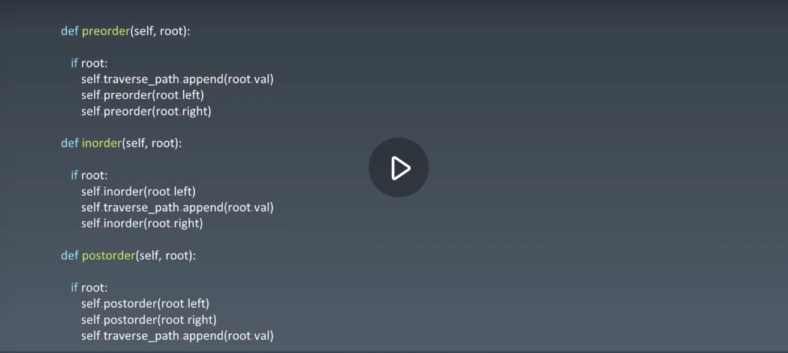

##### 算法学习方法

算法存在客观的复杂度。

反复的思考、练习。

算法只是基础，不要抗拒记忆。

学习最终就是大脑建立稳定的神经回路。

时间间隔分开的过遍数。

过程痛苦是正在成长。

学习高手代码（leetcode）。

##### 学习方法（‘Outliers’一万小时训练法）

1. 切碎知识点（分清知识体系脉络，形成知识网）
2. 刻意练习，基础动作分解训练，反复练习（基本功），练习弱项
3. 反馈（看好代码，别人给你指点，实战）

##### 切题步骤

1. 正确理解题目的需求
2. 想所有可能的解法，分析不同解法的时空复杂度，找出最优的一种解法
3. 写代码
4. 例举测试样例，测试程序正确性。

##### 无毒神掌

1. 5-10 分钟读题 + 思考

   没思路直接看解法，多解法，比较解法优劣。

   背诵、默写好的解法（因为只要先把它记住了之后，100% 都可以理解的，只是要反复很多遍之后）。

2. 马上自己写 --> leetcode 提交，有 bug 就反复 debug，修改，直到通过。多个解法都写一遍。关注时空复杂度。看力扣好的题解。再看力扣国际站。

3. 过一天后做一遍前一天做过的题目。对不太熟悉的解法，做专项训练。

4. 过了一周，回来练习相同题目。对不太熟悉的解法，做专项训练。

5. 面试前一周再把之前的题目做一遍。

##### 最终达到的效果

* 常见的高频题马上就知道它常见的一些办法和每个办法的时间空间复杂度
* 它最简洁的代码实现形式在脑子里马上知道。

##### 指法和小操作

* fn + delete 删除光标右边
* command +left/right 光标切换到行头/行尾
* option + left/right/delete 光标按单词切分
* shift + command + left/right 选中整行
* ide 使用技巧，top tips

##### 自顶向下的编程方式

关键的主干大层次的逻辑代码写在上面，其他的私有函数和细节的逻辑函数写在下面。先森林在枝干再叶子。先不考虑细节怎么实现，把主干逻辑写出来。

##### 时间复杂度

前面的常数系数是不用考虑的。时间复杂度就是根据 n 的不同情况会运行多少次

* O(1)：常数复杂度
* O(log n)：对数复杂度
* O(n)：线性时间复杂度
* O(n^2)：平方
* O(n^3)：立方
* O(2^n)：指数
* O(n!)：阶乘

递归可以画出它的状态树来看它的时间复杂度。

主定理：计算所有递归的时间复杂度

* 排好序的一维数组进行二分查找：O(log n)
* 二叉树遍历：O(n)
* 排好序的二维矩阵中进行二分查找：O(n)
* 归并排序：O(nlog n)，所有排序最优的就是在这个时间复杂度

##### 空间复杂度

* 程序里开了数组，那数组的长度就是你的空间复杂度
* 如果有递归，那递归的深度就是你的空间复杂度。

##### 数据结构

* 一维数据结构
  * 基础
    * 数组
    * 链表
  * 高级
    * 栈
    * 队列
    * 双端队列
    * 集合 set (hash)
    * 映射 map object (hash)
* 二维数据结构：都是从一维数据结构泛化而来的
  * 基础
    * 树
    * 图
  * 高级：在树的基础上加了约束条件
    * 二叉搜索树（红黑树，AVL）
    * 堆
    * 并查集
    * 字典树
* 特殊数据结构：运用于工程中特定的情景
  * 位运算
  * 布隆过滤器
  * LRU 缓存

##### 算法

前三点是所有算法和数据结构的基石。任何高级的算法和数据结构到最后都会转换成这三点。高级复杂算法的根本就是找到它的重复单元，基于这个重复单元就可以泛化成高级的数据结构。

* if else, switch   --->  branch
* for while loop  --->  Iteration
* 递归 recursion（函数自己调用自己）
* 搜索
  * 深度优先搜索 DFS
  * 广度优先搜索 BFS
  * 启发式搜索 A*
* 动态规划
* 二分查找：对有序的数组很快的找到你要的节点
* 贪心算法
* 排序算法
* 数学和几何上的操作。

##### 解题思路

1.暴力

2.基本情况

3.泛化：

用递推，数学归纳法找重复性。用计算机的思维去思考怎么解决问题，不要人肉递归，不要用人脑的思维去想。

找重复性。在列举基本情况的基础上，找 最近 重复子问题。因为程序除了简单的情况使用 if else，其他就是用 for while 和递归 不断的重复。因为计算机不是人脑，它能想到的只有这些简单的解决方式，它就是简单的重复式的机器，你就把它想成一个不断重复在那里干事情的东西就好了，所有复杂问题最终都要变成这几个语句来给计算机去处理。所以我们就往这个方向去做和思考。要让计算机用重复的东西解决你的问题，如果能用重复的东西解决的问题，说明这个问题本身就是可重复的，所以就是找它的重复性。重复的时候可以分出很多 if else 分支，就会让递归的程序越来越复杂，复杂性就慢慢出来了。

比较复杂的算法最后都会归结到找最近的重复性。因为你只能写 if else, for loop, 递归这几个简单的语言。要么就是客观就这么复杂要写很长的程序，要不然就是程序很短的话，那肯定是有重复性，然后用一个递归或者一个 for loop 就可以解决了。

4.思考先想简单的办法，再想高大上的办法。

5.寻找边界条件遵循的原则：互斥且全量。

##### 数组、链表、跳表的基本实现和特性

* 数组

  底层硬件实现有一个叫内存管理器的东西，每当申请数组的话，计算机实际上是在内存中开辟了一段连续的地址，每一个地址可以直接通过内存管理器访问，访问的时间复杂度是 O(1) 的。插入是 O(n)，每当插入一个元素，它后面的元素都要向后挪一个位置，这个过程会涉及到很多元素的复制操作，把要插入的位置让出来，然后把元素插入。删除也是 O(n)，把要删除的元素清除掉，然后把后面的元素都向前移动，再把最后一个元素设置为空。

  * prepend O(1)
  * append O(1)
  * lookup O(1)
  * insert O(n)
  * delete O(n)

* 链表

  元素定义好之后，有 value 和 next，next 指向下一个元素，串在一起就变成了一个类似于数组的结构，每个元素一般用 class 来定义，叫 node。

  如果只有一个 next 指针的话叫单链表，有一个向前的指针有一个向后的指针就是双向链表，头指针一般用 head 来表示，尾指针用 tail 来表示，最后一个元素的 next 指向空，tail 的 next 指回到 head 就叫循环链表。

  链表可以弥补数组的缺点，在一些修改，添加，删除操作比较频繁的情况下，数组并不好用。

  插入删除元素都是 O(1)，增加和删除任何节点都没有引起整个链表的群移操作，也不需要复制元素，挪动多个元素到新的位置。访问元素必须从头节点开始一步一步往后找，是 O(n) 的。这也是它的问题所在

  * prepend O(1)
  * append O(1)
  * lookup O(n)
  * insert O(1)
  * delete O(1)

  从数组和链表可以看到，并没有完美的一种数据结构，如果有的话就不再需要 array 或 linked list 这两个数据结构并存了，就直接用那个牛逼的数据结构就可以了。所以各种数据结构各有优劣，看你使用的场景是什么地方。

* 跳表

  利用升维思想。

  只能用于链表元素有序的情况下。

  跳表对标的是平衡二叉树和二分查找，是一种插入，删除，搜索都是 O(log n) 的数据结构。空间复杂度 O(n)。

  它的优势是原理简单，容易实现，方便扩展，效率更高。因此在一些热门项目里用来替代平衡树，如 Redis，LevelDB 等。

##### 数组实战题目

1.[283. 移动零](https://leetcode-cn.com/problems/move-zeroes/)（7次）2021.06.07（8次）2021.06.15（9次）2021.07.05

```js
/*
* 思路：1.loop O(n^2)，遇零删除，在数组最后添加 0
*      2.开新内存 O(n)，非零的放前面 i，零放后面 j
*      3.双指针index操作 O(n)，一维数组两个下标换来换去。维护 i j 两个指针来做各种事情。
*			   双指针交换：一个循环指针，一个始终记录下一个想要的节点要放的位置的指针。这样就可以在不增加新内存的情况下，通过 index 方          *			   式，把所有想要的节点放在应该的位置。
*/
// 1
function moveZeroes(nums) {
  let count = 0;
  for (let i = 0; i < nums.length; i++) {
    if (nums[i] === 0) {
      nums.splice(i, 1);
      i--;
      count++;
    }
  }
  for (i = 0; i < count; i++) {
    nums.push(0);
  }
  return nums;
};
// 2
function moveZeroes(nums) {
  let res1 = [];
  let res2 = [];
  nums.forEach(item => {
    if (item === 0) {
      res1.push(item);
    } else {
      res2.push(item);
    }
  });
  return res2.concat(res1);
};
// 3
function moveZeroes(nums) {
  // j记录的是下一个要填入的非零元素的位置。
  let j = 0;
  for (let i = 0; i < nums.length; i++) {
    if (nums[i] !== 0) {
    	nums[j] = nums[i];
      if (i !== j) {
				nums[i] = 0;
      }
      j++;
    }
  }
  return nums;
};
function moveZeroes(nums) {
  let j = 0;
  for (let i = 0; i < nums.length; i++) {
    if (nums[i] !== 0) {
      let c = nums[j];
      nums[j] = nums[i];
      if (c === 0) {
        nums[i] = 0;
      }
      j++;
    }
  }
  return nums;
};
function moveZeroes(nums) {
  let j = 0;
  for (let i = 0; i < nums.length; i++) {
    if (nums[i] !== 0) {
      let c = nums[j];
      nums[j] = nums[i];
      nums[i] = c;
      j++;
    }
  }
  return nums;
};
```

2.[11. 盛最多水的容器](https://leetcode-cn.com/problems/container-with-most-water/)（7次）2021.06.07（8次）2021.06.15（9次）2021.07.12

```js
/*
*	思路：1.枚举，双循环 O(n^2)：左柱子x，右柱子y，(x-y)*height。
*      2.左右夹逼 O(n)：左右边界 i j 向中间收敛，最后在中间汇合，只有一层循环 
*/
// 1
function maxArea(height) {
  let max = 0;
  for (let i = 0; i < height.length - 1; i++) {
    for (let j = i + 1; j < height.length; j++) {
      let minHeight = Math.min(height[i], height[j]);
      let area = minHeight * (j - i);
      max = Math.max(max, area);
    }
  }
  return max;
}
// 2
function maxArea(height) {
  let max = 0;
  for (let i = 0, j = height.length - 1; i < j; ) {
    // 谁高度小谁往里面挪，来找那个更高的棒子。
    let minHeight = height[i] < height[j] ? height[i++] : height[j--];
    let area = minHeight * (j - i + 1);
    max = Math.max(max, area);
  }
  return max;
}
```

3.[70. 爬楼梯](https://leetcode-cn.com/problems/climbing-stairs/)（7次）2021.06.08（8次）2021.06.16（9次）2021.07.12

```js
/* f(n) = f(n - 1) + f(n - 2) 斐波那契数列
* 思路：1.暴力递归 O(2^n)
*      2.记忆化递归 O(n)
*      3.动态规划 O(n)：保证计算到 n 就行了。
*/
// 1
function climbStairs(n) {
  if (n <= 2) return n;
  return climbStairs(n - 1) + climbStairs(n - 2);
}
// 2
function climbStairs(n) {
  let map = new Map();
  function recursion(n) {
    if (n <= 2) return n;
    if (map.has(n)) return map.get(n);
    let value = recursion(n - 1) + recursion(n - 2);
    map.set(n, value);
    return value; 
  }
  return recursion(n);
}
// 3
function climbStairs(n) {
  if (n <= 2) return n;
	let arr = [];
  arr[1] = 1;
  arr[2] = 2;
  for (let i = 3; i <= n; i++) {
    arr[i] = arr[i - 1] + arr[i - 2];
  }
  return arr[n];
}
function climbStairs(n) {
  if (n <= 2) return n;
  let a = 1, b = 2, r = 0;
  for (let i = 0; i < n - 2; i++) {
		r = a + b;
    a = b;
    b = r;
  }
  return r;
}
```

4.[1. 两数之和](https://leetcode-cn.com/problems/two-sum/)（7次）2021.06.10（8次）2021.06.18（9次）2021.07.12

```js
/*
* 思路：1.暴力枚举 O(n^2)：两层循环
*      2.哈希表 O(n)：枚举 a，看 target-a 是否也在数组里面。
*/
// 1
function twoSum(nums, target) {
  for (let i = 0; i < nums.length - 1; i++) {
    for (let j = i + 1; j < nums.length; j++) {
      if (nums[i] + nums[j] === target) {
        return [i, j];
      }
    }
  }
  return [];
}
// 2 
function twoSum(nums, target) {
  let mapData = new Map();
  for (let i = 0; i < nums.length; i++) {
    if (mapData.has(target - nums[i])) {
        return [mapData.get(target - nums[i]), i];
    }
    mapData.set(nums[i], i);
  }
  return [];
}
```

5.[15. 三数之和](https://leetcode-cn.com/problems/3sum/)（7次）2021.06.10（8次）2021.06.20（9次）2021.06.23

```js
/*
* 思路：1.暴力 O(n^3)：三重循环
*      2.哈希 O(n^2)：两重循环 + hash 哈希一个数，然后让剩余的数都互相碰一遍。
*.     3.夹逼 O(n^2)：排序后，双指针左右夹逼
*/
// 1
function threeSum(nums) {
  if (nums == null || nums.length <= 2) return [];
  let a = [];
  let set = new Set();
  for (let i = 0; i < nums.length - 2; i++) {
    for (let j = i + 1; j < nums.length - 1; j++) {
      for (let k = j + 1; k < nums.length; k++) {
        let sum = nums[i] + nums[j] + nums[k];
        if (sum === 0) {
          let tmp = [nums[i], nums[j], nums[k]];
          tmp.sort();
          if (!set.has(tmp.join())) {
            a.push([nums[i], nums[j], nums[k]]);
            set.add(tmp.join());
          }
        }
      }
    }
  }
  return a;
}
// 2 技巧 hash，先存 map
function threeSum(nums) {
  if (nums == null || nums.length <= 2) return [];
  let a = [];
  let mapData = new Map();
  let setData = new Set();
  for (let i = 0; i < nums.length - 2; i++) {
    mapData.set(nums[i], nums[i]);
    for (let j = i + 2; j < nums.length; j++) {
      let sum = nums[i + 1] + nums[j];
      if (mapData.has(-sum)) {
        let tmp = [mapData.get(-sum), nums[i + 1], nums[j]].sort();
        if (!setData.has(tmp.join())) {
          a.push(tmp);
          setData.add(tmp.join());
        }
      }
    }
  }
  return a;
}
// 2 技巧 hash，后存 map，天然避免当前map的数重复计算
function threeSum(nums) {
  if (nums == null || nums.length <= 2) return [];
  let a = [];
  let map = new Map();
  let set = new Set();
  for (let i = 0; i < nums.length - 1; i++) {
    for (let j = i + 1; j < nums.length; j++) {
      let sum = nums[i] + nums[j];
      if (map.has(-sum)) {
        let tmp = [nums[map.get(-sum)], nums[i], nums[j]].sort();
        if (!set.has(tmp.join())) {
          a.push(tmp);
          set.add(tmp.join());
        }
      }
    }
    map.set(nums[i], i);
  }
  return a;
}
// 2 两次循环 hash，注意不要和当前哈希表中的数重复
function threeSum(nums) {
  if (nums == null || nums.length <= 2) return [];
  let a = [];
  let mapData = new Map();
  let setData = new Set();
  for (let i = 0; i < nums.length - 2; i++) {
    mapData.set(nums[i], i);
  }
  for (let i = 0; i < nums.length - 1; i++) {
    for (let j = i + 1; j < nums.length; j++) {
      let sum = nums[i] + nums[j];
      if (mapData.has(-sum) && mapData.get(-sum) !== i  && mapData.get(-sum) !== j) {
        let tmp = [nums[mapData.get(-sum)], nums[i], nums[j]].sort();
        if (!setData.has(tmp.join())) {
          a.push(tmp);
          setData.add(tmp.join());
        }
      }
    }
  }
  return a;
}
// 3
function threeSum(nums) {
  if (nums == null || nums.length <= 2) return [];
  nums.sort((a, b) => a - b);
  let a = [];
  for (let k = 0; k < nums.length - 2; k++) {
    if (nums[k] > 0) break;
    if (k > 0 && nums[k] === nums[k - 1]) continue;
    let i = k + 1, j = nums.length - 1;
    while(i < j) {
    	let sum = nums[k] + nums[i] + nums[j];
      if (sum < 0) {
      	while(i < j && nums[i] === nums[++i]);
      } else if (sum > 0) {
      	while(i < j && nums[j] === nums[--j]);   
      } else {
        a.push([nums[k], nums[i], nums[j]]);
        while(i < j && nums[i] === nums[++i]);   
        while(i < j && nums[j] === nums[--j]);   
      }
    }
  }
  return a;
}
```

6.[26. 删除有序数组中的重复项](https://leetcode-cn.com/problems/remove-duplicates-from-sorted-array/)

7.[189. 旋转数组](https://leetcode-cn.com/problems/rotate-array/)

8.[88. 合并两个有序数组](https://leetcode-cn.com/problems/merge-sorted-array/)

9.[66. 加一](https://leetcode-cn.com/problems/plus-one/)

##### 链表实战题目

所有链表的题目的解法都非常固定，主要就是熟能生巧，没有很多算法的东西，关键就是要熟悉怎么把链表的 next 和 prev 指针换来换去。

js 声明链表数据结构（7次）2021.06.16（8次）2021.06.24（9次）2021.07.20

```js
class Node {
  constructor(val) {
    this.val = val;
    this.next = null;
  }
}
class LinkedList {
	constructor(arr) {
    let head = new Node(arr.shift());
    let next = head;
    for (let i of data) {
      next.next = new Node(i);
      next = next.next;
    }
    return head;
  }
}
```

1.[206. 反转链表](https://leetcode-cn.com/problems/reverse-linked-list/)

2.[24. 两两交换链表中的节点](https://leetcode-cn.com/problems/swap-nodes-in-pairs/)

3.[141. 环形链表](https://leetcode-cn.com/problems/linked-list-cycle/)（7次）2021.06.16（8次）2021.06.24（9次）2021.07.20

```js
/*
* 思路：1.暴力 时间O(n) 空间O(n)：遍历链表，hash/set 
*      2.快慢指针 时间O(n) 空间O(1)
*/
// 1
function hasCycle(head) {
  if (head == null || head.next == null) return false;
  let map = new Map();
  let next = head;
  while (next != null) {
    if (map.has(next)) {
      return true;
    }
    map.set(next, 1);
    next = next.next;
  }
  return false;
}
// 2
function hasCycle(head) {
  if(head == null || head.next == null) return false;
  let slow = head;
  let fast = head.next;
  while(fast != null && fast.next != null) {
  	if (fast === slow || fast.next === slow) {
    	return true;
   	}
    slow = slow.next;
    fast = fast.next.next;
 	}
  return false;
}
```

4.[142. 环形链表 II](https://leetcode-cn.com/problems/linked-list-cycle-ii/)

5.[25. K 个一组翻转链表](https://leetcode-cn.com/problems/reverse-nodes-in-k-group/)

6.[21. 合并两个有序链表](https://leetcode-cn.com/problems/merge-two-sorted-lists/)

##### 栈和队列的基本实现和特性

* 栈 stack：先入后出的容器结构。

* 队列 queue：排队，先入先出

* 双端队列 deque：实战中使用双端队列的比较多，双端队列就是 queue 和 stack 的结合体。头和尾都可以进行元素的出和入的队列。

  栈、队列、双端队列添加、删除都是 O(1)，查询为 O(n)。因为它是无序的，你要查任何一个元素的话，就必须把这个数据结构遍历一遍。

* 优先队列 priority queue：

  插入操作 O(1)，取出操作 O(log n) 按照元素的优先级取出

  底层具体实现的数据结构较为多样和复杂：例如 heap、bst、treap

##### 栈、队列实战题目

如果一个东西具有最近相关性的话就会用栈解决，外层和外层配对，内层可以和内层配对。 现实和工程中都有很多这种从外向内或从内向外逐渐扩散的特性。

先来后到、公平性、排队就用队列。

所有东西都不是发明创造的，都是对现实中已有的逻辑进行抽象，然后用计算机的语言来进行表达。

1.[20. 有效的括号](https://leetcode-cn.com/problems/valid-parentheses/)（7次）2021.06.17（8次）2021.06.25（9次）2021.07.20

```js
/*
* 思路：1.暴力 O(n^2)：不断replace匹配括号 -> ''
*      2.栈 O(n)：所有括号问题都类似，用栈解决就行了。像洋葱一样的结构。如果是左括号就压到栈里面去，如果是右括号就和栈顶元素匹配看 *				能不能匹配上，匹配上就把展顶元素移出栈，不然就是不合法，一直这么操作下去。直到整个栈为空就说明完全匹配了。
*/
// 1
function isValid(s) {
  if (s.length % 2 === 1) return false;
  let l = s.length / 2;
  for(let i = 0; i < l; i++){
    s = s.replace('()', '').replace('[]', '').replace('{}', '');
  }
  return !s.length;
}
// 2
function isValid(s) {
  if (s.length % 2 === 1) return false;
  let map = new Map([
    [')', '('],
    [']', '['],
    ['}', '{']
  ]);
  let stack = [];
  for (let i of s){
    if (map.has(i)) {
      if (!stack.length || stack.pop() !== map.get(i)) {
        return false;
      }
    } else {
      stack.push(i);
    }
  };
  return !stack.length;
}
```

2.[155. 最小栈](https://leetcode-cn.com/problems/min-stack/)（7次）2021.06.18（8次）2021.06.25

```js
/*
* 思路：1.栈：两个栈，一个维护出入关系，一个维护最小值的栈。
*        很多时候，用两个栈或两个队列会解决一些特殊性的数据结构的问题，比如只用栈来实现队列或者只用队列来实现栈。
*/
// 1 同步
class MinStack {
  constructor() {
    this.x_stack = [];
    this.min_stack = [Infinity];
  }
  push(x) {
    this.x_stack.push(x);
    this.min_stack.push(Math.min(this.min_stack[this.min_stack.length - 1], x));
  }
  pop() {
    this.x_stack.pop();
    this.min_stack.pop();
  }
  top() {
    return this.x_stack[this.x_stack.length - 1];
  }
  getMin() {
    return this.min_stack[this.min_stack.length - 1];
  }
}
// 1 不同步
class MinStack {
  constructor() {
    this.x_stack = [];
    this.min_stack = [];
  }
  push(x) {
    this.x_stack.push(x);
    if (!this.min_stack.length || x <= this.min_stack[this.min_stack.length - 1]) {
    	this.min_stack.push(x);
    }
  }
  pop() {
    if (this.x_stack.pop() === this.min_stack[this.min_stack.length - 1]) {
      this.min_stack.pop();
    }
  }
  top() {
    return this.x_stack[this.x_stack.length - 1];
  }
  getMin() {
    return this.min_stack[this.min_stack.length - 1];
  }
}
```

3.[84. 柱状图中最大的矩形](https://leetcode-cn.com/problems/largest-rectangle-in-histogram/)（7次）2021.06.30（8次）2021.07.09

```js
/*
* 思路：1.暴力 O(n^3)：
* 		 2.扩散 O(n^2)：遍历，找到当前柱子的前面和后面第一个比他小的柱子，算出它能组成的最大的面积。
*        (i和j不断的往左右两边扩散，或者i和j往中间推进最后相遇，以及i和j写两层嵌套的循环枚举所有可能的i和j的情况。像这些代码一定要*        写的滚瓜烂熟。)
*      3.栈 O(n)：维护一个递增栈，当前元素的前一个元素就是它的左边界，如果大于栈顶元素继续入栈，如果发现比他小的可以确定它的右边  
*        界了，这时就弹栈计算面积。最后清空栈，计算栈中剩余元素的面积。
*/
// 1
function largestRectangleArea(heights) {
  let max = 0;
  // 这样的两重遍历是自己和自己会相遇一次，这样会保证所有的单根面积都计算到。两两相遇是计算组合面积。因为是计算面积，所以并不是两两比较两个数相遇一次就可以的。
  for (let i = 0; i < heights.length; i++) {
    for (let j = i; j < heights.length; j++) {
      let area = (j - i + 1) * Math.min.apply(null, heights.slice(i, j + 1));
      max = Math.max(max, area);
    }
  }
  return max;
}
// 1
function largestRectangleArea(heights) {
  let max = 0;
  for (let i = 0; i < heights.length; i++) {
    let minHeight = heights[i];
    for (let j = i; j < heights.length; j++) {
      minHeight = Math.min(minHeight, heights[j]);
      let area = (j - i + 1) * minHeight;
      max = Math.max(max, area);
    }
  }
  return max;
}
// 2
function largestRectangleArea(heights) {
  let max = 0;
  for (let i = 0; i < heights.length; i++) {
    let j = i;
    let k = i;
    for (; j >= 0; j--) {
      if (heights[j] < heights[i]) break;
    }
    for (; k < heights.length; k++) {
      if (heights[k] < heights[i]) break;
    }
    let area = (k - j - 1) * heights[i];
    max = Math.max(max, area);
  }
  return max;
}
// 2
function largestRectangleArea(heights) {
  let max = 0;
  for (let i = 0; i < heights.length; i++) {
    let j = i;
    let k = i;
    while (j >= 0 && heights[j] >= heights[i]) j--;
    while (k < heights.length && heights[k] >= heights[i]) k++;
    let area = (k - j - 1) * heights[i];
    max = Math.max(max, area);
  }
  return max;
}
// 3 计算弹出来的柱子的左右边界
function largestRectangleArea(heights) {
	let max = 0;
  let stack = [-1];
  heights.push(0);
  for (let i = 0; i < heights.length; i++) {
    while (stack.length > 1 && heights[i] < heights[stack[stack.length - 1]]) {
      let index = stack.pop();
      let area = (i - stack[stack.length - 1] - 1) * heights[index];
      max = Math.max(max, area);
    }
    stack.push(i);
  }
  return max;
}
// 3 计算弹出来的柱子的左右边界
function largestRectangleArea(heights) {
	let max = 0;
  let stack = [-1];
  for (let i = 0; i < heights.length; i++) {
    while (stack.length > 1 && heights[i] < heights[stack[stack.length - 1]]) {
      let index = stack.pop();
      let area = (i - stack[stack.length - 1] - 1) * heights[index];
      max = Math.max(max, area);
    }
    stack.push(i);
  }
  for (let i = 1; i < stack.length; i++) {
    let area = heights[stack[i]] * (stack[stack.length - 1] - stack[i - 1]);
    max = Math.max(max, area);
  }
  return max;
}
// 3 两次循环分别找出每根柱子的左右边界
function largestRectangleArea(heights) {
  let max = 0;
	let left = [];
  let right = [];
  let stack = [];
  for (let i = 0; i < heights.length; i++) {
		while (stack.length && heights[i] <= heights[stack[stack.length - 1]]) {
    	stack.pop();
    }
    left[i] = !stack.length ? -1 : stack[stack.length - 1];
    stack.push(i);
  }
  stack = [];
  for (let i = heights.length - 1; i >= 0; i--) {
		while (stack.length && heights[i] <= heights[stack[stack.length - 1]]) {
    	stack.pop();
    }
    right[i] = !stack.length ? heights.length : stack[stack.length - 1];
    stack.push(i);
  }
  for (let i = 0; i < heights.length; i++) {
    let area = heights[i] * (right[i] - left[i] - 1);
    max = Math.max(max, area);
  }
  return max;
}
// 3 一次循环找出每根柱子的左右边界
function largestRectangleArea(heights) {
  let max = 0;
	let left = [];
  let right = new Array(heights.length).fill(heights.length);
  let stack = [];
  for (let i = 0; i < heights.length; i++) {
		while (stack.length && heights[i] < heights[stack[stack.length - 1]]) {
    	right[stack.pop()] = i;
    }
    left[i] = !stack.length ? -1 : stack[stack.length - 1];
    stack.push(i);
  }
  for (let i = 0; i < heights.length; i++) {
    let area = heights[i] * (right[i] - left[i] - 1);
    max = Math.max(max, area);
  }
  return max;
}
```

4.[239. 滑动窗口最大值](https://leetcode-cn.com/problems/sliding-window-maximum/)（7次）2021.06.25（8次）2021.07.03

```js
/*
* 思路：1.暴力 O(n*k)
*      2.双端单调队列 deque O(n)：单调递减队列，保持队首元素是最大值。
*.       所有滑动窗口的题目就想到用队列处理就行了。
*/
// 1
function maxSlidingWindow(nums, k) {
  let a = [];
	for (let i = 0; i < nums.length - k + 1; i++) {
    let max = nums[i];
    for (let j = i; j < i + k; j++) {
      max = Math.max(max, nums[j])
    }
    a.push(max);
  }
  return a;
}
// 2 
function maxSlidingWindow(nums, k) {
  let a = [];
  let q = [];
  for (let i = 0; i < k; i++) {
    while (q.length && nums[i] >= nums[q[q.length - 1]]) {
      q.pop();
    }
    q.push(i);
  }
  a.push(nums[q[0]]);
  for (let i = k; i < nums.length; i++) {
    while (q.length && nums[i] >= nums[q[q.length - 1]]) {
      q.pop();
    }
    q.push(i);
    while (q[0] < i - k + 1) {
      q.shift();
    }
    a.push(nums[q[0]]);
  }
  return a;
}
// 2
function maxSlidingWindow(nums, k) {
  let a = [];
  let q = [];
  for (let i = 0; i < nums.length; i++) {
    while (q.length && nums[i] >= nums[q[q.length - 1]]) {
      q.pop();
    }
    q.push(i);
    while (q[0] < i - k + 1) {
      q.shift();
    }
    if (i >= k - 1) a.push(nums[q[0]]);
  }
  return a;
}
```

5.[641. 设计循环双端队列](https://leetcode-cn.com/problems/design-circular-deque/)

6.[42. 接雨水](https://leetcode-cn.com/problems/trapping-rain-water/)

##### 哈希表、映射、集合的实现与特性

现实中用的最多的除了数组链表之外，就是 map 和 set 了。他们底层结构基本都是使用哈希表来实现的，有的会用二叉树来实现。

哈希表（hash table）： 

也叫散列表，是根据关键码值（key value）来直接访问的数据结构。

底层实现：key -> 哈希函数 -> index -> arr[index] = value

它通过把关键码值映射到表中的一个位置来访问记录，以加快查询的速度。

这个映射函数叫散列函数也叫哈希函数。存放记录的数组叫做哈希表。

查询添加删除的时间复杂度都是 O(1) 的。有一种最坏的情况就是哈希函数选的非常不好或者哈希表的整个 size 太小了，就导致经常会发生冲突，这样它就退化成一个链表了，这时时间复杂度就退化成 O(n) 了。空间复杂度是 O(n)。

在工程中，我们经常在用的就不再是哈希表了，而是在哈希表基础上抽象出来的，使用的比较多的就是 map 和 set。map 就是键值对，key 是不重复的，值可以重复。set 就是不重复的元素的集合，没有键值对，就是单个的元素。

##### 哈希表实战题目

1.[242. 有效的字母异位词](https://leetcode-cn.com/problems/valid-anagram/)（7次）2021.06.30（8次）2021.07.09

```js
/*
* 思路：1.暴力 O(nlogn)：按照字符的顺序 sort 后比较 string 是否相等
*      2.hash O(n)：统计每个字符的频次，如果每个字符出现的频次一样那就是字母异位词。
*/
// 1
function isAnagram(s, t) {
  if (s.length !== t.length) return false;
  return Array.from(s).sort().join() === Array.from(t).sort().join();
}
// 2
function isAnagram(s, t) {
  if (s.length !== t.length) return false;
  let map = new Map();
  for (let i of s) {
    let value = map.has(i) ? map.get(i) + 1 : 1;
    map.set(i, value);
  }
  for (let i of t) {
    if (map.has(i)) {
      map.set(i, map.get(i) - 1);
      if (map.get(i) < 0) return false;
    } else {
      return false;
    }
  }
  return true;
}
// 2 自制 hash
function isAnagram(s, t) {
  if (s.length !== t.length) return false;
  let table = new Array(26).fill(0);
  for (let i of s) {
    table[i.charCodeAt() - 'a'.charCodeAt()]++;
  }
  for (let i of t) {
    table[i.charCodeAt() - 'a'.charCodeAt()]--;
    if (table[i.charCodeAt() - 'a'.charCodeAt()] < 0) return false;
  }
  return true;
}
```

2.[49. 字母异位词分组](https://leetcode-cn.com/problems/group-anagrams/)（7次）2021.06.30（8次）2021.07.09

```js
/*
* 思路：1.排序 + hash O(n*klogk)：排序后当作key，hash归类。  
*      2.自制hash + hash O(n*k)：自制 hash 后的数组当作key，hash归类。
*/
// 1
function groupAnagrams(strs) {
  let map = new Map();
  for (let str of strs) {
    let key = [...str].sort().join();
    let value = map.has(key) ? map.get(key) : [];
    value.push(str);
    map.set(key, value);
  }
  return [...map.values()];
}
// 2
function groupAnagrams(strs) {
  let map = {};
  for (let str of strs) {
    let table = new Array(26).fill(0);
    for (let c of str) {
      table[c.charCodeAt() - 'a'.charCodeAt()]++;
    }
    map[table] ? map[table].push(str) : map[table] = [str];
  }
  return Object.values(map);
}
// 2
function groupAnagrams(strs) {
 	let map = new Map();
  for (let str of strs) {
    let table = new Array(26).fill(0);
    for (let c of str) {
      table[c.charCodeAt() - 'a'.charCodeAt()]++;
    }
    let value = map.has(table.join()) ? map.get(table.join()) : [];
    value.push(str);
    map.set(table.join(), value);
  }
  return Array.from(map.values());
}
```

3.[18. 四数之和](https://leetcode-cn.com/problems/4sum/)（7次）2021.07.03（8次）2021.07.12

```js
/*
* 思路：1.hash O(n^3) 
*/
// 1
function fourSum(nums, target) {
  let a = [];
  let map = new Map();
  let set = new Set();
  for (let i = 0; i < nums.length - 2; i++) {
    for (let j = i + 1; j < nums.length - 1; j++) {
      for (let k = j + 1; k < nums.length; k++) {
        let sum = nums[i] + nums[j] + nums[k];
        if (map.has(target - sum)) {
          let key = [target - sum, nums[i], nums[j], nums[k]].sort();
          if (!set.has(key.join())) {
            a.push(key);
            set.add(key.join());
          }
        }
      }
    }
    map.set(nums[i], nums[i]);
  }
  return a;
}
```

##### 树、二叉树、二叉搜索树的实现和特性

树：有一个根节点，左子树，右子树，左儿子，右儿子，父节点，兄弟节点，不同的层。从一个节点指向多个节点。

现实中用的最多的就是二叉树，儿子节点只有两个，左儿子和右儿子。

树和图最关键的差别就是有没有环，树里如果有环的话就是图。

链表就是特殊化的树。树就是特殊化的图。

js 根据一维数组声明完全二叉树数据结构（7次）2021.07.08（8次）2021.07.16

```js
class Node {
  constructor(val) {
    this.val = val;
    this.left = null;
    this.right = null;
  }
}
class Tree {
  constructor(data) {
    // 存储所有节点
    let nodeList = [];
    for (let i = 0; i < data.length; i++) {
      let node = new Node(data[i]);
      nodeList.push(node);
      if (i > 0) {
        // 计算当前节点属于哪一层
        let n = Math.floor(Math.sqrt(i + 1));
        // 当前层起始点
        let q = Math.pow(2, n) - 1;
        // 上一层起始点
        let p = Math.pow(2, n - 1) - 1;
        // 找到当前节点的父节点
        let parent = nodeList[p + Math.floor((i - q) / 2)];
        // 将当前节点和上一层的父节点做关联
        if (parent.left) {
          parent.right = node;
        } else {
          parent.left = node;
        }
      }
    }
    let root = nodeList.shift();
    nodeList.length = 0;
    return root;
  }
}
class Tree {
  constructor(data) {
    let nodeList = [];
    for (let i = 0; i < data.length; i++) {
      let node = new Node(data[i]);
      nodeList.push(node);
      if (i > 0) {
        // 找到当前节点的父节点
        let parent = nodeList[Math.floor((i - 1) / 2)];
        // 将当前节点和父节点做关联
        if (parent.left) {
          parent.right = node;
        } else {
          parent.left = node;
        }
      }
    }
    let root = nodeList.shift();
    nodeList.length = 0;
    return root;
  }
}
```

为什么会出来树这么一个结构，因为人类生活在一个三维的世界里面，所有人类很多的工程实践就是在二维的基础上去解决的，而树就是人经常会碰到的一种情况。 例如斐波那契数组求解的时候，暴力递归它扩散出去的节点就是一个树状的节点，叫做它递归的状态树，就是一个树形结构。还有棋类游戏，走了一步之后就会棋盘就会扩散出不同的状态，棋盘的状态也是一个树形结构，每走一步，棋盘就会往下扩散出不同的状态，形成第二层，第三层，第四层的树的节点，到最后的叶子节点就是这个棋盘的某一个终极形态，这时不能再下了，其中某一方赢输或和棋的状态。这是状态树的空间，同时还有一个博弈的空间（决策树的空间），在这个空间里找它的最优解，它们共同决定了这个棋的复杂度。 星际争霸打游戏的时候也是一个树状的结构往外扩散，对手可以动的东西太多了，以至于它们分散出去之后就越来越复杂。

二叉树遍历：

基本的无序的树想查找一个元素就必须要遍历，就是把所有的节点都走一遍，其他的数据结构就是循环一遍一直到没有，树的话会有左子树右子树，那就类似的递归去把它反复的求证。树的遍历基本上是基于递归的，因为树的结构本身导致了它没法有效的进行循环，而写递归调用相对比较简单，做法是对它的左右节点再调用相同的遍历函数。所以树的各种操作不要怕递归，要拥抱递归。

前中后序遍历，因为要查根节点的值，同时还要访问左子树和右子树，总共需要三句语言，这三句语言的顺序就变成了不同的遍历方式。

* 前序：根-左-右
* 中序：左-根-右
* 后序：左-右-根



二叉搜索树：

如果一个普通的树要查找里面的节点，就必须把它的树给遍历一遍，那就是 O(n) 的算法复杂度。那它跟链表就没有太大的区别了，就没有太大意义。所以一般我们会把树的结构变得更加的有序，这样你查找和维护起来就会更加的有效。

二叉搜索树：又叫二叉搜索排序树，也称有序二叉树或排序二叉树，它是一棵空树或者具有下列性质的二叉树。

* 左子树上的所有节点的值都小于它的根节点的值
* 右子树上的所有节点的值都大于它的根节点的值
* 以此类推，左右子树也分别如此满足这两个条件为二叉搜索树。（这就是重复性）

二叉搜索树的中序遍历是升序排列的。

二叉搜索树常见操作：

查询插入和删除都是 O(log n) 的，相当于加速了。

创建就是从一个空树开始把所有的节点不断的调用插入操作依次的插入到这个二叉搜索树里面去即可。

如果删除的是叶子节点，查询到直接删掉即可，如果删除的是某个根节点，删除这个节点之后，要拉一个它的下面的节点来填充它的位置来使整棵树依然成立，要拿和这个节点最接近的节点，紧邻着这个节点但刚刚小于它的节点或紧邻着这个节点但刚刚大于它的节点，也就分别是左子树最右(大)边的节点和右子树最左(小)边的节点。一般是选后者替换上去即可。

有一种特殊的情况就是这个树退化成了一根棍子，这就变成了一个链表了，它的复杂度就都退化成 O(n) 了。要想加速就要把它配平变成平衡二叉树。

##### 树、二叉树、二叉搜索树实战题目

树的面试题的解法一般都是递归。

1.[94. 二叉树的中序遍历](https://leetcode-cn.com/problems/binary-tree-inorder-traversal/)（7次）2021.07.08（8次）2021.07.16

```js
/*
* 思路：1.递归 O(n)：关注递归每层做的事和递归的行走路径。
*      2.基于栈的迭代遍历 O(n)：手动维护一个栈，因为递归每次调用一个函数，就相当于让系统帮你创建一个栈，把要调用的函数和它相应的参
*        数依次压入栈中。
*      3.莫里斯遍历：建立一个索引树
*      4.颜色标记法
*/
// 1
function inorderTraversal(root) {
  let res = [];
  function inorder(root) {
    if (root) {
      inorder(root.left);
      res.push(root.val);
      inorder(root.right);
    }
  }
  inorder(root);
  return res;
}
// 2
function inorderTraversal(root) {
  let res = [];
  let stack = [];
  while (root || stack.length) {
    while (root) {
      stack.push(root);
      root = root.left;
    }
    root = stack.pop();
    res.push(root.val);
    root = root.right;
  }
  return res;
}
// 3
// 4
```

2.[144. 二叉树的前序遍历](https://leetcode-cn.com/problems/binary-tree-preorder-traversal/)

3.[590. N 叉树的后序遍历](https://leetcode-cn.com/problems/n-ary-tree-postorder-traversal/)

4.[589. N 叉树的前序遍历](https://leetcode-cn.com/problems/n-ary-tree-preorder-traversal/)

5.[429. N 叉树的层序遍历](https://leetcode-cn.com/problems/n-ary-tree-level-order-traversal/)

##### 堆、二叉堆的实现和特性

堆：可以迅速的找到一堆数中的最大者或最小者的数据结构。

将根节点最大的堆叫大顶堆，将根节点最小的堆叫小顶堆。堆是比较抽象的数据结构，根据实现形式常见的堆有二叉堆、斐波那契堆（基于多叉树实现的）等。

二叉堆是堆的一种常见且简单的实现，但并不是最优的实现。工程中直接调优先队列就行了。

二叉堆：通过完全二叉树来实现。

二叉堆（大顶）特性：

1. 是一棵完全二叉树。
2. 树中任意节点的值总是大于等于其子节点的值。

二叉堆常见操作 API 和实现细节（假设是大顶堆）：

由于它是一棵完全二叉树，所以就不需要再用链表的结构，就是一个树的节点，然后它有左儿子右儿子这种指针的形式了。我们直接就可以用一维数组来实现。

根元素放在索引为 0 的位置，索引为 i 的节点的左儿子的索引就是 2 * i + 1，右儿子的索引是 2 * i + 2，索引为 i 的父节点的索引是 floor((i - 1) / 2)。

取最大值 find-max O(1)：直接把根节点返回即可。

插入操作 insert(create) O(logn) ：

1. 新元素一律先插入到堆的尾部
2. 依次向上调整整个堆的结构（一直到根即可），HeapifyUp，每次和它的父节点比，大于的话就交换。调整的最坏的情况就是树的深度，就是 log2^n 的。

删除堆顶操作 delete-max O(logn)：

1. 将堆尾元素替换到顶部（即堆顶被替代删除掉）
2. 依次从根部向下调整整个堆的结构（一直到堆尾即可），HeapifyDown，每次比较它的左右儿子，跟更大的儿子交换。调整的最坏的情况就是树的深度，就是 log2^n 的。

js 声明二叉堆数据结构（7次）2021.07.14（8次）2021.07.22

```js
class BinaryHeap {  
  constructor(compare) {    
    this.data = [];    
    this.compare = compare;
  }  
  insert(value) {    
    this.insertAt(this.data.length, value);  
  }  
  insertAt(i, value) {
    this.data[i] = value;
    // 对比当前节点与其父节点，如果当前节点更大就交换它们 
    while (i > 0 && this.compare(value, this.data[Math.floor((i - 1) / 2)]) < 0) {
      this.data[i] = this.data[Math.floor((i - 1) / 2)];
      this.data[Math.floor((i - 1) / 2)] = value;
      i = Math.floor((i - 1) / 2);
    }
  }
  delete(i) {    
    if (this.data.length === 0) return;    
    let value = this.data[i];     
    // fix heap    
    while (i < this.data.length) {      
      let left = i * 2 + 1;      
      let right = i * 2 + 2;      
      // 没有左子节点      
      if (left >= this.data.length) break;      
      // 没有右子节点      
      if (right >= this.data.length) {        
        this.data[i] = this.data[left];        
        i = left;        
        break;      
      }      
      // 左右子节点都有，比较左右子节点的大小，更大的补到父节点      
      if (this.compare(this.data[left], this.data[right]) < 0) {        
        this.data[i] = this.data[left];        
        i = left;      
      } else {        
        this.data[i] = this.data[right];        
        i = right;      
      }    
    }    
    // 查看最后的空位是不是最后的叶子节点    
    if (i < this.data.length - 1) {      
      this.insertAt(i, this.data.pop());    
    } else {      
      this.data.pop();    
    }    
    return value;  
  }
  printHeap() {       
    console.log(this.data);  
  }
}
let maxHeap = new BinaryHeap((a, b) => b - a);
let minHeap = new BinaryHeap((a, b) => a - b);
```

##### 堆和二叉堆实战题目

1.[剑指 Offer 40. 最小的k个数](https://leetcode-cn.com/problems/zui-xiao-de-kge-shu-lcof/)（7次）2021.07.21

```js
/*
* 思路：1.sort O(nlogn)
*      2.heap O(nlogk)：把 arr 放到 heap 里面去，然后从 heap 里取出 k 个就行了。
*      3.快排
*/
// 1
function getLeastNumbers(nums, k) {
  nums.sort((a, b) => a - b);
  return nums.slice(0, k);
}
// 2
function getLeastNumbers(nums, k) {
  let a = [];
  for (let i of nums) {
    minHeap.insert(i);
  }
  for (let i = 0; i < k; i++) {
    a[i] = minHeap.delete(0);
  }
  return a;
}
// 3
```

2.[239. 滑动窗口最大值](https://leetcode-cn.com/problems/sliding-window-maximum/)

```js
/*
* 思路：1.堆：比双端队列多了一个logk的时间复杂度，因为它要插入进来调整
*/
// 1
```

3.[347. 前 K 个高频元素](https://leetcode-cn.com/problems/top-k-frequent-elements/)（7次）2021.07.22

```js
/*
* 思路：1.sort：统计元素出现的频次，sort 排序 value，再取出前 k 个 value 对应的 k。
* 	   2.堆：统计元素出现的频次，将 value 放入堆中排序，再取出前 k 个 value 对应的 k。
*/
// 1
function topKFrequent(nums, k) {
	let a = [];
  let map = new Map();
  for (let i of nums) {
    let value = map.has(i) ? map.get(i) + 1 : 1;
    map.set(i, value);
  }
  let arr = [...map.values()].sort((a, b) => b - a);
  for (let i = 0; i < k; i++) {
    let value = arr.shift();
    for (let [k, v] of map) {
      if (value === v) {
        a.push(k);
        map.delete(k);
        break;
      }
    }
  }
  return a;
}
// 2
function topKFrequent(nums, k) {
  let a = [];
  let map = new Map();
  for (let i of nums) {
    let value = map.has(i) ? map.get(i) + 1 : 1;
    map.set(i, value);
  }
  for (let [k, v] of map) {
    maxHeap.insert(v);
  }
  for (let i = 0; i < k; i++) {
    let value = maxHeap.delete(0);
    for (let [k, v] of map) {
      if (value === v) {
        a.push(k);
        map.delete(k);
        break;
      }
    }
  }
  return a;
}
```

3.[剑指 Offer 49. 丑数](https://leetcode-cn.com/problems/chou-shu-lcof/)

##### 范型递归、树的递归的实现、特性以及思维要点

递归就是要捋清代码的执行顺序。

递归本质上类似于循环，通过循环体调用自己来进行循环。

计算机的汇编没有所谓的循环，它用的就是不断的反复跳到之前的一段指令不断的去执行，这就是所谓的递归。循环编译出来的汇编代码和递归是有异曲同工之处的，所以递归和循环没有明显的边界。

一层一层的不断的向下递归，再一层一层的回来。每进到一层递归相当于是一个新的世界，每层的环境是不受影响的。每次下去或回来的时候，他自身或某个状态会发生改变在不同层带来带去。

递归代码模版（7次）2021.07.24

```js
function recursion(level, params) {   
  // recursion terminator 递归终止条件
  if(level > MAX_LEVEL){     
    process_result     
    return    
  }   
  // process current level 处理当前层逻辑
  process(level, params)   
  // drill down 下探到下一层
  recursion(level + 1, params)   
  // clean current level status if needed 清理当前层
}
```

递归思维要点：

1. 不要人肉进行递归，刚开始可以画递归状态树，后期就不要了，直接看函数本身开始写即可，不然永远没法有效的掌握或熟练的使用递归。
2. 找到最近最简的方法，将其拆解成可重复解决的问题（找最近重复子问题）（找最近重复性）。逻辑比较多，比较复杂的程序，但却可以用几行语句解决，就是因为这个复杂的逻辑本身有所谓的可重复性。假设没有任何重复性的话，说明它的复杂度是客观存在的，有多少复杂的逻辑，就要写多少复杂的代码，比如从 n = 1, n = 2 一直到 n = n 每一个都写出来，代码是几千行几万行这样。
3. 数学归纳法思维，从最简的 1, 2 开始向后递推出 n 成立的形式。

##### 范型递归、树的递归实战题目

1.计算 n!（7次）2021.07.23

```js
/*
* 思路：1.递归
*/
// 1
function factorial(n) {
  if (n === 1) return 1;
  return n * factorial(n - 1);
}
```

2.[70. 爬楼梯](https://leetcode-cn.com/problems/climbing-stairs/)

3.[22. 括号生成](https://leetcode-cn.com/problems/generate-parentheses/)（7次）2021.07.23

```js
/*
* 思路：1.递归
*/
// 生成全部括号组合
function generateParenthesis(n) {
  let a = [];
  function generate(level, n, s) {
    // 递归终止条件
    if (level > 2 * n) {
      a.push(s);
      return;
    }
    // 处理当前层
    // 下探下一层
    generate(level + 1, n, s + '(');
    generate(level + 1, n, s + ')');
  }
  generate(1, n, '');
  return a;
}
// 1
function generateParenthesis(n) {
  let a = [];
  function generate(left, right, n, s) {
    // 终止条件
    if (left === n && right === n) {
      a.push(s);
      return;
    }
    // 处理当前层
    // 下探下一层
    if (left < n) generate(left + 1, right, n, s + '(');
    if (left > right) generate(left, right + 1, n, s + ')');
    // 清理当前层
  }
  generate(0, 0, n, '');
  return a;
}
```

4.[98. 验证二叉搜索树](https://leetcode-cn.com/problems/validate-binary-search-tree/)（7次）2021.07.25

```js
/*
* 思路：1.递归 O(n)
*      2.中序遍历是递增的 O(n)
*/
// 1
function isValidBST(root) {
	function recursion(root, lower, upper) {
    if (root == null) return true;
    if (root.val <= lower || root.val >= upper) return false;
    return recursion(root.left, lower, root.val) && recursion(root.right, root.val, upper); 
  }
  return recursion(root, -Infinity, Infinity);
}
// 2
function isValidBST(root) {
  let flag = true;
  let pre = -Infinity;
  function inorder(root) {
    if (root) {
      inorder(root.left);
      if (root.val <= pre) flag = false;
      pre = root.val;
      inorder(root.right);
    }
  }
  inorder(root);
  return flag;
}
// 2
function isValidBST(root) {
  let stack = [];
  let pre = -Infinity;
  while (root || stack.length) {
    while (root) {
      stack.push(root);
      root = root.left;
    }
    root = stack.pop();
    if (root.val <= pre) return false;
    pre = root.val;
    root = root.right;
  }
  return true;
}
```

5.[104. 二叉树的最大深度](https://leetcode-cn.com/problems/maximum-depth-of-binary-tree/)（7次）2021.07.25

```js
/*
* 思路：1.递归（深搜）：找重复性，深度就是左子树或右子树的深度+1 
*      2.广搜
*/
// 1
function maxDepth(root) {
  function recursion(root) {
    if (root == null) return 0;
    let leftDepth = maxDepth(root.left);
    let rightDepth = maxDepth(root.right);
    return Math.max(leftDepth, rightDepth) + 1;
  }
  return recursion(root);
}
// 2
function maxDepth(root) {
	if (root == null) return 0;
  let res = 0;
  let q = [];
  q.push(root);
  while (q.length) {
  	let length = q.length;
    while (length > 0) {
    	let node = q.shift();
      if (node.left != null) q.push(node.left);
      if (node.right != null) q.push(node.right);
      length--;
    }
    res++;
  }
  return res;
}
```

6.[236. 二叉树的最近公共祖先](https://leetcode-cn.com/problems/lowest-common-ancestor-of-a-binary-tree/)

7.[全排列](https://leetcode-cn.com/problems/permutations/)

8.[翻转二叉树](https://leetcode-cn.com/problems/invert-binary-tree/description/) 

9.[二叉树的最小深度](https://leetcode-cn.com/problems/minimum-depth-of-binary-tree)

10.[二叉树的序列化与反序列化](https://leetcode-cn.com/problems/serialize-and-deserialize-binary-tree/)

11.[从前序与中序遍历序列构造二叉树](https://leetcode-cn.com/problems/construct-binary-tree-from-preorder-and-inorder-traversal)

12.[组合](https://leetcode-cn.com/problems/combinations/)

13.[全排列 II ](https://leetcode-cn.com/problems/permutations-ii/)

##### 分治、回溯的实现和特性

分治和回溯本质上就是递归，是递归其中的一个细分类，一种特殊的递归或较为复杂的递归。

分治：

找重复性，重复性有最近重复性（根据重复性怎么构造以及分解就有分治、回溯或其他各种办法，本质上就是递归，更本质的就是找它的重复性）或最优重复性（动态规划）。

分治在递归的状态树中对一个问题它要化解成好几个子问题，基本很多递归都是需要分治的，因为一个大问题之所以为大问题，肯定是有很多细的子问题组成。

不管是递归，分治，回溯或者其他的办法，最后本质上就是找重复性，以及分解问题和最后组合每个子问题的结果。

Problem -> Sub-Problem -> Sub-Solution -> Solution

分治代码模版

```js
function divide_conquer(problem, params) {  
  // 递归终止条件：相当于递归的层级到了最后层级的叶子节点，没有问题要解决了。
  if (problem == null) {    
    process_result    
    return  
  }   
  // 处理当前层，看把大问题如何分解成子问题。这点比较重要，主要看经验。
  subproblems = split_problem(problem, data)  
  // 下探到下一层
  subresult1 = divide_conquer(subproblem[0], p1)  
  subresult2 = divide_conquer(subproblem[1], p1)  
  subresult3 = divide_conquer(subproblem[2], p1)  
  // 组合子结果返回
  result = process_result(subresult1, subresult2, subresult3)  
  // 清理当前层状态
}
```

回溯：

不断的在每一层去试，看这个方法行不行，最典型的应用是八皇后和数独。把全部情况列举出来，看行不行，把不行的过滤掉，或只保留行的，回溯的过程中尽早的判定当前的结果是不行的，就越能节省执行次数。如生成括号问题。

##### 分治、回溯实战题目

1.[50. Pow(x, n)](https://leetcode-cn.com/problems/powx-n/)（5次）

```js
/*
* 思路：1.暴力枚举累乘 O(n)
*			 2.傻递归 O(n) 调用栈栈溢出
*      3.分治递归 O(logn)
*/
// 1
function myPow(x, n) {
  if (n < 0) {
    x = 1 / x;
    n = -n;
  }
  let res = 1;
  for (let i = 0; i < n; i++) {
    res = res * x;
  }
  return res;
}
// 2
function myPow(x, n) {
  if (n < 0) {
    x = 1 / x;
    n = -n;
  }
  function pow(x, n) {
    if (n === 0) return 1;
    return x * pow(x, n - 1);
  }
  return pow(x, n);
}
// 3
function myPow(x, n) {
  if (n < 0) {
    x = 1 / x;
    n = -n;
  }
  function pow(x, n) {
    if (n === 0) return 1;
    let sub = pow(x, Math.floor(n / 2));
    return n % 2 === 0 ? sub * sub : sub * sub * x;
  }
  return pow(x, n);
}
```

2.[78. 子集](https://leetcode-cn.com/problems/subsets/)（4次）

```js
/*
* 思路：1.递归 O(2^n)
*      2.迭代 O(2^n)
*/
// 1
function subsets(nums) {
  let a = [];
  function recursion(nums, list, index) {
    if (index === nums.length) {
      a.push(list);
      return;
    }
    recursion(nums, JSON.parse(JSON.stringify(list)), index + 1);
    list.push(nums[index]);
    recursion(nums, JSON.parse(JSON.stringify(list)), index + 1);
  }
  recursion(nums, [], 0);
  return a;	
}
function subsets(nums) {
  let a = [];
  function recursion(nums, list, index) {
    if (index === nums.length) {
      a.push(list.slice());
      return;
    }
    recursion(nums, list, index + 1);
    list.push(nums[index]);
    recursion(nums, list, index + 1);
    list.pop();
  }
  recursion(nums, [], 0);
  return a;
}
// 2
function subsets(nums) {
  let a = [[]];
  for (let num of nums) {
    let res = [];
    for (let sub of a) {
      res.push(sub.concat(num));
    }
    a = a.concat(res);
  }
  return a;
}
```

3.[169. 多数元素](https://leetcode-cn.com/problems/majority-element/)（3次）

```js
/*
* 思路：1.hash O(n)
*      2.排序 O(nlogn)
*      3.分治 O(nlogn)
*/
// 1
function majorityElement(nums) {
  let map = new Map();
  for (let i of nums) {
    let value = map.has(i) ? map.get(i) + 1 : 1;
    map.set(i, value);
  }
  for (let [k, v] of map) {
    if (v > nums.length / 2) return k;
  }
}	
function majorityElement(nums) {
	let map = new Map();
  for (let i of nums) {
    let value = map.has(i) ? map.get(i) + 1 : 1;
    map.set(i, value);
    if (map.get(i) > nums.length / 2) return i;
  }
}
// 2
function majorityElement(nums) {
	nums.sort((a, b) => a - b);
  return nums[Math.floor(nums.length / 2)];
}
// 3
```

4.[17. 电话号码的字母组合](https://leetcode-cn.com/problems/letter-combinations-of-a-phone-number/)（3次）

```js
/*
* 思路：1.分治递归
*      2.队列，广度优先
*/
// 1
function letterCombinations(digits) {
  if (digits === '') return [];
  let map = ['', '', 'abc', 'def', 'ghi', 'jkl', 'mno', 'pqrs', 'tuv', 'wxyz'];
  if (digits.length === 1) return map[digits].split('');
  let b = [];
  for (let i of digits) {
    b.push(map[i]);
  }
  function recursion(arr) {
    if (arr.length === 1) {
      return arr[0];
    }
    let a1 = arr.shift();
    let a2 = arr.shift();
    let res = [];
    for (let i of a1) {
      for (let j of a2) {
        res.push(i + j);
      }
    }
    arr.unshift(res);
    return recursion(arr);
  }
  return recursion(b);
}
// 括号生成递归方式
function letterCombinations(digits) {
  if (digits === '') return [];
  let a = [];
  let map = ['', '', 'abc', 'def', 'ghi', 'jkl', 'mno', 'pqrs', 'tuv', 'wxyz'];
  let b = [];
  for (let i of digits) {
    b.push(map[i]);
  }
  function recursion(arr, s, index) {
    if (index === digits.length) {
      a.push(s);
      return;
    }
    for (let i of arr[index]) {
      recursion(arr, s + i, index + 1);
    }
  }
  recursion(b, '', 0); 
  return a;
}
```

5.[51. N 皇后](https://leetcode-cn.com/problems/n-queens/)

```js
/*
* 思路：1.回溯：反复试不同的情况，最后把可以的放到结果里，不行的再重新试。
*/
// 1
```

##### 深度优先搜索和广度优先搜索的实现和特性

它们都是暴力，朴素的搜索，搜索的过程中没有加入任何智能的东西，就是把所有的节点全部遍历一次，然后找到你要的结果。

每个节点访问一次且仅访问一次，对于节点的访问顺序不同就可以分为深度优先搜索和广度优先搜索。

深度优先是先找下级，广度优先是先找同级。广搜是可以找到最优路径的，深搜不行。所有的搜索算法唯一的区别就是数据结构。

其余的搜索就是优先级优先搜索，更加适用于现实中的业务场景，启发式搜索。

深度优先搜索代码模版

```js
// 二叉树
const visited = new Set();
const dfs = node => {  
  if (visited.has(node)) return;  
  visited.add(node);
  dfs(node.left);
  dfs(node.right);
}
// 多叉树
const visited = new Set();
const dfs = node => {  
  if (visited.has(node)) return;  
  visited.add(node);
  for (let next_node of node.children) {
		if (!visited.has(node)) {
    	dfs(next_node);
    }
  }
}
// 非递归写法：手动维护一个栈
// https://shimo.im/docs/UdY2UUKtliYXmk8t/read
```

广度优先搜索代码模版

```js
// https://shimo.im/docs/ZBghMEZWix0Lc2jQ/read
// 使用队列
const bfs = (root) => {  
  let result = [], queue = [root]  
  while (queue.length > 0) {    
    let level = [], n = queue.length    
    for (let i = 0; i < n; i++) {      
      let node = queue.pop()      
      level.push(node.val)       
      if (node.left) queue.unshift(node.left)      
      if (node.right) queue.unshift(node.right)    
    }    
    result.push(level)  
  }  
  return result
}
```

