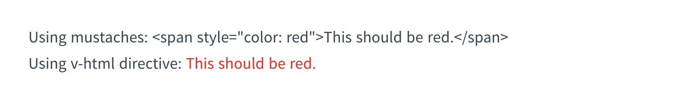

## Vue 基础

### 安装

##### 兼容性

Vue 不支持 IE8 及以下版本，因为 Vue 使用了 IE8 无法模拟的 ECMAScript 5 特性。但它支持所有[兼容 ECMAScript 5 的浏览器](https://caniuse.com/#feat=es5)。

##### Vue Devtools

在使用 Vue 时，我们推荐在你的浏览器上安装 [Vue Devtools](https://github.com/vuejs/vue-devtools#vue-devtools)。它允许你在一个更友好的界面中审查和调试 Vue 应用。

##### 直接用 \<script> 引入

1.直接下载并用 `<script>` 标签引入，`Vue` 会被注册为一个全局变量。

2.cdn

```html
<script src="https://cdn.jsdelivr.net/npm/vue@2.6.14"></script>
```

##### NPM

```bash
npm install vue -S
```

##### 命令行工具 (CLI)

https://cli.vuejs.org/zh/

### 模版语法

#### 插值

##### 文本

```html
<span>Message: {{ msg }}</span>
```

通过使用 v-once 指令，你也能执行一次性地插值，当数据改变时，插值处的内容不会更新。

```html
<span v-once>这个将不会改变: {{ msg }}</span>
```

##### 原始 HTML

双大括号会将数据解释为普通文本，而非 HTML 代码。为了输出真正的 HTML，你需要使用 [`v-html` 指令](https://cn.vuejs.org/v2/api/#v-html)：

```html
<p>Using mustaches: {{ rawHtml }}</p>
<p>Using v-html directive: <span v-html="rawHtml"></span></p>
```



##### 属性 Attribute

```html
<div v-bind:id="dynamicId"></div>
```

##### 使用 JavaScript 表达式

#### 指令

指令 (Directives) 是带有 `v-` 前缀的特殊 attribute。

##### v-bind

`v-bind` 指令可以用于响应式地更新 HTML attribute：

```html
<a v-bind:href="url">...</a>
<!-- 缩写 -->
<a :href="url">...</a>
```

##### v-on

另一个例子是 `v-on` 指令，它用于监听 DOM 事件：

```html
<a v-on:click="doSomething">...</a>
<!-- 缩写 -->
<a @click="doSomething">...</a>
```

修饰符 (modifier) 是以半角句号 `.` 指明的特殊后缀，用于指出一个指令应该以特殊方式绑定。例如，`.prevent` 修饰符告诉 `v-on` 指令对于触发的事件调用 `event.preventDefault()`：

```html
<form v-on:submit.prevent="onSubmit">...</form>
```

##### v-if

##### v-for

