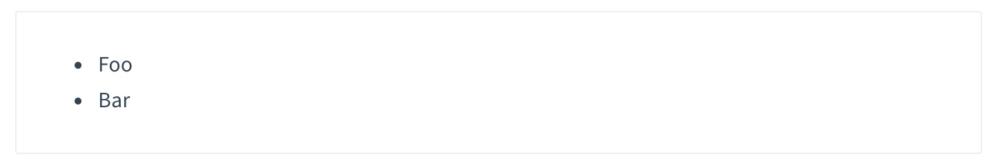
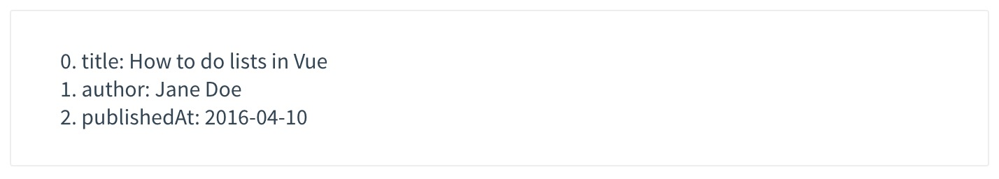
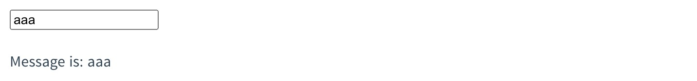
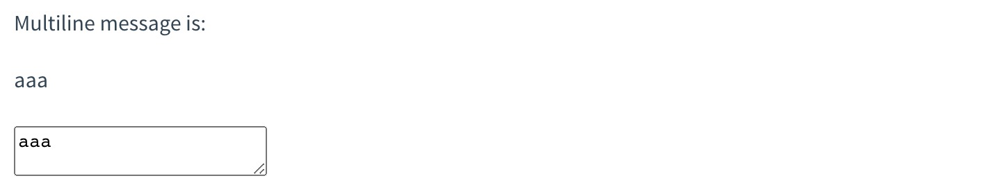
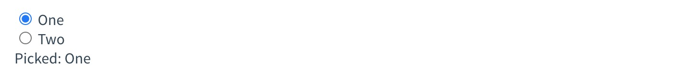
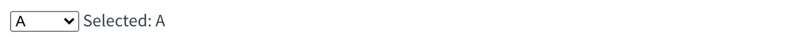
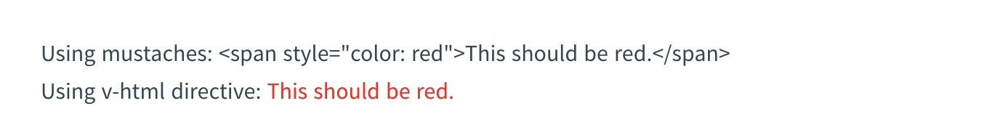
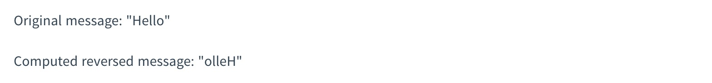
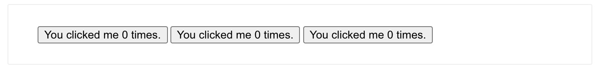

## Vue 基础

### 安装

##### 兼容性

Vue 不支持 IE8 及以下版本，因为 Vue 使用了 IE8 无法模拟的 ECMAScript 5 特性。但它支持所有[兼容 ECMAScript 5 的浏览器](https://caniuse.com/#feat=es5)。

##### Vue Devtools

在使用 Vue 时，我们推荐在你的浏览器上安装 [Vue Devtools](https://github.com/vuejs/vue-devtools#vue-devtools)。它允许你在一个更友好的界面中审查和调试 Vue 应用。

##### 直接用 \<script> 引入

1.直接下载并用 `<script>` 标签引入，`Vue` 会被注册为一个全局变量。

2.cdn

```html
<script src="https://cdn.jsdelivr.net/npm/vue@2.6.14"></script>
```

##### NPM

```bash
npm install vue -S
```

##### 命令行工具 (CLI)

https://cli.vuejs.org/zh/

### 模版语法

#### 插值

```html
<span>Message: {{ msg }}</span>
```

#### 基础指令

指令 (Directives) 是带有 `v-` 前缀的特殊 attribute。

* 属性
* 修饰符

##### v-bind

`v-bind` 指令可以用于响应式地更新 HTML attribute：

```html
<a v-bind:href="url">...</a>
<!-- 缩写 -->
<a :href="url">...</a>
```

##### v-on

`v-on` 指令，它用于监听 DOM 事件：

```html
<a v-on:click="doSomething">...</a>
<!-- 缩写 -->
<a @click="doSomething">...</a>
```

##### 使用 JavaScript 表达式

在模版语法中，可以直接使用 javascript 表达式进行绑定。下面这些都是合法的模版语法。

```html
{{ number + 1 }}

{{ ok ? 'YES' : 'NO' }}

{{ message.split('').reverse().join('') }}

<div v-bind:id="'list-' + id"></div>
```

#### 常用指令

##### Class 与 Style 绑定

操作元素的 class 列表和内联样式是数据绑定的一个常见需求。因为它们都是 attribute，所以我们可以用 `v-bind` 处理它们：只需要通过表达式计算出字符串结果即可。不过，字符串拼接麻烦且易错。因此，在将 `v-bind` 用于 `class` 和 `style` 时，Vue.js 做了专门的增强。表达式结果的类型除了字符串之外，还可以是对象或数组。

Class 绑定：

1.对象语法：

```html
<div v-bind:class="{ active: isActive }"></div>
```

上面的语法表示 `active` 这个 class 存在与否将取决于数据 property `isActive` 的 [truthiness](https://developer.mozilla.org/zh-CN/docs/Glossary/Truthy)。

你可以在对象中传入更多字段来动态切换多个 class。此外，`v-bind:class` 指令也可以与普通的 class attribute 共存。当有如下模板：

```html
<div
  class="static"
  v-bind:class="{ active: isActive, 'text-danger': hasError }"
></div>
```

和如下 data：

```js
data: {
  isActive: true,
  hasError: false
}
```

结果渲染为：

```html
<div class="static active"></div>
```

绑定的数据对象不必内联定义在模板里：

```html
<div v-bind:class="classObject"></div>
```

```js
data: {
  classObject: {
    active: true,
    'text-danger': false
  }
}
```

渲染的结果和上面一样。我们也可以在这里绑定一个返回对象的[计算属性](https://cn.vuejs.org/v2/guide/computed.html)。这是一个常用且强大的模式：

```html
<div v-bind:class="classObject"></div>
```

```js
data: {
  isActive: true,
  error: null
},
computed: {
  classObject: function () {
    return {
      active: this.isActive && !this.error,
      'text-danger': this.error && this.error.type === 'fatal'
    }
  }
}
```

2.数组语法：

我们可以把一个数组传给 `v-bind:class`，以应用一个 class 列表：

```html
<div v-bind:class="[activeClass, errorClass]"></div>
```

```js
data: {
  activeClass: 'active',
  errorClass: 'text-danger'
}
```

渲染为：

```html
<div class="active text-danger"></div>
```

如果你也想根据条件切换列表中的 class，可以用三元表达式：

```html
<div v-bind:class="[isActive ? activeClass : '', errorClass]"></div>
```

当有多个条件 class 时这样写有些繁琐。所以在数组语法中也可以使用对象语法：

```html
<div v-bind:class="[{ active: isActive }, errorClass]"></div>
```

Style 绑定：

1.对象语法：

`v-bind:style` 的对象语法十分直观——看着非常像 CSS，但其实是一个 JavaScript 对象。CSS property 名可以用驼峰式 (camelCase) 或短横线分隔 (kebab-case，记得用引号括起来) 来命名：

```html
<div v-bind:style="{ color: activeColor, fontSize: fontSize + 'px' }"></div>
```

```js
data: {
  activeColor: 'red',
  fontSize: 30
}
```

直接绑定到一个样式对象通常更好，这会让模板更清晰：

```html
<div v-bind:style="styleObject"></div>
```

```js
data: {
  styleObject: {
    color: 'red',
    fontSize: '13px'
  }
}
```

同样的，对象语法常常结合返回对象的计算属性使用。

2.数组语法

`v-bind:style` 的数组语法可以将多个样式对象应用到同一个元素上：

```html
<div v-bind:style="[baseStyles, overridingStyles]"></div>
```

##### 条件渲染

`v-if` 指令用于条件性地渲染一块内容。这块内容只会在指令的表达式返回 truthy 值的时候被渲染。

```html
<h1 v-if="awesome">Vue is awesome!</h1>
<h1 v-else>Oh no 😢</h1>
```

```js
data: {
  awesome: true
}
```

`v-else` 元素必须紧跟在带 `v-if` 或者 `v-else-if` 的元素的后面，否则它将不会被识别。

`v-else-if`，顾名思义，充当 `v-if` 的“else-if 块”，可以连续使用：

```html
<div v-if="type === 'A'">
  A
</div>
<div v-else-if="type === 'B'">
  B
</div>
<div v-else-if="type === 'C'">
  C
</div>
<div v-else>
  Not A/B/C
</div>
```

`v-show` 指令是另一个用于根据条件展示元素的选项。用法大致一样：

```html
<h1 v-show="ok">Hello!</h1>
```

`v-show` 只是简单地切换元素的 CSS property `display`。

##### 列表渲染

我们可以用 `v-for` 指令基于一个数组来渲染一个列表。`v-for` 指令需要使用 `item in items` 形式的特殊语法，其中 `items` 是源数据数组，而 `item` 则是被迭代的每一条数组元素。

```html
<ul id="example-1">
  <li v-for="(item, index) in items" :key="item.message">
    {{ item.message }}
  </li>
</ul>
```

```js
data: {
  items: [
    { message: 'Foo' },
    { message: 'Bar' }
  ]
}
```

结果：



你也可以用 `v-for` 来遍历一个对象的 property。

```html
<div v-for="(value, key, index) in object" :key="key">
  {{ index }}. {{ key }}: {{ value }}
</div>
```

```js
data: {
  object: {
    title: 'How to do lists in Vue',
    author: 'Jane Doe',
    publishedAt: '2016-04-10'
  }
}
```

结果：



##### 事件处理

在模版上使用 javascript 作为事件处理逻辑：

```html
<div id="example-1">
  <button v-on:click="counter += 1">Add 1</button>
  <p>The button above has been clicked {{ counter }} times.</p>
</div>
```

```js
var example1 = new Vue({
  el: '#example-1',
  data: {
    counter: 0
  }
})
```

使用事件处理方法：

许多事件处理逻辑会更为复杂，所以直接把 JavaScript 代码写在 `v-on` 指令中是不可行的。因此 `v-on` 还可以接收一个需要调用的方法名称。

```html
<div id="example-2">
  <!-- greet 是在下面定义的方法名 -->
  <button v-on:click="greet">Greet</button>
</div>
```

```js
var example2 = new Vue({
  el: '#example-2',
  data: {
    name: 'Vue.js'
  },
  // 在 methods 对象中定义方法
  methods: {
    greet: function (event) {
      // this 在方法里指向当前 Vue 实例
      alert('Hello ' + this.name + '!')
      // event 是原生 DOM 事件
      if (event) {
        alert(event.target.tagName)
      }
    }
  }
})
```

给事件处理方法传递参数：

```html
<div id="example-3">
  <button v-on:click="say('hi')">Say hi</button>
  <button v-on:click="say('what')">Say what</button>
</div>
```

```js
new Vue({
  el: '#example-3',
  methods: {
    say: function (message) {
      alert(message)
    }
  }
})
```

有时也需要在事件处理器中访问原始的 DOM 事件。可以用特殊变量 `$event` 把它传入方法：

```html
<button v-on:click="warn('Form cannot be submitted yet.', $event)">
  Submit
</button>
```

```js
// ...
methods: {
  warn: function (message, event) {
    // 现在我们可以访问原生事件对象
    if (event) {
      event.preventDefault()
    }
    alert(message)
  }
}
```

事件修饰符：

在事件处理程序中调用 `event.preventDefault()` 或 `event.stopPropagation()` 是非常常见的需求。尽管我们可以在方法中轻松实现这点，但更好的方式是：方法只有纯粹的数据逻辑，而不是去处理 DOM 事件细节。

为了解决这个问题，Vue.js 为 `v-on` 提供了**事件修饰符**。

修饰符的写法是以 `.` 指明的特殊后缀，用于指出一个指令应该以特殊方式绑定。

- `.stop`
- `.prevent`
- `.capture`
- `.self`
- `.once`

```html
<!-- 阻止单击事件继续传播 -->
<a v-on:click.stop="doThis"></a>

<!-- 提交事件不再重载页面 -->
<form v-on:submit.prevent="onSubmit"></form>

<!-- 修饰符可以串联 -->
<a v-on:click.stop.prevent="doThat"></a>

<!-- 只有修饰符 -->
<form v-on:submit.prevent></form>

<!-- 添加事件监听器时使用事件捕获模式 -->
<div v-on:click.capture="doThis">...</div>

<!-- 只当在 event.target 是当前元素自身时触发处理函数 -->
<div v-on:click.self="doThat">...</div>

<!-- 点击事件将只会触发一次 -->
<a v-on:click.once="doThis"></a>
```

按键修饰符

为了在必要的情况下支持旧浏览器，Vue 提供了绝大多数常用的按键码的别名：

- `.enter`
- `.tab`
- `.delete` 
- `.esc`
- `.space`
- `.up`
- `.down`
- `.left`
- `.right`
- `.ctrl`
- `.alt`
- `.shift`

```html
<!-- 只有在 `key` 是 `Enter` 时调用 `vm.submit()` -->
<input v-on:keyup.enter="submit">
```

```html
<!-- Ctrl + Click -->
<div v-on:click.ctrl="doSomething">Do something</div>
```

##### 表单输入绑定

你可以用 `v-model` 指令在表单 `<input>`、`<textarea>` 及 `<select>` 元素上创建双向数据绑定。

文本：

```html
<input v-model="message" placeholder="edit me">
<p>Message is: {{ message }}</p>
```



多行文本：

```html
<span>Multiline message is:</span>
<p style="white-space: pre-line;">{{ message }}</p>
<textarea v-model="message" placeholder="add multiple lines"></textarea>
```



复选框

单个复选框，绑定到布尔值：

```html
<input type="checkbox" id="checkbox" v-model="checked">
<label for="checkbox">{{ checked }}</label>
```


多个复选框，绑定到同一个数组：

```html
<input type="checkbox" id="jack" value="Jack" v-model="checkedNames">
<label for="jack">Jack</label>

<input type="checkbox" id="john" value="John" v-model="checkedNames">
<label for="john">John</label>

<input type="checkbox" id="mike" value="Mike" v-model="checkedNames">
<label for="mike">Mike</label>

<span>Checked names: {{ checkedNames }}</span>
```

```js
new Vue({
  el: '...',
  data: {
    checkedNames: []
  }
})
```


单选按钮

```html
<div id="example-4">
  <input type="radio" id="one" value="One" v-model="picked">
  <label for="one">One</label>

  <input type="radio" id="two" value="Two" v-model="picked">
  <label for="two">Two</label>

  <span>Picked: {{ picked }}</span>
</div>
```

```js
new Vue({
  el: '#example-4',
  data: {
    picked: ''
  }
})
```



选择框

```html
<div id="example-5">
  <select v-model="selected">
    <option disabled value="">请选择</option>
    <option>A</option>
    <option>B</option>
    <option>C</option>
  </select>
  <span>Selected: {{ selected }}</span>
</div>
```

```js
new Vue({
  el: '...',
  data: {
    selected: ''
  }
})
```



##### v-html

双大括号会将数据解释为普通文本，而非 HTML 代码。为了输出真正的 HTML，你需要使用 [`v-html` 指令](https://cn.vuejs.org/v2/api/#v-html)：

```html
<p>Using mustaches: {{ rawHtml }}</p>
<p>Using v-html directive: <span v-html="rawHtml"></span></p>
```

```html
<script>
export default {
  data() {
		return {
			rawHtml: '<span style="color: red">This should be red.</span>'
    }
  }
}
</script>
```



##### v-once

通过使用 v-once 指令，你也能执行一次性地插值，当数据改变时，插值处的内容不会更新。

```html
<span v-once>这个将不会改变: {{ msg }}</span>
```

### 计算属性

模板内的表达式非常便利，但是设计它们的初衷是用于简单运算的。在模板中放入太多的逻辑会让模板过重且难以维护。例如：

```html
<div id="example">
  {{ message.split('').reverse().join('') }}
</div>
```

所以，对于任何复杂逻辑，你都应当使用**计算属性**。

```html
<template>
	<div id="example">
    <p>Original message: "{{ message }}"</p>
    <p>Computed reversed message: "{{ reversedMessage }}"</p>
  </div>
</template>

<script>
export default {
  data() {
    return {
      message: 'Hello'
    },
  },
  computed: {
    reversedMessage: function () {
      return this.message.split('').reverse().join('');
    }
  }
}
</script>
```

结果：



计算属性在模版中的使用：可以像绑定普通 property 一样在模板中绑定计算属性。

计算属性是响应式的，值的变化依赖于计算属性中使用到的响应式的值。在上面的例子中，`reversedMessage` 依赖于 `message` ，因此当 `message` 发生改变时， `reversedMessage` 也会随之变化的到最新计算后的值。

### 监听器

虽然计算属性在大多数情况下更合适，但有时也需要一个自定义的侦听器。这就是为什么 Vue 通过 `watch` 选项提供了一个更通用的方法，来响应数据的变化。当需要在数据变化时执行异步或开销较大的操作时，这个方式是最有用的。

例如：

```html
<div id="watch-example">
  <p>
    Ask a yes/no question:
    <input v-model="question">
  </p>
  <p>{{ answer }}</p>
</div>
```

```html
<!-- 因为 AJAX 库和通用工具的生态已经相当丰富，Vue 核心代码没有重复 -->
<!-- 提供这些功能以保持精简。这也可以让你自由选择自己更熟悉的工具。 -->
<script src="https://cdn.jsdelivr.net/npm/axios@0.12.0/dist/axios.min.js"></script>
<script src="https://cdn.jsdelivr.net/npm/lodash@4.13.1/lodash.min.js"></script>
<script>
var watchExampleVM = new Vue({
  el: '#watch-example',
  data: {
    question: '',
    answer: 'I cannot give you an answer until you ask a question!'
  },
  watch: {
    // 如果 `question` 发生改变，这个函数就会运行
    question: function (newQuestion, oldQuestion) {
      this.answer = 'Waiting for you to stop typing...'
      this.debouncedGetAnswer()
    }
  },
  created: function () {
    // `_.debounce` 是一个通过 Lodash 限制操作频率的函数。
    // 在这个例子中，我们希望限制访问 yesno.wtf/api 的频率
    // AJAX 请求直到用户输入完毕才会发出。想要了解更多关于
    // `_.debounce` 函数 (及其近亲 `_.throttle`) 的知识，
    // 请参考：https://lodash.com/docs#debounce
    this.debouncedGetAnswer = _.debounce(this.getAnswer, 500)
  },
  methods: {
    getAnswer: function () {
      if (this.question.indexOf('?') === -1) {
        this.answer = 'Questions usually contain a question mark. ;-)'
        return
      }
      this.answer = 'Thinking...'
      var vm = this
      axios.get('https://yesno.wtf/api')
        .then(function (response) {
          vm.answer = _.capitalize(response.data.answer)
        })
        .catch(function (error) {
          vm.answer = 'Error! Could not reach the API. ' + error
        })
    }
  }
})
</script>
```

在这个示例中，使用 `watch` 选项允许我们执行异步操作 (访问一个 API)，限制我们执行该操作的频率，并在我们得到最终结果前，设置中间状态。这些都是计算属性无法做到的。

### 组件化

##### 组件的组织形式

通常一个应用会以一棵嵌套的组件树的形式来组织。

例如，你可能会有页头、侧边栏、内容区等组件，每个组件又包含了其它的像导航链接、博文之类的组件。


##### 组件的复用

```html
<div id="components-demo">
  <button-counter></button-counter>
  <button-counter></button-counter>
  <button-counter></button-counter>
</div>
```



`data` 必须是一个函数：

当我们定义这个 `<button-counter>` 组件时，你可能会发现它的 `data` 并不是像这样直接提供一个对象：

```js
data: {
  count: 0
}
```

**一个组件的 `data` 选项必须是一个函数**，因此每个实例可以维护一份被返回对象的独立的拷贝：

```js
data: function () {
  return {
    count: 0
  }
}
```

##### 组件注册

1.全局注册

在任何地方都可以直接使用。

```js
// kebab-case (短横线分隔命名) 
Vue.component('my-component-name', {
  // ... 选项 ...
})
<my-component-name>
// PascalCase (首字母大写命名) 
Vue.component('MyComponentName', {
  // ... 选项 ...
})
<my-component-name> 和 <MyComponentName>
```

2.局部注册

通过一个普通的 JavaScript 对象来定义组件：

```js
var ComponentA = { /* ... */ }
var ComponentB = { /* ... */ }
var ComponentC = { /* ... */ }
```

然后在 `components` 选项中声明你想要使用的组件：

```js
new Vue({
  el: '#app',
  components: {
    'component-a': ComponentA,
    'component-b': ComponentB
  }
})
```

对于 `components` 对象中的每个 property 来说，其 property 名就是自定义元素的名字，其 property 值就是这个组件的选项对象。

在模块系统中局部注册：

ComponentB.js/ComponentA.vue

```js
import ComponentA from './ComponentA'
import ComponentC from './ComponentC'

export default {
  components: {
    ComponentA,
    ComponentC
  },
  // ...
}
```

现在 `ComponentA` 和 `ComponentC` 都可以在 `ComponentB` 的模板中使用了。

##### Prop

1.prop 类型

以字符串数组形式列出的 prop：

```js
props: ['title', 'likes', 'isPublished', 'commentIds', 'author']
```

通常你希望每个 prop 都有指定的值类型。这时，你可以以对象形式列出 prop，这些 property 的名称和值分别是 prop 各自的名称和类型：

```js
	props: {
    // 基础的类型检查 (`null` 和 `undefined` 会通过任何类型验证)
    propA: Number,
    // 多个可能的类型
    propB: [String, Number],
    // 必填的字符串
    propC: {
      type: String,
      required: true
    },
    // 带有默认值的数字
    propD: {
      type: Number,
      default: 100
    },
    // 带有默认值的对象
    propE: {
      type: Object,
      // 对象或数组默认值必须从一个工厂函数获取
      default: function () {
        return { message: 'hello' }
      }
    }
	}
```

优点：

* 为你的组件提供了文档，使代码可读性更强。
* 在它们遇到错误的类型时从浏览器的 JavaScript 控制台提示用户，便于定位问题。

2.传递静态或动态的 prop

可以像这样给 prop 传入一个静态的值：

```html
<my-component title="My journey with Vue"></my-component>
```

prop 可以通过 `v-bind` 动态赋值：

这种情况可以传递任何数据类型的 prop。

```html
<my-component :title="title"></my-component>
```

```js
data() {
  return {
    title: 'My journey with Vue'
  }
}
```

3.单向数据流

父级 prop 的更新会向下流动到子组件中，但是反过来则不行。这样会防止从子组件意外变更父级组件的状态，从而导致你的应用的数据流向难以理解。这相当于 Vue 的一个约定的规范。我们需要遵守这样的一个规范。

如果你在一个子组件内部改变 prop 的值，Vue 会在浏览器的控制台中发出警告。

这里有两种常见的试图变更一个 prop 的情形：

**这个 prop 用来传递一个初始值；这个子组件接下来希望将其作为一个本地的 prop 数据来使用。**在这种情况下，最好定义一个本地的 data property 并将这个 prop 用作其初始值：

```js
props: ['initialCounter'],
data: function () {
  return {
    counter: this.initialCounter
  }
}
```

**这个 prop 以一种原始的值传入且需要进行转换。**在这种情况下，最好使用这个 prop 的值来定义一个计算属性：

```js
props: ['size'],
computed: {
  normalizedSize: function () {
    return this.size.trim().toLowerCase()
  }
}
```

注意：在 JavaScript 中对象和数组是通过引用传入的，所以对于一个数组或对象类型的 prop 来说，在子组件中改变变更这个对象或数组本身将会影响到父组件的状态。

##### 自定义事件

```html
<my-component @changeTitle="changeTitle"></my-component>

methods: {
	changeTitle(title) {
		console.log(title);
	}
}
```

my-component

```html
<template>
	<button @click="changeTitle"></button>
</template>

methods: {
	changeTitle() {
		this.$emit('changeTitle', 'My journey with Vue');
	}
}
```

##### 插槽

匿名插槽

```vue
<!-- parent -->
<comp>hello</comp>

<!-- comp -->
<div>
  <slot></slot>
</div>
```

具名插槽

```vue
<!-- parent -->
<Comp2>
  <!-- 默认插槽用default做参数 -->
  <template v-slot:default>具名插槽</template> 
  <!-- 具名插槽用插槽名做参数 -->
  <template v-slot:content>内容...</template>
</Comp2> 

<!-- comp -->
<div>
  <slot></slot>
	<slot name="content"></slot>
</div>
```

作用域插槽

在你声明的 \<template>\</template> 里面的数据到底是用来自当前的父组件的还是来自于子组件的，如果分发内容要用到子组件中的数据就用作用域插槽，否则就用普通插槽。

```vue
<!-- parent -->
<Comp3>
  <!-- 把v-slot的值指定为一个作用域上下文对象 slotProps: {foo: 'xxxxx'}--> 
  <template v-slot:default="slotProps">
		来自子组件数据:{{slotProps.foo}} 
  </template>
</Comp3>

<!-- comp3 -->
<div>
  <slot :foo="data"></slot>
</div>
```

##### 

