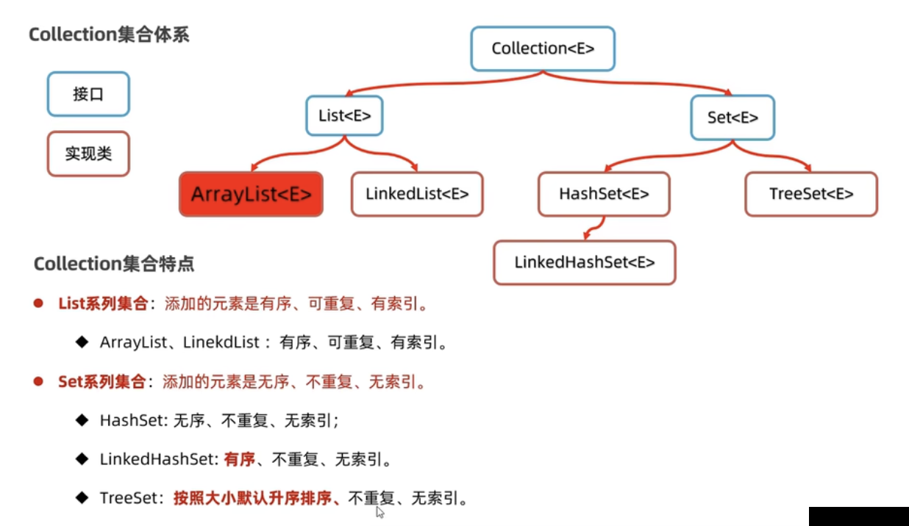
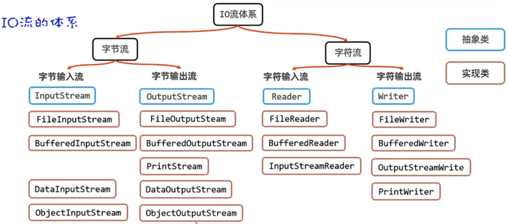
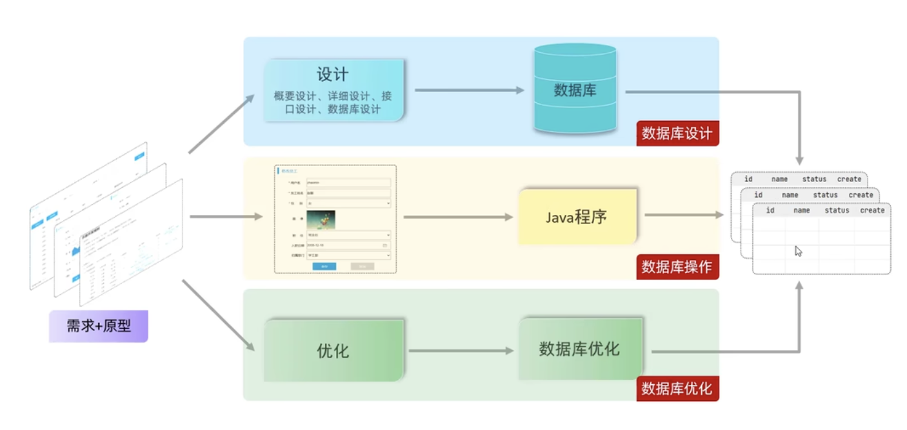
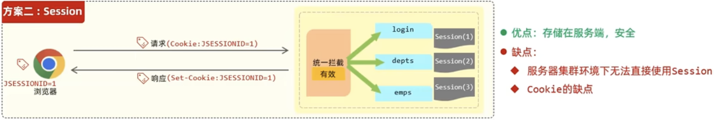
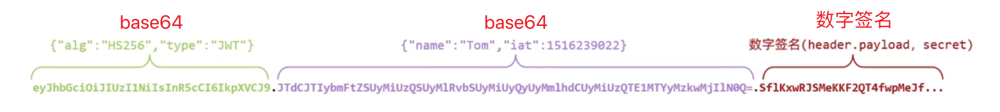

# Javase

**JDK简介**

Java的产品叫**JDK（Java Development Kit：Java开发者工具包）**，必须按照JDK才能使用Java。JDK 8/11/17/21是长期稳定版，企业用8和11最多。本教程使用17。

**JDK（Java Development Kit：Java开发者工具包）的组成**

* JRE（Java Runtime Environment）：Java的运行环境。
  * JVM（Java Virtual Machine）：Java虚拟机，正则运行Java程序的地方。
  * 核心类库：Java自己写好的程序，给程序员的程序调用的。
* 开发工具：java javac ...

**Java跨平台原理**

一次编译，处处可用。

Java程序通过javac编译一次后，就可以在各个平台的虚拟机上运行了，原因是Sun公司为各个平台多提供了对应的JVM虚拟机。

java和javac的作用

javac是编译工具，java是执行工具，使用javac将java代码编译成机器能够识别的程序。然后使用java执行编译后的程序，如此java程序才能运行起来。

**IDEA管理Java程序的结构**

* project（项目、工程）（创建空工程）（选择JKD版本）
  * module（模块）
    * src/package（包）（名字：com.公司名.包名）
      * class（类）
        * 代码（要有main函数）
  * out 编译之后的代码
  * .iml 包含了与模块相关的各种配置信息

**面向对象编程**

* 面向对象编程：将数据和方法交给类去维护，然后在通过类创建对象。

* 实体类(标准JavaBean)

* 继承

* 多态

* 抽象类

* 接口

* 实现类

* 内部类

* 枚举类

* 泛型

**方法**

**Lambda表达式**

**方法引用**

**数组**

**集合**

集合是一种容器，用来装数据，类似于数组。java中集合的种类有很多，如：ArrayList List Map Set...，ArrayList是最常用的。

数组定义时长度就固定了，所有一些场景下使用数组存数据是不合适的。集合大小可变，开发中用的更多。



**异常**

**File**

File是java.io.包下的类，File类的对象，用于代表当前操作系统的文件（可以是文件或文件夹）。可以对文件做一些操作，比如：获取文件信息（大小，文件名，修改时间）、判断文件类型、创建文件/文件夹、删除文件/文件夹等。

File类只能对文件本身进行操作，不能读写文件里面存储的数据。

创建File对象：

```java
File f = new File("文件的相对/绝对路径");
```

file对象操作文件的常用方法：

* 判断文件类型、获取文件信息

  ```java
  // 根据文件路径获取文件对象
  File f = new File("文件的相对/绝对路径");
  // 判断当前文件对象对应的的文件路径是否存在
  f.exists();
  // 判断当前文件对象指代的是否是文件
  f.isFile();
  // 判断当前文件对象指代的是否是文件夹
  f.isDirectory();
  // 获取文件名（包含后缀）
  f.getName();
  // 获取文件大小，返回字节个数
  f.length();
  // 获取文件最后修改时间，返回时间戳
  long time = f.lastModified();
  // 获取场景文件对象时，使用的路径
  f.getPath();
  // 获取文件绝对路径
  f.getAbsolutePath();
  ```

* 创建文件、删除文件

  ```java
  // 获取文件对象
  File f1 = new File("要创建的文件的路径 /Users/a/a.txt");
  // 创建一个新文件（文件内容为空），不存在才会创建，创建成功返回true
  f.createNewFile();
  
  // 获取文件对象
  File f2 = new File("要创建的文件夹的路径 /Users/a");
  // 创建文件夹，只能创建一级文件夹，创建成功返回true
  f2.mkdir();
  
  // 获取文件对象
  File f3 = new File("要创建的文件夹的路径 /Users/a/b/c/d");
  // 创建文件夹，可以创建多级文件夹，创建成功返回true
  f3.mkdirs();
    
  // 删除文件或空文件夹，不能删除非空文件夹，成功返回true
  f3.delete();
  ```

* 遍历文件夹

  ```java
  // 获取文件夹对象
  File f = new File("/Users");
  
  // 获取当前目录下所有的”一级文件名称”到一个字符串数组中去返回
  String[] names = f.list();
  for (String name : names) {
    System.out.println(name);
  }
  
  // 获取当前目录下所有的”一级文件对象“到一个文件对象数组中去返回（重点）
  File[] files = f.listFiles();
  for (File file : files) {
    System.out.println(file.getAbsolutePath());
  }
  ```

**Stream**

Stream也叫Stream流，是Jdk8新增的一套API（Java.util.stream.*），可以用于操作集合或者数组的数据。

Stream流使用步骤：

1. 获取Stream流：Stream流代表一条流水线，并能与数据源（集合/数组/...）建立连接。
2. 处理数据：调用流水线的各种方法对数据进行处理，计算。如：过滤、排序、去重等。
3. 获取结果：获取处理的结果，遍历、同级、收集到一个新的集合中返回。

**IO流**

IO流：用于读写数据的（可以读写文件，或网络中的数据...）

IO流分类：

* 字节输入流：以内存为基准，将来自磁盘文件或网络中的数据**以字节的形式读入到内存**中去的流。
* 字节输出流：以内存为基准，把内存中的数据**以字节的形式写出到磁盘文件或网络**中去的流。
* 字符输入流：以内存为基准，将来自磁盘文件或网络中的数据**以字符的形式读入到内存**中去的流。
* 字符输出流：以内存为基准，把内存中的数据**以字符的形式写出到磁盘文件或网络**中去的流。



**多线程**

线程（Thread）是一个程序内部的一条执行流程。

程序中如果只有一条执行流程，那这个程序就是单线程的程序。

多线程是指从软硬件上实现的多条执行流程的技术（多条线程由CPU负责调度执行）。

创建多线程：

* 继承Thread类
* 实现Runnable接口
* 利用Callable接口、FutureTask类来实现

线程安全问题：

多个线程，同时操作同一个共享资源时，可能会呈现业务安全问题。

线程同步：

* 解决线程安全问题的方案。就是让多个线程实现先后依次访问共享资源，这样就解决了安全问题。

* 线程同步常见方案：
  * 加锁：每次只允许一个线程加锁，加锁后才能进入访问，访问完毕后自动解锁，然后其他线程才能再枷锁进来。
    * 同步代码块
    * 同步方法
    * Lock锁

线程通信：

当多个线程共同操作共享资源时，线程间通过某种方式互相告知自己的状态，以相互协调，或避免无效的资源争夺。

线程池

* 线程池就是一个可以复用线程的技术。

* 不使用线程池的问题：用户没发起一个请求，后台就需要创建一个新线程来处理，下次新任务来了肯定又要创建新线程处理，而创建新线程的开销是很大的，并且请求过多时，肯定会产生大量的线程出来，这样会严重影响系统的性能。

* 线程池中的线程数量是固定的，如果任务数量超出线程池中的线程数量，任务会进行等待。防止任务过多，创建过多线程消耗系统资源的问题。（时间换空间）

并发和并行

* 进程：正在运行的程序（软件）就是一个独立的进程。

* 线程是属于进程的，一个进程中可以同时运行多个线程。

* 进程中的多个线程其实是并发和并行执行的。

* 并发：进程中的线程是由CPU负责调度执行的，但CPU能同时处理线程的数量有限，为了保证全部线程都能往前直行，CPU会轮询为系统的每个线程服务，由于CPU切换的速度很快，给我们的感觉是这些线程在同时执行，这就是并发。

* 并行：在同一个时刻上，同时有多个线程在被CPU（多个）调度执行。

* 多线程执行任务，是并发和并行同时进行的。

线程的生命周期

* 线程从生到死的过程中，经历的各种状态及状态转换。

* 理解线程的这些状态有利于提升并发（多线程）编程的理解能力。

* Java线程的状态

  * Java总共定义了6种状态

  * 6种状态都定义在Thread类的内部枚举类中。

**网络通信**

java.net.*包下提供了网络编程的解决方案。

**junit单元测试框架**

**反射**

**注解**

**动态代理**

# MySQL

**概念**

数据库：是存储数据的仓库，数据是有组织的进行存储，简称DataBase（DB）。

数据库管理系统：操纵和管理数据库的大型软件，简称DataBase Management System（DBMS）。

SQL：操作关系型数据库的编程语言，定义了一套操作关系型数据库的统一标准，简称Structured Query Language（SQL）

通过sql操作数据库管理系统，从而操作数据库。

**连接数据库**

```bash
mysql [-h 127.0.0.1] [-P 3306] -u root -p
```

**关系型数据库**

概念：简历在关系模型基础上，由多张互相连接的二维表组成的数据库。

特点：

1. 使用表存储数据，格式统一，便于维护。
2. 使用SQL语言操作，标准统一，使用方便。

通过表结构存储数据的数据库就称为关系型数据库，不通过表结构存储数据的数据库就称为非关系型数据库。 

**开发时数据库使用**



**数据库优化-索引**

索引是帮助数据库高效获取数据的数据结构（B+Tree多路平衡搜索树）。

利用空间换时间。

**SQL语句**

* DDL：数据定义语言，用来定义数据库对象（数据库，表，字段）
  * 数据库：数据库查询、创建、删除、使用
  * 表：表的查询、创建表及表中字段、修改表名
  * 字段：添加字段、修改表中的字段及其类型，删除表中字段
* DML：数据操作语言，用来对数据库表中的数据进行增删改操作。
  * 为表中的字段添加数据
  * 修改表中字段数据
  * 删除表中字段数据
* DQL：数据查询语言，用来查询数据库中表的记录。
  * 基本查询
  * 去重查询
  * 条件查询
  * 聚合函数
  * 分组函数
  * 排序查询
  * 分页查询
* DCL：数据控制语言，用来管理数据库用户、控制数据库的访问权限。
  * 管理用户
  * 去啊年控制

**函数**

* 字符串函数
* 数值函数
* 日期函数
* 流程函数

**约束**

* 非空约束
* 唯一约束
* 主键约束
* 默认约束
* 检查约束
* 外键约束

**多表查询**

多表关系：项目开发中，在进行数据库表结构设计时，会根据业务需求及业务模块之间的关系（业务《=》数据），分析并设计表结构，由于业务之间相互关联，所以各个表结构之间也存在着各种联系，基本上分为三种：

* 一对多（多对一）：在多的一方建立外键，指向一的一方的主键。
* 多对多：建立第三张中间表，中间表至少包含两个外键，分别关联两方主键。
* 一对一：在任意一方加入外键，关联另外一方的主键，并且设置外键为唯一的（unique）

多表查询：

* 连接查询
  * 内连接：相当于查询A、B交集部分数据（查询两张表有关系的那部分数据）
  * 外链接：
    * 左外连接：查询左表所有数据，以及两张表交集部分数据
    * 右外连接：查询右表所有数据，以及两张表交集部分数据
  * 自连接：当前表与自身的外链接查询，自连接必须使用表别名
* 子查询
  * 标量子查询
  * 列子查询
  * 行子查询
  * 表子查询

**事务**

事务是一组操作的集合，它是一个不可分割的工作单位，事务会把所有的操作作为一个整体一起向系统提交或撤销操作请求，即这些操作要么同时成功，要么同时失败。

默认MySQL的事务是自动提交的，也就是说，当执行一条DML语句，MySQL会立即隐式的提交事务。

事务操作：

* 开启事务
* 提交事务
* 回滚事务

事务四大特性：

* 原子性（Atomicity）：事务是不可分割的最小操作单元，要么全部成功，要么全部失败。
* 一致性（Consistency）：事务完成时，必须使所有的数据都保持一致状态。
* 隔离性（Isolation）：数据库系统提供的隔离机制，保证事务在不受外部并发操作影响的独立环境下运行。
* 持久性（Durability）：事务一旦提交或回滚，它对数据库中的数据的改变就是永久的。

并发事务问题：

* 脏读
* 不可重复读
* 幻读

事务隔离级别：

* 事务隔离级别就是用来解决并发事务问题的。

* 隔离级别越高性能越差，隔离基本越低数据安全性越差。业务中选择事务的隔离级别时，既要权衡数据的安全性，又要权衡数据库的并发性能。

# Javaweb

**SSM**：Spring SpringMVC Mybatis。

**SpringBoot**：SpringBoot是Spring的一个子项目， 可以简化传统Spring应用程序的配置和启动过程，包括与SpringMVC和MyBatis等框架的整合。

**maven**

maven是一个用于管理和构建Java项目的工具，它基于项目对象模型（POM）的概念，通过一小段描述信息（配置）来管理项目的构建。

maven作用：

* 依赖管理
* 统一目录结构
* 标准的项目构建流程

maven坐标：项目的唯一标识，通过坐标可以定位资源位置。使用坐标可以定义项目或引入项目中需要的依赖

* groupId：组织名（域名反写）
* artifactId：项目名（通常是模块名称）
* version：版本号

**tomcat**

Web服务器是一个软件程序，对HTTP协议的操作进行了封装，使得程序员不必直接对协议进行操作，让Web开发更加便捷。

Web服务器的主要功能是部署web项目对外提供网上信息浏览服务。

Tomcat是一个轻量级的web服务器，支持servlet，jsp等少量的JavaEE规范。

基于SpringBoot开发的web引用程序，内置了Tomcat服务器，当启动类运行时，会自动启动内嵌的Tomcat服务器。

**请求响应**

请求：通过SpringBoot框架内部提供的对象，可以轻松获取请求参数。

响应：通过@ResponseBody注解将controller方法返回值直接响应给客户端。并使用实体对象，封装统一响应结果。

**三层架构**

controller：控制层，接收请求，响应数据。

service：业务逻辑层，处理业务逻辑。

dao：数据访问层，负责数据访问操作。

**分层解耦**

spring中我们使用控制反转和依赖注入来解耦三层架构。

* 控制反转：Inversion Of Controller，简称IOC。对象的创建控制权由程序自身转移到外部（容器），这种思想称为控制反转。在被依赖的类上面加上@Component注解，表示将当前类交给IOC容器管理，称为IOC容器中的bean。

* 依赖注入：Dependency Injection，简称DI。容器为应用程序提供运行时所依赖的资源，称之为依赖注入。在要注入依赖的定义变量的上面加上@Autowired注解，表示，IOC容器会提供该类型的bean对象，并赋值给该变量。

* Bean对象：IOC容器中创建、管理的对象，称之为bean。

**Mybatis**

Mybatis就是让我们可以在Java程序中编写SQL语句去操作数据库的工具。

使用Mybatis查询所有用户数据步骤：

1. 准备工作（创建springboot工程、数据库表user、实体类User）
2. 引入Mybatis相关依赖，配置Mybatis（数据库连接信息）
3. 编写SQL语句（注解@select("查询数据的sql语句")/XML）

**JDBC**

就是使用Java语言操作关系型数据库的一套API接口（规范）。

Java提供JDBC接口，数据库厂商实现。

**数据库连接池**

优势：资源重用、提升系统响应速度、避免数据库连接遗漏。

**动态SQL**

随着外部条件的变化而变化的SQL语句。XML映射文件中使用相应的标签 `<id> <foreach> <sql> <include>`

**会话技术**

合法身份凭证：会话和令牌。

会话：用户打开浏览器，访问web服务器的资源，会话建立，直到有一方断开连接，会话结束。也就是浏览器和服务器的一次连接就称为一次会话。在一次会话中可以包含多次请求和响应。

会话跟踪：一种维护浏览器状态的方法，服务器需要识别多次请求是否来自于同一浏览器，以便在同一次会话的多次请求间共享数据。

会话跟踪方案：

* 客户端会话跟踪技术：Cookie  tomcat(sevlet容器)这样的web服务器中提供了获取和设置Cookie的API。
* 服务端会话跟踪技术：Session   tomcat(sevlet容器)这样的web服务器中提供了获取设置Session的API。
* 令牌技术：JWT





令牌技术：jwt

jwt（JSON Web Token）：定义了一种简洁的、自包含的格式，用于在通信双方以json数据格式安全的传输信息，由于数据签名的存在，这些信息是可靠的。

jwt的组成：

* 第一部分：Header（头），记录令牌类型、签名算法等。例如：{ "alg": "hs256", "type": "jwt" }
* 第二部分：Paload（有效载荷），携带一些自定义信息、默认信息等。例如：{"id": "1", "username": "tom"}
* 第三部分：Signature（签名），防止token被篡改、确保安全性。将Header、Paload，并加入指定秘钥，通过指定签名算法计算而来。



注：Base64是一种基于64个可打印字符（A-Z a-z 0-9 + /）来表示二进制的编码方式。

Java要做的事就是生成令牌和校验令牌。

# Nginx

**概念**

nginx是一个高性能的HTTP和反向代理Web服务器，优点是占用内存小，高性能，高并发。

**nginx常用功能**

* 静态资源部署及优化
* rewrite重写URL
* gzip压缩
* 反向代理
* 负载均衡
* 动静分离
* 安全控制https
* 服务器缓存
* 制作下载站点
* 搭建高可用环境

**nginx进程**

* master主进程：负责管理所有的worker进程
* worker工作进程：用来接收和处理用户的请求

**nginx路径**

nginx其实最终关心的就是两个路径：一个是客户端在浏览器中输入的访问地址，一个是要访问的实际资源的地址。

**nginx目录**

```bash
whereis nginx #查找跟nginx相关的所有目录
find / -name nginx.conf #从根目录开始查找nginx配置文件位置

/etc/nginx/   #nginx安装目录
/etc/nginx/nginx.conf   #配置文件
/usr/sbin/   #可执行文件目录 启动./nginx
/usr/share/nginx/html/   #html文件目录 
/var/log/nginx/   #日志目录 cat /var/log/nginx/error.log #查看nginx错误日志
```

**常用命令**

```bash
#nginx命令
sudo nginx -v 										#检查nginx版本号
sudo nginx -V											#检查nginx版本号及其详细安装信息
sudo nginx                        #启动nginx
sudo nginx -s stop                #停止nginx
sudo nginx -s reopen              #重启nginx
sudo nginx -t                     #检查nginx配置文件语法
sudo nginx -T                     #检查nginx配置文件语法，并显示配置文件内容
sudo nginx -s reload              #重载nginx配置文件
sudo nginx -c /etc/nginx/nginx.conf  #指定配置文件路径

#使用systemctl服务（更加安全）
sudo systemctl start nginx      #启动nginx
sudo systemctl stop nginx       #停止nginx
sudo systemctl restart nginx    #重启nginx
sudo systemctl reload nginx     #重载nginx配置文件
sudo systemctl status nginx     #查看nginx是否启动成功
sudo systemctl enable nginx     #开机启动nginx
```

**配置文件**

```nginx
全局块
events块 {
  
}
http块 {
  server块 {
    location块 {
      
    }
  }
}
```

**配置实例**

```nginx
#1.全局块：主要配置一些影响nginx服务器整体运行的指令
#1.1配置nginx worker进程的用户和用户组
user nginx;
#1.2配置是否开启worker进程（默认）
master_process on;
#1.3配置允许生成的worder进程的数量，理论越多越好，建议将该值和服务器cpu内核数保持一致。
worder_process auto;
#1.4配置nginx是否以守护进程的方式启动（默认）
deamon on;
#1.5配置master进程的进程号id存储的文件路径。
pid /var/run/nginx.pid;
#1.6配置错误日志存放路径和日志级别
error_log /var/log/nginx/error.log error;
#1.7include 用来引入其他ngnix配置文件，可以在配置文件中的任何位置使用。

#2.events块：主要配置nginx服务器与用户的网络连接，该配置对nginx服务器的性能影响比较大
events {
	#2.1配置nginx网络连接序列化。解决“惊群”问题。（默认）
  accept_mutex on;
  #2.2配置worker进程是否允许同时接收多个网络连接
  multi_accept on;
  #2.3配置单个worker进程最大连接数
  worker_connections 1024;
  #2.4配置nginx服务器选择哪种事件驱动来处理网络消息（默认）
  use epoll;
}

#3.http块
http {
  #1.其他配置文件引入
  
  #2.定义MIME-TYPE
  #2.1types：定义支持的MIME类型，默认是通过include引入进来的
  include /etc/nginx/mime.types;
  #2.2default_type：配置nginx相应前端请求的默认MIME类型（位置：http、server、location）
  default_type application/octet-stream;
  
  #3.自定义访问日志access_log（位置：http、server、location）
  #3.1log_format：配置指定日志的输出格式。
  log_format  main  '$remote_addr - $remote_user [$time_local] "$request" '
                      '$status $body_bytes_sent "$http_referer" '
                      '"$http_user_agent" "$http_x_forwarded_for"';
  #3.2access_log：配置访问日志的相关属性
  access_log  /var/log/nginx/access.log  main;
  
  #4.优化配置
  #4.1开启高效的文件传输模式
  sendfile on;
  #4.2提升网络包的传输效率，但实时性降低
  tcp_nopush on;
  #4.3提升网络包传输的实时性，但传输效率降低（默认）
  tcp_nodelay on; 
  
  #5.配置长连接的超时时间
  keepalive_timeout 65;
  
  #6.配置长连接的最大使用次数，超过后长连接会断开（默认）
  keepalive_requests 100;
  
  #7.gzip压缩（常见在http块中配置，也可以在server、location中配置）
  #7.1开启gzip压缩功能
  gzip on;
  #7.2根据响应页面的MIME类型选择性的开启gzip压缩功能（默认）
  gzip_types text/html;
  #7.3配置gzip压缩级别
  gzip_comp_level 6;
  #7.4配置使用gzip进行压缩，是否发送Vary: Accept-Encoding响应头
  gzip_vary on;
  #7.5配置处理压缩的缓冲区数量和大小（默认）
  gzip_buffers 32 4k | 16 8k;
  #7.6针对不同客户端，选择性的开启和关闭gzip功能，排除不支持gzip的低版本的浏览器，不进行gzip压缩
  gzip disable "MSIE [1-6]\.";
  #7.7指定使用gzip的最低http版本（默认）
  gzip_http_version 1.1;
  #7.8针对传输数据的大小，选择性的开启和关闭gzip功能
  gzip_min_length 1k;
  #7.9使用nginx做反向代理时，是否对服务端返回的结果进行gzip压缩（默认）
  gzip_proxied off;
  #7.10解决gzip和sendfile共存问题
  gzip_static on;
  
  #8.nginx服务器缓存
  #8.1配置缓存文件的存放路径（位置：http）
  proxy_cache_path /usr/local/proxy_cache keys_zone=itcast:200m  levels=1:2:1 inactive=1d max_size=20g;
  #8.2其他缓存指令（位置：http、server、location）
  proxy_cache itcast;
  proxy_cache_key itheima;
  proxy_cache_min_uses 5;
  proxy_cache_valid 200 5d;
  proxy_cache_valid 404 30s;
  proxy_cache_valid any 1m;
  add_header nginx-cache "$upstream_cache_status";

  #9.server块：配置虚拟主机
  server {
    #1.配置监听的端口
    listen 8080;
    
    #2.配置虚拟主机名称（域名或IP）
    #2.1精确匹配（常用）
    server_name www.baidu.com www.jd.com localhost;
    #2.2通配符匹配（不能在中间使用通配符）
    server_name *.baidu.com www.jd.*;
    #2.3 正则表达式匹配
    server_name ~^www\.\w+\.com$;
    
    #3.配置网站的错误页面（一个server块中可以配置多个）
    error_page  404 /404.html;
    error_page  500 502 503 504 /50x.html;
    
    #4.location块：配置请求匹配的URI，并进行响应
    #4.1配置请求匹配的URI
    #4.1.1不带符号：以指定模式开始的都可以匹配到
    location /abc {...}
    #4.1.2 =：不包含正则表达式的uri的精确匹配
    location =/abc {...} 
		#4.1.3 ~：包含了正则表达式的uri的匹配，区分大小写
    location ~^/abc\w$ {}
    #4.1.4 ~*：包含了正则表达式的uri的匹配，不区分大小写
    location ~*^/abc\w$ {}
    #4.1.5 ^~：和不带符号功能一致，区别是如果匹配到了，就停止匹配其他模式。
		location ^~/abc {}
    #4.2并进行响应
    location /abc {
      #1.配置请求资源根目录（root路径 + location路径）
      root /usr/share/nginx/html;
      
      #2.更改location的URI
      alias path;
      
      #3.配置访问资源的页面（该首页内容必须在root所在的目录下）
      index index.html index.htm;
    }
    
    #5.rewrite：用于重写URL（位置：server、location、if）
    #5.1URL重定向
    location /old-url {
      rewrite ^/old-url(.*)$ /new-url$1 permanent;
    }
    #5.2隐藏文件扩展名
    location /images {
      rewrite ^/images/(.*).jpg$ /images/$1 permanent;
    }
    #5.3重写参数
    location /search {
      rewrite ^/search/(.*)$ /search.php?q=$1 last;
    }
		#5.4强制HTTPS
    if ($scheme != "https") {
      rewrite ^ https://$host$request_uri permanent;
    }
    #5.5URL隐藏
    location /admin {
      rewrite ^/admin/(.*)$ /$1 last;
    }
		#5.6域名跳转（重定向）
    server {
      listen 80;
      server_name www.itheima.com;
      rewrite ^(.*) http://www.hm.com$1 permanent;
    }
    
    #6.反向代理
		location /api {
      #6.1设置被代理服务器地址（可以是主机名称、IP地址加端口号形式）（位置：location）
      #实际访问的资源地址：
      #1.proxy_pass中如果存在uri，就不会加上location的地址
      #2.proxy_pass中如果不存在uri，就会加上location的地址。
      proxy_pass http://192.168.200.146/;  #实际要访问的资源的地址：http://192.168.200.146/index.html
      proxy_pass http://192.168.200.146; #实际要访问的资源的地址：http://192.168.200.146/api/index.html
    
      #6.2接收客户端的请求头信息并做一些维护工作，并将新的请求头发送给被代理的服务器。可以使用该功能让被代理的服务器获取到真实的客户端ip端口等信息。（位置：http、server、location）
    	proxy_set_header username TOM;
      
      #6.3重置响应头信息中的"Location"和"Refresh"。可以在重定向时，防止客户端看到被代理的服务器的地址。
      proxy_redirect http://192.168.200.146 http://192.168.200.133;
      
      #6.4反向代理调优（位置：http、server、location）
      proxy_buffering            on;
      proxy_buffer_size          4 32k;
      proxy_busy_buffers_size    64k;
      proxy_temp_file_write_size 64k;
    }
    
    
    #7.使用nginx制作下载站点（位置：http、server、location）
    location /download{
      root /usr/local;
      autoindex on;
      autoindex_exact_size on;
      autoindex_format html;
      autoindex_localtime on;
    }
  }
  
  #10.安全控制https（所有指令位置：http、server）
  server {
    listen       443 ssl;
    server_name  localhost;

    ssl_certificate      server.cert; #证书
    ssl_certificate_key  server.key; #key

    ssl_session_cache    shared:SSL:1m;
    ssl_session_timeout  5m;

    ssl_ciphers  HIGH:!aNULL:!MD5;
    ssl_prefer_server_ciphers  on;

    location / {
      root   html;
      index  index.html index.htm;
    }
  }
  
  #11.负载均衡：在反向代理基础上，把用户的请求根据指定的算法分发到一组upstream虚拟服务池
  upstream backend{
    server 192.168.200.146:9091;
    server 192.168.200.146:9092;
    server 192.168.200.146:9093;
  }
  server {
    listen 8083;
    server_name localhost;
    location /{
      proxy_pass http://backend;
    }
  }
  
  #12.动静分离
  upstream webservice{
  	server 192.168.200.146:8080;
  }
  server {
    listen       80;
    server_name  localhost;

    #动态资源
    location /demo {
      proxy_pass http://webservice;
    }
    
    #静态资源
    location ~/.*\.(png|jpg|gif|js){
      root html/web;
      gzip on;
    }

    location / {
      root   html/web;
      index  index.html index.htm;
    }
  }
}

#13.搭建高可用环境：使用Keepalived实现nginx的高可用，再使用nginx实现上游服务器的高可用
```

# Node

**概念**

* NodeJS是一个运行在服务端的js解析器。

* 采用事件机制和异步IO，从而实现高性能Web服务器。

* node采用一个长期运行的进程，是单线程的。

* 使用NodeJS编写的东西，要么是一个包，要么是一个命令行程序。

**模块**

* require：在当前模块中加载和使用别的模块
* exports：是当前模块的导出对象，用于导出模块公有方法和属性。
* module：替换当前模块的导出对象。

**模块路径解析规则**

1. 内置模块

   如果传递给`require`函数的是NodeJS内置模块名称，不做路径解析，直接返回内部模块的导出对象，例如`require('fs')`。

2. node_modules目录

   NodeJS定义了一个特殊的`node_modules`目录用于存放模块。例如某个模块的绝对路径是`/home/user/hello.js`，在该模块中使用`require('foo/bar')`方式加载模块时，则NodeJS依次尝试使用以下路径。

   ```
    /home/user/node_modules/foo/bar
    /home/node_modules/foo/bar
    /node_modules/foo/bar
   ```

3. NODE_PATH环境变量

   与PATH环境变量类似，NodeJS允许通过NODE_PATH环境变量来指定额外的模块搜索路径。NODE_PATH环境变量中包含一到多个目录路径，路径之间在Linux下使用`:`分隔，在Windows下使用`;`分隔。例如定义了以下NODE_PATH环境变量：

   ```
    NODE_PATH=/home/user/lib:/home/lib
   ```

   当使用`require('foo/bar')`的方式加载模块时，则NodeJS依次尝试以下路径。

   ```
    /home/user/lib/foo/bar
    /home/lib/foo/bar
   ```

**nodejs模块查找策略：**

1. 文件作为模块：

   * 相对路径
   * 绝对路径

   * 核心模块
   * 从 `node_modules` 中加载模块（https://www.nodejs.com.cn/api/packages.html）
     * 首先检查模块的 `package.json` 文件中，`exports`、`module` 或 `main`字段指定的入口点文件。书写顺序即优先级。
     * 如果 `package.json` 中没有指定或不存在，则默认查找模块根目录下的 `index.js` 文件。

2. 目录作为模块：查找目录中的package.json中的main字段，如果没有就加在目录中的index文件。

**cjs和esm的区别：**

1. CommonJS (CJS):
   - 使用场景：主要用于 Node.js。
   - 导入导出：使用 `require()` 导入模块，`module.exports` 导出。
   - 特点：
     1. 基于运行时的加载方式所以不支持静态分析和摇树。
     2. CJS设计成同步的，主要是因为它最初是为服务器端环境（如 Node.js）开发的，其中模块通常在程序启动时一次性加载。在这种环境下，同步加载简化了模块管理，因为它保证了代码在执行任何操作之前模块就已经完全加载和可用。这种设计减少了编程复杂性，并确保了代码的执行顺序和模块依赖的清晰性。同步模式在服务器端应用中通常是可接受的，因为所有资源通常都是本地可用的，所以不会引起显著的性能问题。
2. ECMAScript Modules (ESM):
   - 使用场景：既可用于浏览器也可用于 Node.js。
   - 导入导出：使用 `import` 和 `export` 语句。
   - 特点：
     1. 基于编译时的加载方式。这意味着模块的导入和导出在代码编译阶段就已经确定，而不是在运行时。这种静态结构使得编译器和打包工具可以在代码执行之前分析模块依赖关系，从而实现优化，如摇树（tree-shaking）和代码拆分
     2. 这也使得 ESM 能够支持异步加载模块，提高了模块管理的灵活性和效率。

**文件操作**

1. fs：对文件属性和内容的读写操作，读写的是字符串或二进制数据
2. buffer：对二进制数据的操作的全局构造函数。
3. stream：对数据持续不断地进行读写时，使用流更加高效和安全。

**网络操作**

http模块提供两种使用方式：

- 作为服务端使用时，创建一个HTTP服务器，监听HTTP客户端请求并返回响应。
- 作为客户端使用时，发起一个HTTP客户端请求，获取服务端响应。

# 工程构建

## babel

* 解析(Parse)
  * 词法分析：将字符串形式的代码转换为令牌流tokens
  * 语法分析：将令牌流转换为抽象语法树（AST）。AST 是一个深层的对象，以树的形式表示代码中的语法结构
* 转换(Transform)
  * 使用插件和预设
    * babel插件就是一个函数
      * 接收 `types` 模块作为参数：主要用于AST节点的创建和验证，不直接影响ast。
      * 返回一个对象，对象中包含想要访问的AST节点类型及其对应的处理函数。
        * 处理函数接收path参数
          * path中包含ast节点及其相关信息，用于操作ast节点（替换、删除、插入等），直接影响ast
  * 遍历 AST：
    * 在遍历的同时，使用各种插件和预设，修改AST节点，从而转换成成新的AST。
    * 遍历是通过访问者（visitor）模式完成的。每个插件都可以定义访问者，当遍历到特定类型的 AST 节点时，就会调用这些访问者。
  * 应用转换：这些转换可能包括添加、更新或删除节点
* 生成(Generate)
  * 生成代码：修改后的 AST 被转换回字符串形式的代码
  * 源码映射：Babel 还可以生成源码映射（source maps）。这些是特殊的文件，允许开发环境像调试转换前的代码一样调试转换后的代码。

## Webpack

## Vuecli

## vite

## Uniap

# 工作流

## CICD

* 私有仓库（gitlab）
  * 安装GitLab
  * 修改gitlab访问地址
  * 启动gitlab
  * 访问gitlab web页面
  * 创建项目
  * 添加用户
  * 在项目中，拉取成员
* CICD
  * gitlab-runner
    * 安装gitlab-runner
    * 获取注册令牌
    * 注册gitlab-runner
      * 实例URL
      * 令牌
      * runner名称
      * 执行器（例如 `shell`、`docker` 等）
    * 运行gitlab-runner
  * 流水线
    * 定义流水线
      * stages（阶段）
      * job（作业）
    * 提交并观察

## Git

**版本回退**

* 撤回工作区的内容，也就是还没 add 和 commit

  `git checkout -- readme.txt` 让这个文件回到最近一次 git commit 或 git add 时的状态，就是撤销工作区的修改

* 撤回暂存区的内容，也就是已经 add 了

  `git reset HEAD readme.txt`

* 撤回分支上的版本，也就是已经 commit

  * 退回到上一个提交的版本： `git reset --hard HEAD^`
  * 回退到指定版本：`git reset --hard 1094adb`

**rebase merge区别**

git merge：

2. 非线性历史: 
   *  `merge` 的结果是一个非线性历史，会保留原始分支的所有提交历史记录。
   *  合并时，它会创建一个新的“合并提交”，这个提交有两个父提交：一个是当前分支的最后提交，另一个是被合并分支的最后提交。
3. 冲突处理: 如果在合并过程中出现冲突，这些冲突必须在创建合并提交之前解决。手动解决冲突之后要再次做 add 和 commit操作。 
4. 适用场景: 对于团队合作和共享分支（如 `master` 或 `develop`），`merge` 是更受欢迎的选择，因为它保留了完整的历史记录和分支的结构。

git rebase：

1. 线性历史:
   * `rebase` 的结果是一个线性历史，会修改合并过来的分支的提交历史。
   * 合并时，首先找到两个分支的基底，然后将合并过来的分支的提交分别做修改（修改hash），依次放入要合入的分支后面。它会它看起来就像所有的更改都是按顺序在一个分支上发生的，这使得历史看起来更简洁、更直观。
2. 冲突处理: 如果在合并过程中出现冲突，这些冲突必须在创建合并提交之前解决。在 `rebase` 过程中解决的任何冲突都会被包含在重新创建的提交中，而不是像 `merge` 那样在单独的合并提交中。手动解决冲突后要将做 add 和 git rebase --continue 操作，来继续rebase。
3. 适用场景:  通常用于整理本地分支的历史，或者在将本地分支的更改合并到共享分支之前。

**git原理**

Git 是一个分布式版本控制系统，广泛用于源代码管理。它的设计哲学是使源代码的管理既高效又灵活。Git 的核心原理包括：

1. 快照，而非差异
   * Git 与其他版本控制系统的主要区别在于其数据模型。其他系统（如 SVN）存储信息作为文件列表和每个文件随时间的改变（即差异）。
   * Git 存储的是项目历史中每个版本的“快照”。每次提交或保存项目状态时，Git 实际上是将一份当前工作目录的快照记录下来。
   * 存储优化
     * Git 通过存储快照和执行内部数据压缩（如打包和压缩）来优化存储。这意味着即使在存在多个分支时，仓库的大小也不会快速增长。
     * 当多个分支共享相同的历史时，Git 可以有效地重用数据，而不是为每个分支重复存储相同的信息。

2. 分布式版本控制
   * Git 是分布式的，每个工作副本都是一个完整的仓库，具有完整的历史记录和版本跟踪能力，不依赖于网络访问或中央服务器。
   * 这意味着即使在离线状态下，你也可以提交更新、创建分支、查看历史等。

3. 数据完整性
   * Git 在内部使用 SHA-1 哈希算法来保证文件和目录状态的完整性。每个文件和目录都有一个唯一的哈希值（称为 blob），这确保了数据不被篡改。
   * 提交记录也通过哈希保护，确保历史记录的不可篡改性。

4. 分支和合并
   * Git 的一个核心特性是其轻松、快速的分支管理。Git 鼓励开发者频繁地创建和合并分支。
   * 分支在 Git 中是非常轻量级的，本质上只是指向特定提交的指针。
   * 合并操作也相对高效，特别是 Git 的“快进”合并。
   * 分支和合并高效的原理：指针
     * 在 Git 中，可以说有两类主要的指针：引用（分支指针等）和 HEAD。引用又可以分为几种不同的类型，包括分支、标签和远程跟踪分支。
       * 分支指针：每个分支都有一个指针，指向该分支上的最新提交。
       * HEAD指针
         * 附加的 HEAD：它指向当前仓库中的一个分支。在这种状态下，`HEAD` 实际上是一个指向分支引用的指针
         * 分离的 HEAD：当 `HEAD` 是分离的，它直接指向一个特定的提交，而不是指向分支。
       * 分支指针和HEAD指针关系
         * HEAD指针指向分支指针，分支指针指向提交
         * 每次提交，分支指针都会向前移动一步，HEAD指针也随之向前移动
         * 版本回退，就是将分支指针和HEAD指针同时挪动到指定的提交。
         * 切换分支就是切换HEAD指针指向的分支指针

5. 区域性操作
   * 许多操作（如提交、分支、合并、查看历史）都是本地执行的，这使得 Git 非常快速。
   * 与中央集中式系统不同，大多数操作不需要远程通信。

6. Staging Area（暂存区）
   * Git 提供了一个称为 "staging area" 或 "index" 的区域，这使得你可以继续工作而不会立即提交所有更改。
   * 你可以先集中一些相关的更新，然后一起提交，这有助于保持历史记录的清洁和理解性。

7. Git 对象
   * Git 存储数据时使用几种主要类型的对象：blob（用于存储文件数据），tree（类似于目录，用于组织 blob），commit（包含指向 tree 对象的指针、作者、提交者信息、日志消息等），tag（用于标记特定的提交，如发布版本）。

总结

Git 的设计重点在于提供速度、数据完整性和对分布式、非线性工作流的支持。它通过以快照的形式存储项目历史，以及其独特的分支和合并模型，实现了这些目标。这使 Git 成为了当今世界最流行的版本控制系统之一。

## 技术选型

**框架**

* Vue
* React
* 小程序
  * 原生
  * uniapp
  * taro
  * mpvue

**UI库**

**语言**

* js
* ts

**状态管理**

## 详设

**业务逻辑整体流程图**

**业务逻辑细节**

* 路由设计

* 状态管理

* 组件设计

  * UI结构

  * 后端数据

  * 根据UI结构进行数据抽象

* 复杂数据处理

* 复杂功能实现逻辑

* 第三方组件或插件使用

# React

# Vue

# 设计模式

# 数据结构

# 算法


