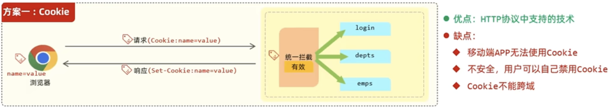

# 百度面试重点

##### babel webpack vuecli原理 优化

##### vue原理

##### vue3 ts 写法

##### nodejs nestjs

##### css

##### js手写

##### 算法

##### 项目

# 工程构建

## babel

* 解析(Parse)

  * 词法分析：将字符串形式的代码转换为令牌流tokens

    ```js
    [{
      type: [ExportedTokenType], // 令牌类型
      value: const,          // 令牌的文本值
      start: 11,                 // 令牌在源代码中的开始位置
      end: 11,                   // 令牌在源代码中的结束位置
      loc: [SourceLocation]      // 令牌在源文件中位置的信息
    }]
    ```

  * 语法分析：将令牌流转换为抽象语法树（AST）。AST 是一个深层的对象，以树的形式表示代码中的语法结构

* 转换(Transform)

  * 使用插件和预设
    * babel插件就是一个函数
      * 接收 `types` 模块作为参数：主要用于AST节点的创建和验证，不直接影响ast。
      * 返回一个对象，对象中包含想要访问的AST节点类型及其对应的处理函数。
        * 处理函数接收path参数
          * path中包含ast节点及其相关信息，用于操作ast节点（替换、删除、插入等），直接影响ast
  * 遍历 AST：
    * 在遍历的同时，使用各种插件和预设，修改AST节点，从而转换成成新的AST。
    * 遍历是通过访问者（visitor）模式完成的。每个插件都可以定义访问者，当遍历到特定类型的 AST 节点时，就会调用这些访问者。
  * 应用转换：这些转换可能包括添加、更新或删除节点

* 生成(Generate)

  * 生成代码：修改后的 AST 被转换回字符串形式的代码
  * 源码映射：Babel 还可以生成源码映射（source maps）。这些是特殊的文件，允许开发环境像调试转换前的代码一样调试转换后的代码。

## Webpack

### 原理

Tapable 为 webpack 插件提供了发布订阅的钩子。每个钩子代表一个关键的事件节点。

webpack 就是基于这种发布订阅的一系列的插件运行的事件流。

在 webpack 内部的 compiler 和 compilation 上面做 hooks 的调用。

插件有个 apply 方法，接收一个 compiler 参数。插件里面做 compiler 和 compilation 上的 hooks 的监听。

1. webpack 命令启动过程：用户运行webapck命令，判断用户是否安装 webpack-cli，没安装的话会提示安装，然后引入 webpack-cli 这个包并执行。`node_modules/webpack/bin/webpack.js` 

2. webpack-cli 脚手架：将命令行和 webpack.config.js 的配置解析组装成 webpack 可识别的配置，再加载 webpack 并将配置传入，开始编译。`node_modules/webpack-cli/lib/webpack-cli.js` webpack(options, callback编译完成的回调)

3. webpack 编译和构建流程：createCompiler(webpackOptions) 

   1. 接收配置 `node_modules/webpack/lib/webpack.js`

   2. 创建compiler（compiler负责整个构建流程和构建过程的生命周期） new Compile(options) `node_modules/webpack/lib/webpack.js`

      * 注册所有compiler hook `node_modules/webpack/lib/Compiler.js`

   3. **执行插件**（给插件传入compiler） `node_modules/webpack/lib/webpack.js`

      ```js
      for (const plugin of options.plugins) {
        if (typeof plugin === "function") {
          (plugin).call(compiler, compiler);
        } else if (plugin) {
          plugin.apply(compiler);
        }
      }
      ```

      1. 根据配置的不同环境，执行webpack内部相应的插件
      2. 执行用户配置中所有的插件（plugins）
      3. 执行webpack内部的一些默认插件

   4. 开始编译 `node_modules/webpack/lib/Compiler.js` compiler.run(() =>{ callback() })

      1. 生成各类模块 `node_modules/webpack/lib/NormalModuleFactory.js` compiler.compile() => compiler.newCompilationParams() => compiler.createNormalModuleFactory()
         1. 解析模块依赖关系 const { getContext } = require("loader-runner")
         2. 决定哪些加载器（loaders）应该应用于特定的模块 getContext(resourceData.resource)
      2. 编译核心步骤：
         1. 创建compilation（compilation负责单次构建的具体构建工作） `node_modules/webpack/lib/Compiler.js` compiler.newCompilation() => compilation.createCompilation()
            * 注册所有compilation hook  `node_modules/webpack/lib/Compilation.js`
         2. **运行loader**：解析文件，得到源码内容 `node_modules/webpack/lib/NormalModule.js` runLoaders()
         3. **解析AST**：将loader解析后的源码内容编译成ast或其他相关的解析数据 `node_modules/webpack/lib/NormalModule.js`  processResult(err, result.result)
         4. **构建依赖图**：同时递归构建依赖图 `node_modules/webpack/lib/util/AsyncQueue.js` buildDependencies.add(loader.loader);
         5. **收集模块代码到compilation.modules**：同时模块（及其解析结果）被添加到compilation对象的modules集合中 `node_modules/webpack/lib/Compilation.js `processResult(err, result.result)

   5. 编译结束 `node_modules/webpack/lib/Compilation.js`  callback()

      1. 分块（chunk）
      2. 代码优化（代码压缩、代码分割、tree shaking等）
      3. 生成哈希
      4. 生成代码资源：将compilation.modules里的内容放到compilation.assets上面

   6. 产出文件资源  `node_modules/webpack/lib/Compiler.js` processedAssets.add(this.assets);

### 热更新原理


### 编写loader

**概念**

loader 的作用是用来处理各种各样的静态资源。

loader 是一个导出为声明式函数的 javascript 模块，接收资源返回资源：

```js
const loaderUtils = require("loader-utils");
module.exports = function(source) { 
  // 参数获取
  const { name } = loaderUtils.getOptions(this);
  
  // 异常处理
  // 1.throw new Error('error');
  // 2.this.callback(new Error('error'), source);
  
  // 返回结果
  // 1.return source;
  // 2.this.callback(null, source, 1, 2); 可以返回多个值
  
  // 异步处理
  const callback = this.async();
  fs.readFile(path.join(__dirname, './demo.txt'), 'utf-8', (err, data) => {
    if (err) {
      callback(err, '');
    }
    callback(null, data);
  });
  
  // 缓存
  // webpack 中默认开启缓存，可以使用以下方法关闭缓存
  // 缓存生效条件：loader 的结果有确定的输出。有依赖的 loader 无法使用缓存。
  this.cacheable(false);
  
  // 文件写入
  const url = loaderUtils.interpolateName(this, "[name].[ext]", source);
  this.emitFile(url, source);
};
```

**loader-runner**

```js
import { runLoaders } from "loader-runner"; 
runLoaders({ 
  resource: “/abs/path/to/file.txt?query”, // String: 资源的绝对路径(可以增加查询字符串) 
  loaders: [“/abs/path/to/loader.js?query”], // String[]: loader 的绝对路径(可以增加查询字符串) 
  context: { minimize: true }, // 基础上下文之外的额外 loader 上下文 
  readResource: fs.readFile.bind(fs) // 读取资源的函数 
}, function(err, result) { 
  // err: Error? 
  // result.result: Buffer | String 
})
```

**raw-loader**

raw-loader 的功能是将一个文件的内容转换成一个 string。

```js
module.exports = function(source) { 
  const json = JSON.stringify(source)
  	.replace(/\u2028/g, '\\u2028') // 为了安全起见, ES6模板字符串的问题 
    .replace(/\u2029/g, '\\u2029');
  return `export default ${json}`; 
};
```

**自动合成雪碧图的 loader**

支持的语法：

background: url('a.png?__sprite')

​                                           						           -----》						background: url('sprite.png')

background: url('b.png?__sprite')

准备知识：如何将两张图片合成一张图片？

使用 spritesmith (https://www.npmjs.com/package/spritesmith) 

验证 spritesmith 功能是不是正常的 test.js:

```js
const path = require('path')
const fs = require('fs')
const Spritesmith = require('spritesmith')

const sprites = ['./loaders/image/1.jpg', './loaders/image/2.jpg']

// 合成图片
Spritesmith.run({src: sprites}, (err, result) => {
  console.log(result.image)
  console.log(result.coordinates)
  console.log(result.properties)
  // 把合成后的图片内容输出到磁盘
  fs.writeFileSync(path.join(__dirname, 'dist/sprite.jpg'), result.image)
})
```

开发 sprite-loader

run-loader.js:

```js
const fs = require("fs"); 
const path = require("path"); 
const { runLoaders } = require("loader-runner"); 

runLoaders( 
  { 
    resource: "./loaders/index.css", 
    loaders: [path.resolve(__dirname, "./loaders/sprite-loader")], 
    readResource: fs.readFile.bind(fs), 
	}, 
  (err, result) => (err ? console.error(err) : null) 
);
```

index.css:

```css
.img1 {
	background: url(./images/1.jpg?__sprite);
}
.img2 {
	background: url(./images/2.jpg?__sprite);
}
```

sprite-loader.js:

```js
const path = require('path')
const fs = require('fs')
const Spritesmith = require('spritesmith')

module.exports = function (source) {
  const callback = this.async()
  const imgs = source.match(/url\((\S*)\?__sprite/g)
  const matchedImgs = []
  
  for (let i = 0; i < imgs.length; i++) {
   	const img = imgs[i].match(/url\((\S*)\?__sprite/)[1]
    matchedImgs.push(path.join(__dirname, img))
  }
  
  Spritesmith.run({
    src: matchedImgs
  }, (err, result) => {
    // 正常开发是使用this.emitFile输出文件，但是loader-runner没有这个方法，所以这里用fs代替
    fs.writeFileSync(path.join(process.cwd(), 'dist/sprite.jpg'), result.image)
    source = source.replace(/url\((\S*)\?__sprite/g, match => {
      return `url("dist/sprite.jpg")`
    })
    fs.writeFileSync(path.join(process.cwd(), 'dist/index.css'), source)
    callback(null, source)
  })
}
```

### 编写plugin

**概念**

插件是伴随着 webpack 从初始化到最终的资源生成的过程的。

插件是一个类，有一个 apply 方法。

webpack 执行插件的时候会运行每一个插件上的 apply 方法，同时把 webpack 的 compiler 对象传进去，这样插件就具备监听 compiler hooks 的能力，通过 compiler.hooks 在不同的阶段可以做相应的事情。compiler里面又可以接收到complition。

```js
// 将一段代码输出到文件里面就可以用 RawSource
const { RawSource } = require("webpack-sources"); 
class MyPlugin {
  constructor(options) { 
    this.options = options; 
  }
  apply(compiler) {
    // 插件处理逻辑
    
    // 插件的错误处理
    // 1.throw new Error('error');
    // 2.通过 compilation 对象的 warnings 和 errors 接收
    //   compilation.warnings.push("warning");
    //   compilation.errors.push("error");

    // 文件写入
    // webpack 的构建流程的文件生成是在 emit 阶段，所以在插件里监听 compiler emit 这个 hooks。
    // 监听这个 hook 之后我们可以获取到 compilation 对象
    // 然后只需要将最终要输出的内容设置到 compilation.assets 对象上面去就可以了
    // 最终webpack生成文件的时候会触发emit，然后读取compilation.assets上的资源内容并输出到磁盘目录
    const { path } = this.options;
    compiler.hooks.emit.tapAsync("MyPlugin", (compilation, callback) => { 
      compilation.assets[path] = new RawSource("demo"); 
      callback();
    }); 
  } 
}
module.exports = MyPlugin;
```

**插件的插件**

webpack 的插件是特别的强大的，除了通过插件来扩展 webpack 的能力，插件自身也可以通过暴露 hooks 的方式进行自身扩展。

以 html-webpack-plugin 为例，它暴露出来的 hooks： 

* html-webpack-plugin-alter-chunks (Sync) 
* html-webpack-plugin-before-html-generation (Async) 
* html-webpack-plugin-alter-asset-tags (Async) 
* html-webpack-plugin-after-html-processing (Async) 
* html-webpack-plugin-after-emit (Async)

**压缩构建资源为 zip 包的插件**

Node.js 里面将文件压缩为 zip 包：使用 jszip (https://www.npmjs.com/package/jszip)

jszip 使用示例

```js
var zip = new JSZip(); 

zip.file("Hello.txt", "Hello World\n"); 

var img = zip.folder("images"); 
img.file("smile.gif", imgData, {base64: true}); 

zip.generateAsync({type:"blob"}).then(function(content) { 
	// see FileSaver.js 
	saveAs(content, "example.zip"); 
});
```

zip-plugin.js:

```js
const JSZip = require('jszip');
const path = require('path');
const RawSource = require('webpack-sources').RawSource;

const zip = new JSZip();

module.exports = class ZipPlugin {
  constructor(options) {
    this.options = options;
  }
  apply(compiler) {
    compiler.hooks.emit.tapAsync('ZipPlugin', (compilation, callback) => {
      const folder = zip.folder(this.options.filename);
      for (let filename in compilation.assets) {
        const source = compilation.assets[filename].source();
        folder.file(filename, source);
      }

      zip.generateAsync({
        type: 'nodebuffer'
      }).then((content) => {
        const outputPath = path.join(
          compilation.options.output.path, 
          this.options.filename + '.zip'
        );

        const outputRelativePath = path.relative(
          compilation.options.output.path,
          outputPath
        );
        compilation.assets[outputRelativePath] = new RawSource(content);
        callback();
      });
    });
  }
}
```

## Vuecli

vue3 setup 获取组件实例   getCurrentInstance

node 开启多线程   worker thread

node的异步任务队列

cors预检请求

wasm

算法：全排列

### 原理

1. npm run serve
2. vue-cli-service serve
   1. new Service('context')
      1. 获取package.json（目的是获取依赖包插件）
      2. 加载插件
         1. 命令插件
         2. 配置插件
         3. 依赖包插件（cli-plugin-babel/cli-plugin-eslint）
   2. 解析命令行参数（serve/build）
   3. service.run()
      1. 确定环境（development/production）
      2. service.init(mode)
         1. 加载环境变量配置文件（确定环境，并给process.env.NODE_ENV赋值）
         2. 组合默认和用户配置（vue.config.js）
         3. 运行插件，并传入插件api和配置
            1. 命令配置：注册命令，传入回调
            2. 配置插件：加载对应配置
            3. 依赖包插件：引入并执行
      3. 执行命令插件回调
         1. 将vuecli配置转换成webpack配置，并加入devServer相关配置
         2. 创建webpack compiler开始编译
         3. 创建devServer


### vuecli默认配置

默认配置：

* loader
  * vue：vue-loader catch-loader
  * 图片：file-loader url-loader
  * 媒体资源：file-loader url-loader
  * 字体：file-loader url-loader
  * pug：pug-plain-loader raw-loader
  * css：`vue-style-loader` `css-loader` `postcss-loader` `sass-loader` `less-loader` `stylus-loader` `mini-css-extract-plugin` `autoprefixer`
  * js：`babel-loader` `eslint-loader` `thread-loader` ` catch-loader`内部使用cli-plugin-babel和cli-plugin-eslint
* optimization
  * splitChunks：code spliting
  * minimizer：js压缩混淆，内部采用TerserPlugin
* plugins
  * VueLoaderPlugin：解析和转换 Vue 单文件组件的 webpack 插件
  * DefinePlugin：设置环境变量
  * MiniCssExtractPlugin：css提取
  * OptimizeCssnanoPlugin：优化和压缩 CSS 的工具
  * HtmlWebpackPlugin：构建过程中生成一个 HTML 文件
  * PreloadPlugin：资源预加载preload prefetch
  * FriendlyErrorsWebpackPlugin：在终端中友好显示 Webpack 构建错误和警告
  * CopyPlugin：将public目录内容完整复制到dist目录

**最佳实践**

```js
module.exports = {
  // 1.webpack基础配置
	publicPath: '/',
  outputDir: 'dist',
  assetsDir: 'static',
  lintOnSave: process.env.NODE_ENV === 'development',
  productionSourceMap: false,
  
  // 2.devServer
  devServer: {
    // 端口
    port: port,
    // open: true,
    overlay: {
      warnings: false,
      errors: true
    },
    // 代理
    proxy: {
      '/api': {
        target: 'http://heimahr.itheima.net/',
        changeOrigin: true,
      }
    }
  },
  // 3.configurewebpack
  configureWebpack: {
    // 项目名称
    name: name,
    // cdn外链
    externals: externals,
    resolve: {
      // 设置别名
      alias: {
        '@': resolve('src')
      }
    }
  },
  // 4.chainWebpack
  chainWebpack(config) {
		// svg-sprite-loader
    // 优化
  }
}
```

### 优化

体积优化成果：优化前2,361k(2.3M) => css摇树 2,236k(2.1M)  => echarts按需导入 1,655k(1.6M) => 图片压缩1545k(1.5M) 

体积优化：

1. runtime内联
2. 按需导入：element、echarts等大包（echarts减少565k）
3. 预加载资源优化：去除默认的prefetch
4. code spliting：将vendor中比较大的包继续拆分，比如echarts、element。
5. tree shaking：purifycss完成css摇树（将css从269k优化到96k）
6. cdn外链：打包进行外链vue、xlsx
7. 图片压缩：image-webpack-loader（9张图片由396k压缩到147k）

构建速度优化：

1. 尽可能使用高版本的 webpack 和 Node.js
2. 优化文件查找路径（vuecli默认已经配置，使用webpack resolve）
   * 设置vue别名
   * 设置指定node_modules目录位置，减少模块所有层级
   * 缩小文件后缀查找范围
3. 多进程构建和代码压缩（vuecli默认已经配置生产环境开启）
4. 利用缓存提升二次构建速度（vuecli默认已经配置开启，使用cache-loader）

## vite

**Webpack**

1. 打包方式：Webpack 是一个模块打包器（bundler）。它通过递归地构建一个依赖图，包含应用程序中所需的每个模块，然后将所有这些模块打包成一个或多个 bundle（通常是 JavaScript 文件）。
2. 转译过程：Webpack 使用 loader 来处理非 JavaScript 文件（如 CSS、图片、字体等），并且经常结合 Babel 一起使用以转译 JavaScript 代码（如将 ES6+ 转换为兼容旧浏览器的代码）。
3. 开发模式：在开发模式下，Webpack 提供了热模块替换（Hot Module Replacement, HMR）等功能，但仍需要打包和服务整个应用，可能导致较慢的启动和热更新速度。
4. 优化和插件：Webpack 提供了广泛的优化选项和插件系统，可以高度定制打包过程。

**Vite**

1. 打包方式：Vite 在开发模式下不使用传统的打包方法。它利用现代浏览器的原生 ES 模块支持，可以直接在浏览器中加载模块。这意味着启动速度更快，因为 Vite 只需为请求的文件进行转换和加载。
2. 转译过程：Vite 在开发时使用 [esbuild](https://esbuild.github.io/) 进行 JavaScript 和 TypeScript 的快速转译。esbuild 使用 Go 编写，速度远快于基于 JavaScript 的传统工具。以及对js或ts进行优化、压缩、Tree Shaking。
3. 开发模式：由于 Vite 在开发时不进行打包，它提供了极快的热更新速度和启动时间。
4. 生产构建：尽管在开发模式下 Vite 不进行打包，但它在生产构建中使用 Rollup 进行高效的打包。Rollup 作为生产打包器，为最终部署提供了优化的包。
5. 优化和插件：Vite 同样支持插件系统，但由于其不同的架构，插件的种类和用法可能与 Webpack 不同。

**总结**

- Webpack适合于需要高度定制和优化的复杂项目，其生态系统成熟，提供了广泛的插件和加载器。
- Vite侧重于快速的开发体验和简单的配置，特别适合于现代浏览器优先的项目和快速原型开发。

## Uniap

UniApp 的底层编译过程涉及到一系列工具和流程，主要分为以下几个步骤：

1. **解析和编译Vue文件**：UniApp的开发者主要使用Vue.js编写代码，而Vue文件通常包含HTML、CSS和JavaScript部分。UniApp的编译过程首先涉及解析Vue文件，将其拆分为模板、样式和脚本。
2. **生成AST（抽象语法树）**：编译器会将解析得到的代码转换为AST，这是一种树形结构表示源代码的方式。AST便于进一步的静态分析和代码转换。
3. **平台适配处理**：UniApp的编译器会根据目标平台进行适配处理。它会根据配置和目标平台的要求，生成对应平台的代码。这可能包括对组件、API调用和特定平台的逻辑进行适配。
4. **条件编译**：UniApp支持条件编译，这意味着可以在代码中添加条件判断，根据不同平台或条件编译选项选择性地包含或排除代码块。这有助于处理在不同平台上需要定制的部分。
5. **插件处理**：UniApp支持插件系统，开发者可以使用插件来扩展框架功能。在编译过程中，编译器会处理插件，并将插件的功能集成到最终的编译结果中。
6. **资源管理和打包**：编译器处理应用所需的各种资源，如图片、字体、样式表等。这些资源可能需要进行优化、压缩，并最终被打包到应用中。
7. **生成目标平台代码**：最终，编译器会生成目标平台的代码，例如生成适用于iOS的Objective-C或Swift代码，适用于Android的Java或Kotlin代码，适用于Web的HTML、CSS和JavaScript代码，以及适用于各种小程序平台的代码。
8. **代码打包和压缩**：生成的代码会被打包成最终的应用程序文件。这可能包括对代码的压缩、混淆等步骤，以提高应用的性能和安全性。

总体来说，UniApp的编译过程涵盖了从源代码到最终应用文件的多个阶段，确保了开发者编写的代码可以在不同平台上运行。这种跨平台的设计使得UniApp可以在多个移动端和Web平台上实现一次编写，多处运行的目标。

# Vue

## vue2原理

* 模版编译：编译的结果是得到 render 函数并放入配置中。

  * 解析：ast = parse(template.trim(), options)
    * HTML解析器
    * 文本解析器
    * 过滤器解析器。
  * 优化：optimize(ast, options)
    * 在 AST 中标记静态子树：patch 时，可以跳过静态子树，提高性能。
  * 生成：code = generate(ast, options)
    * 把 AST 转换成代码字符串，传入 new Function(code) 中得到 render 函数。

* 实例化：将配置传入构造函数中，实例化一个根组件（Vue）实例或自定义组件（VueComponent）实例。

  * 初始化 _init：
    * 合并选项
    * initLifecycle(vm)：声明组件实例的 $parent, $root, $children, $refs
    * initEvents(vm)：对父组件传入的自定义事件添加监听
    * initRender(vm)：声明了 $slots, $createElement就是那个h，对$attrs, $listeners 做了响应化处理。
    * callHook(vm, 'beforeCreate')
    * initInjections(vm)：获取祖辈的注入数据
    * initState(vm)：初始化响应式数据 initProps, initMethods, initData, initComputed, initWatch
      * initData：数据响应式，有几个对象数据（包括data）就有几个 Observer 实例，dep 的数量是对象数据个数（包括 data） + data  内所有 key 的数量，几个组件就有几个 Watcher。
        * 数据命名冲突校验
        * 数据代理
        * 执行 observe，传入 data
          * 创建 Observer 实例
            * 创建对象数据的 dep。$set, array 那七个变更数组方法时会使用到这个的 dep 中存放的依赖来做通知更新。
            * 创建每个 key 对应的 dep。
            * 分别做数组和对象的响应化处理。
            * getter：分别对每个 key 的 dep 和对象数据的 dep 做依赖收集，收集的都是组件 Watcher
            * setter：劫持数据变化
              * dep.notify()：通知更新
              * 批量异步更新：将 dep 中收集的所有 Watcher 的更新函数批量异步的执行一遍。
                * watcher.update()
                * queueWatcher()
                * nextTick()
                * timerFunc()
                * flushSchedulerQueue()
                * watcher.run() 
                * watcher.get()
                * updateComponent()
    * initProvide(vm)：给后代提供数据
    * callHook(vm, 'created')
    * 最后判断选项里如果有 el，自动执行 $mount。

* 挂载 $mount

  * 执行 mountComponent

    * callHook(vm, 'beforeMount')

    * 声明更新函数 updateComponent

      * 执行 _render

        * render（配置中的 render）
          * createElement：h 方法，传入 tag, data, children 等
            * 原生标签：创建 vnode 并返回
            * 自定义组件：createComponent
              * 获取组件配置
              * 根据组件配置，获取组件构造函数
              * 安装组件管理钩子到该组件的 vnode 上。
                * init：组件初始化，创建组件实例，挂载。patch 时执行 init。
                * prepatch：组件更新之前执行，patch 之前的一些工作
                * insert：组件创建完插入 dom 元素里，调用子组件的 mounted 生命周期
                * destroy：组件销毁相关工作
              * 创建 vnode 并返回

      * 执行 _update，传入  vnode。

        * patch

          * new vnode 不存在就删除

          * old vnode 不存在就新增

            * createElm

          * 都存在

            * oldVnode 是原生标签

              * createElm：创建新节点，把 vnode 创建成 DOM 元素，并替换老节点，然后递归创建子元素和子组件。
                * createComponent：如果要创建的是组件，走这个流程
                  * 获取创建组件 vnode 时安装的 init 组件管理钩子并执行：创建组件实例并挂载。
                  * insert：子组件 DOM 树插入父组件的 DOM 树上。
                * 原生标签的创建：
                  * 把 vnode 创建成真实的 DOM，createChildren 递归创建子元素
                  * insert：子组件 DOM 树插入父组件的 DOM 树上。

            * oldVnode 不是原生标签 && 是同一个 vnode 节点

              * patchVnode：执行 diff 更新。

                有孩子先比孩子调用 updateChildren，updateChildren 中还会调用 patchVnode，一直向下递归，将每个 vnode 节点都 patch 一遍。

                每个节点比较的和更新的就是三件事：属性更新，文本更新，子节点更新：

                * isPatchable(vnode)：节点本身的 patch 操作，属性更新。

                * 都无子节点：只是文本的替换。

                * 只有新有子节点：先清空老文本内容，然后为其新增子节点。 

                * 只有老有子节点：移除该节点的所有子节点。

                * 新老均有子节点：对子节点进行 Diff 操作，调用 updateChildren。

                  * updateChildren

                    * 设置双指针，首尾都没有找到相同的节点还是要做双循环。最后根据新老 vnode 的节点剩余情况做相应的新增或删除工作。

                      * 找到相同的节点调用 patchVnode（递归：深度优先）

                      * 移动节点位置（实际的 dom 操作），移动指针做下一个节点的对比（同级比较）

          * invokeInsertHook：调用组件管理钩子 insert。里面调用了 mounted 生命周期钩子。

    * 创建组件 Watcher，传入 updateComponent

      * 执行 updateComponent

    * callHook(vm, 'mounted')

## vue-router原理

1. 声明VueRouter类

   1. 获取用户配置（routes）
   2. 使用defineReactive生命一个VueRouter实例的响应式数据current
   3. 监听地址栏变化hashchange或popstate事件，获取最新路由地址赋值给current
   4. 循环routes，创建路由映射表（path：route）

2. 插件实现

   1. 使用Vue.mixin和beforeCreate挂载$router
   2. 注册全局组件router-link和router-view

3. 实现router-link组件

   1. 接收props.to
   2. 使用render函数渲染一个a标签：`h('a', { attrs: { href: '#' + this.to } }, this.$slots.default);`

4. 实现router-view组件

   ```js
   export default {  
     render(h) {    
       // 获取path对应的component    
       const { routeMap, current } = this.$router; 
       const component = routeMap[current].component || null;  
       return h(component);
     }
   }
   ```

   1. 从this.$router中获取路由映射表和当前路由：`const { routeMap, current } = this.$router; `
   2. 使用当前路由从路由映射表中取出当前需要渲染的组件：`const component = routeMap[current].component || null; `
   3. 使用render函数渲染组件：`h(component)`

## vuex原理

1. 声明Store类，接收配置参数options：state gettes mutations actions

   1. 声明state只读访问器属性 get，set给出错误提示
   2. 使用new Vue，将state和getters做响应式处理
   3. 声明commit方法，接收type和payload，获取要提交的mutation并调用，同时传入state和payload `this.options.mutations[type](this.state, payload)`
   4. 声明dispatch方法，接收type和payload，获取要提交的action并调用，同时传入this和payload

   `this.options.actions[type](this, payload)`

2. 插件实现

   1. 使用Vue.mixin和beforeCreate挂载$store

## vue2和3的区别

* 响应式api变化
  *  Proxy提供了更多拦截点，能够更精确地捕捉对对象的操作。比如：无需使用$set
  * 初始化阶段无需遍历所有数据进行数据拦截，因此在初始化时的性能开销较小。
* 模块化和Tree-shaking
  * vue3设计上更具模块化，使用什么引入声明，没用到的内容会被Tree-shaking掉，所以包装项目体积更小
* Composition API
* 模板语法改进
  * 组件无需唯一根元素
  * v-model语法变化
  * setup语法糖
* 友好的ts支持
* 状态管理：可以配合更好用的pinia
* 构建使用vite，更具优势

## vuex和pinia本质区别

**vuex**

1. Mutation 和 Action： Vuex 使用 mutations 和 actions 来更改和操作状态。Mutations 是同步的，而 Actions 可以是异步的。
2. Module System： Vuex 支持模块系统，可以将状态拆分成多个模块，每个模块有自己的 state、mutations、actions 等。
3. 插件和中间件： Vuex 支持使用插件和中间件来扩展和定制其功能。
4. 官方状态管理： Vuex 是 Vue.js 的官方状态管理库，与 Vue.js 深度集成，通常与 Vue Router 和 Vue 组件的生命周期等一同使用。

**pinia**

1. Vue 3 Composition API： Pinia 是专为 Vue 3 Composition API 设计的状态管理库。它借助 Composition API 的特性，提供更直观、灵活和功能强大的状态管理。
2. 使用 Store Class： Pinia 中状态的创建通过定义一个 Store 类，这个类中包含了状态、getters、mutations、actions 等。这种方式更加面向对象，更符合现代 JavaScript 的设计理念。
3. Reactivity API： Pinia 使用 Vue 3 的响应式 API，借助 `ref`、`reactive` 等 API 来实现对状态的响应式处理。
4. 零依赖： Pinia 是一个零依赖的库，不依赖 Vue Router 或 Vuex。这使得它可以更轻量地集成到项目中，根据需要进行灵活的选择。

# ts

## 泛型

## 装饰器

**概念**

装饰器：以声明性的方式附加元数据和修改类及其成员的行为，增强代码的可读性和可维护性。

typescript中，装饰器本身就是一个函数。这些函数可以接收一到多个参数，具体取决于装饰的位置和类型。需要给装饰器传递参数时，要在装饰器内部返回一个函数。

装饰器的执行顺序：是由底层（参数）到顶层（类）的，这意味着参数装饰器先执行，然后是访问器、属性、方法和类装饰器。

```ts
// 类装饰器
function ClassDecorator(target: Function) {
  // target 是被装饰的类的构造函数
}
// 方法装饰器
function MethodDecorator(target: any, key: string, descriptor: PropertyDescriptor) {
  // target 是被装饰的类的原型
  // key 是被装饰的方法的名称
  // descriptor 是该方法的属性描述符
}
// 属性装饰器
function PropertyDecorator(target: any, key: string) {
  // target 是被装饰的类的原型
  // key 是被装饰的属性的名称
}
// 访问器装饰器
function AccessorDecorator(target: any, key: string, descriptor: PropertyDescriptor) {
  // target 是被装饰的类的原型
  // key 是被装饰的访问器的名称
  // descriptor 是该访问器的属性描述符
}
// 参数装饰器
function ParameterDecorator(target: any, key: string, parameterIndex: number) {
  // target 是被装饰的类的原型
  // key 是被装饰的方法的名称
  // parameterIndex 是被装饰的参数的索引
}

// 应用装饰器
@ClassDecorator
class MyClass {
  @PropertyDecorator
  myProperty: string;

  @AccessorDecorator
  get myAccessor() {
    return this.myProperty;
  }

  @MethodDecorator
  myMethod(@ParameterDecorator param: string) {
    console.log(param);
  }
}
```

**ts实现一个装饰器函数，可以用来装饰一个目标函数，经过装饰后的函数在调用前打印 start,调用后打印end**

```ts
// 装饰器函数
function logStartEnd(target: any, key: string, descriptor: PropertyDescriptor): PropertyDescriptor {
  const originalMethod = descriptor.value;

  // descriptor.value被装饰的内容（该例就是被装饰的函数体本身）
  descriptor.value = function (...args: any[]) {
    console.log('start'); // 在调用前打印 "start"
    
    const result = originalMethod.apply(this, args);
    
    console.log('end');   // 在调用后打印 "end"
    
    return result;
  };
	
  //为了装饰器之间的链式调用，下一个装饰器会获取该装饰器返回的descriptor
  return descriptor;
}

// 使用装饰器
class Example {
  @logStartEnd
  exampleMethod() {
    console.log('Inside the example method.');
  }
}

// 创建 Example 实例
const exampleInstance = new Example();

// 调用被装饰后的方法
exampleInstance.exampleMethod();
```

# NodeJS

**概念**

* NodeJS是一个运行在服务端的js解析器。

* 采用事件机制和异步IO，从而实现高性能Web服务器。

* node采用一个长期运行的进程，是单线程的。

* 使用NodeJS编写的东西，要么是一个包，要么是一个命令行程序。

**模块**

* require：在当前模块中加载和使用别的模块
* exports：是当前模块的导出对象，用于导出模块公有方法和属性。
* module：替换当前模块的导出对象。

**模块路径解析规则**

1. 内置模块

   如果传递给`require`函数的是NodeJS内置模块名称，不做路径解析，直接返回内部模块的导出对象，例如`require('fs')`。

2. node_modules目录

   NodeJS定义了一个特殊的`node_modules`目录用于存放模块。例如某个模块的绝对路径是`/home/user/hello.js`，在该模块中使用`require('foo/bar')`方式加载模块时，则NodeJS依次尝试使用以下路径。

   ```
    /home/user/node_modules/foo/bar
    /home/node_modules/foo/bar
    /node_modules/foo/bar
   ```

3. NODE_PATH环境变量

   与PATH环境变量类似，NodeJS允许通过NODE_PATH环境变量来指定额外的模块搜索路径。NODE_PATH环境变量中包含一到多个目录路径，路径之间在Linux下使用`:`分隔，在Windows下使用`;`分隔。例如定义了以下NODE_PATH环境变量：

   ```
    NODE_PATH=/home/user/lib:/home/lib
   ```

   当使用`require('foo/bar')`的方式加载模块时，则NodeJS依次尝试以下路径。

   ```
    /home/user/lib/foo/bar
    /home/lib/foo/bar
   ```

**nodejs模块查找策略：**

1. 文件作为模块：

   * 相对路径
   * 绝对路径

   * 核心模块
   * 从 `node_modules` 中加载模块（https://www.nodejs.com.cn/api/packages.html）
     * 首先检查模块的 `package.json` 文件中，`exports`、`module` 或 `main`字段指定的入口点文件。书写顺序即优先级。
     * 如果 `package.json` 中没有指定或不存在，则默认查找模块根目录下的 `index.js` 文件。

2. 目录作为模块：查找目录中的package.json中的main字段，如果没有就加在目录中的index文件。

**cjs和esm的区别：**

1. CommonJS (CJS):
   - 使用场景：主要用于 Node.js。
   - 导入导出：使用 `require()` 导入模块，`module.exports` 导出。
   - 特点：
     1. 基于运行时的加载方式所以不支持静态分析和摇树。
     2. CJS设计成同步的，主要是因为它最初是为服务器端环境（如 Node.js）开发的，其中模块通常在程序启动时一次性加载。在这种环境下，同步加载简化了模块管理，因为它保证了代码在执行任何操作之前模块就已经完全加载和可用。这种设计减少了编程复杂性，并确保了代码的执行顺序和模块依赖的清晰性。同步模式在服务器端应用中通常是可接受的，因为所有资源通常都是本地可用的，所以不会引起显著的性能问题。
2. ECMAScript Modules (ESM):
   - 使用场景：既可用于浏览器也可用于 Node.js。
   - 导入导出：使用 `import` 和 `export` 语句。
   - 特点：
     1. 基于编译时的加载方式。这意味着模块的导入和导出在代码编译阶段就已经确定，而不是在运行时。这种静态结构使得编译器和打包工具可以在代码执行之前分析模块依赖关系，从而实现优化，如摇树（tree-shaking）和代码拆分
     2. 这也使得 ESM 能够支持异步加载模块，提高了模块管理的灵活性和效率。

**文件操作**

1. fs：对文件属性和内容的读写操作，读写的是字符串或二进制数据
2. buffer：对二进制数据的操作的全局构造函数。
3. stream：对数据持续不断地进行读写时，使用流更加高效和安全。

**网络操作**

http模块提供两种使用方式：

- 作为服务端使用时，创建一个HTTP服务器，监听HTTP客户端请求并返回响应。
- 作为客户端使用时，发起一个HTTP客户端请求，获取服务端响应。

# 国际化

前端国际化（Internationalization，简称 i18n）是指在前端应用中对多种语言和地区的支持，以便用户可以根据其首选语言和文化习惯使用应用。前端国际化的目标是使应用能够在全球范围内更具可访问性和用户友好性。

## 前端国际化实现

1. 使用国际化库： 常见的国际化库如 `i18next`、`react-intl`、`vue-i18n` 等，它们提供了一套 API 和工具，使得在应用中实现多语言变得更加容易。

2. 资源文件管理： 将不同语言的文本信息抽离到资源文件中，每个语言一个文件。这样，根据用户的语言设置，加载对应的资源文件，实现多语言切换。

3. HTML 标签的 `lang` 属性： 在 HTML 标签中添加 `lang` 属性，指定文档的主要语言。这有助于搜索引擎正确解析内容并为用户提供适当的语言版本。

   ```html
   <html lang="en">
   ```

4. 动态替换文本内容： 在应用中使用变量或占位符来表示需要翻译的文本，然后根据用户选择的语言动态替换这些文本。

   ```js
   // 示例使用 JavaScript 动态替换文本
   const greeting = 'Hello, {name}!';
   const translatedGreeting = greeting.replace('{name}', 'John');
   ```

5. 日期、时间和货币格式化： 考虑到不同语言和地区对日期、时间和货币格式的不同需求，使用相应的库或内置函数进行格式化。

6. 语言切换组件： 在应用中提供一个语言切换的组件，让用户能够方便地选择自己喜欢的语言。

7. 根据浏览器设置默认语言： 可以通过检测浏览器的 `navigator.language` 或 `navigator.languages` 属性，来设置应用的默认语言。

8. 处理复数和性别： 一些语言需要根据复数或性别来调整翻译，因此国际化库通常也提供了处理这些情况的方法。

示例代码（使用 `react-intl` 实现国际化）：

```react
import { IntlProvider, FormattedMessage } from 'react-intl';

const messages = {
  en: {
    greeting: 'Hello, {name}!',
  },
  fr: {
    greeting: 'Bonjour, {name} !',
  },
};

function App({ locale }) {
  return (
    <IntlProvider locale={locale} messages={messages[locale]}>
      <div>
        <FormattedMessage id="greeting" values={{ name: 'John' }} />
      </div>
    </IntlProvider>
  );
}
```

上述示例中，`IntlProvider` 提供了对应语言的文本信息，`FormattedMessage` 根据当前语言动态替换文本。

## i18n常见问题

1. 文本提取与更新困难：
   - 问题： 在应用中的文本分散在各个组件和文件中，提取和更新文本变得困难。
   - 解决方案： 使用专门的国际化工具或库，这些工具可以帮助提取文本、生成翻译文件，并支持动态更新。
2. 多语言切换性能问题：
   - 问题： 切换语言时，加载大量翻译文件可能导致性能问题。
   - 解决方案： 考虑使用按需加载翻译文件的策略，或者使用服务端渲染（SSR）来提前生成包含所需语言翻译的页面。
3. 日期、时间和货币格式化不一致：
   - 问题： 不同语言和地区对日期、时间和货币的格式要求不同。
   - 解决方案： 使用国际化库提供的格式化函数，以便根据当前语言环境动态调整格式。
4. 复数形式和性别问题：
   - 问题： 一些语言对于复数和性别的表达方式有特殊规则。
   - 解决方案： 使用国际化库提供的工具来处理复数和性别，确保正确的翻译形式。
5. SEO 和搜索引擎优化问题：
   - 问题： 在应用中使用了客户端渲染，可能会影响搜索引擎优化（SEO）。
   - 解决方案： 对于需要 SEO 的页面，考虑使用服务器端渲染（SSR）或预渲染来生成包含翻译文本的 HTML。
6. 对 RTL 语言的支持：
   - 问题： 一些语言（如阿拉伯语、希伯来语）是从右到左（RTL）书写的，而其他是从左到右（LTR）的。
   - 解决方案： 使用 CSS 样式或者国际化库提供的 RTL 支持，确保在需要时正确渲染页面。
7. 翻译的一致性问题：
   - 问题： 翻译文件可能由不同人员负责，导致一致性问题。
   - 解决方案： 使用翻译管理工具，确保所有翻译人员都有一致的术语表和翻译规范。
8. 测试难度：
   - 问题： 在多语言应用中进行全面的测试可能会更具挑战性。
   - 解决方案： 创建包含所有支持语言的测试用例，以确保每个语言环境都能正确地显示和交互。
9. 动态内容的处理：
   - 问题： 一些文本可能是由后端生成的动态内容，难以通过前端国际化库处理。
   - 解决方案： 在后端尽量提供本地化的文本，或者通过 API 传递当前语言信息，以便前端动态替换文本。
10. 国际化库的选择：
    - 问题： 选择合适的国际化库可能会因项目需求、团队熟悉度和性能等因素而有所不同。
    - 解决方案： 评估各个国际化库的功能、性能和社区支持，选择符合项目需求的库。

# 工作流

## CICD

* 私有仓库（gitlab）

  * 安装GitLab
  * 修改gitlab访问地址
  * 启动gitlab
  * 访问gitlab web页面
  * 创建项目
  * 添加用户
  * 在项目中，拉取成员

* CICD

  * gitlab-runner

    * 安装gitlab-runner
    * 获取注册令牌
    * 注册gitlab-runner
      * 实例URL
      * 令牌
      * runner名称
      * 执行器（例如 `shell`、`docker` 等）
    * 运行gitlab-runner

  * 流水线

    * 定义流水线

      * stages（阶段）
      * job（作业）

      ```yml
      stages:
        - build
      cache:
        key: ${CI_BUILD_REF_NAME}
        paths:
          - node_modules/
      
      build-140:
        stage: build
        only:
          - master
        script:
          - rm -rf node_modules/
          - pnpm i
          - pnpm build
          - rm -rf /home/patient-h5-preview
          - mkdir /home/patient-h5-preview
          - cp -r dist/* /home/patient-h5-preview
          - cd /home/patient-h5-preview
          - pm2 delete patient-h5-preview || echo no
          - pm2 serve --spa ./ 8083 --name patient-h5-preview
        tags: 
          - patient-h5-preview
      ```

    * 提交并观察

## Git

**版本回退**

* 撤回工作区的内容，也就是还没 add 和 commit

  `git checkout -- readme.txt` 让这个文件回到最近一次 git commit 或 git add 时的状态，就是撤销工作区的修改

* 撤回暂存区的内容，也就是已经 add 了

  `git reset HEAD readme.txt`

* 撤回分支上的版本，也就是已经 commit

  * 退回到上一个提交的版本： `git reset --hard HEAD^`
  * 回退到指定版本：`git reset --hard 1094adb`

**rebase merge区别**

git merge：

1. 非线性历史：

   *  `merge` 的结果是一个非线性历史，会保留原始分支的所有提交历史记录。

   *  合并时，它会创建一个新的“合并提交”，这个提交有两个父提交：一个是当前分支的最后提交，另一个是被合并分支的最后提交。

2. 冲突处理：如果在合并过程中出现冲突，这些冲突必须在创建合并提交之前解决。手动解决冲突之后要再次做 add 和 commit操作。 
3. 适用场景：对于团队合作和共享分支（如 `master` 或 `develop`），`merge` 是更受欢迎的选择，因为它保留了完整的历史记录和分支的结构。

git rebase：

1. 线性历史：
   * `rebase` 的结果是一个线性历史，会修改合并过来的分支的提交历史。
   * 合并时，首先找到两个分支的基底，然后将合并过来的分支的提交分别做修改（修改hash），依次放入要合入的分支后面。它看起来就像所有的更改都是按顺序在一个分支上发生的，这使得历史看起来更简洁、更直观。
2. 冲突处理：如果在合并过程中出现冲突，这些冲突必须在创建合并提交之前解决。在 `rebase` 过程中解决的任何冲突都会被包含在重新创建的提交中，而不是像 `merge` 那样在单独的合并提交中。手动解决冲突后要将做 add 和 git rebase --continue 操作，来继续rebase。
3. 适用场景：通常用于整理本地分支的历史，或者在将本地分支的更改合并到共享分支之前。

**git原理**

Git 是一个分布式版本控制系统，广泛用于源代码管理。它的设计哲学是使源代码的管理既高效又灵活。Git 的核心原理包括：

1. 快照，而非差异
   * Git 与其他版本控制系统的主要区别在于其数据模型。其他系统（如 SVN）存储信息作为文件列表和每个文件随时间的改变（即差异）。
   * Git 存储的是项目历史中每个版本的“快照”。每次提交或保存项目状态时，Git 实际上是将一份当前工作目录的快照记录下来。
   * 存储优化
     * Git 通过存储快照和执行内部数据压缩（如打包和压缩）来优化存储。这意味着即使在存在多个分支时，仓库的大小也不会快速增长。
     * 当多个分支共享相同的历史时，Git 可以有效地重用数据，而不是为每个分支重复存储相同的信息。

2. 分布式版本控制
   * Git 是分布式的，每个工作副本都是一个完整的仓库，具有完整的历史记录和版本跟踪能力，不依赖于网络访问或中央服务器。
   * 这意味着即使在离线状态下，你也可以提交更新、创建分支、查看历史等。

3. 数据完整性
   * Git 在内部使用 SHA-1 哈希算法来保证文件和目录状态的完整性。每个文件和目录都有一个唯一的哈希值（称为 blob），这确保了数据不被篡改。
   * 提交记录也通过哈希保护，确保历史记录的不可篡改性。

4. 分支和合并
   * Git 的一个核心特性是其轻松、快速的分支管理。Git 鼓励开发者频繁地创建和合并分支。
   * 分支在 Git 中是非常轻量级的，本质上只是指向特定提交的指针。
   * 合并操作也相对高效，特别是 Git 的“快进”合并。
   * 分支和合并高效的原理：指针
     * 在 Git 中，可以说有两类主要的指针：引用（分支指针等）和 HEAD。引用又可以分为几种不同的类型，包括分支、标签和远程跟踪分支。
       * 分支指针：每个分支都有一个指针，指向该分支上的最新提交。
       * HEAD指针
         * 附加的 HEAD：它指向当前仓库中的一个分支。在这种状态下，`HEAD` 实际上是一个指向分支引用的指针
         * 分离的 HEAD：当 `HEAD` 是分离的，它直接指向一个特定的提交，而不是指向分支。
       * 分支指针和HEAD指针关系
         * HEAD指针指向分支指针，分支指针指向提交
         * 每次提交，分支指针都会向前移动一步，HEAD指针也随之向前移动
         * 版本回退，就是将分支指针和HEAD指针同时挪动到指定的提交。
         * 切换分支就是切换HEAD指针指向的分支指针

5. 区域性操作
   * 许多操作（如提交、分支、合并、查看历史）都是本地执行的，这使得 Git 非常快速。
   * 与中央集中式系统不同，大多数操作不需要远程通信。

6. Staging Area（暂存区）
   * Git 提供了一个称为 "staging area" 或 "index" 的区域，这使得你可以继续工作而不会立即提交所有更改。
   * 你可以先集中一些相关的更新，然后一起提交，这有助于保持历史记录的清洁和理解性。

7. Git 对象
   * Git 存储数据时使用几种主要类型的对象：blob（用于存储文件数据），tree（类似于目录，用于组织 blob），commit（包含指向 tree 对象的指针、作者、提交者信息、日志消息等），tag（用于标记特定的提交，如发布版本）。

总结

Git 的设计重点在于提供速度、数据完整性和对分布式、非线性工作流的支持。它通过以快照的形式存储项目历史，以及其独特的分支和合并模型，实现了这些目标。这使 Git 成为了当今世界最流行的版本控制系统之一。

**回滚版本**

`rollback.sh`

```bash
#!/bin/bash

# 回滚到上一个提交
git reset --hard HEAD~1
```

`.gitlab-ci`

```yml
stages:
  - rollback

rollback:
  stage: rollback
  script:
    - chmod +x rollback.sh
    - ./rollback.sh
  only:
    - master  # 配置触发回滚的分支
```

## 技术选型

**框架**

* Vue
* React
* 小程序
  * 原生
  * uniapp
  * taro
  * mpvue

**UI库**

**语言**

* js
* ts

**状态管理**

## 详设

**业务逻辑整体流程图**

**业务逻辑细节**

* 路由设计

* 状态管理

* 组件设计

  * UI结构

  * 后端数据

  * 根据UI结构进行数据抽象

* 复杂数据处理

* 复杂功能实现逻辑

* 第三方组件或插件使用

## 开发规范

1. 每一个文件要标注开发人，如：
   ```js
   /**
    * @Author:G.J.F
    * @Description:
    * 
    * */
   ```

2. 每一个方法要写明注释

   ```js
   /**
   * 角色用户模态框点击【保存】
   */
   saveUser () {}
   ```

3. 不采用bus传参

4. 相似功能抽离成组件

5. 通用组件内部不要耦合业务功能（如请求业务数据）

6. 下拉列表等都需要接口

7. 统一prettier配置，统一代码格式

8. 命名规范，变量：大驼峰，组件名：大驼峰

9. 统一使用框架简写语法如：v-slot =》#

10. 使用统一的node版本和包管理工具及其下载源：npm、yarn、pnpm

# Css

## 水平垂直居中

水平居中：

```html
<div class="parent">
	<div class="child"> 啦啦啦 </div>
</div>

<style>
/* 方案一：inline-block + text-align */
.parent { text-align: center; }
.child { display: inline-block; }
/* 方案二：block + margin */
.child { 
  width: 100px; /* 需要设置宽度 */
  display: block; /* 设置成table可以不设置宽度 */
  margin: 0 auto;
}
/* 方案三：absolute + transform/margin */
.parent { position: relative; }
.child {
  position: absolute;
  left: 50%;
  transform: translateX(-50%);
}
</style>
```

垂直居中：

```html
<div class="parent">
	<div class="child"> 啦啦啦 </div>
</div>

<style>
/* 方案一：table-cell + vertical-align */
.parent {
	display: table-cell; /* 单元格的内容是可以设置水平垂直对齐的 */
  vertical-align: middle; /* 用于设置文本内容的垂直方向对齐方式 */
}
/* 方案二：absolute + transform/margin */
.parent { position: relative; }
.child {
  position: absolute;
  top: 50%;
  transform: translateY(-50%);
}
</style>
```

## 鼠标hover时图标旋转180度

```html
<div class="logo-container">
  
</div>

<style>
.logo-container {
  display: inline-block;
  transition: transform 0.3s ease-in-out; /* 添加过渡效果，使旋转更平滑 */
}
.logo:hover {
  transform: rotate(180deg);
}
</style>
```

## css画三角形

```css
.triangle {
  width: 0;
  height: 0;
  border-left: 50px solid transparent;  /* 左边透明，可调整大小 */
  border-right: 50px solid transparent; /* 右边透明，可调整大小 */
  border-bottom: 100px solid #3498db;   /* 底边实心，可调整大小和颜色 */
  position: relative;
}
```

## flex-basis/width/heigth区别

1. `width` 和 `height`：

   - `width` 用于设置盒子的宽度。
   - `height` 用于设置盒子的高度。

   这两个属性在普通的块级元素和行内元素中使用。它们分别定义了盒子在水平和垂直方向上的尺寸。

2. `flex-basis`：

   - `flex-basis` 用于设置 flex 容器中 flex 项的初始主轴尺寸。
   - 在 Flex 布局中，`flex-basis` 定义了 flex 项在未伸缩时（在 `flex-grow` 和 `flex-shrink` 均为 1 时）的大小。

# 组件设计和实现

## 组件设计原则

* 确定组件的目标和用途
* 保持组件的单一职责原则
* 高内聚低耦合
* 入参：prop 插槽
* 状态
* 事件
* 生命周期
* 错误处理：边界条件、错误提示

## 分页组件

# 浏览器

## 如何对cookie进行安全处理

1. 使用Secure标志： 设置Cookie的`Secure`属性，以确保仅在通过HTTPS协议加密的连接中传输。这有助于防止中间人攻击。

   ```
   Set-Cookie: cookieName=cookieValue; Secure;
   ```

2. 使用HttpOnly标志： 设置Cookie的`HttpOnly`属性，以防止通过JavaScript访问Cookie，减少受到跨站脚本攻击（XSS）的风险。

   ```
   Set-Cookie: cookieName=cookieValue; HttpOnly;
   ```

3. 设置SameSite属性： `SameSite`属性可以限制浏览器仅在请求源相同的情况下发送Cookie，以防止跨站请求伪造攻击（CSRF）。

   ```
   Set-Cookie: cookieName=cookieValue; SameSite=Strict;
   ```

4. 设置Max-Age： 通过设置`Expires`或`Max-Age`属性，可以控制Cookie的有效期限，减少被滥用的风险。

   ```
   Set-Cookie: cookieName=cookieValue; Max-Age=3600; // 有效期为1小时
   ```

5. 使用标记签名的Cookie： 对Cookie进行签名，以防止被篡改。这可以通过在Cookie值中添加签名并验证签名来实现。

## 跨域cors

简单请求：对于简单请求，浏览器会自动在请求头中添加一个 `Origin` 字段，服务器收到请求后，如果确认允许跨域访问，会在响应头中加上 `Access-Control-Allow-Origin`。

1. 请求方法： 只能是 `GET`、`HEAD`、`POST` 中的一种。
2. Content-Type： 只能是 `application/x-www-form-urlencoded`、`multipart/form-data`、`text/plain` 中的一种。
3. 自定义头部： 只能简单请求头，例如：Accept/Accept-Language/Content-Language/Content-Type(仅限上述三种)/DPR/Downlink/Save-Data/Viewport-Width/Width。

预检请求：预检请求使用 `OPTIONS` 方法，其主要目的是确认服务器是否允许跨域请求。预检请求包含一个 `Access-Control-Request-Method` 头部，表示实际请求中将使用的 HTTP 方法，以及一个 `Access-Control-Request-Headers` 头部，包含了实际请求中会用到的额外头部。服务器在收到预检请求后，如果允许跨域请求，会在响应头中加上 `Access-Control-Allow-Origin`、`Access-Control-Allow-Methods` 和 `Access-Control-Allow-Headers`。

1. 使用了复杂请求（非简单请求）

# 网络

## https

https = http + tls/ssl

https是对网络传输层进行加密，保证数据传输的安全性。

加密过程：

* SSL/TLS握手过程：
  * 浏览器发起请求
  *  服务器返回数字证书
    * 数字证书：明文信息（证书持有者的公司、网站等）、hash算法、数字签名、服务器公钥
    * 数字签名：明文信息T => hash算法 => hash值 => CA机构私钥加密 => 数字签名S
  * 浏览器验证数字证书：
    * 浏览器从证书中得到明文T，签名S
    * 使用CA机构公钥（由于CA是浏览器信任的机构，所以浏览器保有它的公钥）对S解密 => hash值 S'
    * 明文信息T => 证书指定的hash算法 => hash值 T’
    * 如果 S’ = T' 表明证书没有被篡改，否则证书是被篡改的（浏览器会显示不信任改网站）
  * 浏览器生成会话秘钥，并使用服务器公钥加密后发送给服务器（非对称加密）
  * 服务器使用私钥解密，得到会话秘钥（非对称加密）
  * 握手结束： 客户端和服务器都知道了会话密钥，可以开始安全地进行数据传输。

* 数据传输
  * 使用会话秘钥对称加密传输数据（对称加密）

## http2

- 二进制分帧传输
- 多路复用
- 头部压缩
- 服务器推送

## 三次握手四次挥手

**概念**

标志位：用于在TCP通信中传递控制信息，表示连接的状态和执行的操作。

1. URG（紧急指针）：
   - Urgent Pointer字段有效。用于指示该数据包中包含紧急数据。
2. ACK（确认）：
   - Acknowledgment Number字段有效。用于表示确认号字段包含有效信息，即确认收到的数据。
3. PSH（推送）：
   - Push Function字段有效。表示接收方应该立即将接收到的数据推送给应用层而不是等到缓冲区满再推送。
4. RST（复位）：
   - Reset Connection字段有效。用于表示连接中的错误或异常，通常用于中断连接。
5. SYN（同步）：
   - Synchronize Sequence Numbers字段有效。用于建立连接时发起连接请求。
6. FIN（结束）：
   - No More Data from Sender字段有效。用于结束连接时，表示发送方不再有数据要发送。

seq（序列号）：

seq字段用于标识TCP数据段中第一个字节的序列号。序列号的作用是为接收方提供数据的顺序。每个TCP数据段都包含一个序列号，表示该数据段中第一个字节的序列号。

ack（确认号）：

ack字段用于表示期望接收的下一个字节的序列号。当一方接收到数据后，会发送带有`ack`字段的确认数据包，告知对方它期望接收的下一个字节的序列号是多少。

**三次握手**

1. 客户端请求建立连接：

   1. 客户端发送一个带有SYN标志的数据包
   2. 和一个初始的序列号，给服务器。

   ```
   客户端 --> SYN, seq=x
   ```

2. 服务端确认建立连接：

   1. 服务器发送一个带有SYN/ACK标志的数据包
   2. 和一个初始的序列号：seq=y
   3. 和确认收到了客户端发来的数据包的确认号ack、期望接收的下一个字节的序列号（加一）x+1，给客户端。

   ```
   服务器 --> SYN/ACK, seq=y, ack=x+1
   ```

3. 客户端确认建立连接：

   1. 客户端发送一个带有ACK标志的数据包
   2. 和一个服务端期望的下一个序列号：seq=x+1
   3. 和确认收到了服务器端发来的数据包的确认号ack、期望接收的下一个字节的序列号（加一）x+1，给服务器。此时，连接建立完成。

   ```
   客户端 --> ACK, seq=x+1, ack=y+1
   ```

**四次挥手**

1. 客户端请求断开连接（不再发送数据）：

   1. 客户端发送一个带有FIN标志的数据包
   2. 和一个初始的序列号，给服务器。

   ```
   客户端 --> FIN, seq=a
   ```

2. 服务器确认断开连接请求（检查数据是否传出完毕）：

   1. 发送一个带有ACK标志的数据包
   2. 和一个初始的序列号
   3. 和确认收到了客户端发来的数据包的确认号ack、期望接收的下一个字节的序列号（加一）a+1，给客户端。

   ```
   服务器 --> ACK, seq=b, ack=a+1
   ```

3. 服务器确认断开连接（服务器已经准备好关闭连接）：

   1. 发送一个带有FIN标志的数据包
   2. 和一个初始的序列号
   3. 和确认收到了客户端发来的数据包的确认号ack、期望接收的下一个字节的序列号（加一）a+1，给客户端。

   ```
   服务器 --> FIN, seq=c, ack=a+1
   ```

4. 客户端确认断开连接（确认关闭连接）

   1. 发送一个带有ACK标志的数据包
   2. 和一个服务端期望的下一个序列号：seq=a+1
   3. 和确认收到了服务器端发来的数据包的确认号ack、期望接收的下一个字节的序列号（加一）c+1，给服务器。此时，连接关闭。

   ```
   客户端 --> ACK, seq=a+1, ack=c+1
   ```

**总结**

```bash
#三次握手
客户端 SYN seq=x
服务端 SYN/ACK seq=y ack=x+1
客户端 ACK seq=x+1 ack=y+1

#四次挥手
客户端 FIN seq=a
服务器 ACK seq=b ack=a+1
服务器 FIN seq=c ack=a+1
客户端 ACK seq=a+1 ack=c+1
```

## websocket


# 性能优化

## 白屏优化

1. 预加载资源： 提前加载页面所需的关键资源，如CSS、JavaScript文件等。可以使用 `<link rel="preload">` 标签来指定要预加载的资源。
2. 懒加载：
   - 图片懒加载： 图片是网页中常见的资源，使用懒加载技术可以延迟加载页面中未出现在用户视窗中的图片，节省加载时间。
   - 组件懒加载： 对于前端框架，可以使用动态导入（如 Vue 的 `import()`、React 的 `React.lazy()`）来实现组件的懒加载，只在需要时再加载相应的组件。
3. 将脚本放在底部： 将不是必须立即执行的 JavaScript 脚本放在页面底部，以确保页面内容首先加载并显示给用户。
4. 服务端渲染（SSR）： 使用服务端渲染可以在服务器端生成完整的HTML页面，减少客户端的渲染时间。Nuxt.js（基于Vue）和Next.js（基于React）等框架提供了简单的SSR实现。
5. CDN 加速：将静态资源部署到全球 CDN 网络上，加速资源的传输和加载速度，减少白屏时间。
6. 启用浏览器缓存：启用适当的缓存策略，确保重复访问的用户可以从本地缓存加载资源，而不是重新下载。
7. 优化首页内容：尽量减小首页的内容，将关键信息展示在用户最先看到的区域，避免加载大量不必要的资源。
8. 使用骨架屏：使用骨架屏等加载提示技术，让用户感知到页面正在加载，而不是直接白屏。

# 安全

1. HTTPS： 使用HTTPS协议加密数据传输，以防止信息被窃听和中间人攻击。

2. 跨站脚本攻击（XSS）：

   1. 什么是XSS：攻击者通过注入恶意脚本代码网页中，使得这些脚本在用户浏览器中执行。这可能导致恶意行为，例如窃取用户信息、篡改页面内容、劫持用户会话等。

   2. 情景：评论内容提交给服务器，评论内容中可能含有恶意代码的`<script>`脚本，当浏览器从服务器获取该评论内容时并渲染成html标签显示在页面上时，就会执行该脚本的恶意代码。

   3. XSS防护：

      1. HTML编码。

         ```js
         input
             .replace(/&/g, '&amp;')
             .replace(/</g, '&lt;')
             .replace(/>/g, '&gt;')
             .replace(/"/g, '&quot;')
             .replace(/'/g, '&#39;');
         ```

      2. 使用CSP：使用CSP来限制页面上可执行脚本的来源，减少XSS攻击风险。

         ```html
         <!-- 下面CSP头规定了只允许从同一域 ('self') 加载脚本 -->
         <meta http-equiv="Content-Security-Policy" content="script-src 'self'">
         ```

3. 跨站请求伪造（CSRF）：

   1. 什么是CSRF：CSRF是一种攻击，攻击者利用受害者在已经认证的情况下发出的请求，以执行未经授权的操作。攻击者诱使受害者在浏览器中点击恶意链接或访问包含恶意代码的网页，从而触发在用户已登录的状态下发出的请求。

   2. CSRF防护：

      1. 同源策略： 使用同源策略，限制请求只能从相同的域发起，减少CSRF攻击的可能性。

         ```
         Access-Control-Allow-Origin: https://allowed-origin.com
         ```

      2. CSRF令牌配合cookie的SameSite和HttpOnly安全策略： 后端生成CSRF令牌，并下发给浏览器；浏览器存储在cookie中，并给cookie设置SameSite和HttpOnly字段，以确保只允许同域的请求才携带cookie；服务端验证cookie携带过来的CSRF令牌。

         ```
         Set-Cookie: myCookie=myValue; Domain=example.com; Secure; HttpOnly; SameSite=Lax;
         ```

4. 安全的Cookie管理

5. 安全的开发实践：

   - 避免硬编码敏感信息。
   - 不要依赖前端验证，始终进行服务器端验证。
   - 使用安全的存储机制，避免在本地存储中存储敏感信息。

# 项目

## 组件封装

1. 多级递归表头表格组件
2. 规则条件筛选组件
3. 虚拟列表
4. 支付抽屉组件
5. 通用svg组件

## 行内编辑

1. 使用插槽将表格中的表单和文字同时显示 
2. 在接口返回的数据中，使用 $set 手动添加一个字段，控制表单和文字的互斥效果
3. 防止表单内容和文字内容同时变化，在接口返回的数据中，使用 $set 手动添加缓存数据
4. 表格中的表单绑定的是缓存数据，表格中的文字绑定的是接口原有的数据。
5. 点击确认时，将缓存数据赋值给接口原有的数据
6. 点击取消时，将接口原有的数据赋值给缓存数据

## 支付宝支付

1. 调用生成订单接口：传给后端问诊信息，后端返回订单ID
2. 调用支付接口：传给后端订单ID 支付方式 回跳地址，后端返回支付地址（支付宝）
3. 跳转到支付宝页面
4. 在支付宝页面进行支付
5. 支付宝返回后端支付结果
6. 后端根据支付结果修改订单状态
7. 后端返回支付宝回跳地址
8. 支付宝回跳到前端

## 权限管理

1. 页面权限
   1. 拆分静态和动态路由
   2. 调用接口，获取用户权限数据
   3. 筛选用户能看到的路由（filter），使用 addRoutes 方法将筛选出来的动态路由加入路由系统中
   4. 在vuex中，将静态路由和动态路由组装起来，渲染左侧菜单
   5. 问题1：刷新404：重新跳一次页面 + 将兜底的路由放到最后
   6. 问题2：防止下一个用户能看到上一个用户访问的页面：退出登录时，重置路由
2. 按钮权限

## qq三方登录

1. 注册[QQ互联](https://connect.qq.com/index.html)且实名认证。

2. 准备合法域名作为回跳地址。

3. 创建应用后，得到 appid

4. 回跳地址

   1. 将回跳地址指向本地服务器
      1. 配置电脑的 host 主机映射
      2. 修改项目启动的服务器配置
   2. 将回跳地址添加到白名单

5. 生成QQ跳转链接

   1. 引入QQ登录SDK脚本文件

      1. 脚本文件上设置appid和回跳地址

   2. 生成QQ跳转链接

      ```js
      QC.Login({
        btnId: 'qq'
      })
      ```

6. 获取opneId

   ```js
   if (QC.Login.check()) {
     QC.Login.getMe(openId => {
       console.log(openId)
     })
   }
   ```

7. 使用openid调用后端接口

   1. 绑定过手机号：登录成功
   2. 没绑定手机号，显示绑定手机号页面

## 封装通用请求工具的封装

```js
// 定义后端接口返回数据的类型
type Data<T> = {
  code: number
  message: string
  data: T
}
// instance.request 函数可以接收两个泛型：1.第一个泛型设置的是 res.data 的类型；2.第二个泛型设置的是整个axios返回的结构 res 的类型
const request = <T>(url: string, method: Method = 'get', submitData?: object) => {
  return instance.request<T, Data<T>>({
    url,
    method,
    [method.toLowerCase() === 'get' ? 'params' : 'data']: submitData
  })
}
```

## 聊天室功能

**sockt.io的使用**

- 如何建立链接 `io('地址')`
- 连接成功的事件 `connect`
- 如何发消息 `emit` + 事件
- 如何收消息 `on` + 事件
- 如果关闭连接 `close()`

**项目中的消息事件**

* `chatMsgList` 接收聊天记录消息的事件（第一次进入时获取的是默认聊天记录，发送 getChatMsgList 消息获取更多聊天记录）

* `getChatMsgList` 发送获取上一段聊天记录消息的事件

* `sendChatMsg` 发送聊天消息的事件

* `receiveChatMsg` 接收聊天消息的事件

* `updateMsgStatus` 发送聊天已读消息的事件

* `statusChange` 接收订单状态改变消息的事件

**页面结构**

* 头部：问诊状态
* 主体：聊天消息
* 底部：操作区域

**页面功能**

* 渲染消息列表

  * 封装消息组件：组件中将所有类型的消息的结构和样式写好，每种类型的消息使用v-if控制是否显示。

    * 患者卡片
    * 通知-通用
    * 通知-温馨提示
    * 通知-结束 
    * 发送文字
    * 发送图片
    * 接收文字
    * 接收图片
    * 处方卡片
    * 评价卡片

  * 数据转换：后端返回的是根据时间段进行分组的**树形数据**，页面渲染需要一个**扁平化数据**。

    单条消息数据：

    * 消息ID
    * 消息类型
    * 发信人
    * 发信人头像
    * 收信人
    * 收信人头像
    * createTime
    * 消息主体
      * 文字内容
      * 图片内容
      * 患者信息
      * 处方信息
      * 评价信息

    消息分组数据：

    * 分组消息最早时间
    * 消息数组
    * 订单ID
    * 会话ID

  * 将数据传入消息组件循环渲染消息内容

* 文字聊天

* 图片聊天

* 下拉刷新

  * 请求上一个时间段的消息数据：记录每段消息的开始时间，作为参数传给后端
  * 下拉刷新时，如果聊天记录中有图片，处理整个消息列表会滚动到底部的问题：初始化加载聊天记录时 或 正在聊天时，才滚动到底部

* 消息已读

  * 在接收消息事件中，发送消息已读事件
  * 接收消息事件中，每个消息都有一个是否已读字段进行标记。
  * 接收消息已读事件中，获取已读消息的id，循环消息列表，将该消息id及其上面的消息都显示已读文字。

* 查看处方

# Nginx

**概念**

nginx是一个高性能的HTTP和反向代理Web服务器，优点是占用内存小，高性能，高并发。

**nginx常用功能**

* 静态资源部署及优化
* rewrite重写URL
* gzip压缩
* 反向代理
* 负载均衡
* 动静分离
* 安全控制https
* 服务器缓存
* 制作下载站点
* 搭建高可用环境

**nginx进程**

* master主进程：负责管理所有的worker进程
* worker工作进程：用来接收和处理用户的请求

**nginx路径**

nginx其实最终关心的就是两个路径：一个是客户端在浏览器中输入的访问地址，一个是要访问的实际资源的地址。

**nginx目录**

```bash
whereis nginx #查找跟nginx相关的所有目录
find / -name nginx.conf #从根目录开始查找nginx配置文件位置

/etc/nginx/   #nginx安装目录
/etc/nginx/nginx.conf   #配置文件
/usr/sbin/   #可执行文件目录 启动./nginx
/usr/share/nginx/html/   #html文件目录 
/var/log/nginx/   #日志目录 cat /var/log/nginx/error.log #查看nginx错误日志
```

**常用命令**

```bash
#nginx命令
sudo nginx -v 										#检查nginx版本号
sudo nginx -V											#检查nginx版本号及其详细安装信息
sudo nginx                        #启动nginx
sudo nginx -s stop                #停止nginx
sudo nginx -s reopen              #重启nginx
sudo nginx -t                     #检查nginx配置文件语法
sudo nginx -T                     #检查nginx配置文件语法，并显示配置文件内容
sudo nginx -s reload              #重载nginx配置文件
sudo nginx -c /etc/nginx/nginx.conf  #指定配置文件路径

#使用systemctl服务（更加安全）
sudo systemctl start nginx      #启动nginx
sudo systemctl stop nginx       #停止nginx
sudo systemctl restart nginx    #重启nginx
sudo systemctl reload nginx     #重载nginx配置文件
sudo systemctl status nginx     #查看nginx是否启动成功
sudo systemctl enable nginx     #开机启动nginx
```

**配置文件**

```nginx
全局块
events块 {
  
}
http块 {
  server块 {
    location块 {
      
    }
  }
}
```

**配置实例**

```nginx
#1.全局块：主要配置一些影响nginx服务器整体运行的指令
#1.1配置nginx worker进程的用户和用户组
user nginx;
#1.2配置是否开启worker进程（默认）
master_process on;
#1.3配置允许生成的worder进程的数量，理论越多越好，建议将该值和服务器cpu内核数保持一致。
worder_process auto;
#1.4配置nginx是否以守护进程的方式启动（默认）
deamon on;
#1.5配置master进程的进程号id存储的文件路径。
pid /var/run/nginx.pid;
#1.6配置错误日志存放路径和日志级别
error_log /var/log/nginx/error.log error;
#1.7include 用来引入其他ngnix配置文件，可以在配置文件中的任何位置使用。

#2.events块：主要配置nginx服务器与用户的网络连接，该配置对nginx服务器的性能影响比较大
events {
	#2.1配置nginx网络连接序列化。解决“惊群”问题。（默认）
  accept_mutex on;
  #2.2配置worker进程是否允许同时接收多个网络连接
  multi_accept on;
  #2.3配置单个worker进程最大连接数
  worker_connections 1024;
  #2.4配置nginx服务器选择哪种事件驱动来处理网络消息（默认）
  use epoll;
}

#3.http块
http {
  #1.其他配置文件引入
  
  #2.定义MIME-TYPE
  #2.1types：定义支持的MIME类型，默认是通过include引入进来的
  include /etc/nginx/mime.types;
  #2.2default_type：配置nginx相应前端请求的默认MIME类型（位置：http、server、location）
  default_type application/octet-stream;
  
  #3.自定义访问日志access_log（位置：http、server、location）
  #3.1log_format：配置指定日志的输出格式。
  log_format  main  '$remote_addr - $remote_user [$time_local] "$request" '
                      '$status $body_bytes_sent "$http_referer" '
                      '"$http_user_agent" "$http_x_forwarded_for"';
  #3.2access_log：配置访问日志的相关属性
  access_log  /var/log/nginx/access.log  main;
  
  #4.优化配置
  #4.1开启高效的文件传输模式
  sendfile on;
  #4.2提升网络包的传输效率，但实时性降低
  tcp_nopush on;
  #4.3提升网络包传输的实时性，但传输效率降低（默认）
  tcp_nodelay on; 
  
  #5.配置长连接的超时时间
  keepalive_timeout 65;
  
  #6.配置长连接的最大使用次数，超过后长连接会断开（默认）
  keepalive_requests 100;
  
  #7.gzip压缩（常见在http块中配置，也可以在server、location中配置）
  #7.1开启gzip压缩功能
  gzip on;
  #7.2根据响应页面的MIME类型选择性的开启gzip压缩功能（默认）
  gzip_types text/html;
  #7.3配置gzip压缩级别
  gzip_comp_level 6;
  #7.4配置使用gzip进行压缩，是否发送Vary: Accept-Encoding响应头
  gzip_vary on;
  #7.5配置处理压缩的缓冲区数量和大小（默认）
  gzip_buffers 32 4k | 16 8k;
  #7.6针对不同客户端，选择性的开启和关闭gzip功能，排除不支持gzip的低版本的浏览器，不进行gzip压缩
  gzip disable "MSIE [1-6]\.";
  #7.7指定使用gzip的最低http版本（默认）
  gzip_http_version 1.1;
  #7.8针对传输数据的大小，选择性的开启和关闭gzip功能
  gzip_min_length 1k;
  #7.9使用nginx做反向代理时，是否对服务端返回的结果进行gzip压缩（默认）
  gzip_proxied off;
  #7.10解决gzip和sendfile共存问题
  gzip_static on;
  
  #8.nginx服务器缓存
  #8.1配置缓存文件的存放路径（位置：http）
  proxy_cache_path /usr/local/proxy_cache keys_zone=itcast:200m  levels=1:2:1 inactive=1d max_size=20g;
  #8.2其他缓存指令（位置：http、server、location）
  proxy_cache itcast;
  proxy_cache_key itheima;
  proxy_cache_min_uses 5;
  proxy_cache_valid 200 5d;
  proxy_cache_valid 404 30s;
  proxy_cache_valid any 1m;
  add_header nginx-cache "$upstream_cache_status";

  #9.server块：配置虚拟主机
  server {
    #1.配置监听的端口
    listen 8080;
    
    #2.配置虚拟主机名称（域名或IP）
    #2.1精确匹配（常用）
    server_name www.baidu.com www.jd.com localhost;
    #2.2通配符匹配（不能在中间使用通配符）
    server_name *.baidu.com www.jd.*;
    #2.3 正则表达式匹配
    server_name ~^www\.\w+\.com$;
    
    #3.配置网站的错误页面（一个server块中可以配置多个）
    error_page  404 /404.html;
    error_page  500 502 503 504 /50x.html;
    
    #4.location块：配置请求匹配的URI，并进行响应
    #4.1配置请求匹配的URI
    #4.1.1不带符号：以指定模式开始的都可以匹配到
    location /abc {...}
    #4.1.2 =：不包含正则表达式的uri的精确匹配
    location =/abc {...} 
		#4.1.3 ~：包含了正则表达式的uri的匹配，区分大小写
    location ~^/abc\w$ {}
    #4.1.4 ~*：包含了正则表达式的uri的匹配，不区分大小写
    location ~*^/abc\w$ {}
    #4.1.5 ^~：和不带符号功能一致，区别是如果匹配到了，就停止匹配其他模式。
		location ^~/abc {}
    #4.2并进行响应
    location /abc {
      #1.配置请求资源根目录（root路径 + location路径）
      root /usr/share/nginx/html;
      
      #2.更改location的URI
      alias path;
      
      #3.配置访问资源的页面（该首页内容必须在root所在的目录下）
      index index.html index.htm;
    }
    
    #5.rewrite：用于重写URL（位置：server、location、if）
    #5.1URL重定向
    location /old-url {
      rewrite ^/old-url(.*)$ /new-url$1 permanent;
    }
    #5.2隐藏文件扩展名
    location /images {
      rewrite ^/images/(.*).jpg$ /images/$1 permanent;
    }
    #5.3重写参数
    location /search {
      rewrite ^/search/(.*)$ /search.php?q=$1 last;
    }
		#5.4强制HTTPS
    if ($scheme != "https") {
      rewrite ^ https://$host$request_uri permanent;
    }
    #5.5URL隐藏
    location /admin {
      rewrite ^/admin/(.*)$ /$1 last;
    }
		#5.6域名跳转（重定向）
    server {
      listen 80;
      server_name www.itheima.com;
      rewrite ^(.*) http://www.hm.com$1 permanent;
    }
    
    #6.反向代理
		location /api {
      #6.1设置被代理服务器地址（可以是主机名称、IP地址加端口号形式）（位置：location）
      #实际访问的资源地址：
      #1.proxy_pass中如果存在uri，就不会加上location的地址
      #2.proxy_pass中如果不存在uri，就会加上location的地址。
      proxy_pass http://192.168.200.146/;  #实际要访问的资源的地址：http://192.168.200.146/index.html
      proxy_pass http://192.168.200.146; #实际要访问的资源的地址：http://192.168.200.146/api/index.html
    
      #6.2接收客户端的请求头信息并做一些维护工作，并将新的请求头发送给被代理的服务器。可以使用该功能让被代理的服务器获取到真实的客户端ip端口等信息。（位置：http、server、location）
    	proxy_set_header username TOM;
      
      #6.3重置响应头信息中的"Location"和"Refresh"。可以在重定向时，防止客户端看到被代理的服务器的地址。
      proxy_redirect http://192.168.200.146 http://192.168.200.133;
      
      #6.4反向代理调优（位置：http、server、location）
      proxy_buffering            on;
      proxy_buffer_size          4 32k;
      proxy_busy_buffers_size    64k;
      proxy_temp_file_write_size 64k;
    }
    
    
    #7.使用nginx制作下载站点（位置：http、server、location）
    location /download{
      root /usr/local;
      autoindex on;
      autoindex_exact_size on;
      autoindex_format html;
      autoindex_localtime on;
    }
  }
  
  #10.安全控制https（所有指令位置：http、server）
  server {
    listen       443 ssl;
    server_name  localhost;

    ssl_certificate      server.cert; #证书
    ssl_certificate_key  server.key; #key

    ssl_session_cache    shared:SSL:1m;
    ssl_session_timeout  5m;

    ssl_ciphers  HIGH:!aNULL:!MD5;
    ssl_prefer_server_ciphers  on;

    location / {
      root   html;
      index  index.html index.htm;
    }
  }
  
  #11.负载均衡：在反向代理基础上，把用户的请求根据指定的算法分发到一组upstream虚拟服务池
  upstream backend{
    server 192.168.200.146:9091;
    server 192.168.200.146:9092;
    server 192.168.200.146:9093;
  }
  server {
    listen 8083;
    server_name localhost;
    location / {
      proxy_pass http://backend;
    }
  }
  
  #12.动静分离
  upstream webservice{
  	server 192.168.200.146:8080;
  }
  server {
    listen       80;
    server_name  localhost;

    #动态资源（使用反向代理配合负载均衡）
    location /demo {
      proxy_pass http://webservice;
    }
    
    #静态资源
    location ~/.*\.(png|jpg|gif|js){
      root html/web;
      gzip on;
    }

    location / {
      root   html/web;
      index  index.html index.htm;
    }
  }
}

#13.搭建高可用环境：使用Keepalived实现nginx的高可用，再使用nginx实现上游服务器的高可用
```

# js手写

## Promise.all（1）

```js
Promise.all = function(promises) {
  return new Promise((resolve, reject) => {
    const result = [];
  	let count = 0;
    if (promises.length === 0) {
      resolve(result)
    } else {
      for (let i = 0; i < promises.length; i++) {
        Promise.resolve(promises[i]).then(res => {
          result[i] = res
          count++
          if (count === promises.length) {
            resolve(result)
          }
        }, err => {
          reject(err)
        })
      }
    }
  })
}
```

## Promise

```js
const PENDING = 'pending';
const FULFILLED = 'fulfilled';
const REJECTED = 'rejected';

class CustomPromise {
    constructor(executor) {
        this.state = PENDING;
        this.value = undefined;
        this.reason = undefined;
        this.onFulfilledCallbacks = [];
        this.onRejectedCallbacks = [];

        const resolve = (value) => {
            if (this.state === PENDING) {
                this.state = FULFILLED;
                this.value = value;
                this.onFulfilledCallbacks.forEach(callback => callback(value));
            }
        };

        const reject = (reason) => {
            if (this.state === PENDING) {
                this.state = REJECTED;
                this.reason = reason;
                this.onRejectedCallbacks.forEach(callback => callback(reason));
            }
        };

        try {
            executor(resolve, reject);
        } catch (error) {
            reject(error);
        }
    }

    then(onFulfilled, onRejected) {
        onFulfilled = typeof onFulfilled === 'function' ? onFulfilled : value => value;
        onRejected = typeof onRejected === 'function' ? onRejected : reason => { throw reason; };

        const promise2 = new CustomPromise((resolve, reject) => {
            if (this.state === FULFILLED) {
                setTimeout(() => {
                    try {
                        const x = onFulfilled(this.value);
                        this.resolvePromise(promise2, x, resolve, reject);
                    } catch (error) {
                        reject(error);
                    }
                }, 0);
            } else if (this.state === REJECTED) {
                setTimeout(() => {
                    try {
                        const x = onRejected(this.reason);
                        this.resolvePromise(promise2, x, resolve, reject);
                    } catch (error) {
                        reject(error);
                    }
                }, 0);
            } else if (this.state === PENDING) {
                this.onFulfilledCallbacks.push(() => {
                    setTimeout(() => {
                        try {
                            const x = onFulfilled(this.value);
                            this.resolvePromise(promise2, x, resolve, reject);
                        } catch (error) {
                            reject(error);
                        }
                    }, 0);
                });

                this.onRejectedCallbacks.push(() => {
                    setTimeout(() => {
                        try {
                            const x = onRejected(this.reason);
                            this.resolvePromise(promise2, x, resolve, reject);
                        } catch (error) {
                            reject(error);
                        }
                    }, 0);
                });
            }
        });

        return promise2;
    }

    catch(onRejected) {
        return this.then(null, onRejected);
    }

    resolvePromise(promise2, x, resolve, reject) {
        if (promise2 === x) {
            return reject(new TypeError('Chaining cycle detected for promise'));
        }

        if (x instanceof CustomPromise) {
            x.then(
                value => this.resolvePromise(promise2, value, resolve, reject),
                reason => reject(reason)
            );
        } else if (x !== null && (typeof x === 'object' || typeof x === 'function')) {
            let called = false;

            try {
                const then = x.then;

                if (typeof then === 'function') {
                    then.call(
                        x,
                        value => {
                            if (called) return;
                            called = true;
                            this.resolvePromise(promise2, value, resolve, reject);
                        },
                        reason => {
                            if (called) return;
                            called = true;
                            reject(reason);
                        }
                    );
                } else {
                    resolve(x);
                }
            } catch (error) {
                if (called) return;
                called = true;
                reject(error);
            }
        } else {
            resolve(x);
        }
    }
}

// Usage example:
const promise = new CustomPromise((resolve, reject) => {
    setTimeout(() => {
        reject('Promise rejected');
    }, 1000);
});

promise
    .then(value => {
        console.log(value); // This won't be executed
        return 'New value';
    })
    .catch(reason => {
        console.error(reason); // Output: Promise rejected
    });

```

## 实现new（1）

```js
function New(fn, ...args) {
  const obj = Object.create(fn.prototype);
  const res = fn.call(obj, ...args);
  if (res && (typeof res === 'object' || typeof res === 'function')) return res;
  return obj;
}
```

## 实现call apply bind（1）

call

```js
Function.prototype.call = function (obj, ...args) {
  obj = obj == null ? window : Object(obj);
  obj.fn = this;
  const res = obj.fn(...args);
  delete obj.fn;
  return res;
}
```

apply   

```js
Function.prototype.apply = function (obj, args) {
  obj = obj == null ? window : Object(obj);
  obj.fn = this;
  const res = args ? obj.fn(...args) : obj.fn();
  delete obj.fn;
  return res;
}
```

bind

```js
Function.prototype.bind = function(obj, ...args) {
  obj = obj == null ? window : Object(obj);
  const fn  = this;
  const bound = function(...innerArgs) {
    if (this instanceof bound) {
      return new fn(...args, ...innerArgs);
    } else {
      // return fn.call(obj, ...args, ...innerArgs);
      obj.fn = fn;
      const res = obj.fn(...args, ...innerArgs);
      delete obj.fn;
      return res;
    }
  }
  return bound;
}
```

## 实现字符串trim（1）

```js
String.prototype.trim = function() {
  return this.replace(/(^\s*)|(\s*$)/g, '');
}
```

## 实现数组flat（1）

```js
// reduce + 递归
function flat(arr, depth = 1) {
  if(!Array.isArray(arr) || depth <= 0) return arr;
  return arr.reduce((acc, cur) => {
    return Array.isArray(cur) ？ acc.concat(flat(cur, depth - 1)) : acc.concat(cur);
  }, []);
}
```

## 发布订阅（1）

```js
// 存储事件的对象中，每个键代表事件名，值表示该事件名对应的handler数组
class EventEmitter {
  constructor() {
    this.events = {};
  }
  on(name, handler){
    this.events[name] = this.events[name] || [];
    this.events[name].push(handler);
  }
  emit(name, ...args) {
    if (!this.events[name]) throw new Error('该事件未注册');
    this.events[name].forEach(fn => fn.call(this, ...args));
  }
  off(name, handler) {
    //if (!this.events[name]) throw new Error('该事件未注册');
    //if (!handler) {
		//	delete this.events[name];
    //} else {
    //  this.events[name] = this.events[name].filter(fn => fn !== handler);
    //}
		
    if (!name) return this.event = {}
    if (!this.event[name]) throw new Error('事件未注册')
    if (!handler) return delete this.events[name]
    this.events[name] = this.events[name].filter(fn => fn !== handler)
  }
  once(name, handler) {
   	// 确保once注册的回调只执行一次
    funlction fn(...args) {
      handler.call(this, ...args);
      this.off(name, fn);
    }
    this.on(name, fn);
  }
}
```

## 继承（1）

```js
function Person(name) {
	this.name = name
}
Person.prototype.sayHi = function() {
  console.log(`hello ${this.name}`)
}

function Student(name) {
  Person.call(this, name)
}
Student.prototype.__proto__ = Person.prototype
```

## 数组去重（1）

```js
// 1.传统方式，遍历元素挨个比较，去重
function uniqueArr(arr) {
  const res = [];
  const map = new Map();
  for (let item of arr) {
  	if (!map.has(item)) {
			res.push(item);
      map.set(item, 1);
    }
  }
  return res;
}
// 2.使用Set（无序，不能重复）
function uniqueArr(arr) {
  return [...new Set(arr)];
}
```

## 深拷贝（1）

```js
// 1 
// 1.如果obj里面存在时间对象,JSON.parse(JSON.stringify(obj))之后，时间对象变成了字符串。
// 2.如果obj里有RegExp、Error对象，则序列化的结果将只得到空对象。
// 3.如果obj里有函数，undefined，则序列化的结果会把函数，undefined丢失。
// 4.如果obj里有NaN、Infinity和-Infinity，则序列化的结果会变成null。
// 5.JSON.stringify()只能序列化对象的可枚举的自有属性。如果obj中的对象是有构造函数生成的，则使用JSON.parse(JSON.stringify(obj))深拷贝后，会丢弃对象的构造函数constructor，即无法继续使用构造函数原型上的属性。
// 6.如果对象中存在循环引用的情况也无法正确实现深拷贝。
const o = JSON.parse(JSON.stringify(obj));

// 2
function deepClone(obj, hash = new WeakMap()) {
  if (obj === null || typeof obj !== 'object') return obj;
  if (hash.has(obj)) return hash.get(obj);
  const res = Array.isArray(obj) ? [] : {};
  hash.set(obj, res);
   for (const key in obj) {
     if (Object.prototype.hasOwnProperty.call(obj, key)) {
       res[key] = deepClone(obj[key], hash);
     }
  }
  return res;
}
```

## 节流防抖（1）

```js
// 节流：控制标志
function throttle(fn, delay = 100) {
  let flag = true
  return function(...args) {
		if (!flag) return
    flag = false
    setTimeout(() => {
      fn.call(this, ...args)
      flag = true
    }, delay)
  }
}
// 时间戳版
function throttle(fn, delay = 100) {
  let prev = 0;
  return function(...args) {
    const now = Date.now();
    if (now - prev > delay) {
      fn.call(this, ...args);
      prev = now;
    }
  }
}
// 防抖：控制定时器
function debounce (fn, delay = 300) {
  let timer = null
  return function(...args) {
    if (timer) clearTimeout(timer)
    timer = setTimeout(() => {
      fn.call(this, ...args)
      timer = null
    }, delay)
  }
}
```

## sleep函数（1）

```js
function sleep(time) {
  return new Promise(resolve => setTimeout(resolve, time));
}
// 使用
sleep(1000).then(()=>{
  console.log(1);
})
async function output() {
  let out = await sleep(1000);
  console.log(1);
}
output();
```

## 解析 URL Params（1）

```js
// 1.传统方式，查找location.search
function query(name) {
  const search = location.search.substring(1);
  const reg = new RegExp(`(^|&)${name}=([^&]*)(&|$)`, 'i');
  const res = search.match(reg);
  return res ? res[2] : null;
}
// 2.新api，URLSearchParams
function query(name) {
  const p = new URLSearchParams(location.search);
  return p.get(name);
}
```

## setTimeout实现setInterval（1）

```js
function setInterval(fn, time) {
	function interval() {
    fn();
    setTimeout(interval, time);
  }
  return setTimeout(interval, time);
}
```

## 对象扁平化（1）

```js
function isObject(val) {
  return typeof val === "object" && val !== null;
}
function flatten(obj) {
  if (!isObject(obj)) return obj;
  const res = {};
  function dfs(cur, prefix) {
    if (isObject(cur)) {
      if (Array.isArray(cur)) {
        cur.forEach((item, index) => {
          dfs(item, `${prefix}[${index}]`);
        });
      } else {
        for (let key in cur) {
          dfs(cur[key], `${prefix}${prefix ? "." : ""}${key}`);
        }
      }
    } else {
      res[prefix] = cur;
    }
  };
  dfs(obj, '');
  return res;
}
// 测试
const obj = {
  a: {
    b: 1,
    c: 2,
    d: {e: 5}
  },
  b: [1, 3, {a: 2, b: 3}],
  c: 3
};
flatten(obj);
```

## 千分位分隔

```js
function formatNumberWithCommas(number) {
  return number.toString().replace(/\B(?=(\d{3})+(?!\d))/g, ",");
}
```

## 函数柯里化（1）

函数柯里化（Currying）是一种将多参数的函数转化为一系列接受单一参数的函数的过程。这样的转化使得函数更灵活，能够部分应用复用延迟调用。

```js
function curry(fn, ...args) {
  const length = fn.length;
  return function(...newArgs) {
    const allArgs = [...args, ...newArgs];
    if (allArgs.length < length) {
      // 当接收的参数数量小于原函数形参数量时，返回一个用于接收剩余参数的柯里化函数。
      return curry.call(this, fn, ...allArgs);
    } else {
      // 当接收的参数数量等于于原函数形参数量时，执行被柯里化的函数；
      return fn.apply(this, allArgs);
    }
  }
}
const add = (a, b, c) => a + b + c;
const addCurry = curry(add);
console.log(addCurry(1)(2)(3));
console.log(addCurry(1,2)(3));
console.log(addCurry(1)(2,3));
console.log(addCurry(1,2,3));
```

## compose（1）

compose是一个用于函数组合的高阶函数。它接受多个函数作为参数，返回一个新的函数，这个新函数按照参数的顺序将输入传递给每个函数，并返回最终的结果。

`compose` 函数的作用在于将多个函数组合成一个新的函数，这个新函数按照给定的顺序依次执行传入的函数，形成一个函数管道。其主要用途包括：函数组合、代码可读性、复用性、函数式编程。

```js
function compose(...fns) {
    if (!fns.length) return v => v;
    if (fns.length === 1) return fns[0];
    return fns.reduce((pre, cur) => (...args) => pre(cur(...args)));
}
function compose(...fns) {
    if (!fns.length) return v => v;
    if (fns.length === 1) return fns[0];
    return fns.reduce((pre, cur) => {
        return (...args) => {
            return pre(cur(...args));
        }
    });
}
// 使用
function fn1(x) {
  return x + 1;
}
function fn2(x) {
  return x + 2;
}
function fn3(x) {
  return x + 3;
}
function fn4(x) {
  return x + 4;
}
const a = compose(fn1, fn2, fn3, fn4); // a = (...args) => fn1(fn2(fn3(fn4(...args))))
console.log(a(1)); // 1+4+3+2+1=11
```

# 算法

## 字符串

**字符串中连续最多的字符和个数**（2）

```js
// 'abcaakjbb' => {'a':2,'b':2}
// 'abbkejsbcccwqaa' => {'c':3}
function maxRepeat(s) {
  const res = {};
  const arr = s.match(/(\w)\1*/g);
  const maxLen = Math.max(...arr.map(s => s.length));
  for (let item of arr) {
    if (item.length === maxLen) {
      res[item[0]] = maxLen;
    }
  }
  return res;
}
```

## 数组

**数组中的最大连续子数组的和**（1）

遍历数组，获取当前数字和当前数字+下一个数字比大小，取最大当前数，再和最大值比较。

```js
function maxSubarraySum(nums) {
  if (!nums.length) return 0;
  let maxSum = currentSum = nums[0];
  for (let i = 1; i < nums.length; i++) {
    currentSum = Math.max(nums[i], currentSum + nums[i]);
    maxSum = Math.max(maxSum, currentSum);
  }
  return maxSum;
}
```

**合并两个有序数组**（1）

```js
function mergeSortedArrays(arr1, arr2) {
  let mergedArray = [];
  let i = 0; // 索引指向 arr1
  let j = 0; // 索引指向 arr2
  // 比较 arr1 和 arr2 的元素，将较小的元素添加到 mergedArray 中
  while (i < arr1.length && j < arr2.length) {
    if (arr1[i] < arr2[j]) {
      mergedArray.push(arr1[i]);
      i++;
    } else {
      mergedArray.push(arr2[j]);
      j++;
    }
  }
  // 如果 arr1 还有剩余元素，将其添加到 mergedArray 中
  while (i < arr1.length) {
    mergedArray.push(arr1[i]);
    i++;
  }
  // 如果 arr2 还有剩余元素，将其添加到 mergedArray 中
  while (j < arr2.length) {
    mergedArray.push(arr2[j]);
    j++;
  }
  return mergedArray;
}
```

**逆序数组**（1）

```js
function reverseArray(arr) {
  let start = 0;
  let end = arr.length - 1;
  while (start < end) {
    // 交换两个指针所指的元素
    let temp = arr[start];
    arr[start] = arr[end];
    arr[end] = temp;

    // 移动指针
    start++;
    end--;
  }
  return arr;
}
```

## 链表

**声明链表结构**（1）

```js
class ListNode {
  constructor(val) {
    this.val = val;
    this.next = null;
  }
}
class LinkedList {
	constructor(arr) {
    let head = new ListNode(arr.shift());
    let next = head;
    for (let i of arr) {
      next.next = new ListNode(i);
      next = next.next;
    }
    return head;
  }
}
```

**反转链表**（1）

```js
// 定义链表节点
function ListNode(val, next) {
  this.val = val;
  this.next = next || null;
}

// 反转链表函数
function reverseLinkedList(head) {
  let prev = null;
  let current = head;
  while (current !== null) {
    let nextTemp = current.next;
    current.next = prev;
    prev = current;
    current = nextTemp;
  }
  return prev;
}
```

**合并两个有序链表**（1）

```js
class ListNode {
  constructor(val, next = null) {
    this.val = val;
    this.next = next;
  }
}

function mergeTwoLists(l1, l2) {
  // 创建一个哨兵节点作为结果链表的头部
  const dummy = new ListNode(-1);
  let current = dummy;
  // 比较两个链表的节点值，逐步构建新的有序链表
  while (l1 !== null && l2 !== null) {
    if (l1.val < l2.val) {
      current.next = l1;
      l1 = l1.next;
    } else {
      current.next = l2;
      l2 = l2.next;
    }
    current = current.next;
  }
  // 如果其中一个链表还有剩余节点，直接连接到结果链表的末尾
  if (l1 !== null) {
    current.next = l1;
  }
  if (l2 !== null) {
    current.next = l2;
  }
  // 返回结果链表的头部（去掉哨兵节点）
  return dummy.next;
}
```

**环形链表**（1）

```js
// 快慢指针
function hasCycle(head) {
  if (head == null || head.next == null) return false;
  let slow = head;
  let fast = head.next;
  while(fast != null && fast.next != null) {
  	if (fast === slow) {
    	return true;
   	}
    slow = slow.next;
    fast = fast.next.next;
 	}
  return false;
}
```

## 递归

**给定括号个数打印有效括号**（1）

```js
function genParenthesis(n) {
  const res = [];
  function backtrack(s, left, right) {
    // 如果左右括号都用完了，将当前组合加入结果数组
    if (left === 0 && right === 0) {
      res.push(s);
      return;
    }
    // 左括号还有剩余，可以加入当前组合
    if (left > 0) {
      backtrack(s + '(', left - 1, right);
    }
    // 如果右括号剩余数大于左括号，可以加入当前组合
    if (right > left) {
      backtrack(s + ')', left, right - 1);
    }
  }
  // 从空字符串开始回溯
  backtrack('', n, n);
  return res;
}
```

**翻转二叉树**（1）

```js
class TreeNode {
  contructor(value) {
    this.value = value
    this.left = null
    this.right = null
  }
}
function reverseTree(root) {
  if (root == null) return null;
  // 交换左右子树
  const temp = root.left
  root.left = root.right
  root.right = temp
  // 递归翻转左右子树
  reverseTree(root.left)
  reverseTree(root.right)
  return root
}
```

**遍历dom所有节点，返回标签名**（1）

```js
function getAllTagNames(node) {
  let tagNames = [];
  function recur(node) {
    if (node.nodeType === 1) {
      // 仅处理元素节点
      tagNames.push(node.tagName); // 将标签名添加到数组中
      for (let child of node.children) {
        recur(child); // 递归处理子节点
      }
    }
  }
  recur(node); // 从根节点开始遍历
  return tagNames;
}
```

**全排列**

```js
// 从数组第一个元素开始，每个元素依次和本身以及下一个元素交换位置，使用递归的形式，并且每次交互完位置后再恢复位置，防止影响其他分支。
function permute(nums) {
  const result = [];
  function backtrack(start) {
    if (start === nums.length - 1) {
      result.push([...nums]);
      return;
    }
    for (let i = start; i < nums.length; i++) {
      // 交换元素
      [nums[start], nums[i]] = [nums[i], nums[start]];
      // 递归处理下一层
      backtrack(start + 1);
      // 恢复交换（防止影响其他分支）
      [nums[start], nums[i]] = [nums[i], nums[start]];
    }
  }
  // 从第一个元素开始进行全排列
  backtrack(0);
  return result;
}

const nums = [1, 2, 3];
const result = permute(nums);
console.log(result);
```

## 搜索

深度优先搜索

```js
// 二叉树
// 递归
let visited = new Set();
function dfs(root) {  
  if (visited.has(root)) return;
  visited.add(root);
  dfs(root.left);
  dfs(root.right);
}
// 栈
function dfsPreOrder(root) {
  const stack = [];
  const result = [];
  stack.push(root);
  while (stack.length) {
    const node = stack.pop();
    result.push(node);
    // 注意先压入右子树，再压入左子树，因为栈是先进后出的
    stack.push(node.right);
    stack.push(node.left);
  }
  return result;
}

// 多叉树
// 递归
let visited = new Set();
function dfs(root) {  
  if (visited.has(root)) return;
  visited.add(root);
  for (let next_node of root.children) {
    dfs(next_node);
  }
}
// 栈
function dfs(root) {
  if (root == null) return;
  let visited = new Set();
  let stack = [root];
  while (stack.length) {
		let node = stack.pop();
    if (visited.has(node)) continue;
    visited.add(node);
    for (let i = node.children.length - 1; i >= 0; i--) {
      stack.push(node.children[i]);
    }
  }
}
```

广度优先搜索

## 排序

**冒泡排序**（1）

```js
 // 嵌套循环，内层循环每次把最大的元素放到最后面。
function bubbleSort(nums) {
  for (let i = 0; i < nums.length - 1; i++) {
    for (let j = 0; j < nums.length - i - 1; j++) {
      if (nums[j] > nums[j + 1]) {
        let c = nums[j];
        nums[j] = nums[j + 1];
        nums[j + 1] = c;
      }
    }
  }
  return nums;
}
```

**快排**（1）

```js
function quickSort(nums) {
  if (nums.length < 2) return nums;
  let temp = nums[0];
  const left = [];
  const right = [];
  for (let i = 1; i < nums.length; i++) {
    if (nums[i] < temp) {
      left.push(nums[i]);
    } else {
      right.push(nums[i]);
    }
  }
  return quickSort(left).concat(temp, quickSort(right));
}
```

## 二分查找

**二分查找基础模板**（1）

```js
function binarySearch(arr, target) {
  let left = 0;
  let right = arr.length - 1;
  while (left <= right) {  
    let mid = (left + right) >> 1;
    if (arr[mid] === target) return mid;
    if (arr[mid] < target) {
      left = mid + 1;
    } else {
      right = mid - 1;
    }
  }
  return -1;
}
```

**搜索旋转排序数组**（1）

```js
// 确定左右哪边是有序的，再判断target在不在有序范围内
// [5,6,7,8,0,1,2,3,4]  
function search(nums, target) {
	let left = 0;
  let right = nums.length - 1;
  while (left <= right) {
    let mid = (left + right) >> 1;
    if (nums[mid] === target) return mid;
    if (nums[left] <= nums[mid]) { // 左侧升序
      if (target >= nums[left] && target <= nums[mid]) { // 目标是否在升序范围内
        right = mid - 1;
      } else {
        left = mid + 1;
      }
    } else { // 右侧升序
      if (target >= nums[mid] && target <= nums[right]) { // 目标是否在升序范围内
        left = mid + 1;
      } else {
        right = mid - 1;
      }
    }
  }
  return -1;
}
```

# React

# 设计模式

**装饰者模式**：给类添加新的职责功能（例如：nestjs）

**工厂模式**：用于创建对象的接口（例如：vue-router中创建router实例的工厂函数。解决页面级别权限控制时的退出登录后通过路由记录访问带权限的页面问题）

**代理模式**：控制对某对象的访问（例如：vue2源码中对data的代理）

**观察者模式**：定义对象之间的一对多依赖关系，使得当一个对象的状态发生改变时，所有依赖它的对象都会得到通知并自动更新。（例如：vue数据响应式原理）

**发布-订阅模式**：实现对象之间的解耦，使得一个对象的状态变化能够通知其他相关对象（例如：vue react框架中的事件机制）

**状态模式（State Pattern）**：允许一个对象在其内部状态改变时改变它的行为。（例如：promise内部实现原理、组件的生命周期状态）

# 架构概念

前端架构：清晰的目录结构，哪个模块该干什么，功能拆分的清晰、细致、全面。

cli：项目初始化架构cli，单页面cli

mock：json-server底层、使用nest/express开发本地server mock服务器。

1. 组件化架构： 将应用拆分为独立的组件，每个组件都有自己的职责和状态，利于复用和维护。
2. 模块化架构： 使用模块化的方式组织代码，提高代码的可维护性和可扩展性。例如，使用 ES6 模块、CommonJS、AMD 等。
3. 单页面应用（SPA）： 构建基于单页面应用的架构，使用前端路由来管理页面的切换，提升用户体验。
4. 微前端架构： 将前端应用拆分成独立的微服务，每个微服务可以独立开发、测试和部署。
5. 服务端渲染（SSR）： 在服务器端生成 HTML，提高首屏渲染性能，优化搜索引擎爬取。
6. 状态管理： 使用合适的状态管理工具，例如 Vuex（Vue）、Redux（React）等，来管理应用的状态。
7. 分层架构： 将应用拆分为不同的层，如表示层、业务逻辑层、数据层，使得每一层的职责清晰。

# 杂题

## 出现白屏，从什么方面排查

1. 浏览器控制台报错： 打开浏览器的开发者工具，查看控制台(Console)中是否有任何错误信息。错误信息可能提供有关页面白屏的线索。
2. 网络请求问题： 检查网络请求是否成功加载了所需的资源，比如 HTML、CSS、JavaScript 文件。查看 Network 标签页，确保所有资源都成功加载，并且没有 404 错误。
3. JavaScript 错误： 如果有 JavaScript 错误，可能会导致页面停止渲染。查看控制台中的错误信息，检查是否有未捕获的异常。确保 JavaScript 文件没有语法错误。
4. HTML 结构问题： 检查页面的 HTML 结构，确保标签闭合正确，没有缺失或多余的标签。
5. CSS 问题： 如果 CSS 文件包含错误，可能导致页面没有正确样式。检查 CSS 文件中是否有语法错误，确保选择器和样式规则正确。
6. 是否有脚本阻塞： 如果有大量的 JavaScript 代码，可能会导致页面阻塞。考虑将脚本移到页面底部或使用 `async` 或 `defer` 属性来异步加载脚本。
7. 服务端错误： 检查服务器端是否存在问题，确保服务器返回的响应是正常的。查看服务器日志以获取更多信息。
8. 缓存问题： 尝试清除浏览器缓存，或者在开发者工具中将缓存禁用，看看是否解决了问题。
9. 浏览器兼容性： 检查你的代码是否符合不同浏览器的标准，有时特定的代码在某些浏览器中可能会引发问题。
10. 逐步排查： 如果你无法确定具体问题，可以尝试逐步排查。例如，先禁用某些模块或代码，看看问题是否解决，逐步缩小排查范围。
11. 查看页面源代码： 查看页面源代码，确保其中的内容与预期一致，没有被意外修改。

## web worker

Web Worker 是 HTML5 引入的一项技术，它允许在浏览器中运行后台线程，以便执行一些耗时的任务而不阻塞主线程。这样可以提高 Web 应用的性能和响应性。

Web Worker 具有以下特点：

1. 并行处理： Web Worker 在独立的线程中运行，与主线程并行工作。这意味着可以执行计算密集型的任务，而不会影响用户界面的响应性。
2. 无法访问 DOM： Web Worker 不能直接访问主线程的 DOM，这是为了避免多线程中可能导致的同步问题。它通过消息传递与主线程通信。
3. 使用消息传递进行通信： Web Worker 与主线程之间通过消息传递进行通信。主线程和 Web Worker 通过 `postMessage` 方法发送消息，通过监听 `onmessage` 事件接收消息。
4. 本地脚本和外部脚本： Web Worker 脚本可以直接在页面内联，也可以通过外部脚本引入。外部脚本的加载不会阻塞主线程。

## 驼峰转换

```js
// 驼峰转蛇形
function camelToSnake(str) {
  return str.replace(/[A-Z]/g, match => `_${match.toLowerCase()}`);
}
// 蛇形转驼峰
function snakeToCamel(str) {
  return str.replace(/_([a-z])/g, (match, group) => group.toUpperCase());
}
```

# 管理

1. **项目管理**：项目管理技能，包括任务分配、进度跟踪、风险管理和资源规划

   1. 使用有效的项目管理工具，确保任务清晰分配和进度跟踪。（禅道、jira）
   2. 制定详细的项目计划，包括里程碑和时间表，并及时调整以适应变化。
   3. 确保团队理解项目目标，鼓励透明的沟通，及时发现和解决问题。

2. **沟通技能：** 良好的沟通技能对于理解团队成员的需求、协调工作以及向非技术人员解释技术问题都至关重要。

   1. 学会用简明扼要的语言解释技术问题，适应不同听众的需求。
   2. 建立团队内外的良好沟通渠道，包括定期会议、报告和反馈机制。
   3. 学会倾听团队成员的反馈和建议，以促进积极的沟通氛围。

   引导：要做什么，为什么做，怎么做，做了有什么好处

   为什么要做（1.可以引导学生说出现存的自己的问题 2.可以说要做的东西有什么用） =》 怎么做（安排） =》 心态

   在这学习是为了啥？ =》 找工作

   怎么能找到工作？ =》 会写代码，面试时能表达出来

   怎么能自己会写？ =》 1.听懂  2.大量练习（编程能力，解决问题能力）3.归纳总结

   怎么能面试时表达出来？=》 1.面试题 2.项目话术 3.表达能力

3. **技术能力：** 对技术趋势和最佳实践保持敏感，以便更好地指导团队。

   1. 持续学习新技术，参与行业研讨会和培训课程。
   2. 指导团队采用最佳实践，并在项目中应用先进的技术。
   3. 建立技术监控机制，确保团队在技术上保持领先地位。

4. **人才招聘与培养：** 有招聘和培养优秀技术人才的能力，确保团队的技术水平和素质。

   1. 制定有效的招聘策略，吸引并保留高素质的技术人才。
   2. 提供培训和发展机会，支持团队成员的职业发展。
   3. 定期进行绩效评估，识别并奖励表现优秀的成员。

5. **冲突解决：** 有解决内部团队冲突的经验和技能。

   1. 学会有效地处理团队内的冲突，采取公正和中立的立场。
   2. 促进开放的沟通氛围，鼓励团队成员分享问题和解决方案。
   3. 寻找 win-win 解决方案，使团队更加紧密团结。

6. **持续学习：** 保持对新技术和行业趋势的学习，以确保团队始终保持竞争力。

   1. 订阅行业报告、参与研讨会和培训，保持对最新技术趋势的敏感性。
   2. 鼓励团队成员进行终身学习，支持他们参与培训和认证项目。
   3. 在团队内建立分享知识的文化，促进持续的学习和创新。

# 非技术面

1. 优势
   1. 编写代码会考虑可读性，可维护性，性能更好的代码。能够高效高质量的完成工作内容。
   2. 做事有责任感，积极主动，乐观向上，为人随和，和同事之间相处融洽。
   3. 深刻理解知识
   4. 学习能力强
   5. 解决问题能力（课上、进入公司后的问题：低代码平台问题、工程化问题node栈溢出）
   6. 能够提升团队技术能力
2. 缺点
   1. 慢热（稳定）
3. 职业规划
   1. 架构
   2. 全栈
   3. 管理
4. 最近在看什么书，研究什么技术。
   1. 算法
   2. nodejs nestjs
   3. webpack vue-cli源码
5. 期望薪资
   1. 更注重的是找对工作机会。
   2. 薪资只要我觉得在我能力匹配的范围内都可以接受。
6. 工作考虑的因素
   1. 稳定
   2. 再给公司团队带来一些效益的同时能够在工作中提高自己，并且给自己带来成就感
7. 还有什么问题要问的吗？
   1. 具体做的是什么业务。
   2. 技术栈
   3. 人员配比
   4. 工作职责

# 后端

## Javase

**JDK简介**

Java的产品叫**JDK（Java Development Kit：Java开发者工具包）**，必须按照JDK才能使用Java。JDK 8/11/17/21是长期稳定版，企业用8和11最多。本教程使用17。

**JDK（Java Development Kit：Java开发者工具包）的组成**

* JRE（Java Runtime Environment）：Java的运行环境。
  * JVM（Java Virtual Machine）：Java虚拟机，正则运行Java程序的地方。
  * 核心类库：Java自己写好的程序，给程序员的程序调用的。
* 开发工具：java javac ...

**Java跨平台原理**

一次编译，处处可用。

Java程序通过javac编译一次后，就可以在各个平台的虚拟机上运行了，原因是Sun公司为各个平台多提供了对应的JVM虚拟机。

java和javac的作用

javac是编译工具，java是执行工具，使用javac将java代码编译成机器能够识别的程序。然后使用java执行编译后的程序，如此java程序才能运行起来。

**IDEA管理Java程序的结构**

* project（项目、工程）（创建空工程）（选择JKD版本）
  * module（模块）
    * src/package（包）（名字：com.公司名.包名）
      * class（类）
        * 代码（要有main函数）
  * out 编译之后的代码
  * .iml 包含了与模块相关的各种配置信息

**面向对象编程**

* 面向对象编程：将数据和方法交给类去维护，然后在通过类创建对象。

* 实体类(标准JavaBean)

* 继承

* 多态

* 抽象类

* 接口

* 实现类

* 内部类

* 枚举类

* 泛型

**方法**

**Lambda表达式**

**方法引用**

**数组**

**集合**

集合是一种容器，用来装数据，类似于数组。java中集合的种类有很多，如：ArrayList List Map Set...，ArrayList是最常用的。

数组定义时长度就固定了，所有一些场景下使用数组存数据是不合适的。集合大小可变，开发中用的更多。


**异常**

**File**

File是java.io.包下的类，File类的对象，用于代表当前操作系统的文件（可以是文件或文件夹）。可以对文件做一些操作，比如：获取文件信息（大小，文件名，修改时间）、判断文件类型、创建文件/文件夹、删除文件/文件夹等。

File类只能对文件本身进行操作，不能读写文件里面存储的数据。

创建File对象：

```java
File f = new File("文件的相对/绝对路径");
```

file对象操作文件的常用方法：

* 判断文件类型、获取文件信息

  ```java
  // 根据文件路径获取文件对象
  File f = new File("文件的相对/绝对路径");
  // 判断当前文件对象对应的的文件路径是否存在
  f.exists();
  // 判断当前文件对象指代的是否是文件
  f.isFile();
  // 判断当前文件对象指代的是否是文件夹
  f.isDirectory();
  // 获取文件名（包含后缀）
  f.getName();
  // 获取文件大小，返回字节个数
  f.length();
  // 获取文件最后修改时间，返回时间戳
  long time = f.lastModified();
  // 获取场景文件对象时，使用的路径
  f.getPath();
  // 获取文件绝对路径
  f.getAbsolutePath();
  ```

* 创建文件、删除文件

  ```java
  // 获取文件对象
  File f1 = new File("要创建的文件的路径 /Users/a/a.txt");
  // 创建一个新文件（文件内容为空），不存在才会创建，创建成功返回true
  f.createNewFile();
  
  // 获取文件对象
  File f2 = new File("要创建的文件夹的路径 /Users/a");
  // 创建文件夹，只能创建一级文件夹，创建成功返回true
  f2.mkdir();
  
  // 获取文件对象
  File f3 = new File("要创建的文件夹的路径 /Users/a/b/c/d");
  // 创建文件夹，可以创建多级文件夹，创建成功返回true
  f3.mkdirs();
    
  // 删除文件或空文件夹，不能删除非空文件夹，成功返回true
  f3.delete();
  ```

* 遍历文件夹

  ```java
  // 获取文件夹对象
  File f = new File("/Users");
  
  // 获取当前目录下所有的”一级文件名称”到一个字符串数组中去返回
  String[] names = f.list();
  for (String name : names) {
    System.out.println(name);
  }
  
  // 获取当前目录下所有的”一级文件对象“到一个文件对象数组中去返回（重点）
  File[] files = f.listFiles();
  for (File file : files) {
    System.out.println(file.getAbsolutePath());
  }
  ```

**Stream**

Stream也叫Stream流，是Jdk8新增的一套API（Java.util.stream.*），可以用于操作集合或者数组的数据。

Stream流使用步骤：

1. 获取Stream流：Stream流代表一条流水线，并能与数据源（集合/数组/...）建立连接。
2. 处理数据：调用流水线的各种方法对数据进行处理，计算。如：过滤、排序、去重等。
3. 获取结果：获取处理的结果，遍历、同级、收集到一个新的集合中返回。

**IO流**

IO流：用于读写数据的（可以读写文件，或网络中的数据...）

IO流分类：

* 字节输入流：以内存为基准，将来自磁盘文件或网络中的数据**以字节的形式读入到内存**中去的流。
* 字节输出流：以内存为基准，把内存中的数据**以字节的形式写出到磁盘文件或网络**中去的流。
* 字符输入流：以内存为基准，将来自磁盘文件或网络中的数据**以字符的形式读入到内存**中去的流。
* 字符输出流：以内存为基准，把内存中的数据**以字符的形式写出到磁盘文件或网络**中去的流。


**多线程**

线程（Thread）是一个程序内部的一条执行流程。

程序中如果只有一条执行流程，那这个程序就是单线程的程序。

多线程是指从软硬件上实现的多条执行流程的技术（多条线程由CPU负责调度执行）。

创建多线程：

* 继承Thread类
* 实现Runnable接口
* 利用Callable接口、FutureTask类来实现

线程安全问题：

多个线程，同时操作同一个共享资源时，可能会呈现业务安全问题。

线程同步：

* 解决线程安全问题的方案。就是让多个线程实现先后依次访问共享资源，这样就解决了安全问题。

* 线程同步常见方案：
  * 加锁：每次只允许一个线程加锁，加锁后才能进入访问，访问完毕后自动解锁，然后其他线程才能再枷锁进来。
    * 同步代码块
    * 同步方法
    * Lock锁

线程通信：

当多个线程共同操作共享资源时，线程间通过某种方式互相告知自己的状态，以相互协调，或避免无效的资源争夺。

线程池

* 线程池就是一个可以复用线程的技术。

* 不使用线程池的问题：用户没发起一个请求，后台就需要创建一个新线程来处理，下次新任务来了肯定又要创建新线程处理，而创建新线程的开销是很大的，并且请求过多时，肯定会产生大量的线程出来，这样会严重影响系统的性能。

* 线程池中的线程数量是固定的，如果任务数量超出线程池中的线程数量，任务会进行等待。防止任务过多，创建过多线程消耗系统资源的问题。（时间换空间）

并发和并行

* 进程：正在运行的程序（软件）就是一个独立的进程。

* 线程是属于进程的，一个进程中可以同时运行多个线程。

* 进程中的多个线程其实是并发和并行执行的。

* 并发：进程中的线程是由CPU负责调度执行的，但CPU能同时处理线程的数量有限，为了保证全部线程都能往前直行，CPU会轮询为系统的每个线程服务，由于CPU切换的速度很快，给我们的感觉是这些线程在同时执行，这就是并发。

* 并行：在同一个时刻上，同时有多个线程在被CPU（多个）调度执行。

* 多线程执行任务，是并发和并行同时进行的。

线程的生命周期

* 线程从生到死的过程中，经历的各种状态及状态转换。

* 理解线程的这些状态有利于提升并发（多线程）编程的理解能力。

* Java线程的状态

  * Java总共定义了6种状态

  * 6种状态都定义在Thread类的内部枚举类中。

**网络通信**

java.net.*包下提供了网络编程的解决方案。

**junit单元测试框架**

**反射**

**注解**

**动态代理**

## MySQL

**概念**

数据库：是存储数据的仓库，数据是有组织的进行存储，简称DataBase（DB）。

数据库管理系统：操纵和管理数据库的大型软件，简称DataBase Management System（DBMS）。

SQL：操作关系型数据库的编程语言，定义了一套操作关系型数据库的统一标准，简称Structured Query Language（SQL）

通过sql操作数据库管理系统，从而操作数据库。

**连接数据库**

```bash
mysql [-h 127.0.0.1] [-P 3306] -u root -p
```

**关系型数据库**

概念：简历在关系模型基础上，由多张互相连接的二维表组成的数据库。

特点：

1. 使用表存储数据，格式统一，便于维护。
2. 使用SQL语言操作，标准统一，使用方便。

通过表结构存储数据的数据库就称为关系型数据库，不通过表结构存储数据的数据库就称为非关系型数据库。 

**开发时数据库使用**


**数据库优化-索引**

索引是帮助数据库高效获取数据的数据结构（B+Tree多路平衡搜索树）。

利用空间换时间。

**SQL语句**

* DDL：数据定义语言，用来定义数据库对象（数据库，表，字段）
  * 数据库：数据库查询、创建、删除、使用
  * 表：表的查询、创建表及表中字段、修改表名
  * 字段：添加字段、修改表中的字段及其类型，删除表中字段
* DML：数据操作语言，用来对数据库表中的数据进行增删改操作。
  * 为表中的字段添加数据
  * 修改表中字段数据
  * 删除表中字段数据
* DQL：数据查询语言，用来查询数据库中表的记录。
  * 基本查询
  * 去重查询
  * 条件查询
  * 聚合函数
  * 分组函数
  * 排序查询
  * 分页查询
* DCL：数据控制语言，用来管理数据库用户、控制数据库的访问权限。
  * 管理用户
  * 去啊年控制

**函数**

* 字符串函数
* 数值函数
* 日期函数
* 流程函数

**约束**

* 非空约束
* 唯一约束
* 主键约束
* 默认约束
* 检查约束
* 外键约束

**多表查询**

多表关系：项目开发中，在进行数据库表结构设计时，会根据业务需求及业务模块之间的关系（业务《=》数据），分析并设计表结构，由于业务之间相互关联，所以各个表结构之间也存在着各种联系，基本上分为三种：

* 一对多（多对一）：在多的一方建立外键，指向一的一方的主键。
* 多对多：建立第三张中间表，中间表至少包含两个外键，分别关联两方主键。
* 一对一：在任意一方加入外键，关联另外一方的主键，并且设置外键为唯一的（unique）

多表查询：

* 连接查询
  * 内连接：相当于查询A、B交集部分数据（查询两张表有关系的那部分数据）
  * 外链接：
    * 左外连接：查询左表所有数据，以及两张表交集部分数据
    * 右外连接：查询右表所有数据，以及两张表交集部分数据
  * 自连接：当前表与自身的外链接查询，自连接必须使用表别名
* 子查询
  * 标量子查询
  * 列子查询
  * 行子查询
  * 表子查询

**事务**

事务是一组操作的集合，它是一个不可分割的工作单位，事务会把所有的操作作为一个整体一起向系统提交或撤销操作请求，即这些操作要么同时成功，要么同时失败。

默认MySQL的事务是自动提交的，也就是说，当执行一条DML语句，MySQL会立即隐式的提交事务。

事务操作：

* 开启事务
* 提交事务
* 回滚事务

事务四大特性：

* 原子性（Atomicity）：事务是不可分割的最小操作单元，要么全部成功，要么全部失败。
* 一致性（Consistency）：事务完成时，必须使所有的数据都保持一致状态。
* 隔离性（Isolation）：数据库系统提供的隔离机制，保证事务在不受外部并发操作影响的独立环境下运行。
* 持久性（Durability）：事务一旦提交或回滚，它对数据库中的数据的改变就是永久的。

并发事务问题：

* 脏读
* 不可重复读
* 幻读

事务隔离级别：

* 事务隔离级别就是用来解决并发事务问题的。

* 隔离级别越高性能越差，隔离基本越低数据安全性越差。业务中选择事务的隔离级别时，既要权衡数据的安全性，又要权衡数据库的并发性能。

## Javaweb

**SSM**：Spring SpringMVC Mybatis。

**SpringBoot**：SpringBoot是Spring的一个子项目， 可以简化传统Spring应用程序的配置和启动过程，包括与SpringMVC和MyBatis等框架的整合。

**maven**

maven是一个用于管理和构建Java项目的工具，它基于项目对象模型（POM）的概念，通过一小段描述信息（配置）来管理项目的构建。

maven作用：

* 依赖管理
* 统一目录结构
* 标准的项目构建流程

maven坐标：项目的唯一标识，通过坐标可以定位资源位置。使用坐标可以定义项目或引入项目中需要的依赖

* groupId：组织名（域名反写）
* artifactId：项目名（通常是模块名称）
* version：版本号

**tomcat**

Web服务器是一个软件程序，对HTTP协议的操作进行了封装，使得程序员不必直接对协议进行操作，让Web开发更加便捷。

Web服务器的主要功能是部署web项目对外提供网上信息浏览服务。

Tomcat是一个轻量级的web服务器，支持servlet，jsp等少量的JavaEE规范。

基于SpringBoot开发的web引用程序，内置了Tomcat服务器，当启动类运行时，会自动启动内嵌的Tomcat服务器。

**请求响应**

请求：通过SpringBoot框架内部提供的对象，可以轻松获取请求参数。

响应：通过@ResponseBody注解将controller方法返回值直接响应给客户端。并使用实体对象，封装统一响应结果。

**三层架构**

controller：控制层，接收请求，响应数据。

service：业务逻辑层，处理业务逻辑。

dao：数据访问层，负责数据访问操作。

**分层解耦**

spring中我们使用控制反转和依赖注入来解耦三层架构。

* 控制反转：Inversion Of Controller，简称IOC。对象的创建控制权由程序自身转移到外部（容器），这种思想称为控制反转。在被依赖的类上面加上@Component注解，表示将当前类交给IOC容器管理，称为IOC容器中的bean。

* 依赖注入：Dependency Injection，简称DI。容器为应用程序提供运行时所依赖的资源，称之为依赖注入。在要注入依赖的定义变量的上面加上@Autowired注解，表示，IOC容器会提供该类型的bean对象，并赋值给该变量。

* Bean对象：IOC容器中创建、管理的对象，称之为bean。

**Mybatis**

Mybatis就是让我们可以在Java程序中编写SQL语句去操作数据库的工具。

使用Mybatis查询所有用户数据步骤：

1. 准备工作（创建springboot工程、数据库表user、实体类User）
2. 引入Mybatis相关依赖，配置Mybatis（数据库连接信息）
3. 编写SQL语句（注解@select("查询数据的sql语句")/XML）

**JDBC**

就是使用Java语言操作关系型数据库的一套API接口（规范）。

Java提供JDBC接口，数据库厂商实现。

**数据库连接池**

优势：资源重用、提升系统响应速度、避免数据库连接遗漏。

**动态SQL**

随着外部条件的变化而变化的SQL语句。XML映射文件中使用相应的标签 `<id> <foreach> <sql> <include>`

**会话技术**

合法身份凭证：会话和令牌。

会话：用户打开浏览器，访问web服务器的资源，会话建立，直到有一方断开连接，会话结束。也就是浏览器和服务器的一次连接就称为一次会话。在一次会话中可以包含多次请求和响应。

会话跟踪：一种维护浏览器状态的方法，服务器需要识别多次请求是否来自于同一浏览器，以便在同一次会话的多次请求间共享数据。

会话跟踪方案：

* 客户端会话跟踪技术：Cookie  tomcat(sevlet容器)这样的web服务器中提供了获取和设置Cookie的API。
* 服务端会话跟踪技术：Session   tomcat(sevlet容器)这样的web服务器中提供了获取设置Session的API。
* 令牌技术：JWT




令牌技术：jwt

jwt（JSON Web Token）：定义了一种简洁的、自包含的格式，用于在通信双方以json数据格式安全的传输信息，由于数据签名的存在，这些信息是可靠的。

jwt的组成：

* 第一部分：Header（头），记录令牌类型、签名算法等。例如：{ "alg": "hs256", "type": "jwt" }
* 第二部分：Paload（有效载荷），携带一些自定义信息、默认信息等。例如：{"id": "1", "username": "tom"}
* 第三部分：Signature（签名），防止token被篡改、确保安全性。将Header、Paload，并加入指定秘钥，通过指定签名算法计算而来。


注：Base64是一种基于64个可打印字符（A-Z a-z 0-9 + /）来表示二进制的编码方式。

Java要做的事就是生成令牌和校验令牌。